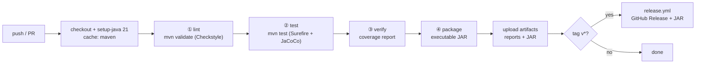

# Event Processing Pipeline — Technical Notes

Actionable guidance for building, testing, shipping and debugging this project.

---

## 3.1 CI/CD Pipeline Design

One workflow, one job, four gates — ordered cheapest-failure-first so a style
mistake costs 30 seconds, not 8 minutes.



`mvn verify` runs all four gates in one JVM invocation because Checkstyle is
bound to `validate` and JaCoCo to `verify` in `pom.xml`. CI does not need to
know the stage order — the POM owns it, so local and CI behave identically.
That property is worth more than a prettier multi-job pipeline: **"works on my
machine" and "works in CI" are the same command.**

### Stage details

| Stage | Command | Fails on | Typical duration |
|---|---|---|---|
| Lint | `mvn validate` | Any Checkstyle violation (`failOnViolation=true`), including test sources | ~5 s |
| Test | `mvn test` | Any failing/erroring test | ~50 s (≈47 s of it the two control-plane classes, which each start a real server per test — budget for that rather than assuming a hang) |
| Coverage | `mvn verify` | Line coverage < 85 % or branch < 80 % (`jacoco:check`) | ~5 s |
| Package | `mvn package` | Compile error, missing main class | ~5 s |

### Concurrency-specific CI advice

- **Run the test suite with a repeat count on `main`.** Race conditions are probabilistic; a single green run proves little. Add a scheduled job: `mvn test -Dsurefire.rerunFailingTestsCount=0 -Dtest.repeat=20`, or use JUnit's `@RepeatedTest(20)` on the concurrency-sensitive tests (already applied to `BoundedStageQueueTest` and `PipelineOrchestratorTest`).
- **CI runners have fewer cores than your laptop** (GitHub-hosted: 2–4). Tests must never assume `availableProcessors() >= 8`. All tests here derive thread counts from config, and the orchestrator test uses 2 consumers.
- **Every test needs a timeout.** `@Timeout(30)` on integration tests: a deadlocked test that hangs a runner for 6 hours is worse than a failing one. `timeout-minutes: 15` on the job is the second line of defence.
- **`-Dsurefire.printSummary` + always-upload artifacts.** A flaky concurrency failure is often only diagnosable from the surefire XML dump of the *other* threads.
- **Don't parallelise Surefire here** (`forkCount=1`). The tests themselves are multi-threaded and CPU-saturating; running them in parallel makes timing assertions flaky for no wall-clock gain.

### Branch protection (recommended)

`main` requires: the `verify` check green, one approving review, linear history, and no force-push. Everything else stays deliberately loose — this is a small project and process should not outweigh the code.

---

## 3.2 Testing Strategy

### Test pyramid for a concurrency project

```text
        ╱╲        E2E (1)      PipelineApplication main() smoke — real JAR, real exit code
       ╱  ╲
      ╱────╲      Integration (3)  Orchestrator end-to-end, FilterStage pill fan-out,
     ╱      ╲                      full pipeline counter reconciliation
    ╱────────╲    Unit (7+)        Records, predicate, AggregationTask, queue, config,
   ╱__________╲                    metrics, rate limiter — mostly single-threaded
```

Note the inversion versus a web app: the *interesting* tests are the integration ones, because the bugs live in the interaction (pill counts, blocking, shutdown), not in the algebra. But keep the unit layer big anyway — `AggregationTask` and `AggregateResult.merge` are testable with **zero threads**, and that is exactly why the design puts them in `domain`/`application`.

### Frameworks and targets

| Concern | Choice | Target |
|---|---|---|
| Unit + integration | **JUnit 5 (Jupiter) 5.10.x** | — |
| Coverage | **JaCoCo 0.8.12** | **Gated** at ≥ 85 % line / ≥ 80 % branch over the whole bundle (`jacoco:check`, bound to `verify`). Measured: **92.5 % line, 90.6 % branch, 94.4 % instruction** over 597 tests. Bundle-level rather than per-class, because the untestable remainder is unevenly distributed — see *What is deliberately not tested* below — and a per-class rule would need enough exclusions to stop meaning anything |
| Assertions | Plain JUnit `assertEquals`/`assertThrows` | No AssertJ/Hamcrest — keeping the dependency tree at zero runtime deps is a project goal |
| Mocks | **Hand-written fakes** (`RecordingMetricsRecorder`, list-backed generator) | No Mockito: ports have 1–2 methods; a fake is shorter, faster and thread-safe-by-inspection |
| Timeouts | `@Timeout` on every concurrent test | Hard requirement |
| Repetition | `@RepeatedTest(10..20)` on race-sensitive tests | Turns "passed once" into evidence |

### Rules for testing concurrent code (the part that actually matters)

1. **Never assert on `Thread.sleep`.** Synchronise on `CountDownLatch`, `CyclicBarrier`, `CompletableFuture.get(timeout)`, or `queue.poll(timeout)`. If a clock assertion is unavoidable it may only be a **lower** bound ("1000 events at 500/s took ≥ 1.5 s"), never an upper one — a CI runner can stall arbitrarily. As it stands the suite contains **no elapsed-time assertion at all**: `grep -rn 'nanoTime\|currentTimeMillis' src/test` returns nothing but a comment. The pressure to add one shows up as a test like `outlivesTheShutdownBudget`, which needs a run that outlasts a budget; it asserts on the *verdict* (`success()`, the counters) instead, so a slow runner makes it a stronger guard rather than a flaky one.
2. **Make the interesting interleaving deterministic where you can.** `AggregationTask` is tested by calling `compute()` directly on the caller thread with a cutoff forced to 1, which exercises the *split* logic with no pool involved. The parallel path is then tested for *equivalence* with the sequential one — that pair of tests is stronger than either alone.
3. **Test the shutdown path as a first-class feature**, not an afterthought:
   - pill count == consumer count → every consumer exits (`FilterStageTest#onePillPerConsumerStopsAll`, parameterised over 1/2/4/8);
   - exactly one pill goes downstream, whatever the consumer count (`FilterStageTest#forwardsExactlyOnePillDownstream`);
   - data queued ahead of the pills is never dropped (`FilterStageTest#drainsDataAheadOfThePills`, `@RepeatedTest(10)` against a capacity-2 queue);
   - a full queue blocks the writer instead of overflowing, and an interrupt gets it out (`BoundedStageQueueTest#putBlocksUntilSpaceAppears`);
   - counter reconciliation after the drain (`PipelineOrchestratorTest#reconcilesEveryEvent`, `@RepeatedTest(5)`);
   - `Ctrl+C` mid-run still drains and still reports success (`PipelineOrchestratorTest#requestStopAllDrainsCleanly`).
4. **Force the queue to be full in a test.** Capacity 1, batch size 1, and a consumer that waits on a latch — that is the backpressure test, and it should assert the producer is `BLOCKED`/`WAITING`, not that it produced fewer events.
5. **Seed the randomness.** `SyntheticSensorEventGenerator` takes a seed so the same run produces the same events, making a failure reproducible. Unseeded randomness in a concurrency test is two sources of nondeterminism multiplied.
6. **Assert on invariants, not on schedules.** Correct: `produced == passed + rejected`, `merge` is associative, `snapshot.count == sum of batch counts`. Incorrect: "consumer-0 handled ≥ 25 % of batches" — work distribution is the scheduler's business.
7. **`@RepeatedTest` + a stress test.** One test that runs 100 k events through the real pipeline with capacity 2 and 4 consumers catches more than 50 careful unit tests.

### What is deliberately *not* tested

Almost nothing, now — and the shrinking of this section is the most useful thing in it, because every entry that left did so for a different reason.

Two things remain untested on purpose:

- **`main(String[])`.** It is three lines — parse, `run`, `System.exit` — and the last one makes it untestable in-process: a test that reached it would take the Surefire JVM down with it. This is precisely why `PipelineApplication.run(PipelineConfig)` exists as a separate, `exit`-free method, and `PipelineApplicationTest` drives the whole graph through it.
- **`JdbcAggregateRepository`'s unimplemented bodies.** `JdbcAggregateRepositoryTest` pins what the stub actually promises — that it throws `UnsupportedOperationException` with a message naming the alternative, and that the password has no accessor — but there is no test of a `save` that does not exist. The Phase 3 fix was not to test the stub harder; it was to make `PipelineApplication.run` **refuse to start** when `pipeline.jdbc.url` is set, so a misconfiguration is exit 2 before any thread starts rather than a successful twenty-minute run that fails on its final write.

What *was* on this list, and what it took to get off it:

| Was excused as | Why the excuse failed |
|---|---|
| Console output formatting — "cosmetic" | It is the operator's only feedback at INFO level. `ConsoleAggregateSinkTest`, `ConsoleDashboardTest` and `PipelineLogFormatterTest` now pin the formats; the dashboard's fixed-width rendering in particular is what makes an in-place refresh not corrupt the terminal. |
| The HTTP control plane — "optional, so peripheral" | Optional and *authenticating*. Untested auth is worse than no auth, so `ControlPlaneServerTest` and `PipelineControlHandlerTest` (42 tests) now cover loopback-only binding, the ≥16-char token requirement, `MessageDigest.isEqual` comparison, method and path rejection, body-size limits and malformed JSON. They take ~47 s of the suite's ~64 s because each starts a real server; that is the price of testing a socket rather than a handler in isolation. |
| `CsvAggregateSink` — "just IO" | It is the one place configuration turns into a filesystem write, and it is pure. `CsvAggregateSinkTest` pins path containment against `..` traversal, the row format against a locale that writes `2,000000` for `2.0` (which would shift every column after it), and — the `CrashSafety` group — the temp-file-then-atomic-move path: a successful publish leaves no `.tmp` behind, and a publish that rejects a row leaves the *previous* report byte-identical instead of truncating it. |
| `TokenBucketRateLimiter` — "the obvious test wants a clock assertion, which rule 1 forbids" | The rule was right and the conclusion was wrong. The answer was to change the class, not to skip the test: a package-private constructor now takes a `LongSupplier` clock and a `NanoSleeper`, and `TokenBucketRateLimiterTest` supplies a fake that **advances the clock by the requested sleep instead of spending it**. Pacing is then verified as arithmetic, with no wall-clock assertion anywhere. |

The pattern worth extracting: three of those four were untestable-by-design rather than untested-by-laziness, and in each case the fix was a seam in production code — an `exit`-free `run`, an injected clock, render-before-open ordering.

### Suggested additions (Phase 3)

- **jqwik** property tests: `merge` associativity/commutativity/identity over generated `AggregateResult`s.
- **PIT mutation testing** on `domain` + `application` — line coverage says the line ran, mutation score says the assertion mattered.
- **JMH** benchmarks for batch size / queue capacity, run manually (never in CI — noisy runners produce meaningless numbers).
- **`-Xcheck:jni -XX:+UseZGC` matrix** and a run under `-XX:+UnlockDiagnosticVMOptions -XX:GuaranteedSafepointInterval=1` to shake out safepoint-sensitive assumptions.
- **Java Flight Recorder** in the soak script: `-XX:StartFlightRecording=duration=60s,filename=pipeline.jfr`, then inspect thread-park events.

---

## 3.3 Deployment Strategy

**Target: local execution. No Docker, by requirement — and that is the correct call here**, so this section describes what "deployment" honestly means for a self-contained JVM tool.

### Artifact

A single executable JAR with a `Main-Class` manifest and **no dependency shading needed** (zero runtime dependencies):

```bash
mvn clean verify
java -jar target/event-processing-pipeline-1.0.0-SNAPSHOT.jar --help
java -jar target/event-processing-pipeline-1.0.0-SNAPSHOT.jar \
     --events=200000 --rate=50000 --threshold=42 --consumers=8 --batch-size=128
```

Convenience wrappers: `scripts/run.ps1` (Windows) and `scripts/run.sh` (POSIX) — both build if the JAR is missing and pass through arguments.

### Recommended JVM flags

| Flag | Why |
|---|---|
| `-Xms512m -Xmx512m` | Equal min/max avoids resize pauses; the pipeline's footprint is bounded by design, so pick a number and hold it |
| `-XX:+UseZGC` (or G1 default) | ZGC for low pause on high allocation rates; G1 is fine below ~1 M events/s |
| `-XX:+HeapDumpOnOutOfMemoryError -XX:HeapDumpPath=./dumps` | An OOM here means a queue-sizing bug — you want the dump |
| `-Djava.util.logging.config.file=src/main/resources/logging.properties` | Log levels without a rebuild |
| `-XX:StartFlightRecording=...` | Soak runs only |

### Distribution options, in order of effort

1. **Copy the JAR** + a `config/application-<env>.properties`. Requires a JRE 21 on the target.
2. **`jlink` a custom runtime** — no JRE needed on the target, ~45 MB self-contained image:
   ```bash
   jlink --add-modules java.base,java.logging,jdk.httpserver \
         --strip-debug --no-header-files --no-man-pages --compress=2 \
         --output dist/pipeline-runtime
   dist/pipeline-runtime/bin/java -jar event-processing-pipeline.jar
   ```
   The module list is short precisely because there are no third-party dependencies.
3. **`jpackage`** for an OS-native installer (`.msi`/`.deb`) if handed to non-developers.
4. **GraalVM `native-image`** (Phase 3 TODO) — sub-50 ms startup, no reflection config needed since the code uses none.

### Containerisation

**Not used, per the requirements.** If a CI job ever needs a reproducible runner, the honest minimal form is documented rather than committed:

```dockerfile
# Reference only — not part of this project's deliverables.
FROM eclipse-temurin:21-jre-alpine
COPY target/event-processing-pipeline-*.jar /app/pipeline.jar
ENTRYPOINT ["java","-XX:+UseZGC","-jar","/app/pipeline.jar"]
```

Two things to know if you do containerise a thread-pool app: the JVM sizes
`availableProcessors()` from the cgroup CPU quota, so a `--cpus=0.5` limit
yields **1** processor and your "8 consumer threads" default silently becomes
oversubscription — always set `pipeline.consumer.threads` explicitly in a
container. And `MaxRAMPercentage`, not `-Xmx`, is the right heap control there.

### Release process

Tag `v1.2.3` → `release.yml` builds, attaches the JAR + checksums to a GitHub Release. Versioning is SemVer, where "public API" means the **CLI flags and property keys** — renaming `--threshold` is a breaking change even though no Java caller exists.

---

## 3.4 Environment Management

### Configuration precedence (lowest → highest)

```text
1. Hard-coded defaults        PipelineConfig.defaults()
2. Classpath properties      src/main/resources/application.properties
3. External profile file     config/application-<env>.properties   (--env=dev|staging|prod)
4. Environment variables     PIPELINE_EVENTS_PER_SECOND=50000 ...
5. CLI flags                 --rate=50000                          (always wins)
```

Rationale: files for *shape*, env for *secrets and per-host values*, flags for
*this one run*. Anything that would be committed lives in a file; anything that
must not be committed arrives via env. Every layer is optional, and
`ConfigLoader` logs the effective config once at startup (with secrets redacted)
so a surprising run is self-explaining.

### Env var naming

`PIPELINE_` prefix, property key upper-snake-cased: `pipeline.queue.capacity` → `PIPELINE_QUEUE_CAPACITY`. Mechanical, so no lookup table is needed.

### Profiles

| Profile | Intent | Distinctive settings |
|---|---|---|
| `dev` | Fast feedback, tiny numbers you can read | `events=5000`, `rate=1000`, `queue.capacity=8`, `consumers=2`, `dashboard=true`, `log=FINE` |
| `staging` | Production-like soak | `events=5000000`, `rate=0` (saturate), `queue.capacity=128`, `consumers=cores`, `metrics.interval=5s` |
| `prod` | Quiet, conservative, machine-readable | `rate` bounded, `dashboard=false`, `log=INFO`, `http.enabled=false`, JDBC sink on |

Small queues in `dev` are intentional: **backpressure and pill-drain bugs only show up when the queue is actually full**, so the dev profile makes the interesting failure mode the *common* case.

### `.env.example`

Committed at the repo root, documents every variable with placeholder values. Copy to `.env` (git-ignored) and source it:

```bash
cp .env.example .env
set -a && . ./.env && set +a
java -jar target/event-processing-pipeline-*.jar
```

On Windows PowerShell: `Get-Content .env | ForEach-Object { if ($_ -match '^\s*([^#=]+)=(.*)$') { [Environment]::SetEnvironmentVariable($Matches[1].Trim(), $Matches[2].Trim()) } }`.

**Never commit `.env`.** `.gitignore` covers it; `.env.example` carries placeholders only.

---

## 3.5 Version Control Workflow

**Recommendation: trunk-based development with short-lived branches** (GitHub Flow).

### Why, for this project specifically

- **Single deployable artifact, single environment, no release train.** Gitflow's `develop` + `release/*` + `hotfix/*` machinery exists to coordinate parallel long-lived releases; here it would be pure overhead with no coordination problem to solve.
- **CI runs the whole suite in under two minutes**, so `main` can credibly stay green — which is the actual precondition for trunk-based work.
- **Concurrency changes must not marinate.** A week-old branch touching `FilterStage` shutdown while `main` changes pill counting produces a merge whose *race behaviour* nobody has tested. Short-lived branches keep the interleaving space small.

### Rules

1. Branch from `main`: `feat/aggregation-sharding`, `fix/pill-count`, `docs/architecture`, `chore/bump-junit`.
2. **Lifetime ≤ 2 days.** Longer means the change should be split.
3. Conventional Commits — `feat:`, `fix:`, `perf:`, `refactor:`, `test:`, `docs:`, `chore:` — with the *why* in the body. `perf:` commits must cite before/after numbers and the config used.
4. PR into `main`, squash merge, linear history. One green `verify` + one review.
5. Tag releases on `main` only: `v1.2.3`.
6. **`main` is always releasable.** Incomplete work hides behind a config flag (e.g. `pipeline.aggregation.sharded=false`), not behind a branch.

### Commit-message notes for concurrency work

Say what invariant changed and how it was verified:

Both examples below are the real commit messages for the two defects this pipeline
actually shipped with, not invented ones.

```text
fix: stop only the producer on Ctrl+C, not all three stages

requestStopAll() set the stop flag on every stage at once, so consumers left
poll() while queue #1 still held batches: those events were lost, the producer
wedged in put() against a queue nobody drained, and the run ended in a forced
shutdown -- reporting FAILED for a pipeline that was working. Stopping only the
head of the graph is enough: the producer emits its N pills on the way out and
they cascade behind the data already queued. The all-stages stop is now private
and reserved for runs that have already failed.

Verified: PipelineOrchestratorTest#requestStopAllDrainsCleanly. The graceful-
shutdown nest went from 27.07s (forced, reconciled=false) to 0.082s, success=true.
```

```text
fix: bound the drain, not the run

run() passed shutdownTimeout to allOf(...).get(), making a drain grace period
into a deadline for the whole run. The shipped defaults -- 100k events at
10k/s against a 10s budget -- sat exactly on that boundary, so an honest
end-to-end run died at ten seconds and printed "result : FAILED" directly above
"reconciled=true", with an empty aggregate table for a pipeline that had already
aggregated 48015 events (the aggregation future never completed, so getNow
returned the empty outcome).

The wait now watches liveness instead: the monotonic sum of the event and batch
counters, polled every 100ms. An unchanged sum for the whole budget is a stall
-- which covers every way this graph wedges -- while a run that keeps moving
runs as long as event.count and duration.seconds say it may. queueBlockedNanos
is excluded from the sum on purpose: it keeps climbing while the producer is
parked, which is the one case most worth catching.

Verified: PipelineOrchestratorTest#outlivesTheShutdownBudget (a 2.4s run against
a 1s budget, success=true) and #aStallIsReported (a wedged predicate still
reports a stall). The 200k-event jar run went from EXIT=1 at 10s to EXIT=0 at
19992ms, "all stages drained; 200000 events reconciled".
```

---

## 3.6 Common Pitfalls

Ranked by how often they actually bite in this exact stack.

### 1. Poison pill arithmetic (the #1 source of hangs)

- **N consumers need N pills.** One pill wakes one consumer; the rest block until the shutdown timeout.
- **A consumer must never re-offer the pill it consumed** to the queue it read from — with a full queue that is an instant deadlock (it blocks on `put` while holding no progress), and even when it works it creates a pill that circulates unpredictably.
- **The aggregator needs exactly one pill**, forwarded by the *last* consumer to finish (`AtomicInteger` countdown). Forwarding one pill per consumer makes the aggregator stop at the first, silently discarding in-flight batches — and the counter reconciliation is what catches this.
- **A pill must not overtake data.** `ArrayBlockingQueue` is FIFO, so `put`ting the pill after the last batch is sufficient — this is a concrete reason to prefer it over a priority or unordered queue here.

### 2. Swallowed `InterruptedException`

```java
// WRONG — shutdown will hang, and the reason will be invisible
try { queue.take(); } catch (InterruptedException e) { /* ignored */ }

// RIGHT — exit the loop and preserve the flag for callers
try {
    msg = queue.poll(pollTimeout, TimeUnit.MILLISECONDS);
} catch (InterruptedException e) {
    Thread.currentThread().interrupt();
    break;
}
```

Also: use `poll(timeout)` rather than `take()` in stage loops so a stage can notice a shutdown flag even if no pill arrives (e.g. the producer died).

### 3. `ExecutorService.shutdown()` is not "wait for completion"

`shutdown()` only stops *new* submissions. The full, correct dance (implemented in `PipelineExecutors.shutdownOrderly`):

```java
pool.shutdown();
if (!pool.awaitTermination(timeout, SECONDS)) {
    pool.shutdownNow();                                  // interrupt stragglers
    if (!pool.awaitTermination(5, SECONDS)) {
        log.severe("pool did not terminate: " + pool);    // report, don't pretend
    }
}
```

And with **try-with-resources on Java 21** (`ExecutorService` is now `AutoCloseable`), `close()` blocks until termination and *re-interrupts* — convenient, but be aware it can block your `main` indefinitely if a task ignores interrupts.

### 4. Exceptions vanishing inside a pool

A `Runnable` submitted via `submit()` that throws stores the exception in the `Future` and prints **nothing**. If nobody calls `get()`, the failure is invisible and the pipeline just goes quiet.
Fixes used here: stages run inside `CompletableFuture.supplyAsync(...)` whose exceptional completion the orchestrator *always* inspects, plus a `Thread.UncaughtExceptionHandler` on `NamedThreadFactory` as a backstop. Never use `execute()` for stage bodies without a handler.

### 5. `ForkJoinPool.commonPool()` and blocking work

- The common pool is shared with every parallel stream in the JVM, and its default parallelism is `cores - 1` — **on a 1-core CI runner that is a pool of size... 1**, executing on the caller thread, which quietly destroys your parallelism assumptions.
- Blocking inside a fork/join task (IO, `queue.take()`) starves the pool. Aggregation here is pure CPU; the queue read happens on a *dedicated dispatcher thread*, and the submission uses a **dedicated** `ForkJoinPool`. Keep it that way.
- **Fork/join etiquette:** `invokeAll(left, right)` or `left.fork(); rightResult = right.compute(); leftResult = left.join();` — computing one half on the current thread avoids wasting a worker. Never `fork()` both and `join()` both.
- **Cutoff matters more than parallelism.** Splitting to single elements makes fork overhead dominate; measure with 256/512/1024.

### 6. Unbounded queues and the illusion of speed

`LinkedBlockingQueue` with no capacity looks faster in a microbenchmark because the producer never waits — then it OOMs in the soak test. `ArrayBlockingQueue` with an explicit capacity is a design decision about memory; make it consciously. Memory ceiling ≈ `capacity × batchSize × sizeof(SensorEvent)`, per queue.

### 7. Batch size 1

Per-event `put`/`take` means two lock acquisitions and a signal per event; at that point the queue *is* your workload and the filter predicate is noise. Batching 32–256 events per message is typically a 5–10× throughput difference. Conversely, huge batches (≥ 4096) hurt tail latency and make the "queue full" state extremely coarse.

### 8. `ArrayBlockingQueue`'s single lock

Both `put` and `take` contend on one `ReentrantLock`. With many producers and consumers that becomes the hot spot — visible as high `blockedNanos` on a queue that is *neither* full nor empty. Remedies: bigger batches (fewer ops), or shard into `k` queues by `sensorId` hash. `LinkedBlockingQueue` has two locks (head/tail) and can beat it under heavy contention — but it allocates a node per element and is unbounded unless you pass a capacity.

### 9. Non-atomic composite counters

`produced++` on a plain `long` from multiple threads loses updates — and the loss is invisible until reconciliation fails. Use `LongAdder` for write-heavy counters (`AtomicLong` becomes a CAS hot spot at millions of ops/s). Note that a *snapshot* of several `LongAdder`s is **not** a consistent instant: `produced=1000, passed=400, rejected=590` mid-flight is normal. Only reconcile **after** all stages have completed.

### 10. Timing assumptions and rate limiting

`Thread.sleep(1)` is not 1 ms (10–15 ms granularity on Windows), so a naive "sleep between events" limiter caps out around 60–100 events/s. Use a token bucket over `System.nanoTime()` with a batch-level wait, and treat the configured rate as an *upper bound*, never a guarantee. Also: `System.currentTimeMillis()` is wall-clock and can jump backwards (NTP) — always use `nanoTime()` for durations.

### 11. Java-21 specific gotchas

- **Records are shallowly immutable.** `record EventBatch(List<SensorEvent> events)` still leaks a mutable list unless the constructor does `List.copyOf(events)`. Done here in the canonical constructor.
- **Sealed interface + `switch` pattern matching** gives compile-time exhaustiveness — but only if you omit `default`. Adding `default` silently re-opens the hole you sealed.
- **Virtual threads are not a speed-up for CPU-bound work**, and pinning inside `synchronized` blocks was still a real limitation as of 21. Fixed pools remain correct for filtering.

### 12. A `default` branch in routing answers the wrong question

`PipelineControlHandler` dispatched on method first and path second, so GET requests fell
into a `switch (path)` whose `default` was `404 not found`. `GET /threshold` therefore
reported that a route which very much exists was absent. The symmetric case — POST to a
GET-only route — was already `405`, and already had a test; the missing half was found by
curling every path and method by hand against a running server, not by reading the code,
because both branches read correctly in isolation.

The general shape: a `default` in a routing switch collapses *"no such path"* and *"wrong
method for this path"* into one answer, and those are different diagnoses. The first sends
an operator looking for a typo, the second tells them to change the verb. Enumerate the
POST-only paths in the GET switch explicitly, even though it costs a line per route, and
pin **both** directions with tests — `getToPostRouteIsMethodNotAllowed` exists precisely
because its mirror image passing gave false confidence that the pair was covered.

### 13. Windows/local-dev environment

- Maven may default to an older JDK — set `JAVA_HOME` to a JDK 21 explicitly before building (`mvn -version` should report 21).
- Console encoding: use `-Dfile.encoding=UTF-8` (default in 18+) and avoid box-drawing characters in output if `chcp` is 850/1252 — `ConsoleDashboard` sticks to ASCII for this reason.
- `Ctrl+C` in PowerShell delivers SIGINT and *does* run JVM shutdown hooks — the graceful-drain hook is testable interactively.
