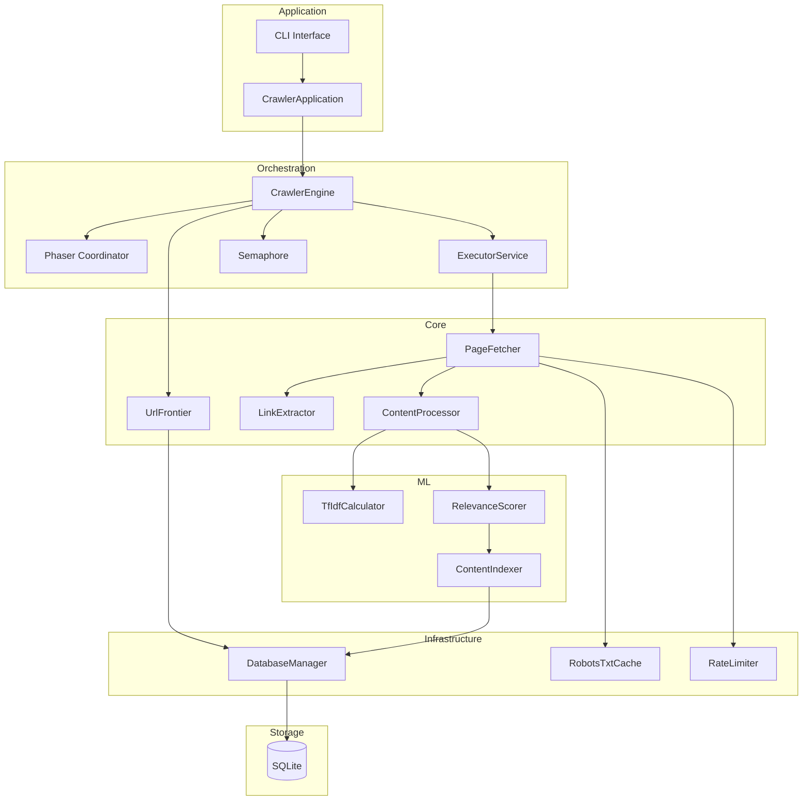
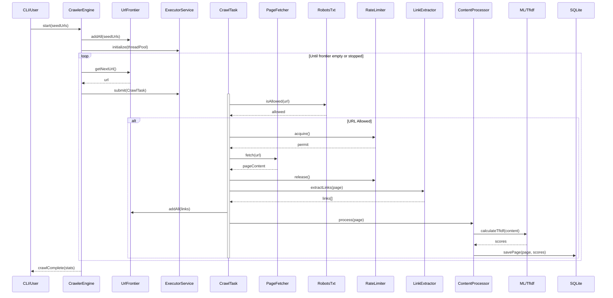
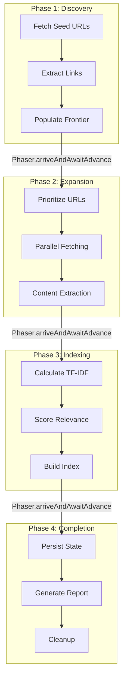
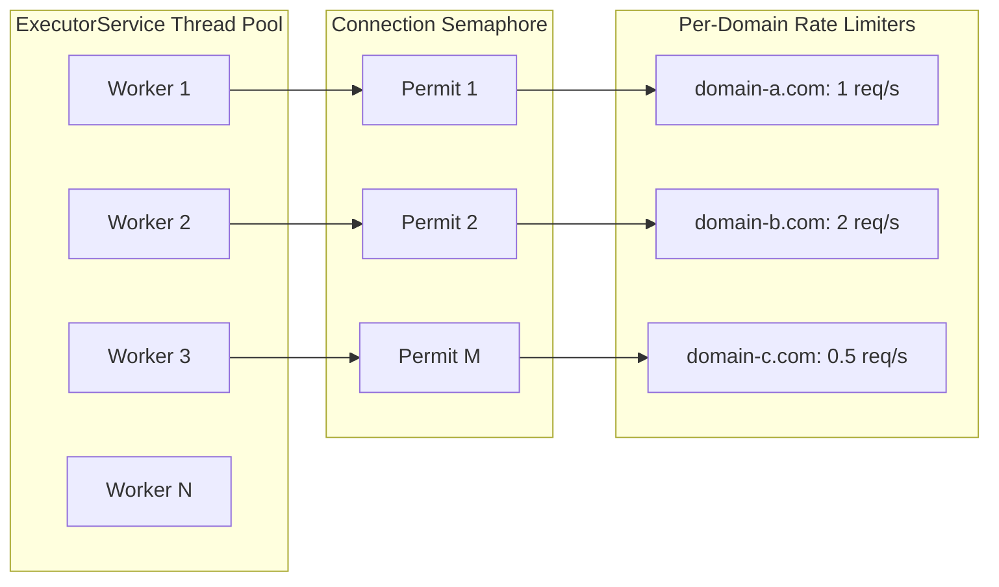
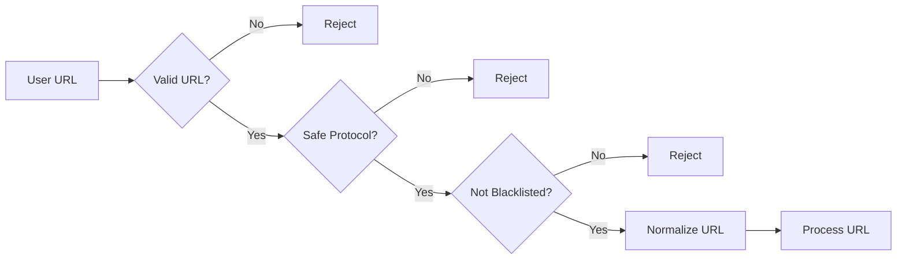
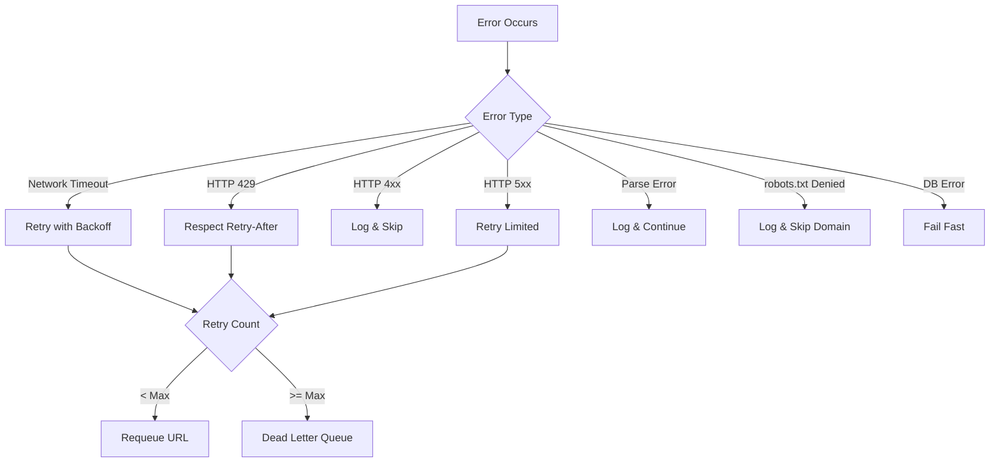
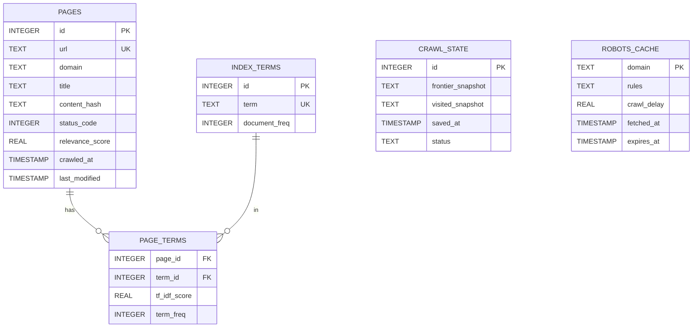
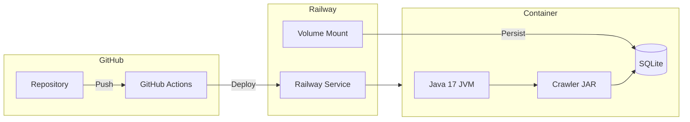

# Concurrent Web Crawler - Architecture Documentation

## 1. Architectural Pattern

### Chosen Pattern: Layered Modular Monolith

This project adopts a **Layered Modular Monolith** architecture with clear separation of concerns:

```
┌─────────────────────────────────────────────────────────┐
│                    APPLICATION LAYER                     │
│              (CrawlerApplication, CLI/API)              │
├─────────────────────────────────────────────────────────┤
│                   ORCHESTRATION LAYER                    │
│            (CrawlerEngine, Phaser Coordination)         │
├─────────────────────────────────────────────────────────┤
│                      CORE LAYER                          │
│    (PageFetcher, LinkExtractor, ContentProcessor)       │
├─────────────────────────────────────────────────────────┤
│                    ML/INDEXING LAYER                     │
│      (TfIdfCalculator, RelevanceScorer, Indexer)        │
├─────────────────────────────────────────────────────────┤
│                   INFRASTRUCTURE LAYER                   │
│     (DatabaseManager, RobotsTxtCache, RateLimiter)      │
└─────────────────────────────────────────────────────────┘
```

### Justification

1. **Simplicity**: A monolith is appropriate for this single-purpose tool
2. **Performance**: No network overhead between components
3. **Deployment**: Single JAR deployment to Railway
4. **Maintainability**: Clear module boundaries enable future extraction
5. **Testability**: Each layer can be tested independently

---

## 2. Key Component Interactions

### 2.1 Component Diagram



### 2.2 Communication Patterns

| From | To | Pattern | Description |
|------|-----|---------|-------------|
| CrawlerEngine | ExecutorService | Thread Pool | Submit CrawlTask instances |
| CrawlTask | PageFetcher | Direct Call | Fetch page synchronously |
| CrawlTask | UrlFrontier | ConcurrentHashMap | Thread-safe URL management |
| PageFetcher | RateLimiter | Semaphore | Acquire permits before fetch |
| CrawlerEngine | Phaser | Barrier Sync | Coordinate crawl phases |
| ContentProcessor | TfIdfCalculator | Direct Call | Calculate term weights |
| All Components | DatabaseManager | Connection Pool | SQLite access |

---

## 3. Data Flow

### 3.1 Main Crawl Flow



### 3.2 Multi-Phase Crawl Coordination



---

## 4. Scalability & Performance Strategy

### 4.1 Concurrency Model



### 4.2 Performance Strategies

| Strategy | Implementation | Benefit |
|----------|----------------|---------|
| Bounded Thread Pool | `Executors.newFixedThreadPool(N)` | Prevents resource exhaustion |
| Connection Limiting | `Semaphore(maxConnections)` | Respects server limits |
| URL Deduplication | `ConcurrentHashMap.putIfAbsent()` | Avoids redundant fetches |
| Batch Writes | SQLite transactions | Reduces I/O overhead |
| Lazy Loading | Demand-paged robots.txt | Reduces startup time |
| Caching | Guava Cache for robots.txt | Reduces network calls |

### 4.3 Memory Management

```java
// Bounded frontier prevents OOM
private final BlockingQueue<String> frontier =
    new LinkedBlockingQueue<>(MAX_FRONTIER_SIZE);

// LRU cache for visited URLs (evicts oldest)
private final Map<String, Boolean> visited =
    Collections.synchronizedMap(new LinkedHashMap<>(MAX_VISITED, 0.75f, true) {
        protected boolean removeEldestEntry(Map.Entry eldest) {
            return size() > MAX_VISITED;
        }
    });
```

---

## 5. Security Considerations

### 5.1 Input Validation



### 5.2 Security Measures

| Area | Measure | Implementation |
|------|---------|----------------|
| URL Safety | Protocol whitelist | Only HTTP/HTTPS allowed |
| SSRF Prevention | IP range blacklist | Block private/localhost |
| Resource Limits | Timeout & size caps | Max 30s, 10MB per page |
| SQL Injection | Prepared statements | All queries parameterized |
| Credential Storage | Environment variables | Never in code/config files |
| Rate Limiting | Per-domain throttling | Configurable delays |
| robots.txt | Strict compliance | Honor Crawl-Delay |

### 5.3 SSL/TLS Handling

```java
// Default: Strict SSL validation
// Configurable for testing environments only
public class PageFetcher {
    private boolean validateSSL = true;

    public Document fetch(String url) throws IOException {
        Connection conn = Jsoup.connect(url)
            .timeout(TIMEOUT_MS)
            .maxBodySize(MAX_BODY_SIZE)
            .validateTLSCertificates(validateSSL);
        return conn.get();
    }
}
```

---

## 6. Error Handling & Logging Philosophy

### 6.1 Error Handling Strategy



### 6.2 Retry Policy

```java
public class RetryPolicy {
    private static final int MAX_RETRIES = 3;
    private static final long BASE_DELAY_MS = 1000;

    public long getDelay(int attempt) {
        // Exponential backoff: 1s, 2s, 4s
        return BASE_DELAY_MS * (long) Math.pow(2, attempt);
    }

    public boolean shouldRetry(int attempt, Exception e) {
        if (attempt >= MAX_RETRIES) return false;
        return isRetryable(e);
    }

    private boolean isRetryable(Exception e) {
        return e instanceof SocketTimeoutException
            || e instanceof ConnectException
            || (e instanceof HttpStatusException
                && ((HttpStatusException) e).getStatusCode() >= 500);
    }
}
```

### 6.3 Logging Structure

```
[TIMESTAMP] [LEVEL] [THREAD] [COMPONENT] - Message {context}

Examples:
2024-01-15 10:23:45.123 INFO  [pool-1-thread-3] PageFetcher - Fetching URL {url=https://example.com/page, attempt=1}
2024-01-15 10:23:46.456 WARN  [pool-1-thread-3] PageFetcher - Retry scheduled {url=https://example.com/page, error=timeout, nextAttempt=2}
2024-01-15 10:23:47.789 ERROR [pool-1-thread-3] PageFetcher - Max retries exceeded {url=https://example.com/page, totalAttempts=3}
```

### 6.4 Metrics Collection

```java
public class CrawlMetrics {
    private final AtomicLong pagesProcessed = new AtomicLong();
    private final AtomicLong bytesDownloaded = new AtomicLong();
    private final AtomicLong errors = new AtomicLong();
    private final ConcurrentHashMap<Integer, AtomicLong> statusCodes = new ConcurrentHashMap<>();
    private final ConcurrentHashMap<String, AtomicLong> domainCounts = new ConcurrentHashMap<>();

    // Thread-safe increment methods
    public void recordPage(String domain, int statusCode, long bytes) {
        pagesProcessed.incrementAndGet();
        bytesDownloaded.addAndGet(bytes);
        statusCodes.computeIfAbsent(statusCode, k -> new AtomicLong()).incrementAndGet();
        domainCounts.computeIfAbsent(domain, k -> new AtomicLong()).incrementAndGet();
    }
}
```

---

## 7. Database Schema

### 7.1 Entity Relationship Diagram



---

## 8. Deployment Architecture

### 8.1 Railway Deployment



### 8.2 Container Strategy

- **Base Image**: `eclipse-temurin:17-jre-alpine`
- **Size Target**: < 200MB
- **Health Check**: HTTP endpoint on `/health`
- **Graceful Shutdown**: SIGTERM handler for clean stop
