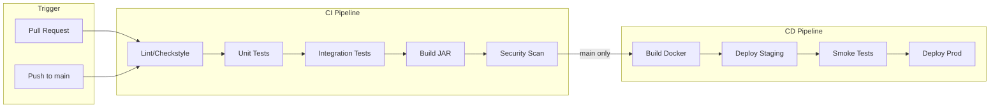
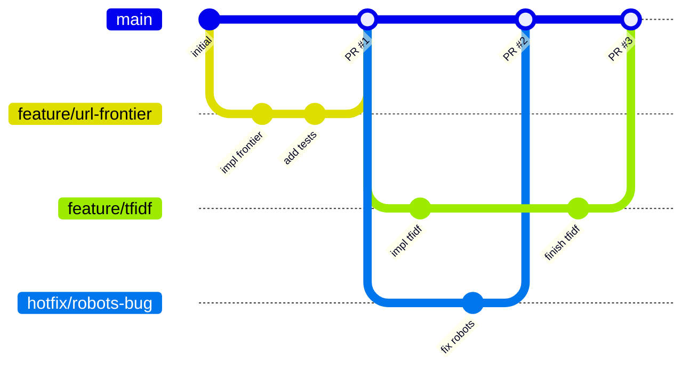

# Concurrent Web Crawler - Technical Notes

## 1. CI/CD Pipeline Design

### 1.1 Pipeline Overview



### 1.2 CI Stages

| Stage | Tool | Trigger | Failure Action |
|-------|------|---------|----------------|
| Lint | Checkstyle | All PRs | Block merge |
| Unit Test | JUnit 5 + JaCoCo | All PRs | Block merge |
| Integration Test | WireMock + Testcontainers | All PRs | Block merge |
| Build | Maven | All branches | Block merge |
| Security Scan | OWASP Dependency Check | All PRs | Warn only |
| Docker Build | Docker | main only | Fail pipeline |
| Deploy Staging | Railway | main only | Fail pipeline |
| Smoke Test | curl health check | main only | Rollback |
| Deploy Prod | Railway | manual gate | N/A |

### 1.3 GitHub Actions Workflow

See `.github/workflows/ci.yml` for implementation.

---

## 2. Testing Strategy

### 2.1 Test Pyramid

```
        /\
       /  \
      / E2E \        <- 10% (Smoke tests)
     /--------\
    /Integration\    <- 30% (WireMock, SQLite)
   /--------------\
  /   Unit Tests   \ <- 60% (JUnit 5, Mockito)
 /------------------\
```

### 2.2 Unit Testing

**Framework**: JUnit 5 + Mockito
**Coverage Target**: 80% line coverage on core packages

```java
// Example: TfIdfCalculatorTest.java
@Test
void calculateTfIdf_singleDocument_returnsCorrectScore() {
    TfIdfCalculator calculator = new TfIdfCalculator();

    Document doc = new Document("java concurrency java threads");
    calculator.addDocument(doc);

    double tfIdf = calculator.getTfIdf(doc, "java");

    // TF = 2/4 = 0.5, IDF = log(1/1) = 0, TF-IDF = 0
    assertEquals(0.0, tfIdf, 0.001);
}

@Test
void calculateTfIdf_multipleDocuments_weightsRareTermsHigher() {
    TfIdfCalculator calculator = new TfIdfCalculator();

    calculator.addDocument(new Document("java concurrency"));
    calculator.addDocument(new Document("java streams"));
    calculator.addDocument(new Document("phaser barrier"));

    double javaScore = calculator.getTfIdf(docs.get(0), "java");
    double phaserScore = calculator.getTfIdf(docs.get(2), "phaser");

    // "phaser" appears in fewer docs, should have higher IDF
    assertTrue(phaserScore > javaScore);
}
```

### 2.3 Integration Testing

**Tools**: WireMock (HTTP mocking), In-memory SQLite

```java
// Example: PageFetcherIntegrationTest.java
@WireMockTest(httpPort = 8089)
class PageFetcherIntegrationTest {

    @Test
    void fetch_validHtml_extractsContent(WireMockRuntimeInfo wm) {
        stubFor(get("/test")
            .willReturn(ok()
                .withHeader("Content-Type", "text/html")
                .withBody("<html><body><h1>Test</h1></body></html>")));

        PageFetcher fetcher = new PageFetcher();
        Page page = fetcher.fetch(wm.getHttpBaseUrl() + "/test");

        assertThat(page.getTitle()).isEqualTo("Test");
    }

    @Test
    void fetch_serverError_throwsRetryableException(WireMockRuntimeInfo wm) {
        stubFor(get("/error").willReturn(serverError()));

        PageFetcher fetcher = new PageFetcher();

        assertThrows(RetryableException.class,
            () -> fetcher.fetch(wm.getHttpBaseUrl() + "/error"));
    }
}
```

### 2.4 End-to-End Testing

```bash
# Smoke test script
#!/bin/bash
set -e

echo "Starting crawler with test seed..."
java -jar crawler.jar --seed "https://httpbin.org/links/10" --max-pages 5

echo "Verifying database..."
sqlite3 crawler.db "SELECT COUNT(*) FROM pages;" | grep -q "[5-9]"

echo "Smoke test passed!"
```

---

## 3. Deployment Strategy

### 3.1 Railway Configuration

**Service Type**: Web Service (for health endpoint) or Worker
**Region**: US East (default)
**Scaling**: Single instance (SQLite limitation)

```json
// railway.json
{
  "build": {
    "builder": "DOCKERFILE",
    "dockerfilePath": "Dockerfile"
  },
  "deploy": {
    "startCommand": "java -jar /app/crawler.jar",
    "healthcheckPath": "/health",
    "healthcheckTimeout": 30,
    "restartPolicyType": "ON_FAILURE",
    "restartPolicyMaxRetries": 3
  }
}
```

### 3.2 Docker Strategy

**Multi-stage build** for minimal image size:

```dockerfile
# Build stage
FROM maven:3.9-eclipse-temurin-17 AS build
WORKDIR /build
COPY pom.xml .
RUN mvn dependency:go-offline
COPY src ./src
RUN mvn package -DskipTests

# Runtime stage
FROM eclipse-temurin:17-jre-alpine
RUN addgroup -g 1000 crawler && adduser -u 1000 -G crawler -D crawler
WORKDIR /app
COPY --from=build /build/target/crawler-*.jar crawler.jar
USER crawler
EXPOSE 8080
ENTRYPOINT ["java", "-jar", "crawler.jar"]
```

### 3.3 Persistent Storage

SQLite requires persistent volume:

```yaml
# Railway volume configuration
services:
  crawler:
    volumes:
      - data:/app/data

volumes:
  data:
```

---

## 4. Environment Management

### 4.1 Configuration Hierarchy

```
1. Default values (hardcoded)
2. application.properties
3. application-{profile}.properties
4. Environment variables
5. Command-line arguments (highest priority)
```

### 4.2 Environment Variables

| Variable | Default | Description |
|----------|---------|-------------|
| `CRAWLER_THREADS` | 10 | Worker thread pool size |
| `CRAWLER_MAX_CONNECTIONS` | 20 | Semaphore permits |
| `CRAWLER_DEFAULT_DELAY_MS` | 1000 | Default crawl delay |
| `CRAWLER_MAX_PAGES` | 10000 | Max pages to crawl |
| `CRAWLER_USER_AGENT` | ConcurrentCrawler/1.0 | User-Agent header |
| `DB_PATH` | ./data/crawler.db | SQLite database path |
| `LOG_LEVEL` | INFO | Logging level |

### 4.3 .env.example Template

```bash
# Crawler Configuration
CRAWLER_THREADS=10
CRAWLER_MAX_CONNECTIONS=20
CRAWLER_DEFAULT_DELAY_MS=1000
CRAWLER_MAX_PAGES=10000
CRAWLER_USER_AGENT=ConcurrentCrawler/1.0

# Database
DB_PATH=./data/crawler.db

# Logging
LOG_LEVEL=INFO

# Railway-specific (set automatically)
# PORT=8080
# RAILWAY_ENVIRONMENT=production
```

---

## 5. Version Control Workflow

### 5.1 Recommended: GitHub Flow



### 5.2 Branch Naming

| Type | Pattern | Example |
|------|---------|---------|
| Feature | `feature/description` | `feature/tfidf-indexing` |
| Bugfix | `fix/description` | `fix/robots-parser-crash` |
| Hotfix | `hotfix/description` | `hotfix/memory-leak` |
| Refactor | `refactor/description` | `refactor/url-normalizer` |

### 5.3 Commit Message Format

```
<type>(<scope>): <subject>

[optional body]

[optional footer]
```

**Types**: feat, fix, docs, style, refactor, test, chore

**Examples**:
```
feat(crawler): add phaser-based multi-phase coordination
fix(robots): handle malformed robots.txt gracefully
test(tfidf): add edge case tests for empty documents
```

---

## 6. Common Pitfalls

### 6.1 Concurrency Issues

| Pitfall | Cause | Solution |
|---------|-------|----------|
| Race condition in visited set | Non-atomic check-then-add | Use `ConcurrentHashMap.putIfAbsent()` |
| Deadlock with Semaphore | Acquire without release on exception | Use try-finally or try-with-resources |
| Thread starvation | Unbounded queue + fixed pool | Use bounded `LinkedBlockingQueue` |
| Phaser hang | Party deregistration failure | Always deregister in finally block |

```java
// WRONG: Race condition
if (!visited.contains(url)) {
    visited.add(url);  // Another thread may add between check and add
    process(url);
}

// RIGHT: Atomic operation
if (visited.putIfAbsent(url, true) == null) {
    process(url);
}
```

### 6.2 Jsoup Gotchas

| Pitfall | Solution |
|---------|----------|
| Infinite redirect loops | Set `maxRedirects(5)` |
| Memory exhaustion on large pages | Set `maxBodySize(10 * 1024 * 1024)` |
| Hanging on slow servers | Set `timeout(30000)` |
| SSL cert errors | Keep `validateTLSCertificates(true)`, handle exceptions |
| Relative URL resolution | Use `Element.absUrl("href")` |

```java
// Recommended Jsoup configuration
Connection conn = Jsoup.connect(url)
    .userAgent(config.getUserAgent())
    .timeout(30_000)
    .maxBodySize(10 * 1024 * 1024)
    .followRedirects(true)
    .maxRedirects(5)
    .ignoreHttpErrors(false);
```

### 6.3 SQLite Concurrency

| Pitfall | Solution |
|---------|----------|
| "database is locked" | Use single connection or WAL mode |
| Slow bulk inserts | Batch in transactions |
| Corruption on crash | Enable WAL + synchronous=NORMAL |

```java
// Enable WAL mode for better concurrency
try (Connection conn = dataSource.getConnection()) {
    conn.createStatement().execute("PRAGMA journal_mode=WAL");
    conn.createStatement().execute("PRAGMA synchronous=NORMAL");
}

// Batch inserts in transaction
public void savePages(List<Page> pages) {
    String sql = "INSERT INTO pages (url, title, content_hash) VALUES (?, ?, ?)";
    try (Connection conn = dataSource.getConnection()) {
        conn.setAutoCommit(false);
        try (PreparedStatement ps = conn.prepareStatement(sql)) {
            for (Page page : pages) {
                ps.setString(1, page.getUrl());
                ps.setString(2, page.getTitle());
                ps.setString(3, page.getContentHash());
                ps.addBatch();
            }
            ps.executeBatch();
            conn.commit();
        } catch (SQLException e) {
            conn.rollback();
            throw e;
        }
    }
}
```

### 6.4 robots.txt Compliance

| Pitfall | Solution |
|---------|----------|
| Ignoring Crawl-delay | Respect `Crawl-delay` directive |
| Not handling wildcards | Implement proper pattern matching |
| Caching forever | Cache with TTL (24 hours typical) |
| Blocking on fetch | Async fetch with fallback |

### 6.5 Memory Management

```java
// WRONG: Unbounded collections
private final Set<String> visited = new HashSet<>();  // Can grow forever

// RIGHT: Bounded with eviction
private final Map<String, Boolean> visited = Collections.synchronizedMap(
    new LinkedHashMap<String, Boolean>(MAX_SIZE, 0.75f, true) {
        @Override
        protected boolean removeEldestEntry(Map.Entry<String, Boolean> eldest) {
            return size() > MAX_SIZE;
        }
    }
);

// Alternative: Use Bloom filter for very large scale
private final BloomFilter<String> visited = BloomFilter.create(
    Funnels.stringFunnel(StandardCharsets.UTF_8),
    EXPECTED_INSERTIONS,
    FALSE_POSITIVE_RATE
);
```

---

## 7. Performance Tuning

### 7.1 JVM Options

```bash
# Recommended JVM flags for crawler workload
java -Xms256m -Xmx512m \
     -XX:+UseG1GC \
     -XX:MaxGCPauseMillis=100 \
     -XX:+ParallelRefProcEnabled \
     -Djava.net.preferIPv4Stack=true \
     -jar crawler.jar
```

### 7.2 Connection Tuning

```java
// System properties for HTTP connections
System.setProperty("http.maxConnections", "50");
System.setProperty("http.keepAlive", "true");
System.setProperty("sun.net.http.allowRestrictedHeaders", "true");
```

### 7.3 Monitoring Metrics

| Metric | Target | Alert Threshold |
|--------|--------|-----------------|
| Pages/minute | > 100 | < 50 |
| Error rate | < 5% | > 10% |
| Memory usage | < 80% heap | > 90% |
| Queue depth | < 10000 | > 50000 |
| DB write latency | < 50ms | > 200ms |
