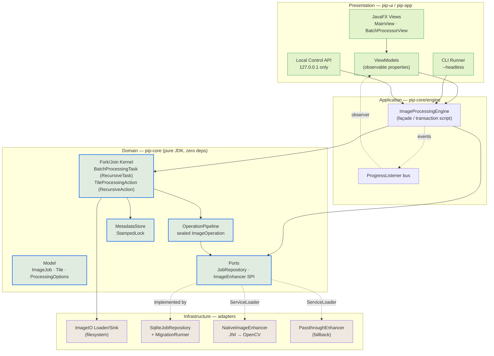
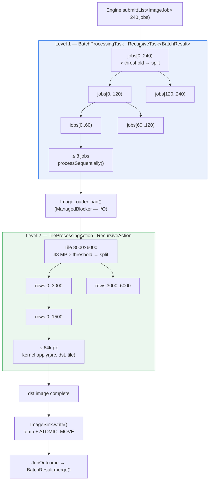
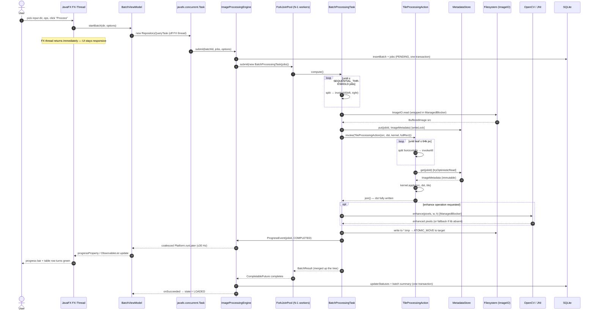
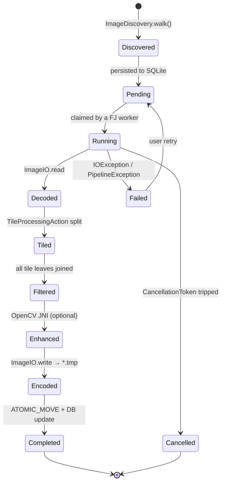
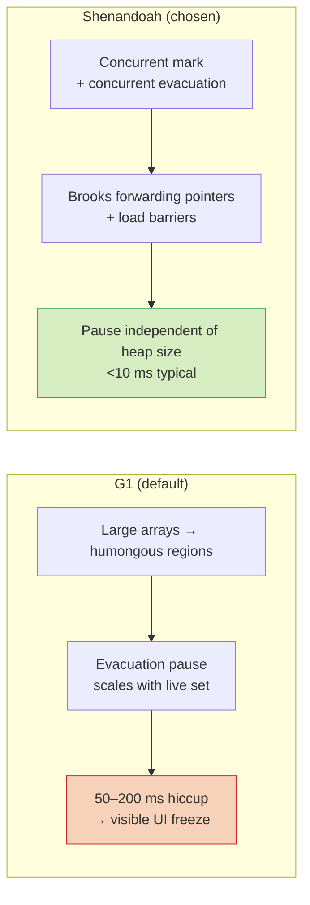
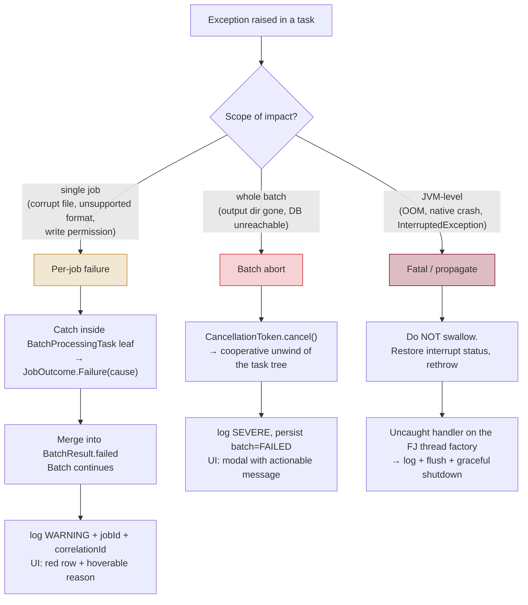

# Parallel Image Processor — Architecture

> **Audience:** engineers joining the project, reviewers of structural changes.
> **Scope:** a single-user local desktop application. Every trade-off below is judged against that
> constraint — there is no network tier, no multi-tenancy, and no container runtime.

---

## 2.1 Chosen Architectural Pattern

### Decision: **Modular Layered Monolith** with a **Hexagonal (Ports & Adapters) core**, driven by a **Fork/Join Work-Stealing compute kernel**

Three ideas layered on top of each other, each solving a distinct problem:

| Concern | Pattern applied | Why |
|---------|-----------------|-----|
| Deployment shape | **Monolith** — one JVM, one process | It is a local desktop tool. Any distribution boundary would add IPC latency and failure modes for zero benefit. Fork/join *requires* shared memory to steal work cheaply. |
| Internal structure | **Hexagonal core + Maven modules** | `pip-core` defines domain logic and *ports* (`JobRepository`, `ImageEnhancer`). SQLite, OpenCV/JNI and JavaFX are *adapters* plugged in at the edges. The compiler enforces the boundary — `pip-core` has no dependency on any of them. |
| Compute | **Divide-and-conquer / work-stealing** | The workload is a recursively decomposable, embarrassingly parallel data problem. `ForkJoinPool` is the JDK's purpose-built engine for exactly this. |

### Why *not* the alternatives

| Rejected | Reason |
|----------|--------|
| **Microservices** | Absurd at this scale: a local tool with one user. Network hops would dominate the actual pixel work, and you cannot work-steal across processes. |
| **Event-driven / message broker** | Kafka/RabbitMQ solve durable cross-service decoupling. Here, the work queue *is* the `ForkJoinPool`'s deque — already lock-free and cache-friendly. A broker adds an operational dependency the "local execution, no Docker" constraint forbids. |
| **Serverless** | No cloud runtime; cold starts and payload limits are fatal for 50 MB TIFFs. |
| **Plain layered monolith (no hexagon)** | Would let `ImageIO`/JDBC/JavaFX types leak into domain code, making the parallel engine untestable without a database and a display. |
| **`ExecutorService` + `invokeAll`** | Works for the flat batch level but degrades on skew: one 100 MP image behind 200 thumbnails leaves 15 cores idle. Fork/join's *nested* decomposition plus work-stealing fixes that. See `docs/adr/0002`. |

### Layer map



**The dependency rule:** arrows point inward. Domain never imports infrastructure; infrastructure
implements domain-declared interfaces. `pip-core/pom.xml` has an empty `<dependencies>` block —
that is the enforcement mechanism, not a convention.

---

## 2.2 Key Component Interactions

Everything is **in-process**. There are exactly four interaction mechanisms, chosen deliberately:

| # | Mechanism | Used between | Implementation | Why not something heavier |
|---|-----------|--------------|----------------|---------------------------|
| 1 | **Direct method call** | UI/CLI → Engine → Kernel | Plain Java calls across module boundaries via interfaces | Nanoseconds vs. microseconds. No serialization. |
| 2 | **Work-stealing deques** | Fork/join worker ↔ worker | `ForkJoinPool` internals (`fork()` / `join()` / `invokeAll()`) | This *is* the message queue. Lock-free, LIFO-local/FIFO-steal, cache-affine. |
| 3 | **Observer / listener bus** | Kernel → UI (progress) | `ProgressListener` + `Platform.runLater` coalescing | Decouples the compute kernel from JavaFX entirely; `pip-core` never sees an FX class. |
| 4 | **Ports (SPI + repository)** | Domain → Infrastructure | `ServiceLoader` for `ImageEnhancer`; constructor injection for `JobRepository` | Swappable at runtime (native present or not) without touching domain code. |

### Two-level decomposition — the core mechanism



Why nesting matters: a leaf of L1 that hits a 48 MP image immediately opens an L2 tree whose
sub-tasks are *stealable by every idle worker in the same pool*. The pool self-balances without any
scheduling logic on our part — that is the property a flat `ExecutorService` cannot provide.

### Metadata access: `StampedLock` optimistic reads

Reads outnumber writes roughly 100:1 (UI table refresh, per-tile lookups, progress polling).
`ReentrantReadWriteLock` still performs an atomic CAS on shared state for every *read*, causing
cache-line ping-pong across 16 cores. `StampedLock.tryOptimisticRead()` performs **no write at all**
on the happy path — just a volatile read of the stamp, then a `validate()` to confirm no writer
intervened.

```mermaid
sequenceDiagram
    participant W as FJ Worker (reader)
    participant L as StampedLock
    participant M as HashMap&lt;String, ImageMetadata&gt;
    participant U as Writer (job update)

    W->>L: tryOptimisticRead() → stamp
    Note over W,L: no shared-state mutation — scales linearly
    W->>M: read value (may be racy)
    W->>L: validate(stamp)
    alt stamp still valid (common)
        L-->>W: true → return value
    else a writer intervened
        L-->>W: false
        W->>L: readLock() (pessimistic)
        W->>M: re-read consistently
        W->>L: unlockRead(stamp)
    end

    U->>L: writeLock()
    U->>M: put(...)
    U->>L: unlockWrite(stamp)
```

**Non-negotiable rules when touching `MetadataStore`** (see `docs/adr/0004`):
1. Copy fields into locals *inside* the optimistic block; only publish them **after** `validate()`.
2. Never dereference a possibly-torn reference or index an array with a possibly-torn length.
3. `StampedLock` is **not reentrant** — never call another locking method while holding a stamp.
4. Store immutable records (`ImageMetadata` is a `record`) so a torn read yields a stale-but-whole
   object rather than a half-updated one.

---

## 2.3 Data Flow

### End-to-end sequence (UI-initiated batch)



### Data-state machine



**Invariants**
- The **source `BufferedImage` is read-only** during tiling; every tile writes only to its own
  disjoint region of `dst`. This is why convolution kernels may safely read a halo across tile
  boundaries with no locking — a critical design property.
- Output is written to `target.tmp` then `ATOMIC_MOVE`d, so a crash never leaves a half-written image
  that a later run would mistake for valid output.
- `BatchResult` is a **commutative monoid** (`merge` is associative, `EMPTY` is the identity), which
  is what makes bottom-up `RecursiveTask` reduction correct regardless of join order.

---

## 2.4 Scalability & Performance Strategy

This is a single machine, so "scalability" means **scaling across cores and up to large inputs**,
not across nodes.

### Vertical scaling — cores

| Lever | Implementation | Expected effect |
|-------|----------------|-----------------|
| Work stealing | `ForkJoinPool(parallelism = cores - 1)` | Idle workers steal; no central queue contention. One core reserved for the FX thread + GC. |
| `asyncMode = true` | `ForkJoinConfig` constructs the pool with FIFO-local queues | Correct for event-style tasks that never join their own children; improves fairness for batch leaves. |
| Nested decomposition | L1 batch + L2 tile | Removes the "one huge image at the tail" serial bottleneck (Amdahl's biggest term here). |
| Threshold tuning | `SEQUENTIAL_THRESHOLD` per level | Too small → fork overhead dominates; too large → poor balance. Target 10k–100k px/leaf, calibrated by JMH. |
| `ManagedBlocker` | Around decode/encode/JNI | Pool temporarily compensates with an extra thread so blocking I/O doesn't idle the CPU pool. |
| Lock-free hot reads | `StampedLock` optimistic path | Metadata reads scale ~linearly with cores; RW-lock would plateau. |

**Amdahl reality check.** With per-image serial fractions of decode ≈ 15 %, encode ≈ 10 %, and
pipeline ≈ 75 % (parallelizable), a 16-core box realistically lands at **6–9× throughput**, not 16×.
Decode/encode is the ceiling — which is precisely why `ManagedBlocker` and a separate I/O path
matter more than micro-optimizing the filter loops.

### Scaling up — large inputs

- **Heap-aware admission control:** cap concurrently-decoded images by `maxHeap / (w·h·4·2)`.
  A 48 MP ARGB image is ~192 MB *per copy*, and the pipeline holds src + dst.
- **Tile streaming** for >100 MP: `ImageReader.readTile()` instead of whole-image decode (Phase 3).
- **Buffer reuse:** pooled `int[]` scanline buffers to cut allocation churn.

### GC strategy — why Shenandoah

The allocation profile is *few, very large, short-lived* arrays — the worst case for a
stop-the-world collector, and simultaneously a soft-real-time UI that must not stutter.



Production flags (`config/jvm/shenandoah.vmoptions`):

```text
-XX:+UseShenandoahGC
-XX:ShenandoahGCHeuristics=adaptive     # 'compact' if RSS-constrained
-XX:+AlwaysPreTouch                     # avoid first-touch faults mid-batch
-XX:+UseNUMA
-Xms2g -Xmx8g                           # equal Xms/Xmx on dedicated boxes
-XX:MaxDirectMemorySize=2g              # direct ByteBuffers for the JNI path
```

**Accepted trade-off:** Shenandoah costs ~5–15 % throughput (load barriers) to buy pause-time
predictability. For an interactive desktop tool that is the right side of the trade. If PIP is ever
run purely headless in a throughput-only pipeline, `-XX:+UseParallelGC` will beat it — this is
overridable per invocation, see `scripts/run-cli.sh`.

**Fallback:** `ForkJoinConfig` detects Shenandoah availability at startup; if the JVM build lacks it,
the app logs a warning and runs under the default collector rather than failing.

---

## 2.5 Security Considerations

Threat model for a **local, single-user desktop app**: the adversary is not a remote attacker with a
session — it is a **malicious or malformed input file**, and a **local process** trying to reach the
control API. Traditional web-app auth is largely out of scope; input hardening is the main event.

### Authentication & authorization

| Surface | Approach |
|---------|----------|
| Desktop UI | None required — the OS user session *is* the authentication boundary. |
| Local HTTP control API | Bind **`127.0.0.1` only** (never `0.0.0.0`). Require a shared secret header (`X-Pip-Token`) read from `PIP_API_TOKEN`, compared with `MessageDigest.isEqual` (constant-time). Reject any request whose `Host` header isn't loopback (DNS-rebinding guard). |
| Filesystem | Inherit OS ACLs. Never run elevated. Config/DB under `~/.pip/` with owner-only permissions (`PosixFilePermissions` 700 where supported). |

### Data protection

- **Path traversal is the #1 risk** (a batch request names input/output paths).
  `JobRequestValidator` resolves every path with `Path.toRealPath()` and asserts it
  `startsWith()` a configured allow-listed root. Reject symlinks that escape the root.
- **Decompression / decode bombs:** enforce max pixel count *before* allocating
  (`ImageReader.getWidth/getHeight` on the header, then check `w*h <= maxPixels`) and a max file
  size. An unchecked `ImageIO.read` on a crafted 4-byte-header/50-gigapixel file is an instant OOM.
- **XXE in metadata:** ImageIO plugins parse XMP/SVG-ish metadata. Disable external entities on any
  `XMLReader`/`DocumentBuilder` we construct (`FEATURE_SECURE_PROCESSING`, `disallow-doctype-decl`).
- **EXIF is untrusted, potentially sensitive:** it can carry GPS coordinates. Default to **stripping**
  metadata on output; make retention explicit and opt-in.
- **At rest:** the SQLite DB holds file paths and timings, not image bytes or credentials. No
  encryption by default; rely on OS full-disk encryption. Document that paths themselves may be
  sensitive.

### API security (the local endpoint)

- Allow-list HTTP methods per route; return `405` otherwise.
- Cap request body size (`Content-Length` check + bounded read) — no unbounded `readAllBytes`.
- Validate/normalize **all** input: enum values via `valueOf` in a try/catch, numeric ranges clamped,
  string lengths bounded.
- Never echo raw exception messages or stack traces to a client (they leak absolute paths). Return a
  correlation id; log details locally.
- No CORS headers, no cookies, no browser-facing surface at all.

### Secret management

- **Nothing sensitive in the repo.** `.env.example` documents keys; `.env` is git-ignored.
- Resolution order: JVM system property → environment variable → `~/.pip/application.properties`
  → packaged defaults. Secrets only ever come from the first two.
- The API token is generated on first run if absent and written to `~/.pip/` with restrictive
  permissions; it is never logged (a `SecretString` wrapper whose `toString()` returns `"***"`).
- **JNI supply chain:** verify the SHA-256 of any downloaded OpenCV binary against a checked-in
  manifest before `System.load`. Load native libraries **only** from the app's own extraction
  directory — never from a user-supplied path, and never rely on ambient `PATH`/`LD_LIBRARY_PATH`.
- CodeQL runs on both `java` and `cpp` (`codeql.yml`); Dependabot watches Maven deps.

### Native-code specific

The JNI boundary is the only place where memory safety is not guaranteed. Rules:
1. Validate array length, width, height, and stride **on the Java side** before every call — the C++
   side must never be the first line of defence.
2. Prefer direct `ByteBuffer` over `GetPrimitiveArrayCritical` (which pins the heap and can stall GC).
3. Check every JNI return for `NULL`; check for pending exceptions after every JNI call.
4. Accept that a native crash kills the JVM — hence the always-present `PassthroughEnhancer`
   fallback and the option of an out-of-process worker if instability shows up in the field.

---

## 2.6 Error Handling & Logging Philosophy

### Guiding principle

> **One bad image must never abort a 10,000-image batch.**
> Failures are *per-job data*, not control flow. Fatal conditions are the narrow exception.

### The error taxonomy



### Rules

1. **Unchecked domain exceptions.** `PipException` (root) → `ImageIoException`, `PipelineException`,
   `ValidationException`. Checked exceptions do not compose with `RecursiveTask.compute()`, which
   cannot declare them — so I/O checked exceptions are wrapped at the boundary, *always preserving
   `cause`*.
2. **Never `catch (Exception e) {}`.** Every catch either handles, enriches-and-rethrows, or converts
   to a `JobOutcome.Failure`. SpotBugs/PMD rules enforce this.
3. **Fork/join exception semantics are a real trap.** An exception in `compute()` surfaces at
   `join()` wrapped in a *different* thread's stack, and `ForkJoinTask` **rethrows the same
   exception instance across threads** — so the stack trace can be misleading. Therefore leaf tasks
   catch and convert to `JobOutcome.Failure` rather than letting exceptions travel up the tree.
   `join()` is only expected to throw for genuinely fatal cases.
4. **Cooperative cancellation.** `CancellationToken` is polled at every `compute()` entry;
   `ForkJoinTask.cancel(true)` alone cannot interrupt a tight pixel loop.
5. **Interruption discipline.** On `InterruptedException`: restore the flag with
   `Thread.currentThread().interrupt()`, then abandon the work. Never swallow it.
6. **`finally` for every resource** — or better, try-with-resources for `ImageInputStream`,
   `Connection`, `Graphics2D` (`dispose()`).
7. **Errors carry context.** Every failure records `jobId`, source path, operation name, worker
   thread, and a batch-level `correlationId` so a log line maps to a UI row and back.

### Logging

Uses **`System.Logger`** (JEP 264) — no SLF4J/Logback dependency, keeping `pip-core` dependency-free.
`pip-app` installs a handler that emits structured single-line JSON.

| Level | Meaning here | Example |
|-------|--------------|---------|
| `ERROR` | Batch-fatal or data-loss risk | output root disappeared mid-batch |
| `WARNING` | Job failed, batch continues; degraded mode | corrupt JPEG skipped; OpenCV lib absent → fallback |
| `INFO` | Lifecycle milestones (low volume) | batch started/finished, parallelism, GC in use |
| `DEBUG` | Per-job detail | job completed in 412 ms, 3 tiles |
| `TRACE` | Per-tile detail — **off by default** | tile (0,1500,4000,1500) done |

Rules:
- **Never log inside the per-tile hot loop at `INFO`.** Logging cost would exceed the pixel work and
  the shared handler becomes a contention point. Per-tile logging is `TRACE`-guarded with
  `logger.isLoggable()`.
- **No PII/paths at `INFO`+** beyond the batch root; full paths at `DEBUG`.
- Log **once**, at the point of decision — not at every rethrow (no duplicate stack traces).
- Metrics, not log-scraping, for performance: JFR events + `EngineStats` (steal count, queue depth,
  MP/s, GC pause p99) surfaced in the UI.
- Log rotation: 10 MB × 5 files under `~/.pip/logs/`, `java.util.logging.FileHandler`.

### UI error presentation

| Failure kind | UI treatment |
|--------------|--------------|
| Single job | Row turns red; tooltip has the reason; "Retry failed" button re-queues |
| Batch abort | Non-blocking banner with the actionable cause and a "Open log" link |
| Degraded mode | Subtle status-bar chip: "OpenCV unavailable — using built-in enhancement" |
| Unexpected | Generic message + correlation id + "Copy diagnostics" (never a raw stack trace) |

The UI **never** shows a bare exception class name to the user, and the FX thread never blocks to
render an error — error state is just another value of the view-model's `state` enum
(`LOADING | LOADED | EMPTY | ERROR`).
