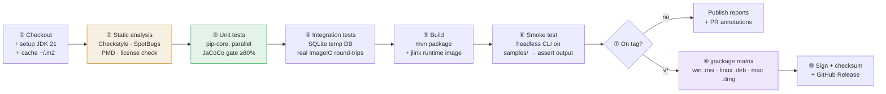
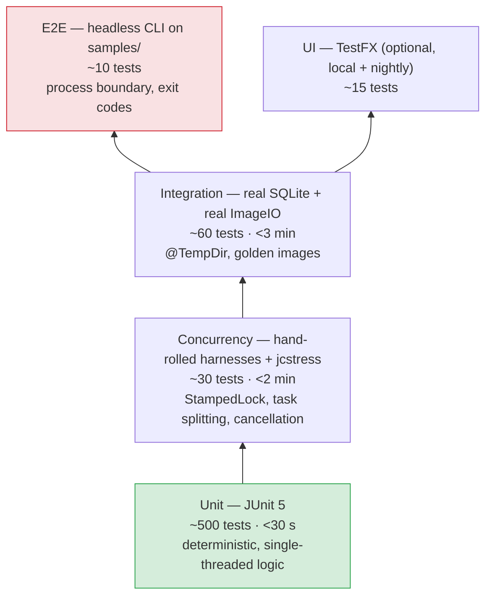
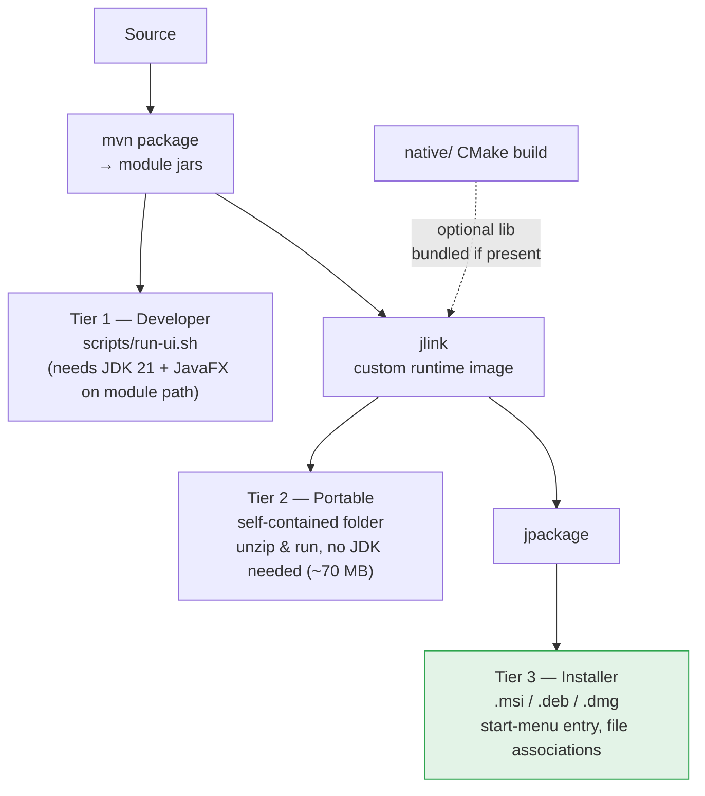
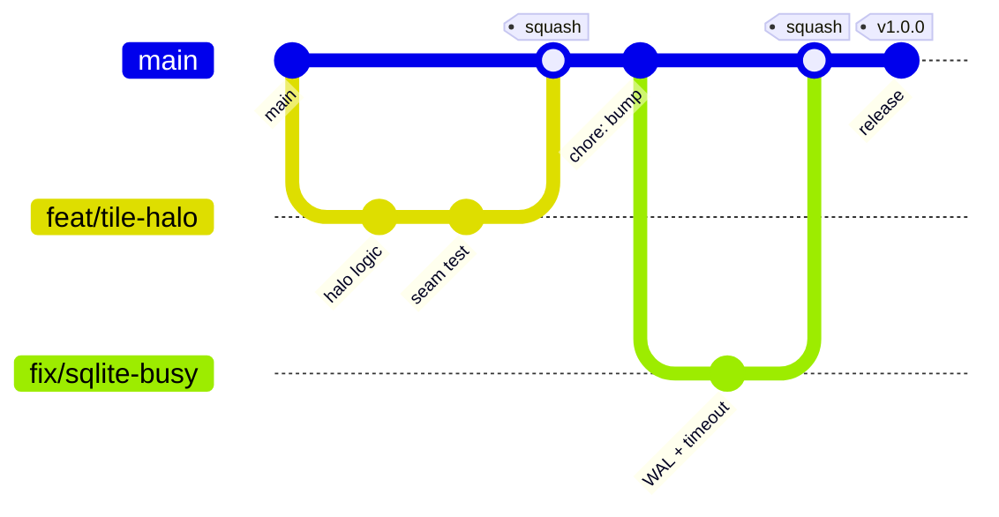

# Parallel Image Processor — Technical Notes

Actionable, opinionated guidance for building, testing, shipping and debugging this codebase.
Read §3.6 (**Common Pitfalls**) before writing any fork/join or JNI code — it is the highest-value
section in this document.

---

## 3.1 CI/CD Pipeline Design

**Constraint:** the deployment target is *local execution*. There is no server to deploy to, so "CD"
means **producing signed native installers**, not pushing to an environment. No Docker anywhere.

### Pipeline stages



### Concrete stage definitions

| Stage | Command | Gate | Runs on |
|-------|---------|------|---------|
| Lint | `mvn -B checkstyle:check spotbugs:check pmd:check` | fail on any violation | ubuntu |
| Unit | `mvn -B -T1C test` | JaCoCo line ≥ 80 % on `pip-core` | ubuntu, windows |
| Integration | `mvn -B verify -Pintegration` | all `*IT` pass | ubuntu, windows |
| Package | `mvn -B package -DskipTests` | jar + jlink image produced | matrix |
| Smoke | `scripts/run-cli.sh --in samples/input --out /tmp/out -p grayscale` | exit 0, N files written | matrix |
| Native | `cmake --build native/build` | shared lib produced | 3-OS matrix, **separate workflow** |
| Release | `jpackage ...` | installer artifacts uploaded | matrix, tag-triggered |

### Design decisions worth knowing

- **`setup-java` with `cache: maven`** is mandatory — a cold Maven resolve is the dominant cost.
- **`-T1C`** (one thread per core) for the Maven build itself; independent of the app's own fork/join.
- **Concurrency group** with `cancel-in-progress: true` so force-pushes don't queue stale runs.
- **`--no-transfer-progress`** keeps logs readable (set once in `.mvn/maven.config`).
- **Native builds are a separate workflow.** OpenCV toolchain setup takes minutes and rarely changes;
  gating every PR on it would be miserable. The Java build must always work *without* the native
  library — `PassthroughEnhancer` guarantees that, and CI proves it by running the default job with
  no native lib present.
- **CI runners have 2–4 cores; developer boxes have 8–32.** Concurrency tests must not assert on
  absolute timings or on observing real parallelism — see §3.6.
- **Set `-Djava.awt.headless=true`** for all CI test runs; `Graphics2D`/`ImageIO` work headless, but
  any accidental AWT window would hang the runner. JavaFX UI tests are skipped on CI unless
  Monocle/TestFX with `-Dtestfx.headless=true` is configured.

### Suggested `jpackage` invocation (release stage)

```bash
jpackage --type msi \
  --name "Parallel Image Processor" --app-version "${VERSION}" \
  --runtime-image target/pip-runtime \
  --input pip-app/target/dist --main-jar pip-app.jar \
  --main-class com.parallelimage.app.Main \
  --java-options "-XX:+UseShenandoahGC -Xmx8g -Dpip.parallelism=0" \
  --win-menu --win-shortcut --win-dir-chooser
```

`--input`/`--main-jar`, **not** `--module`. There is no `module-info.java` anywhere in the reactor:
the application runs on the classpath, and `--module` would require every jar — including SQLite JDBC
and the JavaFX artifacts — to be a proper named module. `jlink` still produces the runtime image
(`--add-modules` with the set below), because a runtime image is a set of *JDK* modules and says
nothing about how the application itself is packaged. `pip-app/target/dist` is the application jar
plus its dependency jars, which is what `--input` expects.

---

## 3.2 Testing Strategy

### The layered pyramid



### Unit testing

- **Framework:** JUnit 5 (Jupiter) + plain `assert*`. No Mockito in `pip-core` — the domain has no
  collaborators worth mocking; use hand-written fakes (`InMemoryJobRepository`) instead. Mocks in
  concurrency tests give false confidence because they don't model memory visibility.
- **Coverage targets:** `pip-core` **≥ 85 % line / ≥ 75 % branch** (hard gate). `pip-persistence`
  ≥ 70 %. `pip-ui` ≥ 40 % (view-models only; views excluded). `pip-native` excluded (needs the lib).
  Coverage is a *floor*, not a goal — a 100 %-covered fork/join splitter can still be wrong.
- **Parallel test execution:** enable in `junit-platform.properties`
  (`junit.jupiter.execution.parallel.enabled=true`, `mode.default=concurrent`) — but mark any test
  touching a shared `ForkJoinPool` or `@TempDir` fixture with `@ResourceLock` /
  `@Execution(SAME_THREAD)`.
- **Property-based thinking for `Tile.split()`:** the invariants are *total coverage, no overlap,
  no zero-area tiles*. Assert those over many randomized rectangles rather than a handful of
  examples. (jqwik is a good optional add; the scaffold does it with a seeded loop.)
- **Golden-image regression:** run a filter on a fixture, compare against a checked-in expected PNG
  with a small per-channel tolerance. This is how tile-seam artefacts get caught — a per-pixel exact
  match is too brittle across JDK/ImageIO versions.

### Concurrency testing — the part people get wrong

| Goal | Technique |
|------|-----------|
| Prove correct results under parallelism | Run the same batch with parallelism 1 and parallelism N; assert **byte-identical output**. This is the single most valuable test in the suite. |
| Prove no torn reads from `MetadataStore` | N reader threads + M writer threads via `CyclicBarrier`; every read must yield a *fully consistent* record (all fields from the same generation). |
| Prove cancellation actually stops work | Cancel mid-batch; assert completed + cancelled = total and that no output files appear after the cancel instant. |
| Prove no deadlock | `assertTimeoutPreemptively(Duration.ofSeconds(30), ...)` around every pool-using test. |
| Prove exception isolation | Inject a job whose source is a corrupt file; assert `BatchResult.failed == 1` and the other 99 succeeded. |
| Find memory-model bugs | jcstress for `MetadataStore` (optional module, nightly only — it takes minutes). |

**Rules:**
- Never `Thread.sleep()` to synchronize. Use `CountDownLatch`, `CyclicBarrier`, `Phaser`.
- Never assert "this ran on ≥2 threads" — a 1-core runner will fail it. Assert *outcomes*.
- Always create a **fresh, private `ForkJoinPool`** per test and shut it down in `@AfterEach`; leaking
  into `commonPool()` makes tests interfere with each other and with Maven's own parallelism.
- Run concurrency tests repeatedly in CI (`@RepeatedTest(20)`) — races are probabilistic.

### Integration testing

- Real SQLite against a `@TempDir` file (not `:memory:` — in-memory hides WAL/locking behaviour,
  which is exactly what you need to test).
- Run `MigrationRunner` from scratch in every integration test; assert the schema version afterwards.
  Also test migrate-from-V001-to-latest to catch broken forward migrations.
- Real files through `ImageIO`: write a small PNG/JPEG in `@BeforeEach`, process, read back, assert
  dimensions and a few pixels. JPEG is lossy — assert with tolerance, never equality.
- Naming: `*Test` = unit (surefire), `*IT` = integration (failsafe, `-Pintegration`).

### E2E testing

- Invoke the built jar as a **real subprocess** (`ProcessBuilder`) so you test the actual
  `main()`/arg-parsing/exit-code contract, not an internal method.
- Assert exit codes (`0` ok / `1` partial / `2` usage / `3` fatal) and that stdout is machine-parseable
  in `--json` mode.
- UI E2E: **TestFX** with Monocle for headless. Keep it to a nightly job — TestFX is flaky on shared
  CI runners and blocking the PR gate on it destroys velocity.

### Performance testing

- **JMH** in `benchmarks/` (separate module, never on the PR path). Benchmark: threshold sweep,
  parallelism 1..2N, GC comparison, filter throughput in MP/s.
- Always report **MP/s and MB/s**, not "seconds for my folder" — otherwise results aren't comparable.
- Use `-prof gc` to catch allocation regressions, which matter more than raw CPU here.

---

## 3.3 Deployment Strategy

**No containers.** Docker is explicitly out of scope: the app needs a display, direct filesystem
access to the user's photo directories, and native OpenCV — all of which containers make harder for
zero benefit on a desktop tool.

### Distribution tiers



| Tier | Audience | Prereqs | How |
|------|----------|---------|-----|
| 1 — Dev run | Contributors | JDK 21, Maven | `scripts/run-ui.cmd` / `.sh` |
| 2 — Portable | Power users, CI | none | `jlink` image, zipped |
| 3 — Installer | End users | none | `jpackage` per OS |

### `jlink` module set

```text
java.base, java.desktop (ImageIO/Graphics2D), java.sql (SQLite),
java.logging, java.net.http, jdk.httpserver (control API),
jdk.crypto.ec, javafx.controls, javafx.swing, javafx.graphics, javafx.base
```

Add `--compress=zip-6 --no-header-files --no-man-pages --strip-debug` to keep the image ~70 MB.

### Native library placement

The OpenCV shim is **optional at runtime**. Resolution order, first hit wins:
1. `-Dpip.native.path=/abs/path/libpip_enhance.so`
2. Bundled resource `native/<os>-<arch>/` extracted to a temp dir and `System.load`ed
3. `System.loadLibrary("pip_enhance")` (relies on `PATH`/`LD_LIBRARY_PATH`)
4. **Fallback:** `PassthroughEnhancer` — log a `WARNING` and keep going

Never fail startup because a native library is missing. Verify the SHA-256 against the checked-in
manifest before loading (see ARCHITECTURE §2.5).

### Local runtime layout

```text
~/.pip/
├── pip.db                  # SQLite (WAL: pip.db-wal, pip.db-shm)
├── application.properties  # user overrides
├── api.token               # generated, mode 600
├── logs/pip.0.log … pip.4.log
└── native/                 # extracted shared libs, checksum-verified
```

### Rollback

The installer keeps the previous version's `~/.pip` intact. Migrations are **forward-only**; a
downgrade is therefore only safe if the schema version is unchanged. Back up `pip.db` before
migrating (`MigrationRunner` does this automatically) and document the last-compatible version in
release notes.

---

## 3.4 Environment Management

Three "environments" for a desktop app: **dev**, **test/CI**, **prod (user machine)**.

### Configuration resolution order (highest wins)

```text
1. JVM system property     -Dpip.parallelism=8
2. Environment variable    PIP_PARALLELISM=8          (dots→underscores, upper-cased)
3. ~/.pip/application.properties                       (user overrides, persisted by the UI)
4. classpath:/application.properties                   (packaged defaults, checked in)
```

`AppConfig` implements exactly this chain and is the **only** place `System.getenv` is called.
Never read env vars from domain code — it makes tests order-dependent and untestable.

### `.env.example`

`.env` is **git-ignored**; `.env.example` is checked in and documents every key. Scripts source it;
it is *not* read by the JVM directly (the JVM reads real env vars / properties).

```dotenv
# ── Concurrency ───────────────────────────────────────────
PIP_PARALLELISM=0                 # 0 = availableProcessors()-1
PIP_TILE_THRESHOLD_PX=65536       # L2 leaf size in pixels
PIP_BATCH_THRESHOLD=8             # L1 leaf size in jobs

# ── Paths ─────────────────────────────────────────────────
PIP_INPUT_DIR=./samples/input
PIP_OUTPUT_DIR=./samples/output
PIP_ALLOWED_ROOTS=./samples       # path-traversal allow-list (OS path separator)

# ── Limits (decode-bomb protection) ───────────────────────
PIP_MAX_PIXELS=200000000
PIP_MAX_FILE_BYTES=268435456

# ── Local control API ─────────────────────────────────────
PIP_API_ENABLED=false
PIP_API_PORT=877
PIP_API_TOKEN=                    # generated on first run if blank — never commit a value

# ── Native / OpenCV ───────────────────────────────────────
PIP_NATIVE_ENABLED=true
PIP_NATIVE_PATH=

# ── Logging ───────────────────────────────────────────────
PIP_LOG_LEVEL=INFO
PIP_LOG_JSON=false
```

### Per-environment differences

| Setting | dev | CI | prod |
|---------|-----|----|------|
| `PIP_LOG_LEVEL` | `DEBUG` | `INFO` | `WARNING` |
| `PIP_PARALLELISM` | `0` (auto) | `2` (pin — runners are small) | `0` |
| GC flags | `debug.vmoptions` (+GC log, +JFR, `-ea`) | default G1 (faster startup) | `shenandoah.vmoptions` |
| `PIP_API_ENABLED` | `true` | `false` | `false` (opt-in) |
| DB | `./target/dev.db` | `@TempDir` | `~/.pip/pip.db` |

**Never** ship a config file containing a real token. **Never** log the resolved config at `INFO`
without redacting `*TOKEN*`/`*SECRET*`/`*PASSWORD*` keys.

---

## 3.5 Version Control Workflow

### Recommendation: **Trunk-Based Development** with short-lived branches and release tags



**Rules**
- `main` is always releasable and always green. Protected: PR + green CI + 1 review required.
- Feature branches live **< 3 days**. Named `feat/`, `fix/`, `perf/`, `docs/`, `chore/`, `refactor/`.
- **Squash-merge** to `main` — one logical change per commit keeps `git bisect` usable, which matters
  enormously when hunting an intermittent concurrency regression.
- **Conventional Commits** (`feat(core): add halo overlap to BoxBlurFilter`) → automatable changelog.
- Releases are **tags on `main`** (`v1.2.0`), which trigger `release.yml`. No long-lived
  `develop`/`release` branches.
- Hotfix: branch from the tag, fix, tag `v1.2.1`, cherry-pick forward to `main`.

**Why trunk-based over Gitflow here:** Gitflow's `develop`/`release`/`hotfix` topology exists to
coordinate *multiple simultaneously-supported versions* shipped on a slow cadence. A desktop tool
with one supported version and CI-produced installers gets nothing from that overhead — only merge
pain and long-lived divergence. Trunk-based keeps integration continuous, which is what actually
surfaces concurrency bugs early.

**Binary fixtures:** golden images live in `src/test/resources` and are marked `binary` in
`.gitattributes` (no CRLF mangling, no useless diffs). If they grow past ~50 MB total, move to
Git LFS rather than bloating clone time.

---

## 3.6 Common Pitfalls

The stack-specific traps. **Read this before writing fork/join or JNI code.**

### A. Fork/Join

| # | Pitfall | Why it hurts | Do this instead |
|---|---------|--------------|-----------------|
| A1 | **Blocking I/O inside `compute()`** | `ForkJoinPool` sizes itself to core count assuming tasks are CPU-bound. A blocked worker isn't replaced → cores idle → throughput collapses. | Wrap decode/encode/JNI in `ForkJoinPool.ManagedBlocker` so the pool compensates, or move I/O to a separate `Executor`. |
| A2 | **`fork()` + `join()` on both halves** | `left.fork(); right.fork(); left.join(); right.join();` wastes the current thread and inverts LIFO locality. | `invokeAll(left, right)` — or `right.fork(); left.compute(); right.join();`. The scaffold uses `invokeAll`. |
| A3 | **Joining in the wrong order** | Joining a task forked *earlier* than another can force the worker to help with unrelated stolen work first, hurting locality. | Join in **reverse** fork order (LIFO). `invokeAll` handles it. |
| A4 | **Threshold too small** | Fork overhead (~a few hundred ns/task) swamps the pixel work; millions of tiny tasks can be *slower than single-threaded*. | Target 100k–1M pixels per leaf (measured via JMH — see `docs/PERFORMANCE.md`). Measure — never guess. |
| A5 | **Using `commonPool()`** | Shared with parallel streams, `CompletableFuture`, and anything else in the JVM; one blocking task poisons the whole application. | Own a dedicated `ForkJoinPool` from `ForkJoinConfig`. Never `parallelStream()` on the hot path. |
| A6 | **Assuming `cancel(true)` interrupts a running task** | It only prevents *unstarted* tasks from running; a tight pixel loop runs to completion. | Cooperative `CancellationToken`, polled at each `compute()` entry and each tile row. |
| A7 | **Exceptions vanish** | An exception in `compute()` surfaces later, at `join()`, on another thread, wrapped — with a confusing stack. | Catch in leaves → `JobOutcome.Failure`. Install an uncaught-exception handler on the thread factory. |
| A8 | **Mutating shared state from tiles** | Data race; may look fine for months. | Tiles write to **disjoint** regions of `dst` and only ever *read* `src`. Aggregate via the `BatchResult` monoid, not a shared counter. |
| A9 | **`ThreadLocal` leaks** | FJ workers are long-lived; `ThreadLocal` values (e.g. a cached `Graphics2D`) survive the batch and leak. | Avoid, or clear explicitly in a `finally`. |
| A10 | **Recursion depth on huge splits** | Deeply unbalanced splits can approach stack limits. | Always split at the *midpoint*; keep the threshold sane. |

### B. Java 21 / language

| # | Pitfall | Guidance |
|---|---------|----------|
| B1 | Reaching for virtual threads for pixel work | **Wrong tool.** Virtual threads win for *blocking I/O concurrency*, not CPU-bound parallelism — 10k virtual threads on 16 cores just add scheduling overhead. Use fork/join for pixels; virtual threads are fine for the control API's request handling. |
| B2 | `record` with an array component | Arrays break `equals`/`hashCode`. Never put `int[] pixels` in a record you compare. Keep pixel buffers out of value objects. |
| B3 | Pattern-matching `switch` without exhaustiveness | Use a **sealed** interface (`ImageOperation`) and *omit* `default` — the compiler then errors when a new op is added. That is the point. |
| B4 | Maven silently using the wrong JDK | On this machine `mvn -v` reports **JDK 11**. `maven.compiler.release=21` will fail cryptically. Set `JAVA_HOME=C:\Programs\jdk-21.0.2` or configure `~/.m2/toolchains.xml`. |

### C. Shenandoah GC

| # | Pitfall | Guidance |
|---|---------|----------|
| C1 | Assuming Shenandoah exists | Absent from some vendor builds. Detect at startup and fall back — never hard-fail. |
| C2 | Expecting a throughput win | Load barriers cost ~5–15 % throughput. You are buying **pause predictability**. For headless throughput-only runs, `ParallelGC` is faster — keep it overridable. |
| C3 | Heap too small for the allocation rate | Large images allocate hundreds of MB/s; if the collector can't keep up, Shenandoah degrades to a full STW pause — worse than G1. Give it headroom (`-Xmx8g`) and watch "Pacing" / "Degenerated GC" in the GC log. |
| C4 | Humongous allocations | A 48 MP ARGB `int[]` is ~192 MB. `-XX:+AlwaysPreTouch` avoids first-touch faults; a buffer pool avoids the allocation entirely. |
| C5 | No GC visibility | Always run dev with `-Xlog:gc*:file=logs/gc.log:time,uptime,level,tags`. Diagnosing a stutter without a GC log is guesswork. |

### D. JavaFX

| # | Pitfall | Guidance |
|---|---------|----------|
| D1 | Touching UI from a worker thread | Instant `IllegalStateException` (or silent corruption). All UI mutation goes through `Platform.runLater` — or better, `javafx.concurrent.Task`'s `updateProgress/updateMessage`, which coalesce for you. |
| D2 | Flooding the FX thread | One `runLater` per tile = tens of thousands of queued Runnables = frozen UI. **Coalesce** to ≤ 30 updates/sec (`ProgressBridge` does this with an `AtomicReference` + a pulse). |
| D3 | `SwingFXUtils.toFXImage` on the FX thread | Converting a 48 MP `BufferedImage` blocks the renderer for hundreds of ms. Convert on a background thread and hand over the finished `Image`. |
| D4 | Blocking `ObservableList` updates | Adding 10 000 rows one-by-one triggers 10 000 change events. Build a plain `List` off-thread, then `setAll()` once. |
| D5 | Missing module path | JavaFX 21 is modular and *not* in the JDK. Running without `--module-path`/`--add-modules` gives "JavaFX runtime components are missing". Scripts handle it; a bare `java -jar` will not. |
| D6 | `Thread.sleep` in `Application.start` | Freezes before the window shows. Do all initialization in a `Task`. |

### E. ImageIO

| # | Pitfall | Guidance |
|---|---------|----------|
| E1 | **`ImageIO` is not fully thread-safe** | The `ImageIO.read/write` static entry points are documented as safe, but individual `ImageReader`/`ImageWriter` **instances are not**. Never share a reader/writer across tasks — create one per task, `dispose()` in `finally`. |
| E2 | Disk-cache contention | `ImageIO` defaults to a temp-file cache; under 16 concurrent decodes this becomes a filesystem bottleneck. `ImageIO.setUseCache(false)` once at startup (measurable win). |
| E3 | Unknown `BufferedImage` type | `ImageIO.read` may return `TYPE_3BYTE_BGR`, `TYPE_BYTE_INDEXED`, `TYPE_CUSTOM`… Pixel loops written for `TYPE_INT_RGB` silently produce garbage or crawl via `getRGB`. **Normalize on load** to `TYPE_INT_RGB`/`TYPE_INT_ARGB` (`ImageLoader` does this). |
| E4 | `getRGB`/`setRGB` per pixel | Orders of magnitude slower than direct `DataBufferInt` access. Grab `((DataBufferInt) raster.getDataBuffer()).getData()` once per tile and index it. |
| E5 | No alpha in JPEG | Writing an ARGB image as JPEG yields pink/garbled output. Composite onto opaque white first, or write PNG. |
| E6 | Losing EXIF/ICC | Standard `ImageIO` drops most metadata on re-encode. If preservation is required you must copy `IIOMetadata` explicitly — and note this conflicts with the privacy-by-default stripping policy. |
| E7 | Reading dimensions costs a full decode | Use an `ImageReader` on an `ImageInputStream` and call `getWidth(0)`/`getHeight(0)` to check limits **before** allocating (also the decode-bomb defence). |
| E8 | Decode bombs | Always enforce `w*h <= PIP_MAX_PIXELS` before `read()`. |

### F. JNI / OpenCV

| # | Pitfall | Guidance |
|---|---------|----------|
| F1 | A native crash kills the JVM | No try/catch will save you. Validate **everything** on the Java side; keep the pure-Java fallback; consider an out-of-process worker if instability appears. |
| F2 | `GetPrimitiveArrayCritical` pins the heap | Stalls GC — brutal under Shenandoah's concurrent evacuation. Prefer a **direct `ByteBuffer`** (`GetDirectBufferAddress`) for zero-copy without pinning. |
| F3 | Local reference leaks | JNI local refs aren't freed until the native method returns; a loop creating refs overflows the local frame. `DeleteLocalRef` in loops, or `Push/PopLocalFrame`. |
| F4 | Ignoring pending exceptions | After any JNI call that can throw, check `ExceptionCheck()` and return immediately. Continuing with a pending exception is undefined behaviour. |
| F5 | JNI call overhead in a hot loop | A JNI transition costs ~10–50 ns. Never call native per-pixel; pass a whole tile or image. |
| F6 | Name mangling mismatch | `Java_com_parallelimage_nativebridge_NativeImageEnhancer_enhance` — one typo and you get `UnsatisfiedLinkError` at call time. Generate the header with `javac -h` rather than hand-writing it. |
| F7 | OpenCV `Mat` lifetime | `Mat` is reference-counted in C++ but invisible to the JVM. Scope it tightly; never hand a raw `Mat*` to Java as a `long` without an explicit release path. |
| F8 | Deadlock: native code calling back into Java while holding a lock | Avoid callbacks from native into Java entirely. Pass data down, get data back. |
| F9 | Loading from an untrusted path | `System.load(userPath)` is arbitrary-code-execution. Load only from the app's own verified extraction directory. |

### G. SQLite

| # | Pitfall | Guidance |
|---|---------|----------|
| G1 | **Single writer** | Concurrent writes → `SQLITE_BUSY`. Enable `PRAGMA journal_mode=WAL` + `PRAGMA busy_timeout=5000`, and funnel writes through **one** thread/connection. |
| G2 | Auto-commit per row | 10 000 individual inserts ≈ 10 000 fsyncs. Wrap batches in a single transaction (~100× faster). |
| G3 | Sharing a `Connection` across FJ workers | JDBC `Connection` is not thread-safe. One connection per thread, or a single writer actor. |
| G4 | Writing the DB into the app directory | Breaks on read-only installs. Use `~/.pip/`. |
| G5 | Forgetting WAL sidecar files | `pip.db-wal` / `pip.db-shm` must be copied with the DB in any backup. |

### H. Build / environment (this machine specifically)

| # | Pitfall | Guidance |
|---|---------|----------|
| H1 | Maven → JDK 11 by default | `export JAVA_HOME=C:/Programs/jdk-21.0.2` before building, or use `toolchains.xml`. |
| H2 | JavaFX classifier | Artifacts need an OS classifier (`win`, `linux`, `mac`, `mac-aarch64`). The POM selects it via an OS-activated profile; a hardcoded classifier breaks cross-platform CI. |
| H3 | CRLF vs LF | `.gitattributes` normalizes text and marks images binary; without it Windows checkouts corrupt golden PNGs. |
| H4 | Path separators | Never concatenate with `"/"`. Use `Path.resolve()` everywhere. |
| H5 | Long paths on Windows | Deep module + package nesting can exceed `MAX_PATH` (260) in some tools. Keep the checkout near the drive root. |
