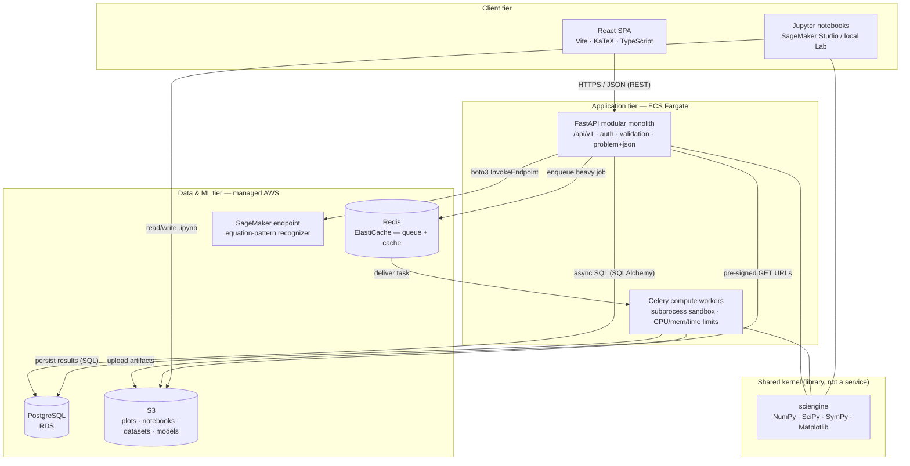
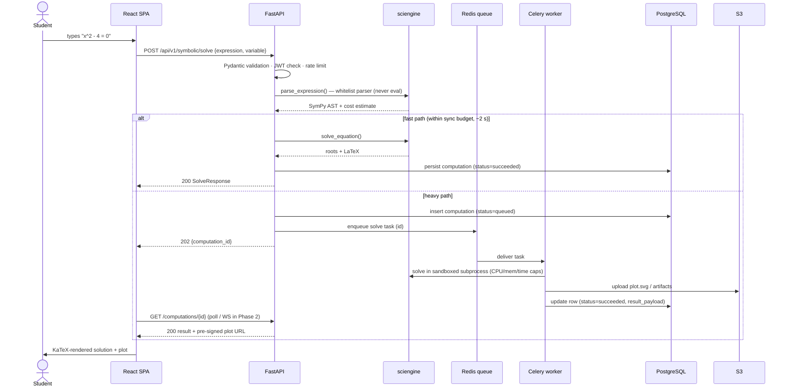
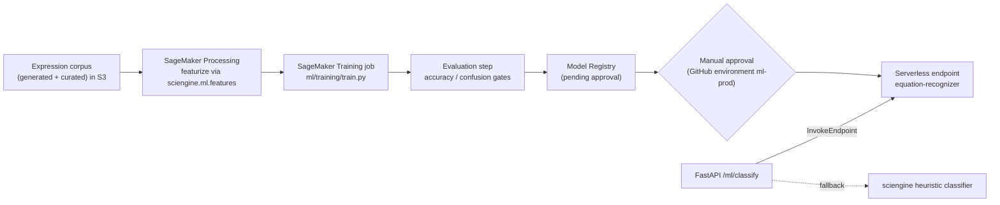

# Scientific Computing Platform — Architecture

**Status:** Draft v1 · **Last updated:** 2026-07-08
**Related:** [PROJECT-PLAN.md](./PROJECT-PLAN.md) · [TECH-NOTES.md](./TECH-NOTES.md) · [ADR-0001](./adr/0001-modular-monolith.md)

---

## 2.1 Chosen Architectural Pattern

**Modular monolith core + asynchronous compute plane + managed ML sidecar.**

Three cooperating parts, deliberately *not* microservices:

1. **Modular monolith (FastAPI)** — one deployable API with strict internal
   layering (`endpoints → services → sciengine/db`). All request/response,
   auth, validation, and persistence concerns live here.
2. **Asynchronous compute plane (Celery workers on the same codebase)** —
   symbolic solving and numerical jobs are CPU-bound and can be pathologically
   slow (SymPy can run for minutes on an unlucky integral). They execute in
   separate worker containers, isolated per-task in subprocesses with hard
   time/memory limits, fed by a Redis queue. The API never blocks on them
   beyond a small "fast path" budget.
3. **Managed ML sidecar (AWS SageMaker)** — the equation-pattern-recognition
   model is trained, registered, and served entirely by SageMaker. The
   monolith consumes it through one narrow interface (`InvokeEndpoint`) and
   degrades gracefully to a heuristic classifier when the endpoint is absent.

The scientific kernel **`sciengine`** is a shared *library* (NumPy/SciPy/SymPy/
Matplotlib) imported identically by the API, the workers, Jupyter notebooks,
and ML feature extraction — the single source of mathematical truth.

### Why this fits

| Requirement | How the pattern serves it |
| --- | --- |
| Education platform, small team | One repo, one API deployable, one lockfile — minimal ops burden; no distributed-transaction or service-mesh complexity. |
| Untrusted math input, unbounded CPU | The *only* hard isolation boundary in the system is placed exactly where the risk is: sandboxed worker subprocesses with rlimits/timeouts. |
| Interactive Jupyter + web UI must agree | Both import the same `sciengine` — no drift between "what the notebook teaches" and "what the API computes". |
| ML lifecycle ≠ app lifecycle | SageMaker owns training/registry/serving; models ship weekly without redeploying the app. |
| Future growth | Modules (`symbolic`, `plots`, `ml`, `computations`) have service-shaped seams; any of them can be extracted later if scale demands it — see ADR-0001. |

Microservices were rejected for now: they would multiply deployment surfaces
(~6 services), force network contracts between math modules that naturally
share in-process dataclasses, and buy nothing at classroom scale (thousands,
not millions, of users). Serverless-only (Lambda) was rejected because SymPy
workloads regularly exceed comfortable Lambda duration/memory envelopes and
benefit from warm BLAS-tuned containers.

---

## 2.2 Key Component Interactions



### Communication contract per edge

| From → To | Mechanism | Sync/Async | Failure behavior |
| --- | --- | --- | --- |
| SPA → API | REST JSON over HTTPS, JWT bearer | Sync | Typed `application/problem+json` errors; client retries only idempotent GETs |
| API → sciengine | In-process function call | Sync, budgeted | `SciEngineError` taxonomy → mapped HTTP status (see §2.6) |
| API → Redis → Worker | Celery task `compute.run_computation` (`acks_late`, JSON serializer; workers run the threads pool — the sandbox subprocess does the heavy math) | Async | Redelivery on worker death; terminal `failed` state on any error; idempotency key = computation id; broker outage marks the row `failed (queue_unavailable)` instead of losing it |
| API/Worker → Postgres | SQLAlchemy 2.0 (async in API, sync in worker) | Sync | Pool pre-ping, bounded pool; readiness probe flips on outage |
| Worker → S3 | boto3 PUT, artifacts keyed `computations/{id}/…` | Async job step | Retry w/ backoff; job fails cleanly if S3 down |
| API → SageMaker | `sagemaker-runtime:InvokeEndpoint` (JSON) | Sync, 2 s timeout | Circuit-break to local heuristic classifier (`source: "heuristic"` in response) |
| SPA ← API job status | Polling `GET /computations/{id}` (Phase 2: WebSocket push) | Async | Poll with backoff; job records carry terminal `status` + `error_code` |

**Deliberate non-interactions:** the frontend never talks to SageMaker, S3, or
the DB directly; workers never accept network input; notebooks call the
library, not the API (they *are* the trusted compute environment).

---

## 2.3 Data Flow

### Interactive solve (the core loop)



### ML pattern-recognition training loop (batch)



Key property of both flows: **inputs are canonicalized once** (safe parse →
SymPy canonical form) and every downstream consumer — solver, plotter, cache
key, ML featurizer — operates on that canonical form, never on raw user text.

---

## 2.4 Scalability & Performance Strategy

**Stateless where it's cheap, queued where it's expensive.**

- **API tier**: FastAPI containers are stateless (JWT auth, no sticky
  sessions) → horizontal scaling behind an ALB with target-tracking on CPU.
  Endpoints that call SymPy are declared as *sync* `def` routes so FastAPI
  runs them on the threadpool without blocking the event loop.
- **Compute tier**: workers scale on **queue depth** (custom CloudWatch metric
  from Redis) rather than CPU — classroom traffic is bursty (300 submissions
  in the first minute of a lab). `worker_prefetch_multiplier=1` +
  `acks_late=True` keeps long tasks from starving the queue.
- **Per-task budget enforcement**: soft limit 30 s / hard kill 60 s, memory
  rlimit per subprocess, `OMP_NUM_THREADS=1` so BLAS threads × worker
  concurrency doesn't oversubscribe cores.
- **Caching**: computation results are cached keyed by
  `sha256(srepr(canonical_expr) + operation)` — identical homework questions
  from 30 students cost one solve. Redis when reachable, an in-process LRU
  otherwise; cache failures always degrade to a miss, never an error. Plot
  responses carry `Cache-Control`; static SPA assets are immutable-hashed
  behind CloudFront.
- **Artifacts**: workers write plot outputs through a storage interface —
  S3 (pre-signed GET) in AWS, a shared volume locally — and the API serves
  them through the owner-scoped artifact endpoint.
- **ML serving**: SageMaker **serverless inference** absorbs spiky classroom
  load with scale-to-zero economics; can be promoted to a provisioned endpoint
  with auto-scaling if latency SLOs demand it.
- **Database**: JSONB payloads keep the hot path join-free; pagination is
  mandatory on list endpoints; read replicas are a Phase 3 option, not a
  Phase 1 cost.
- **Explicit budgets** (SLO targets): p95 ≤ 300 ms for cached/simple solves,
  p95 ≤ 5 s for fast-path symbolic, async jobs visible in UI within 1 s of
  completion; error budget wired to CloudWatch alarms.

Growth path: because modules communicate through service-layer interfaces and
a queue, the first extraction candidate (the compute plane) is *already*
physically separate; the second (ML) already lives outside the process. The
monolith can therefore scale by replication for a long time before any
decomposition is warranted.

---

## 2.5 Security Considerations

### Authentication & authorization

- **JWT access tokens** (15 min, HS256 → RS256 when multi-service) + rotating
  **single-use refresh tokens** (14 days). Every refresh token is recorded
  server-side in the `refresh_tokens` table by its `jti`: refresh revokes the
  presented token and issues a new pair, logout revokes explicitly — a stolen
  refresh token dies on first legitimate rotation.
- **Login is enumeration-resistant**: unknown emails burn the same scrypt
  verification time as wrong passwords, and both return the identical error.
- **Roles**: `student`, `instructor`, `admin` embedded as claims; enforcement
  in FastAPI dependencies (`get_current_user` / `get_optional_user`), never in
  the frontend.
- Resource ownership scoping at the service layer: every `computations` query
  filters by `owner_id` — no cross-tenant reads by construction (foreign IDs
  read as 404, not 403).

### The #1 domain-specific threat: evaluating user math

- `sympy.sympify()` calls `eval()`. It is **banned** in this codebase.
  `sciengine.symbolic.parsing.parse_expression()` is the only entry point:
  length caps, character whitelist, `__` rejection, whitelisted function
  namespace, empty `global_dict`, and a complexity guard (op count, exponent
  magnitude) against `10**10**10`-style memory bombs.
- Heavy evaluation runs in **worker subprocesses** with no network access,
  CPU/memory rlimits, and hard kills — a hung `solve()` cannot take down an
  API pod or another student's job.
- LaTeX is rendered **client-side by KaTeX with `trust: false`** (no `\href`,
  no `\includegraphics`). The platform never shells out to a TeX binary on
  user input; PDF export (Phase 3) will run in a locked-down container.

### API security

- TLS everywhere (ALB terminates, internal traffic in private subnets).
- Strict CORS allowlist from config; JSON body size caps; security headers
  (CSP, `X-Content-Type-Options`, HSTS) at the edge.
- **Rate limiting per identity** (JWT holder, else client IP) on every
  `POST /api/v1/*`: fixed one-minute windows, Redis-backed across replicas
  with an in-process fallback, `429 problem+json` with `Retry-After`. Protects
  the solver against classroom bursts and `/auth/login` against credential
  stuffing; the sync-budget 202/504 escalation bounds per-request cost on top.
- Pydantic validates *shape* (including per-kind computation payloads);
  sciengine validates *content*. Both run before any computation.

### Data protection & secrets

- At rest: RDS/S3/ElastiCache encryption (KMS); minimal PII (email + password
  hash only; scrypt via stdlib `hashlib`, per-user salt).
- In transit: TLS 1.2+; pre-signed S3 URLs are short-lived (minutes).
- **Secrets**: AWS Secrets Manager / SSM Parameter Store under
  `/scp/{env}/…`, injected into ECS task definitions. GitHub Actions uses
  **OIDC role assumption — zero long-lived AWS keys in CI**. Local dev uses
  `.env` (gitignored); `.env.example` documents every knob.
- Supply chain: committed lockfiles (`uv.lock`, `package-lock.json`),
  Dependabot, `pip-audit`/`npm audit` in CI, image scanning on ECR push,
  containers run as non-root.

---

## 2.6 Error Handling & Logging Philosophy

**One error taxonomy, defined in the kernel, honored everywhere.**

```text
SciEngineError(code)                       # base — never leaks internals
├── ExpressionParseError    → HTTP 422     # user-fixable; message says what to fix
├── UnsupportedExpressionError → HTTP 422  # valid math we can't (yet) handle
├── ComputationError        → HTTP 500     # our defect; opaque detail, full server log
│   └── ConvergenceError    → HTTP 422     # numeric method diverged; returns iterations/residual
└── ComputationTimeoutError → HTTP 504 (sync) / status=failed + error_code (async)
```

Principles:

1. **Errors are part of the API contract.** Every non-2xx response is RFC 7807
   `application/problem+json`:

   ```json
   {
     "type": "https://scp.example.com/problems/expression_parse_error",
     "title": "expression parse error",
     "status": 422,
     "detail": "Expression contains unsupported characters.",
     "request_id": "8f4a…"
   }
   ```

2. **User-fixable vs. ours.** 4xx messages teach (this is an education
   platform — a parse error is a learning moment); 5xx messages are opaque to
   the client and verbose in the logs. Stack traces never cross the API
   boundary.
3. **Fail closed on input, fail soft on enrichment.** Parsing/validation
   errors abort the request; a SageMaker outage silently downgrades
   `/ml/classify` to the heuristic (`source` field tells the truth).
4. **Async jobs never vanish.** A queued computation always reaches a terminal
   `status` (`succeeded|failed`) with a machine-readable `error_code`; hard
   timeouts are recorded, not swallowed.
5. **Structured JSON logs** with a stable field set:
   `timestamp, level, event, request_id, user_id, route, duration_ms,
   computation_kind, cache_hit`. The `X-Request-ID` header is accepted or
   generated at ingress, stored in a contextvar, echoed in responses and every
   log line, and passed through Celery task headers — one ID traces
   SPA → API → queue → worker → DB.
6. **Retries are explicit.** Only idempotent operations retry (client GETs,
   worker S3 uploads with backoff). Task submission is idempotent via the
   computation UUID, so a duplicated enqueue cannot double-charge a solve.
7. **Destinations**: stdout JSON → CloudWatch Logs (metric filters → alarms);
   exceptions → Sentry with release + request_id; SLO dashboards from ALB,
   queue-depth, and SageMaker invocation metrics.
