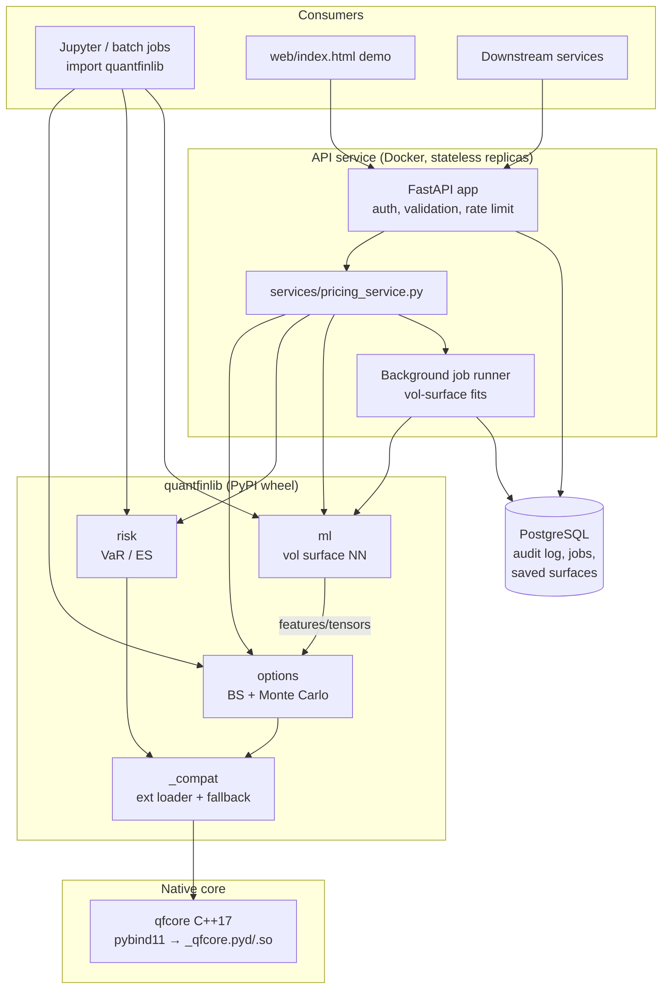
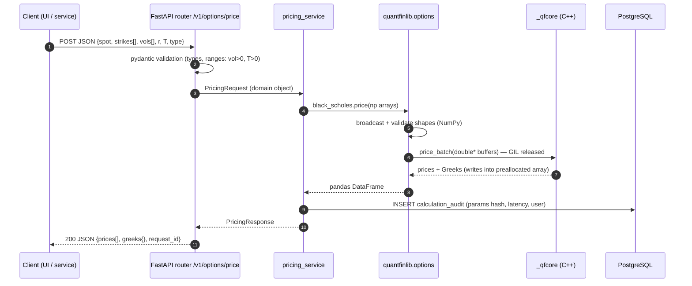
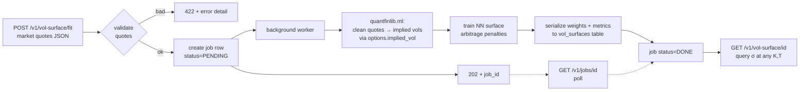

# Quantitative Finance Library — Architecture

## 2.1 Chosen Architectural Pattern

**Layered Monolith with a native-core boundary**, packaged as a library-first product plus a
thin service shell:

```
┌─────────────────────────────────────────────────────────┐
│  Presentation      FastAPI service (api/) + static demo │   deployed (Docker)
├─────────────────────────────────────────────────────────┤
│  Application       quantfinlib Python package           │   published (PyPI)
│                    options / risk / ml façades          │
├─────────────────────────────────────────────────────────┤
│  Numerical core    qfcore C++17 (pybind11 boundary)     │   compiled into wheel
└─────────────────────────────────────────────────────────┘
```

**Why this pattern, and not microservices/serverless:**

- The product is fundamentally a **library**. Consumers are quants in notebooks, batch jobs,
  and one HTTP façade. There is no organizational or scaling reason to split pricing, risk,
  and ML into separately deployed services — they share the same numerical core and would
  pay network-serialization costs (fatal for `price 100k options` workloads) for no benefit.
- **Serverless is a poor fit** for the compute profile: pricing calls are CPU-bound with a
  compiled extension; cold-starting a ~200 MB image (NumPy/SciPy/torch) per invocation
  destroys latency, and long ML fits exceed typical function timeouts.
- The layered monolith keeps a **hard, testable boundary** at each layer: the C++ core knows
  nothing about Python; the Python library knows nothing about HTTP; the API knows nothing
  about numerics. Each layer is replaceable (e.g., swap MLP for a Gaussian-process surface
  model) without touching the others.
- If load ever demands it, the API tier scales **horizontally as identical stateless
  replicas** — the monolith is the unit of replication, not of coupling.

### Component overview



---

## 2.2 Key Component Interactions

| Interaction | Mechanism | Notes |
|---|---|---|
| Python ↔ C++ core | **In-process pybind11 calls**, zero-copy NumPy buffers (`py::array_t`, GIL released during compute) | No serialization; the whole point of the C++ core. Contract = typed function signatures in `bindings.cpp`, mirrored by `_qfcore.pyi` stubs. |
| API ↔ library | **Direct Python imports** through `services/` layer only | Routers never import `quantfinlib` directly — keeps HTTP concerns out of numerics and gives one seam for mocking in tests. |
| Clients ↔ API | **REST/JSON over HTTPS**, versioned under `/v1` | OpenAPI schema auto-generated; pydantic v2 validates at the edge. |
| Long fits (ML) | **Job table + background worker** (in-process `asyncio` task first, external queue later) | `POST /v1/vol-surface/fit` → `202 Accepted` + job id → client polls `GET /v1/jobs/{id}`. Avoids request timeouts on multi-minute training. |
| API ↔ database | **SQLAlchemy 2.x (async)**, migrations via Alembic | DB stores *metadata* (audit log, job status, serialized fitted surfaces) — never market data, never intermediate numerics. |
| No message bus (yet) | — | An event bus is deliberately deferred: one producer, one consumer, one process. The job-table pattern gives the same decoupling with none of the ops burden; ADR to revisit if fits move to GPU workers. |

---

## 2.3 Data Flow

Typical request: **price an option chain via the API**.



Second flow: **ML volatility-surface fitting** (long-running).



Library-only users skip everything left of `quantfinlib` — the same code path, no HTTP, no DB.

---

## 2.4 Scalability & Performance Strategy

**Performance (single node) — where 95 % of the wins are:**

- Hot loops live in **C++** (closed-form BS, MC path generation); pybind11 releases the **GIL**
  during computation, so the FastAPI worker keeps serving.
- **Batch-first API design**: every function accepts arrays, not scalars. One call prices an
  entire chain; crossing the Python↔C++ boundary once, not 10 000 times.
- **Zero-copy** NumPy buffers across the binding; outputs written into preallocated arrays.
- **OpenMP** parallelism inside the MC engine (paths are embarrassingly parallel);
  antithetic variates + (Phase 3) Sobol sequences cut required path counts ~4–10×.
- ML training uses torch; CPU by default, CUDA if present — device selection is config, not code.

**Scalability (multi node):**

- The API is **stateless** — all state in Postgres — so it scales horizontally behind any
  load balancer; `docker compose --scale api=N` locally, replicas/HPA on any orchestrator.
- Pricing calls are **deterministic for identical inputs** (seeded MC), enabling response
  caching keyed on a canonical hash of the request (Phase 3).
- Long ML fits are already isolated behind the **job queue seam**: moving them from in-process
  tasks to dedicated GPU workers changes one module (`jobs/runner.py`), not the API contract.
- The database only stores metadata and small serialized models → it will not be the
  bottleneck; connection pooling via SQLAlchemy async engine.

**Known ceiling & plan:** if a single request must price millions of exotics, the answer is
not more API replicas but the library used directly in a batch/HPC context — which the
library-first architecture already supports.

---

## 2.5 Security Considerations

| Area | Approach |
|---|---|
| **Authentication** | Static **API keys** (SHA-256 hashed at rest, `X-API-Key` header) — appropriate for an internal quant service. Future: OIDC/JWT (Auth0/Entra) if exposed beyond the team. The auth dependency is a single FastAPI `Depends` (`require_scope`), so swapping mechanisms doesn't touch routers. |
| **Authorization** | Coarse per-key scopes (`price`, `fit`, `admin`) declared in `QF_API_KEY_HASHES` (`hash:scope1\|scope2`) and checked in the auth dependency. No row-level ACLs needed — data is not user-private market data. |
| **Input hardening** | pydantic v2 at the HTTP edge (types, bounds); a *second* validation layer in `quantfinlib.utils.validation` guards the C++ boundary against NaN/inf/negative-variance inputs — the native core must never receive unchecked memory sizes (`n_paths`, `n_steps` are capped). |
| **Data protection** | TLS terminated at the ingress/load balancer; Postgres encrypted at rest (platform disk encryption); audit log stores parameter *hashes* + metadata, not proprietary portfolio contents, unless explicitly enabled. |
| **API security** | Per-key sliding-window rate limiting (in-process, per replica; 429 + Retry-After); strict CORS (demo UI origin only); request size limits (surface-fit payloads capped); no stack traces in error responses (RFC 7807 problem-details instead). |
| **Secret management** | Local dev: `.env` (gitignored) from `.env.example`. CI: GitHub Actions **environments** + OIDC — PyPI publishing uses **Trusted Publishing (no stored token at all)**. Production: platform secret store (AWS Secrets Manager / Docker secrets); secrets enter the app only via `pydantic-settings`, never hardcoded, never logged. |
| **Supply chain** | Dependabot for pip + Actions; `pip-audit` job in CI; wheels built only from tagged commits in the protected release workflow; C++ has zero third-party runtime deps (pybind11 is header-only, build-time). |

---

## 2.6 Error Handling & Logging Philosophy

**Errors are values at boundaries, exceptions within layers — and each layer translates.**

```
C++ core          throws qfcore::invalid_input / std::domain_error only
   │  pybind11 auto-translates → Python ValueError with message intact
Python library    raises QuantFinError hierarchy:
                    InvalidInputError (user's fault, fix the input)
                    ConvergenceError  (numerics: implied-vol/MC/NN didn't converge; carries diagnostics)
                    ExtensionNotAvailable (env problem: no compiled core, fallback refused)
   │  services layer catches library errors, never lets them leak raw
API               maps to RFC 7807 problem-details:
                    InvalidInputError   → 422 (field-level detail)
                    ConvergenceError    → 409 (with diagnostics payload)
                    anything unexpected → 500 (opaque; request_id for correlation, details only in logs)
```

Rules:

1. **Never return silent NaNs.** A pricing function either returns a finite number or raises
   with the reason (which input, which bound). NaN-poisoning downstream risk numbers is the
   worst failure mode in quant software.
2. **Fail loud on environment problems.** If the C++ extension is missing, the pure-Python
   fallback is used with a one-time `warnings.warn` — and the API refuses to start in
   production mode without the native core (`QF_REQUIRE_NATIVE=1`).
3. **Structured logging** (`structlog`, JSON in prod / pretty in dev). Every API request gets a
   `request_id` propagated through service → library log context → response header; audit rows
   store it, making any historical number reproducible and traceable.
4. **Log levels mean something:** `DEBUG` numerics internals (iteration counts), `INFO` one
   line per request/job transition, `WARNING` fallback paths & retries, `ERROR` only for
   failures a human should look at. No `print()` anywhere; the library logs via
   `logging.getLogger("quantfinlib")` and stays silent by default (library etiquette).
5. **Determinism aids debugging:** MC and NN training accept explicit seeds; the audit log
   records them, so any past result can be re-derived bit-for-bit.
