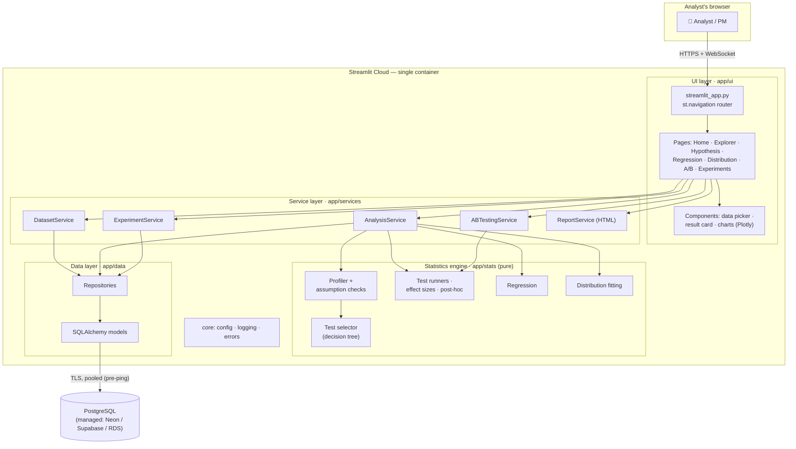
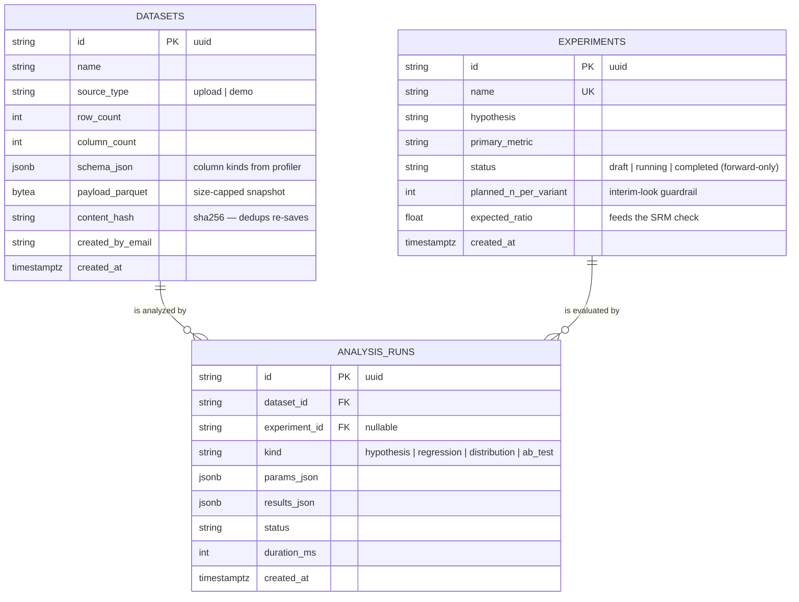
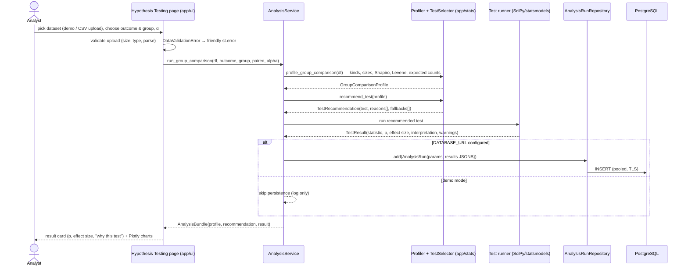

# Statistics Dashboard — Architecture

> Companion docs: [PROJECT-PLAN.md](PROJECT-PLAN.md) · [TECH-NOTES.md](TECH-NOTES.md)

---

## 2.1 Chosen Architectural Pattern: **Layered (Modular) Monolith inside a single Streamlit runtime**

The system is one deployable unit — a Streamlit app — with four strictly separated internal layers:

1. **UI layer** (`app/ui`) — Streamlit pages & components. Owns widgets, session state, caching decorators, Plotly rendering. Contains *no* statistics and *no* SQL.
2. **Service layer** (`app/services`) — use-case orchestration ("run a group comparison", "plan an A/B test"). Streamlit-free, so it is unit-testable and portable.
3. **Statistics engine** (`app/stats`) — pure functions over pandas/NumPy/SciPy/statsmodels. No I/O, no framework imports. This is the intellectual core and carries the highest test bar.
4. **Data layer** (`app/data`) — SQLAlchemy models + repositories against PostgreSQL; Alembic owns the schema.

`app/core` (config, logging, error taxonomy) is the only cross-cutting package.

### Why this pattern (and not microservices / serverless)

- **Fit for scale.** The workload is interactive, low-QPS, analyst-facing. A single process comfortably serves it; network-partitioning the stats engine would add latency and operational cost with zero benefit at this scale.
- **Streamlit Cloud constraint.** The platform runs *one* container per app. A monolith is not just adequate — it is the native deployment shape.
- **Escape hatch preserved.** Because `app/stats` and `app/services` never import Streamlit, they can be lifted verbatim behind a FastAPI compute service later (see §2.4) if heavy workloads appear. The layering *is* the migration plan.
- **Demo-mode degradation.** When no `DATABASE_URL` is configured the app runs fully in-memory with bundled sample data. This keeps local onboarding at "clone → install → run" and makes the DB an enhancement, not a hard dependency.



---

## 2.2 Key Component Interactions

There is deliberately **no internal network**: within the process everything is a direct,
typed function call. External interactions are limited to the browser session and PostgreSQL.

| Interaction | Mechanism | Notes |
|---|---|---|
| Browser ↔ app | HTTPS + WebSocket (Streamlit protocol) | Streamlit reruns the page script top-to-bottom on each widget event |
| UI → services | Direct function calls returning frozen dataclasses | UI never receives ORM objects — only plain result types |
| Services → stats engine | Direct calls; DataFrames in, dataclasses out | Engine is side-effect-free → trivially cacheable & testable |
| Services → PostgreSQL | Repositories over SQLAlchemy `session_scope()` | Only `app/data` writes SQL; pooled engine, `pool_pre_ping` |
| Expensive recomputation | `st.cache_data` / `st.cache_resource` in the UI layer only | Cache keys derive from dataset content hash + params |
| Schema evolution | Alembic migrations, run out-of-band (release step) | The app never mutates schema at runtime |
| Message queues / event bus | **None — intentionally.** | At this scale a queue is accidental complexity; the seam for adding one later is `AnalysisService` |

Result persistence is **write-behind and non-blocking in spirit**: an analysis renders even if
the `INSERT` of its `AnalysisRun` fails (the failure is logged and surfaced as a non-fatal toast).
Statistics must never be hostage to storage.

### Persistence data model



---

## 2.3 Data Flow

Typical path — an analyst runs a group comparison with automated test selection:



Key properties of the flow:

- **Validation happens at the boundary** (upload → `DataValidationError` with a user-safe message), so inner layers can assume well-formed frames.
- **The recommendation is explainable**: every branch of the selector appends a human-readable reason ("groups are non-normal (Shapiro p < 0.05) and n < 30 → Mann-Whitney U"), which the UI shows verbatim. Trust is a feature.
- **Everything the engine returns is a frozen dataclass** — safe to cache, serialize to `results_json`, and render without back-references into mutable state.

---

## 2.4 Scalability & Performance Strategy

**Now (single container):**

- `st.cache_resource` for the SQLAlchemy engine; `st.cache_data` for demo-dataset loads, profiling, and fitted results — keyed by dataset content hash + parameters, so reruns (Streamlit's core execution model) cost ~0.
- Normality checks subsample above `NORMALITY_MAX_N=5000` (Shapiro is both slow and hypersensitive at large n); fitting caps candidate evaluations.
- Large uploads: hard cap via `server.maxUploadSize`; frames above ~200k rows get a sampling banner (analysis on a seeded sample, clearly labeled). Pyarrow-backed parsing keeps memory in check on the 1 GB Streamlit Cloud tier.
- Small, capped DB pool (`pool_size=5, max_overflow=5, pool_recycle=1800`) because managed Postgres connection slots — not CPU — are the first bottleneck.

**Growth path (in order, only as needed):**

1. **Vertical + platform**: larger Streamlit tier / self-host the provided Docker image behind a reverse proxy with several replicas (the app is stateless apart from session memory; sticky sessions required for WebSocket).
2. **Connection pooling proxy** (pgbouncer / Neon pooler) once replicas multiply connections.
3. **Extract the compute service**: `app/services` + `app/stats` behind FastAPI; Streamlit becomes a thin client. The layering rule (no Streamlit imports below the UI) makes this a lift, not a rewrite.
4. **Async jobs** for genuinely long fits (queue + worker), with `analysis_runs.status` already modeling `pending/succeeded/failed`.

Non-goals: real-time collaboration, sub-second big-data queries (that's a warehouse + BI tool's job).

---

## 2.5 Security Considerations

| Concern | Approach |
|---|---|
| **Authentication** | Phase 1: Streamlit Cloud viewer allow-list (workspace email). Phase 3: `st.login` OIDC (Google/Entra); `st.user.email` recorded as `created_by_email` on writes. |
| **Authorization** | Single role (analyst) initially. The repository layer is the future enforcement point for per-team dataset visibility (`WHERE created_by_email …`) — never the UI. |
| **Transport** | TLS end-to-end: browser↔Streamlit Cloud (platform-managed), app↔Postgres with `sslmode=require` in the DSN. |
| **Secrets** | Never in git (`.gitignore` covers `.env`, `secrets.toml`). Local: `.env` / `.streamlit/secrets.toml`. Cloud: Streamlit secrets UI. CI: GitHub Actions secrets. `secrets.toml.example` documents the shape. Rotation = update in one place, reboot app. |
| **SQL injection** | SQLAlchemy bound parameters everywhere; repositories never interpolate SQL strings. |
| **Upload hardening** | Extension + MIME check, size cap (config + `server.maxUploadSize`), parse with `pandas.read_csv` in a try/except → `DataValidationError`; uploaded payloads are treated as *data*, never evaluated (no `eval`, no formula injection into patsy from raw cell values). |
| **XSRF / embedding** | `server.enableXsrfProtection = true`; no `unsafe_allow_html` with user-controlled content. |
| **Data protection** | Uploaded datasets may contain PII: size-capped parquet payloads in Postgres (encrypted at rest by the managed provider), retention job in Phase 3, and logs never include cell values — only shapes, dtypes, and timings. |
| **Dependencies** | Dependabot weekly; `pip` installs pinned by compatible-release ranges; CI is the gate. |

---

## 2.6 Error Handling & Logging Philosophy

**Taxonomy (in `app/core/errors.py`):**

```
AppError (base; carries .user_message — safe to render)
├── DataValidationError   → analyst fixes their input (bad CSV, wrong column types)
├── AnalysisError         → statistics cannot proceed (n too small, zero variance, unmet preconditions)
└── StorageError          → infrastructure trouble (DB down, misconfigured DSN)
```

**Rules:**

1. **Raise typed, catch at the boundary.** Inner layers raise `AppError` subtypes with precise messages; the *only* generic catch lives in the `@guard_page` decorator wrapping every page's `render()`. Expected failures → `st.error(exc.user_message)`; unexpected ones → full traceback to logs, generic apology to the user. The app never shows a stack trace and never white-screens.
2. **Two audiences, two messages.** `user_message` is actionable and jargon-free ("Column 'revenue' has zero variance in group B — a t-test is undefined; check your filter"); the log line carries the technical detail.
3. **Statistical caveats are warnings, not errors.** Small n, failed normality, SRM detection etc. attach to `TestResult.warnings` and render as visible caveats — the analysis still runs. We degrade transparently rather than block.
4. **Persistence failures never kill an analysis** (§2.2): log at ERROR, toast the user, return results.
5. **Logging:** stdlib `logging` to stdout (what Streamlit Cloud and Docker both collect), configured idempotently (Streamlit reruns must not stack handlers). Human-readable lines in development; **JSON lines when `APP_ENV=production`** so collectors can index them. Per-module loggers via `get_logger(__name__)`; no PII / cell values in logs — only shapes, dtypes, and timings. **Sentry is optional and DSN-gated**: initialized at startup when `SENTRY_DSN` is set and hooked into `guard_page`'s unexpected-error branch; its absence (or the SDK's) is a supported configuration, never an error.
6. **Fail fast at startup** on misconfiguration (invalid `DATABASE_URL` shape) — but *absence* of a DB is a supported mode (demo), not an error.
