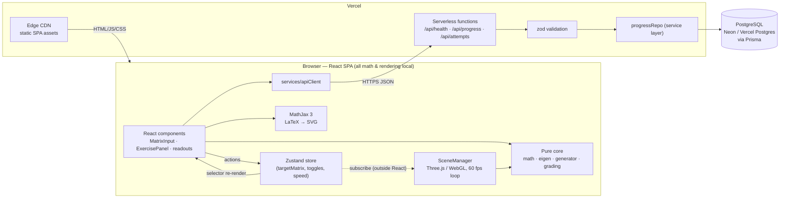
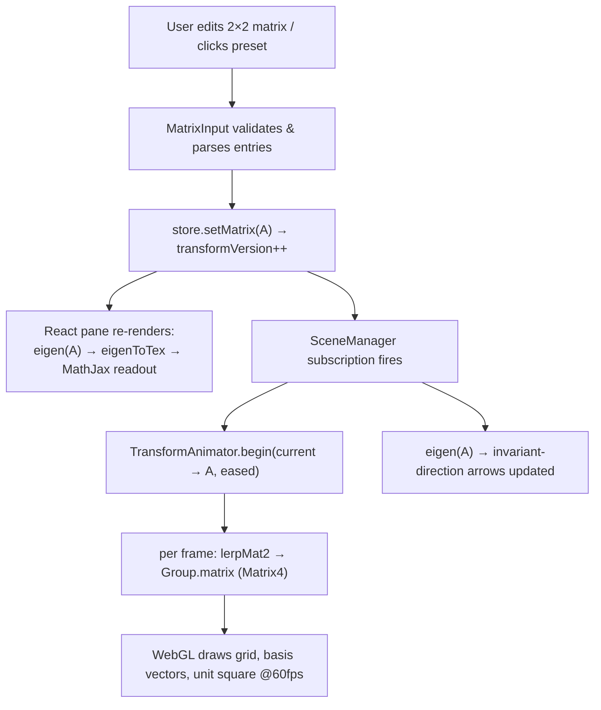
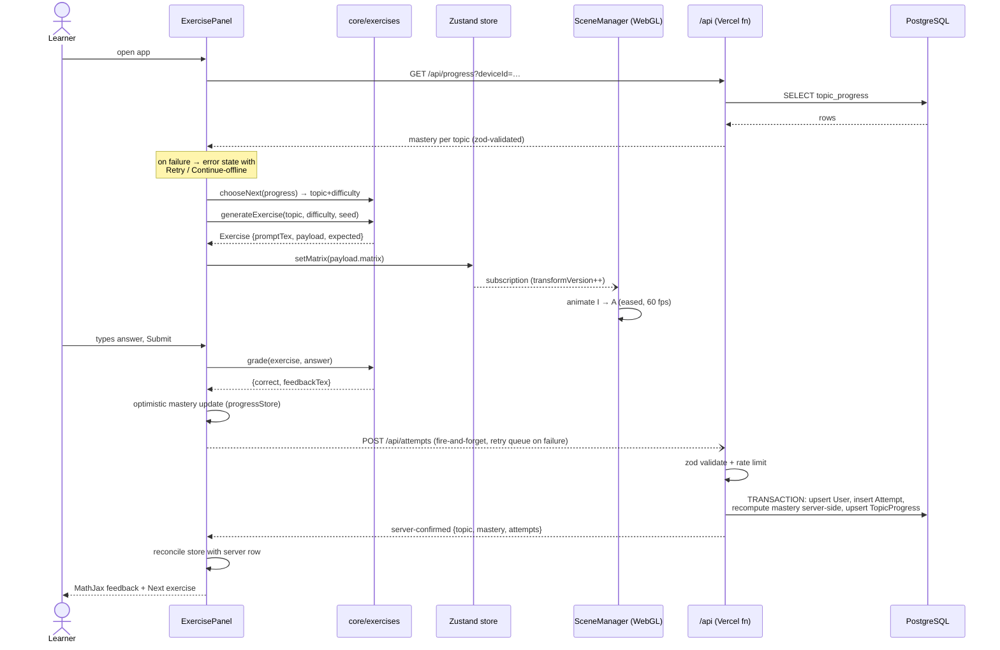

# Linear Algebra Visualizer — Architecture

## 2.1 Chosen Architectural Pattern

**Client-centric layered SPA with a serverless Backend-for-Frontend (BFF).**

The system is a statically-hosted React single-page application in which **all mathematics, exercise
generation, grading, and WebGL rendering run in the browser**, plus a thin set of Vercel serverless
functions whose only job is durable persistence of learner progress.

Inside the SPA, code is layered strictly:

| Layer                            | Location                        | Allowed to import                             |
| -------------------------------- | ------------------------------- | --------------------------------------------- |
| Presentation (React)             | `src/components`, `src/App.tsx` | state, services, core, hooks                  |
| Rendering (Three.js, imperative) | `src/rendering`                 | state, core — **never React**                 |
| State (Zustand)                  | `src/state`                     | core                                          |
| Services (HTTP)                  | `src/services`                  | core types                                    |
| Domain core (pure TS)            | `src/core`                      | **nothing** (no React, no Three.js, no fetch) |

**Why this pattern fits:**

- **The workload is client-side by nature.** Rendering must hit 60 fps locally; a 2×2 eigen solve is
  nanoseconds of CPU. Shipping computation to a server would add latency and cost with zero benefit.
- **Serverless matches the traffic profile.** An educational tool has spiky, classroom-shaped load
  (idle at night, bursts at lesson time). Vercel functions scale to zero and to a class of 300
  without capacity planning.
- **Operational surface is minimal.** No containers, no orchestration, no server patching — a solo
  maintainer or small team deploys with `git push`.
- **The pure core is the asset.** Keeping math + exercise logic dependency-free makes it exhaustively
  testable and portable (the same module could later power a React Native app or a server-side
  grader unchanged).

**Deliberate non-goals:** microservices (one bounded context only), SSR (no SEO-critical dynamic
content; the page shell is static), realtime collaboration (out of scope for MVP).

### System context

---

## 2.2 Key Component Interactions

**1. React ⇄ Store (synchronous, in-process).** Components call store actions
(`setMatrix`, `toggle`, `setAnimationSpeed`); components re-render through selective Zustand
selectors. No prop drilling across panes.

**2. Store ⇄ Rendering layer (event bus pattern, in-browser).** This is the load-bearing decision:
`SceneManager` subscribes to the store **outside React** (`useVisualizerStore.subscribe`). A
monotonic `transformVersion` counter signals "start a new tween". The 60 fps loop never touches
React; React never re-renders per frame. The store is effectively the app's event bus.

**3. Frontend ⇄ Backend (HTTPS + JSON, same origin).** `services/apiClient` wraps `fetch` with a
base URL, timeout and a typed `ApiError`. `progressService` zod-parses every response — the client
does not trust the wire any more than the server does. Attempts are posted **fire-and-forget with a
retry queue**: a retryable failure (network, 5xx, 429) is parked in localStorage and flushed on the
next boot (a non-429 4xx is permanently invalid and dropped), so persistence failures never block
the learning loop. The queue is at-least-once, so every attempt carries a client-generated
**`attemptId` idempotency key** — the server treats replays as no-ops, making delivery effectively
exactly-once. Successful writes return the server-computed mastery row, which the client reconciles
over its optimistic local value.

**4. Functions ⇄ Database (direct access via Prisma).** Only serverless functions touch PostgreSQL,
always through the `progressRepo` service layer — routes handle HTTP concerns, the repo handles
persistence. Connection reuse relies on the serverless Prisma singleton + a pooled connection string.

**5. Message queues: intentionally none.** The only async workload (attempt recording) is a single
idempotent-ish insert. If attempt telemetry ever needs batching/analytics fan-out, the seam is
`progressRepo` — swap the insert for a queue producer (e.g. Upstash QStash) without touching routes.

**6. MathJax (in-page service).** Loaded from CDN with `startup.typeset: false`; the
`useMathJaxTypeset` hook typesets only the changed DOM subtree after React commits, avoiding
whole-page typeset races.

---

## 2.3 Data Flow

### Flow A — Interactive transformation (pure client)

### Flow B — Exercise round trip (client compute + serverless persistence)

Storage summary: the **matrix/animation state never leaves the browser**; only compact attempt
records (topic, difficulty, seed, correctness, duration, mastery) are persisted. Storing the `seed`
instead of the full exercise keeps rows tiny yet lets us regenerate the exact exercise for review.

---

## 2.4 Scalability & Performance Strategy

**Horizontal scale is inherited, not built:**

- Static assets on Vercel's edge CDN — practically unlimited concurrent learners.
- Functions scale per-request; no shared in-memory state (the Prisma singleton is per-instance
  connection reuse, not state).
- PostgreSQL is the only stateful tier: use a **pooled connection string** (Neon pooler/pgbouncer)
  because serverless concurrency exhausts direct connections first. Growth path: Prisma Accelerate
  or read replicas — schema is append-mostly and tiny per user.

**Client performance (the real budget):**

- 60 fps target. Per-frame work is one `lerpMat2` (8 mul/adds), one `Matrix4` write, one draw of a
  few static geometries — no allocations in the loop, geometries built once and mutated in place.
- React is out of the frame path by design (store-subscription bridge, §2.2).
- Bundle: three.js isolated into its own chunk (`manualChunks`), MathJax on CDN (cached across
  sites), initial app JS budget < 300 KB gz; exercise panel lazy-loadable later.
- `devicePixelRatio` capped at 2 to keep fill-rate sane on 4K displays.

**Data growth:** `ExerciseAttempt` grows linearly with usage; indexed by `(userId, topic, createdAt)`.
At educational scale (millions of rows) this is still trivial for Postgres; partition/archive only if
analytics demands it.

---

## 2.5 Security Considerations

**Authentication & authorization.** MVP is **anonymous-first**: a random `deviceId` (UUID) generated
client-side and stored in `localStorage` keys all progress. No PII, no passwords, minimal GDPR
surface. The schema already isolates identity in `User`, so Phase-3 OAuth (Auth.js/Clerk) becomes
"link deviceId history to an account", not a rewrite. Until then, knowledge of a random 128-bit
deviceId is the (deliberately weak, low-stakes) authorization token.

**API security.**

- Every function validates input with **zod at the trust boundary** (body, query) — types are never
  assumed from the wire; invalid input → structured `400`, unknown methods → `405`.
- Same-origin API (no CORS surface by default).
- The write endpoint (the only abuse target) is rate limited: a sliding window keyed by
  IP + deviceId (`api/_lib/rateLimit.ts`). It is per-instance and therefore best-effort — the
  distributed upgrade is platform WAF rules or a Redis-backed limiter.
- **Mastery is server-authoritative**: `POST /api/attempts` accepts only the correctness bit and
  recomputes mastery inside a Prisma transaction (`api/_lib/mastery.ts` mirrors the core rule) —
  a tampering client cannot inflate its persisted progress.
- **Writes are idempotent** on the client-generated `attemptId` (unique column + replay check +
  unique-violation race handling) — retries from the offline queue cannot double-count.
- Standard security headers on every response (`vercel.json`): CSP (self + the MathJax CDN),
  `X-Content-Type-Options`, `X-Frame-Options`, HSTS, `Referrer-Policy`, `Permissions-Policy`.
- Error responses are envelopes (`{ error: { code, message } }`) — never stack traces or SQL.

**Data protection.** TLS everywhere (Vercel-managed). At-rest encryption from the DB provider. The
dataset is intentionally low-sensitivity: no names, no emails in MVP. Deleting a `User` cascades all
attempts (`onDelete: Cascade`) — right-to-erasure is one query.

**Secret management.** Secrets (`DATABASE_URL`, `VERCEL_TOKEN`) live in Vercel/GitHub encrypted
environment stores; never in the repo. **Vite rule enforced by convention and review:** only
`VITE_`-prefixed variables reach the client bundle, therefore secrets must never carry that prefix.
`.env` files are git-ignored; `.env.example` documents shape without values.

**Known accepted risk:** exercises are generated and graded client-side, so answers exist in browser
memory — a learner can "cheat" via devtools by reporting `correct: true`. What they _cannot_ do is
inflate mastery beyond the rule (the server recomputes it per attempt). For a self-study tool this
residual risk is acceptable; if grades ever feed classrooms/assessment, move grading itself
server-side — the pure `core/exercises` module runs on Node unchanged (that portability is
deliberate; the seed stored per attempt lets the server regenerate the exact exercise).

**Supply chain.** Lockfile committed, `npm ci` in CI (no floating installs), Dependabot/`npm audit`
review as routine. MathJax pinned to major v3 on a reputable CDN; self-hosting is the hardening
option noted in TECH-NOTES.

---

## 2.6 Error Handling & Logging Philosophy

**One principle: errors are data at the edges, exceptions only for programmer bugs.**

- **Pure core:** functions are total over valid inputs and return discriminated unions for
  mathematically degenerate cases (`inverse()` → `null`, `eigen()` → `{kind: 'complex'|…}`).
  `throw` is reserved for invariant violations (e.g. normalizing a zero vector) — a thrown error in
  core is by definition a bug, never user input.
- **UI:** user input is validated where it enters (`MatrixInput` parsing, `ExercisePanel` answer
  parsing) and rejected with inline messages — invalid input must be unrepresentable downstream.
  Async UI state is an explicit machine: `loading | error | ready` (no boolean soup). Every fetching
  component owns a visible error state with **Retry** and, where meaningful, **Continue offline**.
- **Rendering:** WebGL unavailability is detected before constructing the renderer and rendered as a
  friendly fallback panel; context-loss handling is a tracked TODO in `SceneManager`.
- **Last line of defense:** a top-level React `ErrorBoundary` converts render crashes into a
  recoverable "something went wrong" panel instead of a white page.
- **Serverless functions:** catch at the route boundary; log **structured JSON** to stdout
  (`{level, route, message}` — queryable in Vercel logs / drainable later); return the error
  envelope with a stable `code`. 4xx are client facts, 5xx are our bugs — alerts (Phase 2, Sentry)
  fire only on 5xx rates.
- **Fire-and-forget writes** (`POST /api/attempts`) fail silently into a bounded localStorage
  retry queue, flushed on the next boot — persistence failures never interrupt learning, and no
  attempt is lost to a flaky connection.
