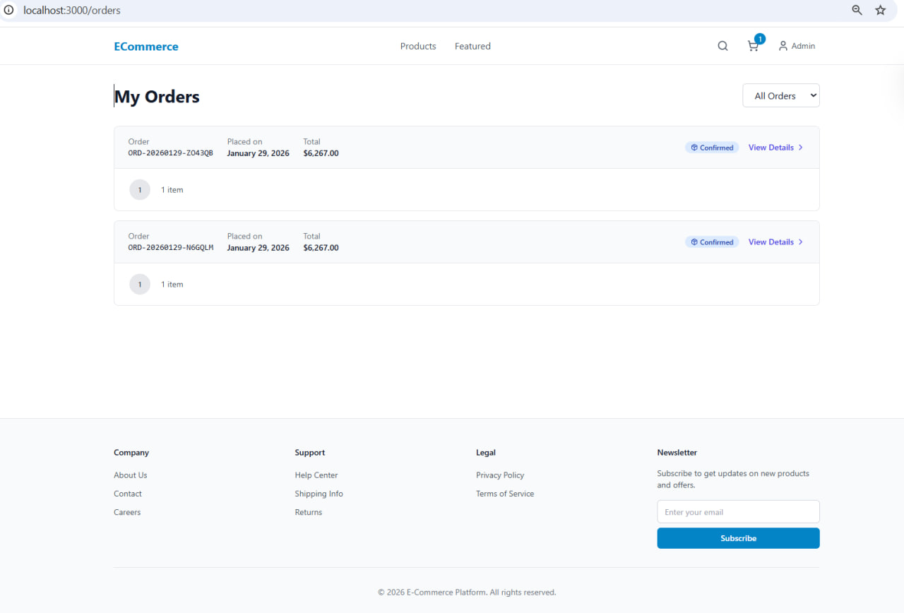

# E-Commerce Platform

A full-featured e-commerce platform built with Django, React, and modern cloud technologies.



## Tech Stack

### Backend
- **Python 3.12** with Django 5.0
- **Django REST Framework** for API
- **Celery** with Redis for async task processing
- **PostgreSQL** for primary database
- **Redis** for caching and sessions
- **Elasticsearch** for product search
- **PyTorch** for recommendation engine

### Frontend
- **React 18** with TypeScript
- **Vite** for build tooling
- **TailwindCSS** for styling
- **React Query** for data fetching
- **Zustand** for state management

### Infrastructure
- **AWS ECS** (Fargate) for container orchestration
- **AWS RDS** for managed PostgreSQL
- **AWS ElastiCache** for managed Redis
- **AWS OpenSearch** for managed Elasticsearch
- **Terraform** for infrastructure as code
- **GitHub Actions** for CI/CD

## Storage Architecture

### Database: PostgreSQL (Single Database)

All business entities are stored in one PostgreSQL database called `ecommerce`:

| App | Tables | Description |
|-----|--------|-------------|
| **users** | `users_user`, `users_address`, `users_wishlistitem` | User accounts, authentication, addresses, wishlist |
| **products** | `products_category`, `products_product`, `products_productimage`, `products_productvariant`, `products_productreview` | Product catalog |
| **vendors** | `vendors_vendor`, `vendors_vendorpayout` | Marketplace sellers |
| **cart** | `cart_cart`, `cart_cartitem` | Shopping carts |
| **checkout** | `checkout_order`, `checkout_orderitem` | Orders |
| **inventory** | `inventory_*` | Stock tracking |

### Connection Details (Development)

```
Host: db (container name) / localhost:5432 (from host)
Database: ecommerce
User: postgres
Password: postgres
```

### Other Storage Systems

| System | Purpose | Data Stored |
|--------|---------|-------------|
| **Redis** | Cache & Queue | Sessions, cache, Celery tasks |
| **Elasticsearch** | Search | Product search index (copy of product data) |
| **File Storage** | Media | Product images, avatars (local `/app/media/` in dev) |

### Architecture Diagram

```
┌─────────────────────────────────────────────────────┐
│                   PostgreSQL                         │
│  ┌─────────┐ ┌──────────┐ ┌─────────┐ ┌──────────┐ │
│  │  Users  │ │ Products │ │ Vendors │ │  Orders  │ │
│  └─────────┘ └──────────┘ └─────────┘ └──────────┘ │
└─────────────────────────────────────────────────────┘
                         │
          ┌──────────────┼──────────────┐
          ▼              ▼              ▼
    ┌──────────┐   ┌──────────┐   ┌──────────┐
    │  Redis   │   │ Elastic  │   │  Files   │
    │ (cache)  │   │ (search) │   │ (media)  │
    └──────────┘   └──────────┘   └──────────┘
```

## Features

- User authentication with JWT
- Product catalog with categories
- Shopping cart (persistent)
- Checkout with Stripe payments
- Order management
- Vendor/marketplace support
- Inventory tracking
- Full-text search with Elasticsearch
- Personalized recommendations (collaborative filtering)
- Wishlist / Favorites
- Admin dashboard

## Django Admin

Django Admin is a built-in web interface for managing database data. It provides CRUD operations, user management, and data browsing - auto-generated from your models.

### Access

- **URL:** http://localhost:8000/admin/
- **Credentials:** `admin@example.com` / `admin123` (development)

### Available Entities

#### Custom App Models (registered in `admin.py` files)

| Entity | Location | Description |
|--------|----------|-------------|
| Users | `apps/users/admin.py` | Custom user model with email auth |
| Addresses | `apps/users/admin.py` | User shipping/billing addresses |
| Wishlist Items | `apps/users/admin.py` | User favorites |
| Products | `apps/products/admin.py` | Product catalog |
| Categories | `apps/products/admin.py` | Product categories |
| Product Reviews | `apps/products/admin.py` | Customer reviews |
| Vendors | `apps/vendors/admin.py` | Marketplace sellers |
| Vendor Payouts | `apps/vendors/admin.py` | Seller payments |

#### Built-in / Package Models

| Entity | Source |
|--------|--------|
| Groups | Django auth system |
| Task Results | `django-celery-results` package |
| Periodic Tasks | `django-celery-beat` package |

### Who Uses It

- **Developers** - testing and debugging
- **Admins** - content and user management
- **Support** - customer data lookup

## Getting Started

### Prerequisites

- Docker and Docker Compose
- Python 3.12+
- Node.js 20+
- PostgreSQL 16
- Redis 7

### Quick Start

1. Clone the repository:
   ```bash
   git clone <repository-url>
   cd ecommerce-platform
   ```

2. Run the setup script:
   ```powershell
   # PowerShell (recommended)
   .\scripts\setup-dev.ps1

   # Or Command Prompt
   scripts\setup-dev.bat
   ```

3. Start the development servers:
   ```bash
   docker-compose -f docker-compose.dev.yml up
   ```

4. Access the application:
   - Frontend: http://localhost:3000
   - Backend API: http://localhost:8000/api/v1/
   - Admin: http://localhost:8000/admin/

### Manual Setup

See [docs/TECH-NOTES.md](docs/TECH-NOTES.md) for detailed setup instructions.

## Documentation

- [Project Plan](docs/PROJECT-PLAN.md) - Project structure and implementation roadmap
- [Architecture](docs/ARCHITECTURE.md) - System architecture and design decisions
- [Tech Notes](docs/TECH-NOTES.md) - Technical guidelines and best practices

## Development

### Running Tests

```powershell
# PowerShell - All tests
.\scripts\run-tests.ps1

# Backend only
.\scripts\run-tests.ps1 -Backend

# Frontend only
.\scripts\run-tests.ps1 -Frontend

# With coverage
.\scripts\run-tests.ps1 -Coverage

# Command Prompt alternative
scripts\run-tests.bat --backend
scripts\run-tests.bat --frontend
scripts\run-tests.bat --coverage
```

### Code Quality

Pre-commit hooks are configured for linting and formatting:

```bash
pip install pre-commit
pre-commit install
```

## API Documentation

### Authentication

All authenticated endpoints require a JWT token in the `Authorization` header:
```
Authorization: Bearer <access_token>
```

### API Endpoints

| Endpoint | Method | Description |
|----------|--------|-------------|
| `/api/v1/auth/register/` | POST | Register new user |
| `/api/v1/auth/login/` | POST | Login and get tokens |
| `/api/v1/auth/token/refresh/` | POST | Refresh access token |
| `/api/v1/products/` | GET | List products (paginated) |
| `/api/v1/products/<slug>/` | GET | Get product details |
| `/api/v1/cart/` | GET | Get current cart |
| `/api/v1/cart/add/` | POST | Add item to cart |
| `/api/v1/checkout/` | POST | Initiate checkout |
| `/api/v1/checkout/confirm/` | POST | Confirm payment |
| `/api/v1/orders/` | GET | List user orders |
| `/api/v1/search/products/` | GET | Search products |
| `/api/v1/recommendations/personalized/` | GET | Get recommendations |
| `/api/v1/auth/wishlist/` | GET | List user's wishlist |
| `/api/v1/auth/wishlist/` | POST | Add product to wishlist |
| `/api/v1/auth/wishlist/<id>/` | DELETE | Remove from wishlist |

### Health Check

```
GET /health/
```

Returns `{"status": "healthy"}` when the service is running.

## Troubleshooting

### Common Issues

#### Database Connection Error

If you see `OperationalError: could not connect to server`:
1. Ensure PostgreSQL is running: `docker-compose ps`
2. Check database credentials in `.env` match your setup
3. Verify the database exists: `psql -U postgres -c '\l'`

#### Redis Connection Error

If Celery tasks fail with `Connection refused`:
1. Ensure Redis is running: `docker-compose ps redis`
2. Verify REDIS_URL in `.env` is correct
3. Test connection: `redis-cli ping` (should return `PONG`)

#### Elasticsearch Not Available

If search returns empty results:
1. Check Elasticsearch status: `curl http://localhost:9200/_cluster/health`
2. Rebuild the search index: `python manage.py search_index --rebuild`
3. Verify ELASTICSEARCH_URL in `.env`

#### Celery Tasks Not Processing

1. Check Celery worker logs: `docker-compose logs celery`
2. Verify Redis connection
3. Restart Celery: `docker-compose restart celery`

#### Frontend Not Loading

1. Check if backend is running: `curl http://localhost:8000/health/`
2. Verify CORS settings allow your frontend URL
3. Check browser console for errors

### Environment Setup Checklist

1. [ ] Copy `.env.example` to `.env`
2. [ ] Generate a secure SECRET_KEY: `python -c "from django.core.management.utils import get_random_secret_key; print(get_random_secret_key())"`
3. [ ] Set up Stripe test keys (optional for development)
4. [ ] Run migrations: `python manage.py migrate`
5. [ ] Create superuser: `python manage.py createsuperuser`

### Resetting Development Environment

```bash
# Stop all containers and remove volumes
docker-compose down -v

# Rebuild and start fresh
docker-compose up --build
```

## Deployment

See [docs/TECH-NOTES.md](docs/TECH-NOTES.md#3-deployment-strategy) for deployment instructions.

## <span style="color:orange">Django ORM - Database Integration</span>

<span style="color:orange">

Django uses its own built-in ORM (Object-Relational Mapping) to interact with the database. This section explains how database integration works in this application.

### How It All Connects

```
┌─────────────────────────────────────────────────────────────────────────┐
│                        REQUEST FLOW                                      │
│                                                                         │
│  HTTP Request → URL Router → View → Serializer → Service → ORM → DB    │
│                                                                         │
│  ┌─────────┐   ┌─────────┐   ┌────────────┐   ┌─────────┐   ┌────────┐│
│  │ urls.py │ → │views.py │ → │serializers │ → │services │ → │models  ││
│  │         │   │         │   │   .py      │   │  .py    │   │  .py   ││
│  └─────────┘   └─────────┘   └────────────┘   └─────────┘   └────────┘│
│                                                                    ↓    │
│                                                              PostgreSQL │
└─────────────────────────────────────────────────────────────────────────┘
```

### Step 1: Define Models (`models.py`)

Models are Python classes that define database tables. Each model = one table.

**Location:** `backend/apps/<app_name>/models.py`

```python
# Example: backend/apps/products/models.py
from django.db import models

class Product(models.Model):
    name = models.CharField(max_length=255)           # VARCHAR(255)
    price = models.DecimalField(max_digits=10, decimal_places=2)  # DECIMAL
    description = models.TextField()                   # TEXT
    created_at = models.DateTimeField(auto_now_add=True)  # TIMESTAMP
    category = models.ForeignKey('Category', on_delete=models.CASCADE)  # FK

    class Meta:
        db_table = 'products_product'  # Optional: explicit table name
```

**Field Types Mapping:**
| Django Field | PostgreSQL Type |
|--------------|-----------------|
| `CharField` | VARCHAR |
| `TextField` | TEXT |
| `IntegerField` | INTEGER |
| `DecimalField` | DECIMAL |
| `BooleanField` | BOOLEAN |
| `DateTimeField` | TIMESTAMP |
| `ForeignKey` | INTEGER + FK constraint |
| `ManyToManyField` | Junction table |
| `UUIDField` | UUID |

### Step 2: Create Migrations

Migrations are Python files that describe database schema changes.

**Who creates them:** Django's `makemigrations` command analyzes model changes.

```bash
# Generate migration files
python manage.py makemigrations

# Or for specific app
python manage.py makemigrations products
```

**Output:** `backend/apps/products/migrations/0001_initial.py`

```python
# Auto-generated migration file
class Migration(migrations.Migration):
    dependencies = []
    operations = [
        migrations.CreateModel(
            name='Product',
            fields=[
                ('id', models.BigAutoField(primary_key=True)),
                ('name', models.CharField(max_length=255)),
                # ... more fields
            ],
        ),
    ]
```

### Step 3: Apply Migrations (Create Tables)

**Who creates tables:** Django's `migrate` command executes migration files.

```bash
# Apply all pending migrations
python manage.py migrate

# Apply specific app migrations
python manage.py migrate products
```

**What happens:**
1. Django reads migration files
2. Generates SQL statements (CREATE TABLE, ALTER TABLE, etc.)
3. Executes SQL against PostgreSQL
4. Records applied migrations in `django_migrations` table

**In Docker (this app):** Migrations run automatically via `entrypoint.sh`:
```bash
python manage.py makemigrations --noinput
python manage.py migrate --noinput
```

### Step 4: Create Serializers (`serializers.py`)

Serializers convert between Python objects and JSON. They handle validation and data transformation.

**Location:** `backend/apps/<app_name>/serializers.py`

```python
# Example: backend/apps/products/serializers.py
from rest_framework import serializers
from .models import Product

class ProductSerializer(serializers.ModelSerializer):
    class Meta:
        model = Product
        fields = ['id', 'name', 'price', 'description', 'category']
        read_only_fields = ['id']
```

**Serializer Registration:** Serializers are NOT registered globally. They're used explicitly in views:

```python
# In views.py
class ProductViewSet(viewsets.ModelViewSet):
    serializer_class = ProductSerializer  # ← Used here
    queryset = Product.objects.all()
```

### Step 5: Create Views (`views.py`)

Views handle HTTP requests and return responses.

**Location:** `backend/apps/<app_name>/views.py`

```python
from rest_framework import viewsets
from .models import Product
from .serializers import ProductSerializer

class ProductViewSet(viewsets.ModelViewSet):
    queryset = Product.objects.all()
    serializer_class = ProductSerializer
```

### Step 6: Register URLs (`urls.py`)

URLs map HTTP endpoints to views.

**App URLs:** `backend/apps/<app_name>/urls.py`
```python
from rest_framework.routers import DefaultRouter
from .views import ProductViewSet

router = DefaultRouter()
router.register(r'', ProductViewSet, basename='products')

urlpatterns = router.urls
```

**Main URLs:** `backend/core/urls.py`
```python
urlpatterns = [
    path('api/v1/products/', include('apps.products.urls')),
]
```

### Step 7: Register Admin (`admin.py`)

Admin registration makes models manageable via Django Admin UI.

**Location:** `backend/apps/<app_name>/admin.py`

```python
from django.contrib import admin
from .models import Product

@admin.register(Product)
class ProductAdmin(admin.ModelAdmin):
    list_display = ['name', 'price', 'category', 'created_at']
    search_fields = ['name', 'description']
    list_filter = ['category', 'created_at']
```

### Complete Integration Checklist

| Step | File | Command | Who Does It |
|------|------|---------|-------------|
| 1. Define model | `models.py` | - | Developer |
| 2. Generate migration | `migrations/*.py` | `makemigrations` | Django |
| 3. Create tables | PostgreSQL | `migrate` | Django |
| 4. Create serializer | `serializers.py` | - | Developer |
| 5. Create view | `views.py` | - | Developer |
| 6. Register URL | `urls.py` | - | Developer |
| 7. Register admin | `admin.py` | - | Developer |

### ORM Query Examples

```python
# Get all products
Product.objects.all()

# Filter products
Product.objects.filter(price__lt=100, category__name='Electronics')

# Get single object
Product.objects.get(id=1)

# Create
Product.objects.create(name='Phone', price=999)

# Update
product = Product.objects.get(id=1)
product.price = 899
product.save()

# Delete
Product.objects.filter(id=1).delete()

# Complex queries
from django.db.models import Q, Count, Avg

Product.objects.filter(Q(name__contains='phone') | Q(price__lt=500))
Product.objects.annotate(review_count=Count('reviews'))
Product.objects.aggregate(avg_price=Avg('price'))
```

### Files Structure Summary

```
backend/apps/products/
├── __init__.py
├── models.py          ← 1. Define tables
├── migrations/        ← 2. Schema changes (auto-generated)
│   ├── __init__.py
│   └── 0001_initial.py
├── serializers.py     ← 4. JSON conversion
├── views.py           ← 5. Request handlers
├── urls.py            ← 6. URL routing
├── admin.py           ← 7. Admin UI
└── services.py        ← Business logic (optional)
```

</span>

## License

Proprietary - All rights reserved
