# E-Commerce Platform - Architecture Documentation

## 1. Architectural Pattern

### Chosen Pattern: Modular Monolith with Event-Driven Components

This architecture combines the simplicity of a monolith with clear module boundaries and asynchronous processing capabilities.

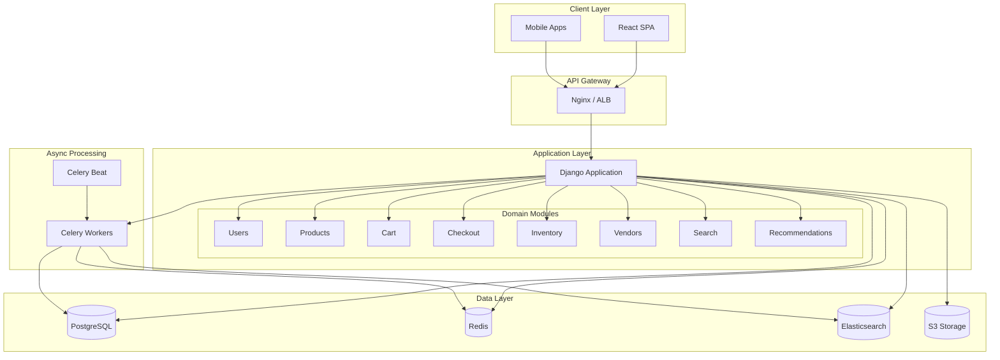

### Justification

1. **Simplicity**: Single deployable unit reduces operational complexity
2. **Clear Boundaries**: Django apps provide logical separation while sharing infrastructure
3. **Async Capability**: Celery enables event-driven patterns for long-running tasks
4. **Scalability Path**: Can evolve to microservices if needed (each Django app can become a service)
5. **Team Size**: Suitable for small-to-medium teams (3-8 developers)

---

## 2. Key Component Interactions

### 2.1 API Communication

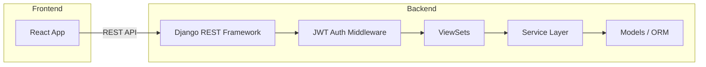

### 2.2 Message Queue Communication

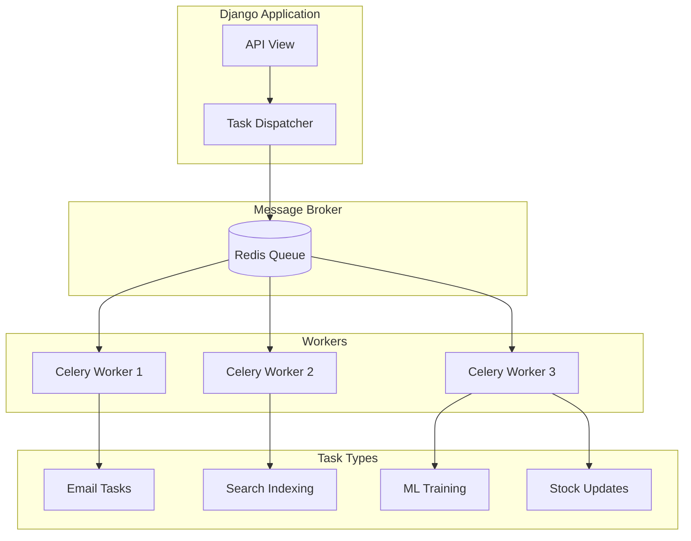

### 2.3 Component Communication Matrix

| Source | Target | Method | Use Case |
|--------|--------|--------|----------|
| Frontend | Backend | REST API | All user interactions |
| Backend | Database | SQLAlchemy/Django ORM | Data persistence |
| Backend | Redis | Direct connection | Caching, session storage |
| Backend | Elasticsearch | elasticsearch-dsl | Search queries |
| Backend | Celery | Task queue | Async operations |
| Celery | Backend DB | Django ORM | Background updates |
| Celery | External APIs | HTTP | Email, payments |

---

## 3. Data Flow

### 3.1 Product Search Flow

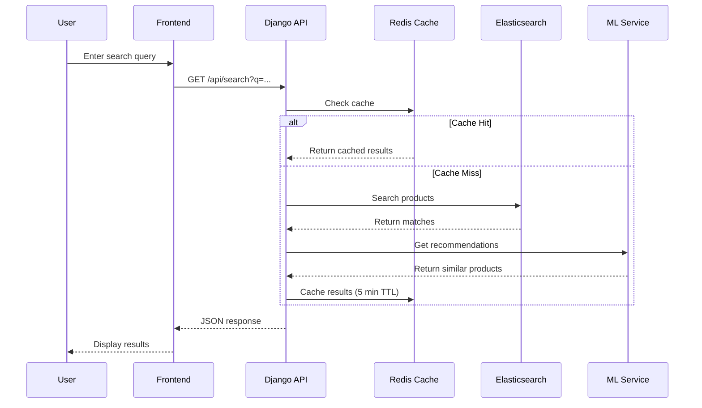

### 3.2 Checkout Flow

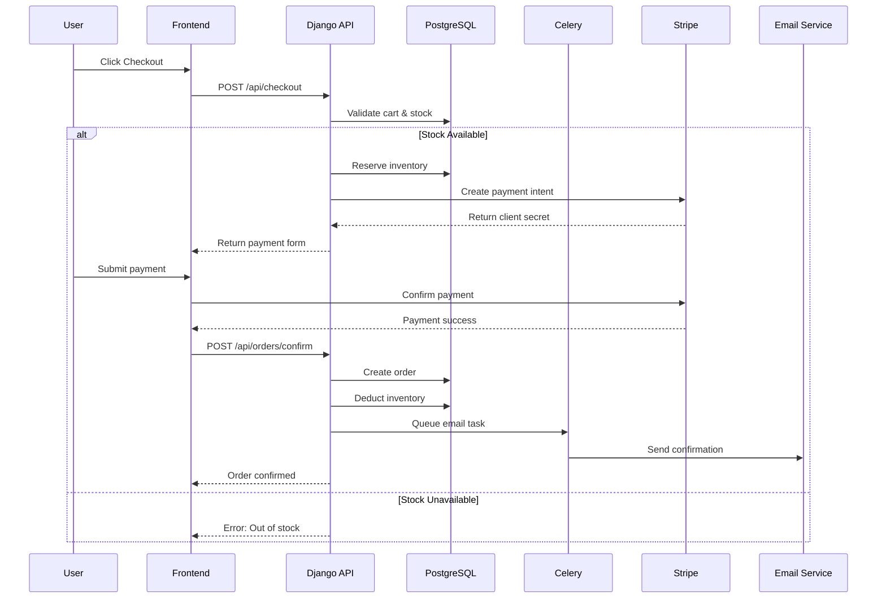

### 3.3 Recommendation Engine Flow

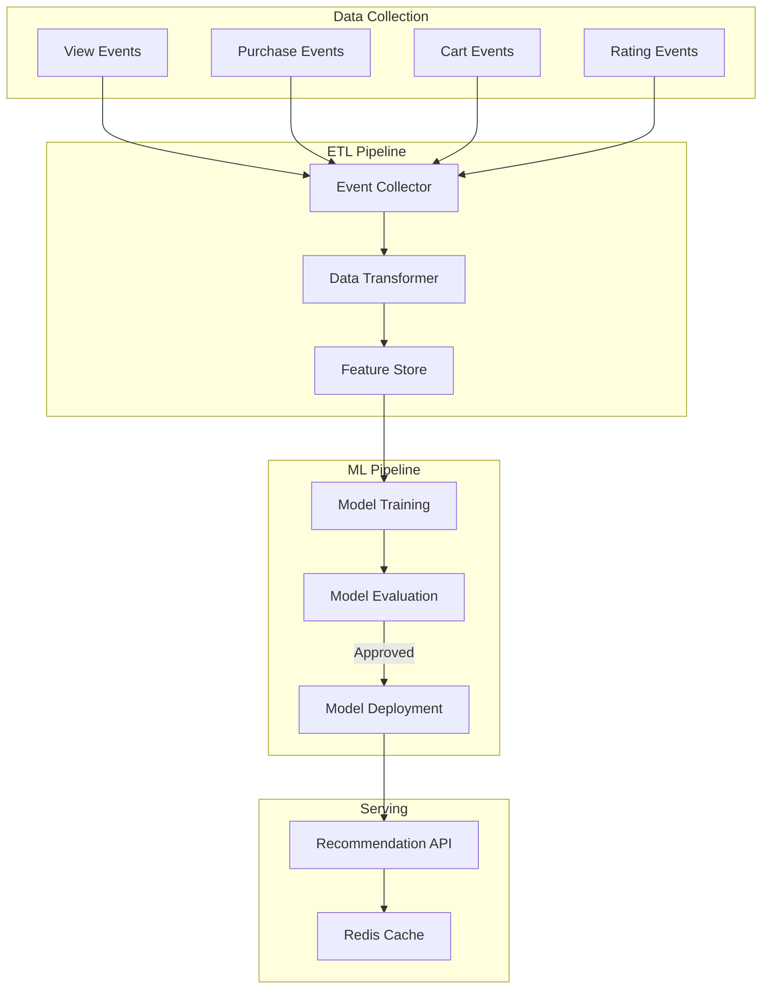

---

## 4. Scalability & Performance Strategy

### 4.1 Horizontal Scaling Architecture

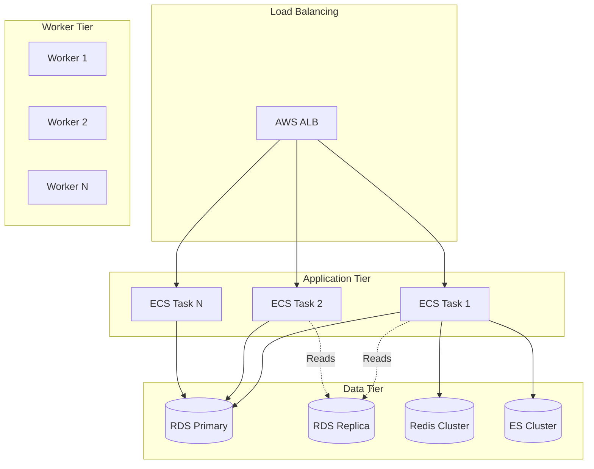

### 4.2 Performance Strategies

| Layer | Strategy | Implementation |
|-------|----------|----------------|
| **API** | Response caching | Redis with 5-min TTL for read-heavy endpoints |
| **Database** | Read replicas | Route read queries to replica |
| **Database** | Connection pooling | PgBouncer with 100 connections |
| **Search** | Result caching | Cache popular searches |
| **Assets** | CDN | CloudFront for static files |
| **Images** | Lazy loading | Progressive image loading |
| **API** | Pagination | Cursor-based pagination |
| **Async** | Task queues | Offload heavy operations to Celery |

### 4.3 Caching Strategy

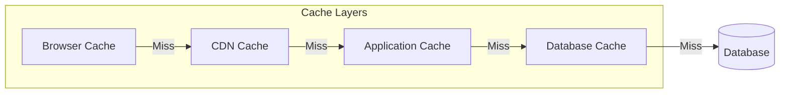

| Cache Type | TTL | Invalidation |
|------------|-----|--------------|
| Product listings | 5 min | On product update |
| Product details | 15 min | On product update |
| User sessions | 24 hours | On logout |
| Search results | 5 min | Time-based |
| Cart data | 7 days | On checkout |
| Recommendations | 1 hour | On model update |

---

## 5. Security Considerations

### 5.1 Security Architecture

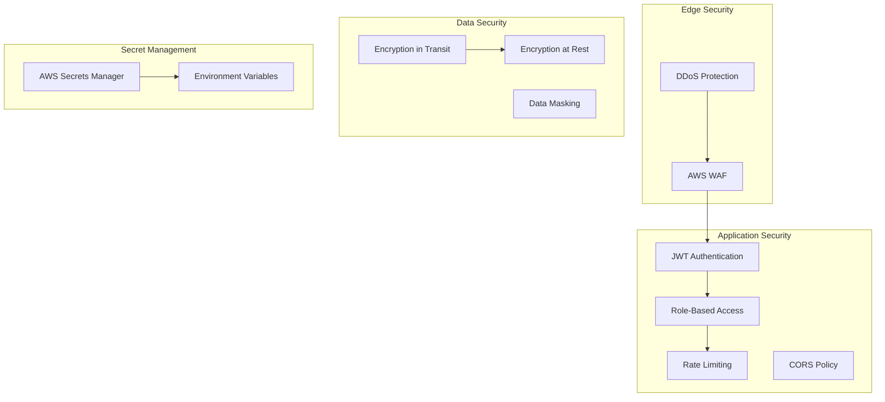

### 5.2 Authentication & Authorization

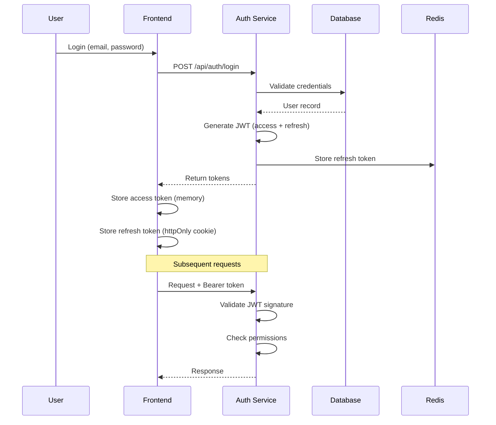

### 5.3 Security Checklist

| Category | Measure | Implementation |
|----------|---------|----------------|
| **Auth** | Password hashing | Argon2id |
| **Auth** | Token expiry | Access: 15min, Refresh: 7 days |
| **Auth** | MFA support | TOTP (optional) |
| **API** | Rate limiting | 100 req/min per user |
| **API** | Input validation | Pydantic/DRF serializers |
| **API** | SQL injection | Parameterized queries |
| **API** | XSS prevention | Content-Security-Policy |
| **Data** | PII encryption | AES-256 for sensitive fields |
| **Data** | Audit logging | All data modifications |
| **Infra** | Secrets | AWS Secrets Manager |
| **Infra** | Network | VPC with private subnets |

---

## 6. Error Handling & Logging Philosophy

### 6.1 Error Handling Strategy

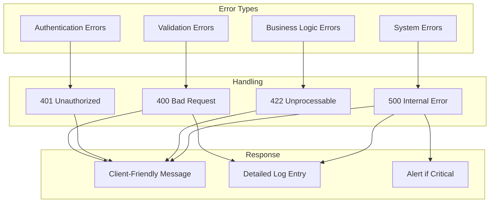

### 6.2 Standard Error Response Format

```json
{
  "error": {
    "code": "VALIDATION_ERROR",
    "message": "Invalid input provided",
    "details": [
      {
        "field": "email",
        "message": "Must be a valid email address"
      }
    ],
    "request_id": "req_abc123",
    "timestamp": "2024-01-15T10:30:00Z"
  }
}
```

### 6.3 Logging Architecture

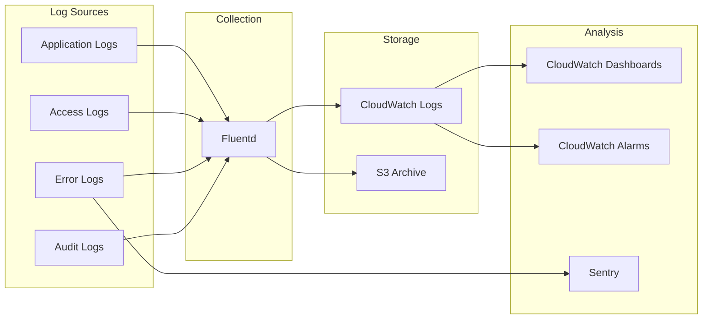

### 6.4 Logging Standards

| Log Level | Use Case | Example |
|-----------|----------|---------|
| **DEBUG** | Development only | Variable values, query details |
| **INFO** | Normal operations | Request received, task completed |
| **WARNING** | Recoverable issues | Deprecated API usage, retry attempt |
| **ERROR** | Failures | Payment failed, external API error |
| **CRITICAL** | System failures | Database connection lost |

### 6.5 Structured Log Format

```json
{
  "timestamp": "2024-01-15T10:30:00.123Z",
  "level": "ERROR",
  "service": "checkout",
  "request_id": "req_abc123",
  "user_id": "user_456",
  "message": "Payment processing failed",
  "context": {
    "order_id": "order_789",
    "amount": 99.99,
    "error_code": "card_declined"
  },
  "stack_trace": "..."
}
```

---

## 7. Infrastructure Overview

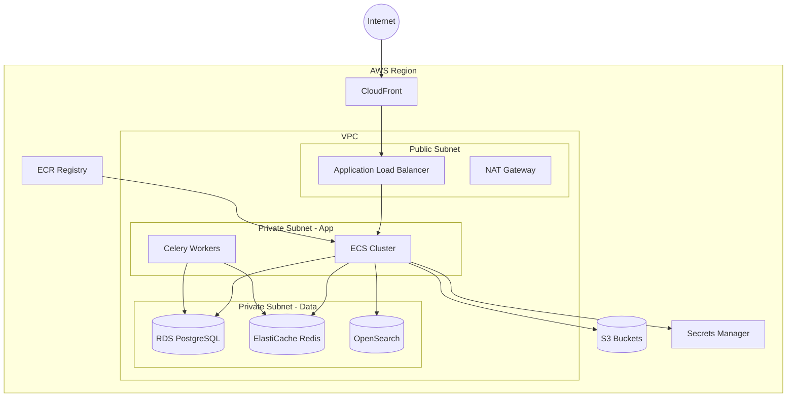

---

## 8. Deployment Architecture

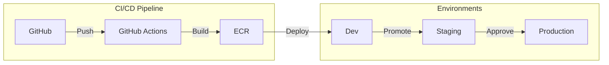

| Environment | Purpose | Data |
|-------------|---------|------|
| **Development** | Feature development | Synthetic data |
| **Staging** | Pre-production testing | Anonymized production clone |
| **Production** | Live system | Real customer data |
