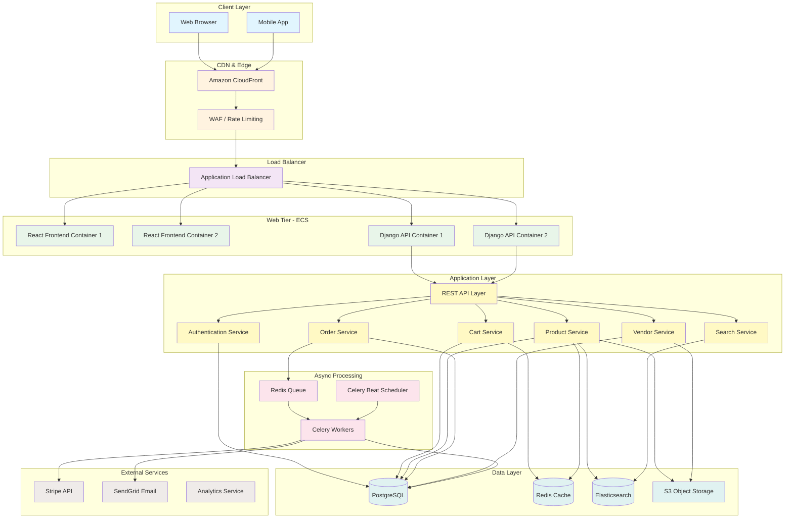
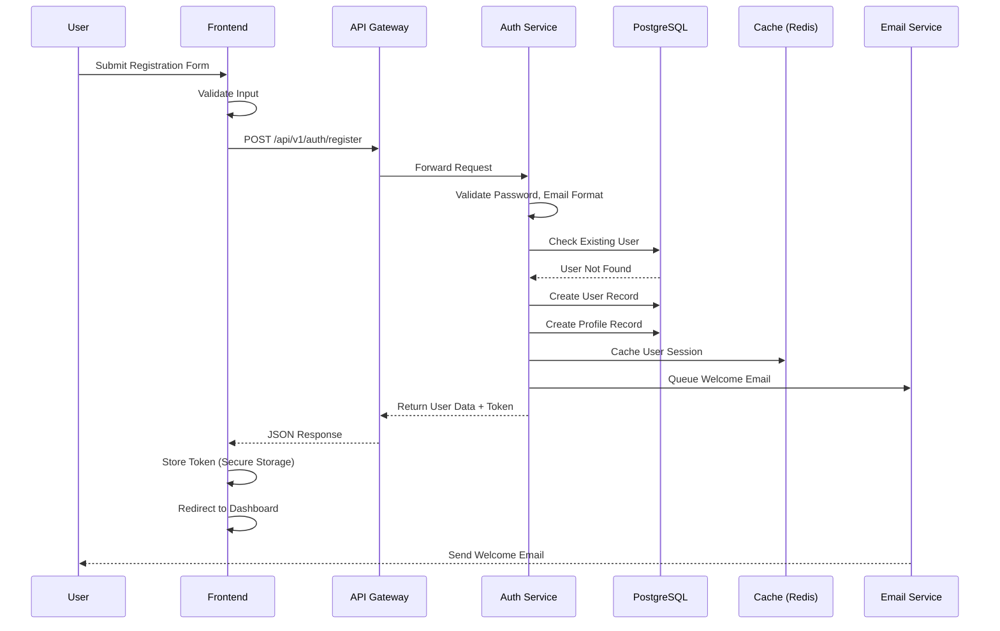
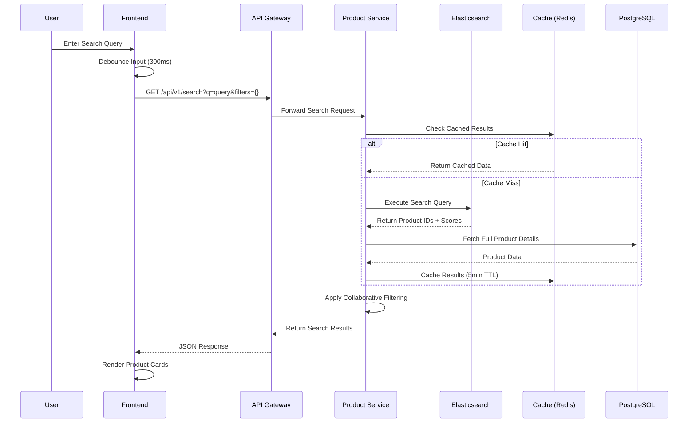
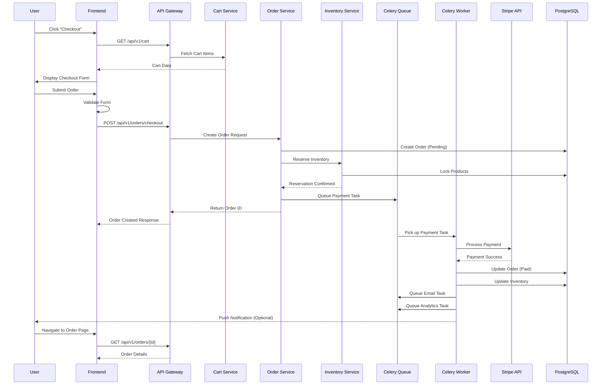
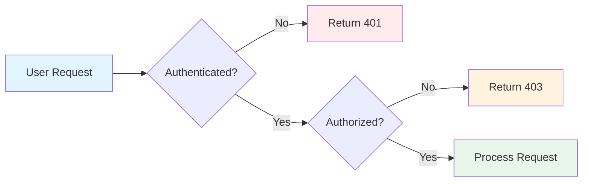
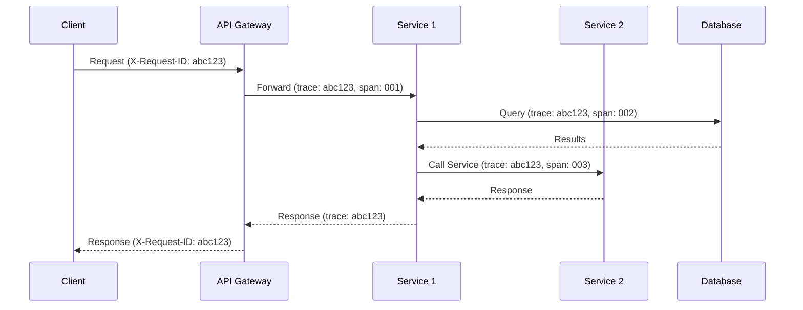
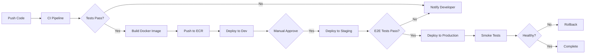

# E-Commerce Platform - Architecture Documentation

## 1. Chosen Architectural Pattern

### **Layered Monolith with Service-Oriented Components**

**Justification:**

For this e-commerce platform, we've chosen a **Layered Monolith** architecture with service-oriented internal components. This decision is based on:

1. **Team Size & Complexity**: A monolith is simpler to develop, test, and deploy for small-to-medium teams
2. **Cost Efficiency**: Single deployment reduces infrastructure complexity and operational overhead
3. **Performance**: In-process calls avoid network latency of microservices
4. **Transaction Management**: Easier to maintain ACID properties across related operations
5. **Future Evolution**: Clean service boundaries allow extraction to microservices if needed

The architecture uses clear separation of concerns through layered design, making it maintainable and testable while keeping deployment simple.

## 2. System Architecture Overview



## 3. Key Component Interactions

### 3.1 Communication Patterns

| Type | Protocol | Use Case |
|------|----------|----------|
| **Client → Frontend** | HTTPS/HTTP2 | Static assets, SPA delivery |
| **Frontend → Backend** | REST/HTTPS | API calls, state updates |
| **Backend → Database** | Connection Pool | Direct SQL queries via SQLAlchemy |
| **Backend → Cache** | Redis Protocol | Cache get/set operations |
| **Backend → Search** | HTTP REST | Elasticsearch queries |
| **Backend → Async** | Redis (as broker) | Task queue messages |
| **Async Workers → External** | HTTPS | Third-party API calls |
| **Async → Backend** | Direct SQL | Task result updates |

### 3.2 API Gateway Pattern

The Django REST Framework serves as an internal API gateway:

```python
# API Gateway routes requests to appropriate services
/api/v1/auth/*    → Authentication Service
/api/v1/products/* → Product Service
/api/v1/cart/*     → Cart Service
/api/v1/orders/*   → Order Service
/api/v1/vendors/*  → Vendor Service
/api/v1/search/*   → Search Service
```

## 4. Data Flow

### 4.1 User Registration Flow



### 4.2 Product Search Flow



### 4.3 Checkout & Order Flow



## 5. Scalability & Performance Strategy

### 5.1 Horizontal Scaling

| Component | Scaling Strategy | Implementation |
|-----------|------------------|----------------|
| **Frontend** | Auto-scaling | ECS with ALB, target tracking |
| **API Servers** | Auto-scaling | ECS with CPU/Memory metrics |
| **Celery Workers** | Auto-scaling | ECS with queue depth metric |
| **Database** | Read Replicas | RDS Multi-AZ with read replicas |
| **Cache** | Cluster Mode | Redis Cluster with sharding |
| **Search** | Horizontal | Elasticsearch cluster |

### 5.2 Performance Optimization

**Database Level:**
- Proper indexing on frequently queried columns
- Connection pooling (pg_bouncer)
- Query optimization with EXPLAIN ANALYZE
- Denormalized views for reporting
- Partitioned tables for orders/history

**Cache Strategy:**
- Product details cache (5-15 min TTL)
- User session cache (24h TTL)
- Search results cache (5 min TTL)
- Cart data cache (7 day TTL)
- Full-page cache for home page

**Frontend Optimization:**
- Code splitting by route
- Lazy loading components
- Image optimization (WebP, lazy load)
- Service Worker for offline support
- CDN for static assets

### 5.3 Caching Hierarchy

```
Level 1: Browser Cache (CDN)
    ↓
Level 2: Application Cache (Redis)
    ↓
Level 3: Database Query Cache
    ↓
Level 4: PostgreSQL Database
```

## 6. Security Considerations

### 6.1 Authentication & Authorization



**Implementation:**
- JWT tokens for stateless authentication
- Refresh token rotation
- Role-based access control (RBAC)
- API key authentication for vendor integrations
- OAuth 2.0 for social login

### 6.2 Data Protection

| Concern | Solution |
|---------|----------|
| **Data at Rest** | AES-256 encryption (RDS default) |
| **Data in Transit** | TLS 1.3 for all connections |
| **PII Storage** | Encrypted fields, access logs |
| **Password** | bcrypt with salt, minimum 12 rounds |
| **PCI Compliance** | No card data storage, tokenize via Stripe |
| **GDPR** | Right to export/delete implementation |

### 6.3 API Security

```
Security Layers:
┌─────────────────────────────────────┐
│ 1. WAF (AWS WAF)                    │
│    - Rate limiting                   │
│    - SQL injection protection        │
│    - XSS protection                  │
├─────────────────────────────────────┤
│ 2. API Gateway (Django Middleware)  │
│    - Authentication check            │
│    - Request validation              │
│    - CSRF protection                 │
├─────────────────────────────────────┤
│ 3. Application Level                 │
│    - Input sanitization              │
│    - Output encoding                 │
│    - Parameterized queries           │
├─────────────────────────────────────┤
│ 4. Service Level                     │
│    - Principle of least privilege    │
│    - Database user restrictions      │
└─────────────────────────────────────┘
```

### 6.4 Secret Management

- **AWS Secrets Manager**: Store database credentials, API keys
- **Environment Variables**: Container-specific config
- **Parameter Store**: CI/CD pipeline secrets
- **Rotation Policy**: Automatic secret rotation (90 days)

## 7. Error Handling & Logging Philosophy

### 7.1 Error Response Structure

```typescript
// Standard API Error Response
interface ApiError {
  error: {
    code: string;           // e.g., "VALIDATION_ERROR"
    message: string;        // Human-readable message
    details?: any;          // Validation errors, stack trace (dev)
    requestId: string;      // For tracing
    timestamp: string;      // ISO 8601
  };
}
```

### 7.2 Error Categories

| Category | HTTP Code | Example |
|----------|-----------|---------|
| **Validation** | 400 | Invalid email format |
| **Authentication** | 401 | Missing/invalid token |
| **Authorization** | 403 | Insufficient permissions |
| **Not Found** | 404 | Product doesn't exist |
| **Conflict** | 409 | Email already registered |
| **Rate Limit** | 429 | Too many requests |
| **Server Error** | 500 | Unexpected error |

### 7.3 Logging Strategy

```
Log Levels:
┌────────────────────────────────────┐
│ CRITICAL    System-wide failure    │ → PagerDuty
│ ERROR       Failed operations      │ → Sentry + CloudWatch
│ WARNING     Degraded performance   │ → CloudWatch
│ INFO        Business events        │ → CloudWatch + Analytics
│ DEBUG       Detailed diagnostics   │ → Development only
└────────────────────────────────────┘
```

**Log Format (JSON):**
```json
{
  "timestamp": "2024-01-15T10:30:00Z",
  "level": "INFO",
  "service": "order-service",
  "environment": "production",
  "request_id": "req-abc123",
  "user_id": "user-456",
  "event": "order_created",
  "order_id": "ORD-789",
  "amount": 99.99
}
```

### 7.4 Distributed Tracing



## 8. Deployment Architecture

### 8.1 Environment Strategy

```
┌─────────────────────────────────────────────────────────┐
│                    Production                            │
│  ┌─────────────────────────────────────────────────┐   │
│  │  Multi-AZ Deployment                            │   │
│  │  - 2+ AZs for high availability                 │   │
│  │  - Blue-Green deployments                       │   │
│  │  - Auto-scaling enabled                         │   │
│  └─────────────────────────────────────────────────┘   │
└─────────────────────────────────────────────────────────┘

┌─────────────────────────────────────────────────────────┐
│                    Staging                               │
│  ┌─────────────────────────────────────────────────┐   │
│  │  Single-AZ Deployment                           │   │
│  │  - Pre-production testing                       │   │
│  │  - Load testing environment                     │   │
│  │  - Production-like configuration                │   │
│  └─────────────────────────────────────────────────┘   │
└─────────────────────────────────────────────────────────┘

┌─────────────────────────────────────────────────────────┐
│                    Development                           │
│  ┌─────────────────────────────────────────────────┐   │
│  │  Local / Docker Compose                         │   │
│  │  - Feature development                          │   │
│  │  - Unit / Integration testing                   │   │
│  │  - Hot reload enabled                           │   │
│  └─────────────────────────────────────────────────┘   │
└─────────────────────────────────────────────────────────┘
```

### 8.2 Deployment Pipeline



---

*Document Version: 1.0*
*Last Updated: 2024*
*Architecture Status: Designed*
