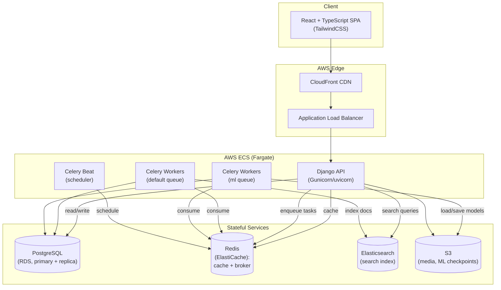
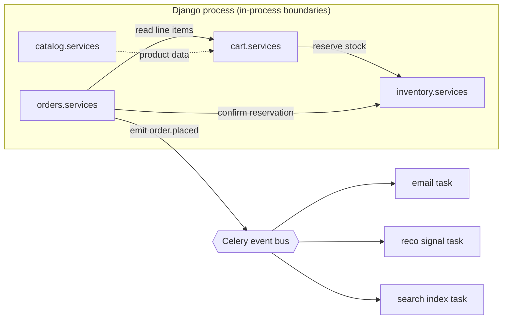
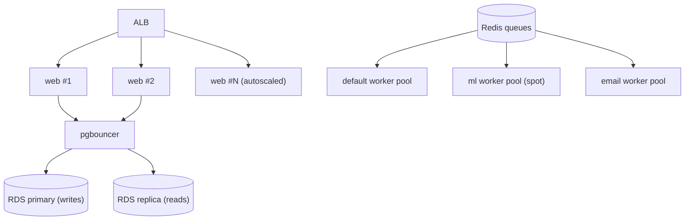
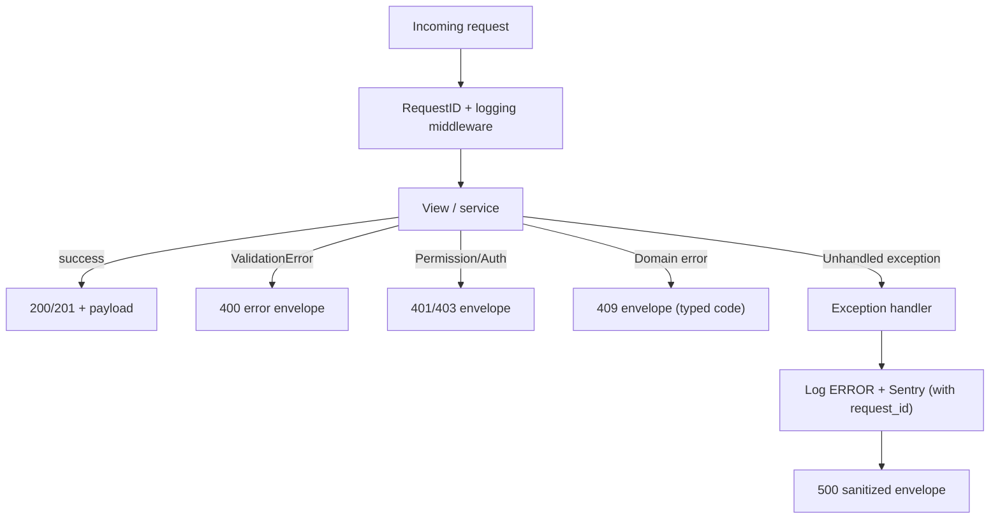

# E-Commerce Platform — Architecture

> Companion to [`PROJECT-PLAN.md`](./PROJECT-PLAN.md) and [`TECH-NOTES.md`](./TECH-NOTES.md).

---

## 2.1 Chosen Architectural Pattern

**Pattern: Modular Monolith with an Event-Driven asynchronous edge.**

The Django backend is a single deployable application internally partitioned
into **bounded-context apps** (`catalog`, `cart`, `orders`, `inventory`,
`vendors`, `search`, `recommendations`). Long-running and side-effecting work
(search indexing, email, payments reconciliation, ML training/inference) is
pushed onto **Celery + Redis** queues, making the system event-driven at the
edges without the operational cost of full microservices.

### Why this is the right fit

- **Team & scale stage.** For an e-commerce platform at launch-to-growth scale,
  a modular monolith ships faster, is far cheaper to operate, and avoids
  distributed-transaction complexity (e.g., cart→inventory→order consistency is
  a local DB transaction, not a saga).
- **Strong module boundaries preserve optionality.** Each app exposes a service
  layer; nothing reaches across apps into another's models directly. When a
  context (e.g., `search` or `recommendations`) needs independent scaling or a
  different language/runtime, it can be carved out into its own service with
  minimal blast radius.
- **Async where it matters.** Indexing to Elasticsearch, sending email,
  charging cards, and running PyTorch inference are inherently async and
  failure-prone — perfect for queues with retries and dead-letter handling, and
  they keep p95 request latency low.



---

## 2.2 Key Component Interactions

| Interaction | Mechanism | Notes |
|-------------|-----------|-------|
| SPA ↔ Backend | **REST/JSON over HTTPS** | Versioned `/api/v1/...`; JWT bearer auth; typed client in `frontend/src/api`. |
| Django app ↔ App | **In-process service-layer calls** | No cross-app model imports; interaction via each app's `services.py`. |
| Backend → async work | **Message queue (Celery/Redis)** | Producers enqueue; workers consume. Tasks are idempotent and retried with backoff. |
| Backend ↔ PostgreSQL | **Direct DB access via Django ORM** | Writes on primary; heavy/reporting reads via **SQLAlchemy** against a read replica. |
| Backend ↔ Redis | **Cache + broker** | Cache-aside for catalog/search; broker + result backend for Celery. |
| Backend/Worker ↔ Elasticsearch | **HTTP client** | Catalog writes emit signals → indexing tasks keep ES eventually consistent. |
| ML worker ↔ S3 | **Object storage** | PyTorch checkpoints saved/loaded; training reads exported interaction data. |
| Domain events | **Lightweight event bus over Celery** | e.g., `order.placed` fans out to email, inventory decrement, recommendation signal capture. |



---

## 2.3 Data Flow

### Example: Checkout (user input → processing → storage → response)

```mermaid
sequenceDiagram
    autonumber
    actor U as User (SPA)
    participant API as Django API
    participant CART as cart.services
    participant INV as inventory.services
    participant DB as PostgreSQL
    participant PAY as Payment Gateway
    participant Q as Redis (Celery)
    participant W as Celery Worker
    participant ES as Elasticsearch

    U->>API: POST /api/v1/checkout (JWT, cart_id, payment_token)
    API->>API: Validate input (serializer) + authorize user
    API->>CART: get_active_cart(user)
    CART->>DB: SELECT cart + line items
    API->>INV: reserve(cart.items)  [DB transaction]
    INV->>DB: SELECT ... FOR UPDATE; decrement stock
    alt insufficient stock
        INV-->>API: ReservationError
        API-->>U: 409 Conflict (standard error envelope)
    else stock reserved
        API->>PAY: charge(payment_token, amount) [idempotency key]
        PAY-->>API: payment_intent succeeded
        API->>DB: INSERT order (status=PAID) + items  [commit tx]
        API->>Q: enqueue order.placed event
        API-->>U: 201 Created (order summary)
        Q->>W: deliver order.placed
        W->>W: send confirmation email
        W->>ES: update product popularity signals
        W->>DB: write recommendation interaction
    end
```

**In words:** the synchronous path does only what the user must wait for —
validation, authorization, stock reservation (a single ACID transaction), and
payment. Everything else (email, search signals, recommendation data) happens
asynchronously after a `201` is returned, keeping the request fast and the
critical section small.

---

## 2.4 Scalability & Performance Strategy

- **Stateless web tier.** Django containers hold no session state (JWT + Redis),
  so ECS scales them horizontally behind the ALB on CPU/latency targets.
- **Independent worker pools.** Separate Celery queues (`default`, `ml`,
  `email`) scale independently — a nightly PyTorch training spike never starves
  order-confirmation emails. ML workers can run on larger/spot instances.
- **Read/write split.** Primary RDS for writes; read replicas serve catalog,
  search-adjacent, and reporting reads. Complex analytical queries use
  **SQLAlchemy Core** for fine-grained, replica-targeted SQL.
- **Caching layers.** CloudFront for static/media; Redis cache-aside for hot
  product/category/search responses with explicit invalidation on writes.
- **Search offloaded to Elasticsearch.** Full-text, faceting, and autocomplete
  never hit PostgreSQL, and ES scales as its own cluster.
- **Recommendations precomputed.** Top-N recommendations are computed in batch
  and cached per-user in Redis; the request path is a cache read, not a model
  forward pass.
- **Connection pooling.** pgbouncer in front of RDS to bound connection counts
  as web/worker container counts grow.



---

## 2.5 Security Considerations

**Authentication & Authorization**
- Stateless **JWT** access tokens (short TTL) + rotating refresh tokens stored
  as HttpOnly, Secure, SameSite cookies.
- **Role-based access control**: `customer`, `vendor`, `staff`/`admin`.
  DRF permission classes enforce object-level ownership (a vendor only edits
  their own products; a user only reads their own orders).
- Sensitive actions (password change, payout setup) require re-authentication.

**Data Protection**
- TLS 1.2+ everywhere (ALB/CloudFront termination, in-transit to RDS/Redis/ES).
- Encryption at rest (RDS, ElastiCache, S3, EBS) via KMS.
- Passwords hashed with Django's PBKDF2/Argon2; PII access audited.
- **No card data stored** — payment tokens only; PCI scope minimized via gateway.

**API Security**
- Strict input validation (DRF serializers); output serialization prevents
  field over-exposure.
- Rate limiting / throttling per user and per IP; WAF in front of CloudFront.
- CORS allowlist; CSRF protection for cookie-based flows.
- Idempotency keys on payment and order-creation endpoints.

**Secret Management**
- No secrets in code or images. Injected at runtime from **AWS Secrets Manager**
  / SSM Parameter Store into ECS task definitions.
- `.env.example` documents required variables; real `.env` is git-ignored.
- Least-privilege IAM roles per ECS service; rotated credentials.

---

## 2.6 Error Handling & Logging Philosophy

**Principles**
1. **Fail loud internally, fail safe externally.** Unexpected exceptions are
   logged with full context and a correlation ID, but the client only ever sees
   a sanitized, standardized error envelope — never stack traces.
2. **One error shape.** Every API error returns the same JSON contract:
   ```json
   {
     "error": {
       "code": "INVENTORY_INSUFFICIENT",
       "message": "Requested quantity exceeds available stock.",
       "details": { "sku": "ABC-123", "available": 2 },
       "request_id": "f3c1...e9"
     }
   }
   ```
3. **Correlation everywhere.** A `request_id` is generated by middleware on
   ingress, attached to logs, propagated to Celery tasks, and returned to the
   client so a user-reported ID maps directly to backend traces.

**Logging**
- **Structured JSON logs** to stdout (12-factor); shipped to CloudWatch →
  centralized log store. No `print`; use the configured logger.
- Log **levels** used deliberately: `INFO` for business events
  (`order.placed`), `WARNING` for recoverable/expected failures (payment
  declined), `ERROR` for unexpected exceptions, `CRITICAL` for outages.
- **Sentry** captures exceptions with breadcrumbs and request context.

**Async error handling**
- Celery tasks use bounded retries with exponential backoff + jitter;
  exhausted retries route to a **dead-letter queue** and raise an alert.
- Idempotent task design so retries are safe.


