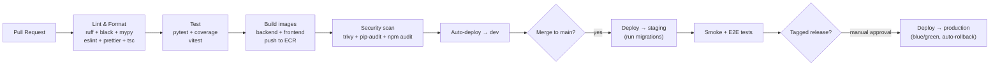

# E-Commerce Platform — Technical Notes

> Actionable engineering guidance. Companion to [`ARCHITECTURE.md`](./ARCHITECTURE.md).

---

## 3.1 CI/CD Pipeline Design

A single PR triggers `ci.yml`; merges and tags trigger the CD pipelines.



**Stage detail**

| Stage | Tooling | Gate |
|-------|---------|------|
| Lint/Format | `ruff`, `black --check`, `mypy`; `eslint`, `prettier --check`, `tsc --noEmit` | Fail on any error |
| Test | `pytest --cov` (backend), `vitest` (frontend) | Coverage threshold enforced |
| Build | Docker Buildx, layer cache, push to **ECR** by git SHA | Reproducible, immutable tags |
| Scan | `trivy` (image), `pip-audit`, `npm audit` | Fail on HIGH/CRITICAL |
| Deploy dev | ECS service update | Automatic on PR branch |
| Deploy staging | ECS + migration task | Automatic on merge to `main` |
| Deploy prod | ECS blue/green via CodeDeploy | **Manual approval** on git tag |

- **Migrations run as a one-off ECS task** before the new service revision goes
  live; they must be backward-compatible (expand/contract pattern).
- Images are tagged by **immutable git SHA**; environments promote the *same*
  artifact (build once, deploy many).

---

## 3.2 Testing Strategy

Follow the **testing pyramid** — many fast unit tests, fewer integration tests,
a handful of E2E journeys.

**Unit testing**
- Backend: **pytest** with `pytest-django`, `factory_boy` for fixtures,
  `pytest-mock`. Test services/domain logic in isolation; mock external I/O
  (payment gateway, ES, S3).
- Frontend: **Vitest** + **React Testing Library**; test components by behavior,
  not implementation.
- **Coverage target: ≥ 85%** on backend domain code (`apps/*/services.py`,
  models), ≥ 70% overall frontend. Enforced in CI.

**Integration testing**
- Spin up **real PostgreSQL, Redis, Elasticsearch** via service containers in CI
  (mirrors `docker-compose`). Test cart→inventory→order flows against real DB
  transactions, ES indexing, and Celery (eager mode or a real worker).
- Use `pytest` marks (`@pytest.mark.integration`) to separate from unit runs.

**End-to-end testing**
- **Playwright** drives the deployed staging SPA: signup → browse → search →
  add to cart → checkout → order history. Run post-staging-deploy and nightly.
- Keep E2E focused on critical revenue paths; they are the slowest and flakiest.

**ML-specific**
- Offline evaluation of the recommendation model (precision@k, recall@k, NDCG)
  against a holdout split, gated in the training pipeline before a model is
  promoted to serving.

---

## 3.3 Deployment Strategy

- **Containerized** with Docker; one image per service (`backend`, `frontend`).
  Multi-stage builds keep runtime images small (no build/test deps).
- **AWS ECS on Fargate** — no EC2 to manage. Separate services:
  `web`, `worker-default`, `worker-ml`, `worker-email`, `beat`.
- **Frontend** is a static build served via **S3 + CloudFront** (the
  `frontend` image is only for SSR/preview if added later).
- **Blue/green deployments** via CodeDeploy: new task set registered, health
  checks pass, traffic shifts, old set drained. **Automatic rollback** if the
  ALB health check or CloudWatch alarms trip.
- **Provisioning** is entirely **Terraform** (`infrastructure/terraform`),
  with remote state in S3 + DynamoDB lock. `staging` and `production` compose
  the same modules with different sizing.

---

## 3.4 Environment Management

- **Three environments:** `development` (local + dev cluster), `staging`
  (production-like), `production`.
- Configuration via **environment variables** only (12-factor). Settings are
  selected by `DJANGO_SETTINGS_MODULE` (`config.settings.development|staging|production`).
- **Secrets** never live in env files in the cloud — injected from AWS Secrets
  Manager / SSM into the ECS task definition. Locally, a git-ignored `.env`
  feeds `docker-compose`.
- See [`.env.example`](../.env.example) for the full template of required
  variables (DB URL, Redis URL, ES URL, JWT secret, Stripe keys, AWS region…).

Precedence (local → cloud): `.env` (dev only) → ECS task env → Secrets Manager
(highest, for sensitive values).

---

## 3.5 Version Control Workflow

**Recommended: Trunk-Based Development with short-lived feature branches.**

- `main` is always deployable. Branches are small, live < 2 days, and merge via
  PR with required green CI + at least one review.
- **Releases are git tags** (`vX.Y.Z`); tagging triggers the production deploy
  with manual approval.
- **Feature flags** gate incomplete work so partially built features can merge
  to `main` without being exposed.

**Rationale:** Trunk-based minimizes long-lived divergent branches and painful
merges, maximizes integration frequency, and pairs naturally with strong CI and
feature flags — ideal for a small/medium team shipping continuously. Full
Gitflow's release/develop branches add ceremony this team doesn't need.

```text
main ─────●────●────●────●────────●──  (always deployable)
           \    \         \       (tag v1.2.0 → prod)
   feat/cart●    feat/search●  fix/checkout●
   (<2 days, PR + green CI + review, then squash-merge)
```

---

## 3.6 Common Pitfalls (this stack)

**Django / Celery**
- **N+1 queries** — use `select_related`/`prefetch_related`; add
  `nplusone` or `django-zen-queries` in dev. Catalog/order list endpoints are
  prime offenders.
- **Non-idempotent tasks** — Celery delivers *at least once*. Tasks that send
  emails or charge cards MUST be idempotent (dedupe keys) or you'll double-send.
- **Tasks holding DB transactions** — never call `.delay()` inside an open
  transaction expecting the row to exist; use `transaction.on_commit()`.
- **Migrations that lock tables** — large `ALTER`/index builds lock writes. Use
  expand/contract and `CREATE INDEX CONCURRENTLY`.

**PostgreSQL + SQLAlchemy alongside ORM**
- Two query layers (Django ORM + SQLAlchemy) means **two connection pools** —
  size them together against pgbouncer limits or you'll exhaust connections.
- Keep SQLAlchemy strictly for **read-only reporting** on replicas; writes stay
  in the ORM to avoid bypassing model logic/signals.

**Redis**
- It's both cache and broker — **separate logical databases** (or instances) so
  a cache flush doesn't drop queued tasks.
- Cache stampede on hot keys → use locks / `CACHE_TTL` jitter.

**Elasticsearch**
- ES is **eventually consistent** with PostgreSQL. Never treat it as source of
  truth; reconcile via periodic full reindex Celery task. Handle index-lag in UX.
- Mapping changes require reindex — version your indices and alias-swap.

**PyTorch recommendations**
- Don't run model inference in the request path — **precompute & cache**.
- Pin CUDA/torch versions; CPU vs GPU image divergence causes subtle bugs.
  Keep training in the `ml` Celery queue on appropriately sized workers.
- Guard against **cold-start** users (no history) with popularity fallback.

**Frontend (React/TS)**
- Keep server state in a data-fetching cache (TanStack Query) — don't shove it
  into global Redux/Zustand. Distinguish server state from UI state.
- Enforce `strict` TS; generate API types from the backend schema (OpenAPI) to
  prevent contract drift.
