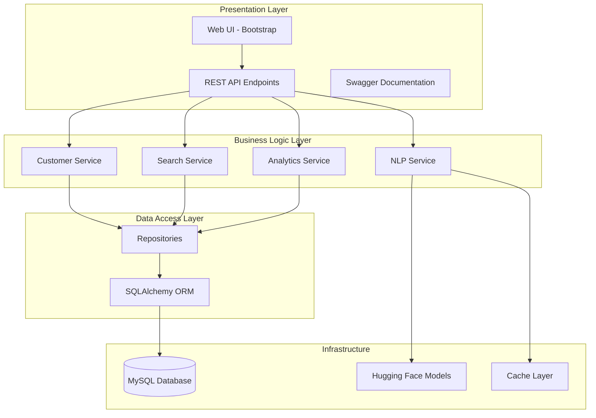
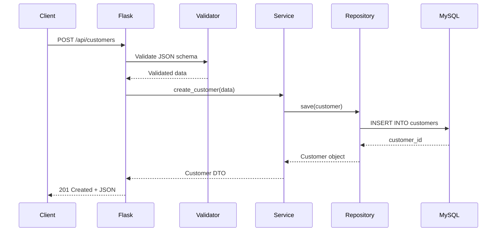
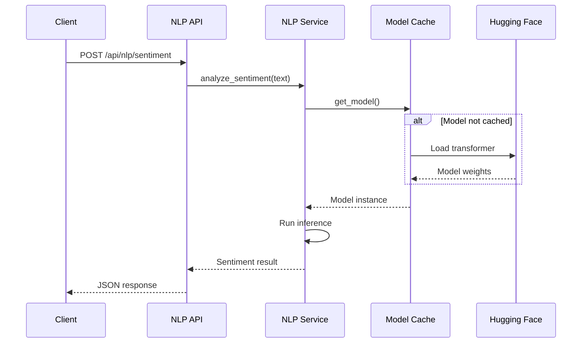
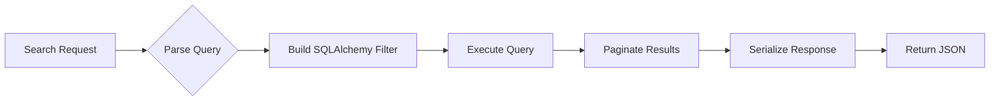
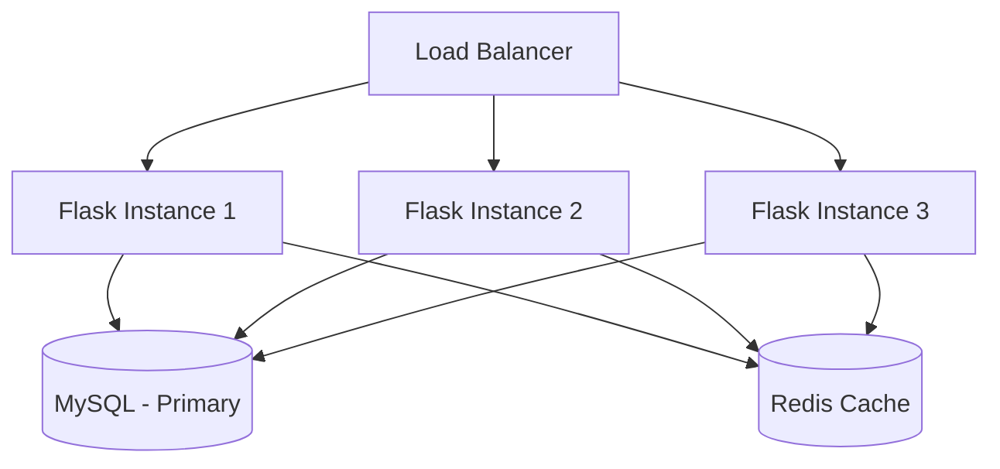
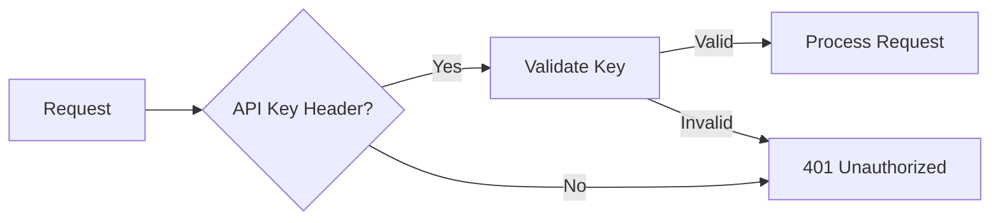
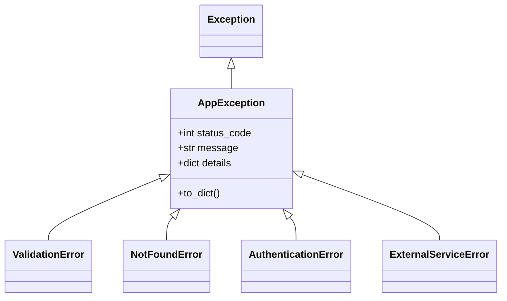

# Architecture Documentation

## 1. Chosen Architectural Pattern

### Pattern: Layered Monolith with Modular Blueprints



### Justification

1. **Simplicity**: For a customer management API, a monolith provides straightforward deployment and debugging
2. **Modularity**: Flask blueprints enable clean separation without microservices overhead
3. **Scalability Path**: Can be decomposed into microservices if needed (NLP service is already isolated)
4. **Cost Effective**: Single deployment on Railway reduces infrastructure complexity

---

## 2. Key Component Interactions

### 2.1 API Layer Communication

```mermaid
graph LR
    CLIENT[Client] -->|HTTP/JSON| FLASK[Flask App]
    FLASK -->|Blueprint| CUST[/api/customers]
    FLASK -->|Blueprint| SEARCH[/api/search]
    FLASK -->|Blueprint| ANALYTICS[/api/analytics]
    FLASK -->|Blueprint| NLP_API[/api/nlp]
```

### 2.2 Service Layer Interactions

| Service | Dependencies | External Calls |
|---------|-------------|----------------|
| CustomerService | SQLAlchemy | Database |
| SearchService | SQLAlchemy | Database |
| AnalyticsService | SQLAlchemy | Database |
| NLPService | transformers | Hugging Face (cached) |

### 2.3 Database Access Pattern

- **Repository Pattern**: Services don't access ORM directly
- **Unit of Work**: Flask-SQLAlchemy session management
- **Migrations**: Alembic via Flask-Migrate

---

## 3. Data Flow

### 3.1 Typical Request Flow



### 3.2 NLP Processing Flow



### 3.3 Search Flow



---

## 4. Scalability & Performance Strategy

### 4.1 Horizontal Scaling



### 4.2 Performance Strategies

| Strategy | Implementation | Benefit |
|----------|---------------|---------|
| Connection Pooling | SQLAlchemy pool_size=10 | Reduce DB connection overhead |
| Query Optimization | Eager loading, indexes | Faster response times |
| Model Caching | Singleton NLP models | Avoid repeated model loading |
| Response Caching | Redis for frequent queries | Reduce DB load |
| Pagination | Cursor-based pagination | Handle large datasets |

### 4.3 Railway Scaling

- **Auto-scaling**: Based on CPU/memory thresholds
- **Database**: Railway MySQL with connection limits
- **Stateless**: All instances share database state

---

## 5. Security Considerations

### 5.1 Authentication & Authorization



**Implementation:**
- API Key authentication via `X-API-Key` header
- Role-based access (future: JWT tokens)
- Rate limiting per API key

### 5.2 Data Protection

| Layer | Protection |
|-------|------------|
| Transport | HTTPS enforced (Railway provides SSL) |
| Database | Parameterized queries (SQLAlchemy) |
| Input | Schema validation (Marshmallow) |
| Output | Sensitive field filtering |
| Logs | No PII in logs |

### 5.3 API Security Checklist

- [x] SQL Injection prevention (ORM)
- [x] Input validation
- [x] CORS configuration
- [ ] Rate limiting
- [ ] API key rotation
- [ ] Request size limits

### 5.4 Secret Management

```
Development:  .env file (gitignored)
CI/CD:        GitHub Secrets
Production:   Railway environment variables
```

---

## 6. Error Handling & Logging Philosophy

### 6.1 Error Hierarchy



### 6.2 Error Response Format

```json
{
    "error": {
        "code": "VALIDATION_ERROR",
        "message": "Invalid customer data",
        "details": {
            "email": "Invalid email format"
        }
    },
    "request_id": "abc-123-def"
}
```

### 6.3 Logging Strategy

| Level | Usage | Example |
|-------|-------|---------|
| DEBUG | Development only | SQL queries, request details |
| INFO | Business events | Customer created, search performed |
| WARNING | Recoverable issues | Rate limit approached, slow query |
| ERROR | Failures | Database connection lost, NLP model error |

### 6.4 Structured Logging Format

```python
{
    "timestamp": "2024-01-15T10:30:00Z",
    "level": "INFO",
    "service": "customer-api",
    "request_id": "abc-123",
    "message": "Customer created",
    "customer_id": 42,
    "duration_ms": 150
}
```

### 6.5 Error Recovery Patterns

1. **Database Errors**: Retry with exponential backoff
2. **NLP Service Errors**: Return graceful degradation response
3. **Validation Errors**: Return detailed field errors
4. **Unexpected Errors**: Log full traceback, return generic message
