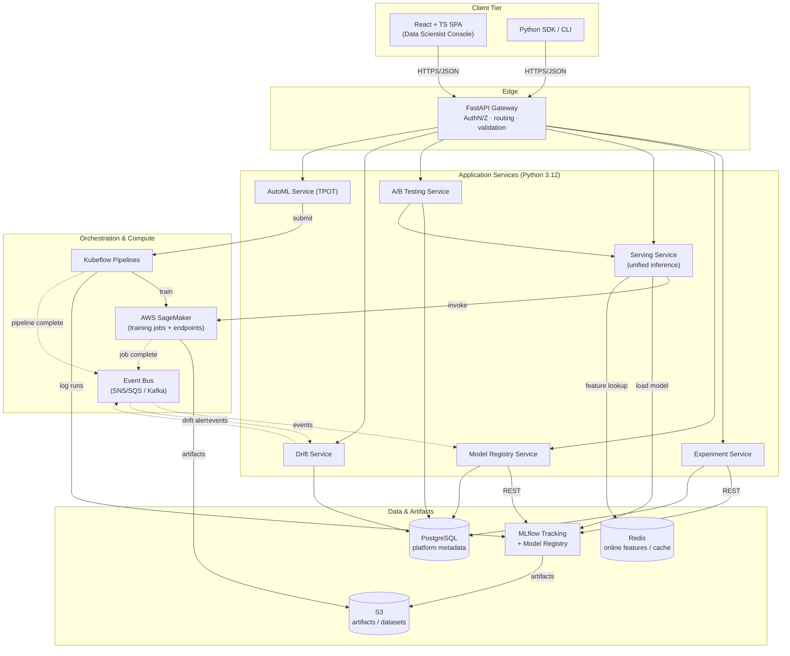
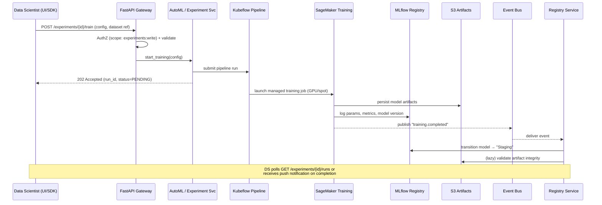
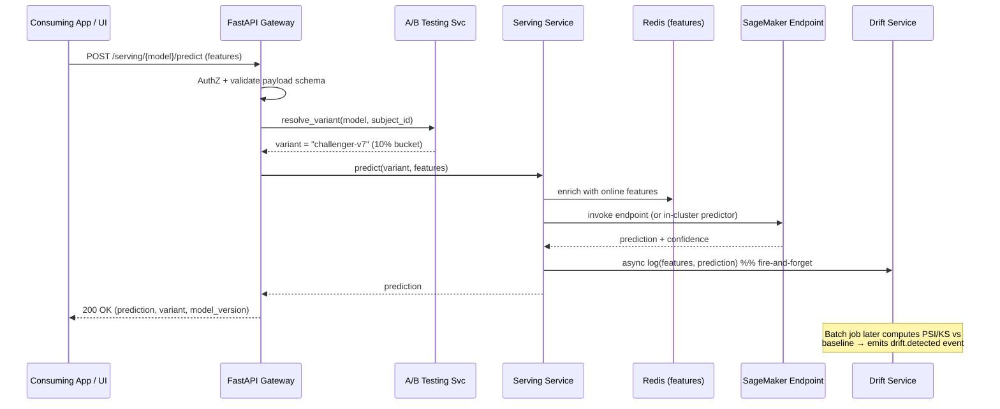

# Enterprise ML Platform — Architecture

## 2.1 Chosen Architectural Pattern

**Service-oriented platform with an event-driven backbone** — a small set of
cohesive backend services behind a single FastAPI gateway, coordinated by
**Kubeflow** for batch ML workflows and backed by **MLflow** as the system of
record for experiments and models. Long-running and asynchronous work (training,
AutoML search, drift evaluation) is dispatched as **events/jobs**, while
low-latency model inference is served synchronously through a **unified serving
layer** (in-cluster predictors + AWS SageMaker endpoints).

### Why this pattern fits

- **Mixed workload profile.** The platform has two very different traffic
  classes: *interactive* (sub-100ms inference, dashboard reads) and *batch*
  (multi-hour training, AutoML, drift sweeps). A monolith would couple their
  scaling and failure domains; full microservices would over-fragment a team of
  data scientists. A **modular service layer + job orchestration** splits these
  cleanly without premature granularity.
- **MLflow is the natural aggregate root.** Experiments → runs → model versions
  → stages form a strong domain spine. Centering the architecture on the MLflow
  registry avoids re-inventing lineage and versioning.
- **Elastic, bursty compute.** Training/AutoML demand spikes map well to
  Kubeflow on EKS + SageMaker managed (spot) capacity, decoupled from the
  always-on serving tier.
- **Independent evolvability.** Drift detection, A/B testing, and AutoML can ship
  on separate cadences behind stable service interfaces.

### Pattern trade-offs (acknowledged)

> Distributed jobs add orchestration complexity and eventual-consistency between
> "training finished" and "model registered/served." We accept this for
> scalability and isolation, and contain it with idempotent job handlers, an
> outbox/event log, and reconciliation between MLflow stage transitions and the
> serving deployment state.

---

## 2.2 Key Component Interactions

### Communication mechanisms

| Interaction | Mechanism | Rationale |
|-------------|-----------|-----------|
| UI/SDK → platform | **HTTPS / JSON (REST)** via FastAPI | Simple, cacheable, typed contracts (OpenAPI) |
| Gateway → services | In-process / module calls (modular monolith deploy) | Low latency, single deployable; can be split later |
| Services → MLflow | **REST** (MLflow tracking & registry API) | MLflow is the source of truth for runs/models |
| Service → training | **Async job submission** (Kubeflow / SageMaker SDK) | Decouples long compute from request lifecycle |
| Job completion → platform | **Event bus** (SNS→SQS, or Kafka) | Eventual, reliable, fan-out to registry + drift |
| Serving → online features | **Direct Redis** access | Sub-ms feature reads on the hot path |
| Services → metadata | **Direct DB** (async SQLAlchemy) | Transactional platform state (deployments, A/B) |

---

## 2.3 Data Flow

### Training & registration (write path)

### Inference & A/B serving (read path)

---

## 2.4 Scalability & Performance Strategy

- **Separate scaling domains.** Serving tier (always-on, latency-bound) scales
  independently from batch tier (training/AutoML/drift, throughput-bound).
  Serving uses **HPA/KEDA** on p95 latency + queue depth; batch uses Kubeflow on
  **Karpenter-provisioned GPU/spot** nodes that scale to zero when idle.
- **Stateless services.** All application services are stateless; state lives in
  PostgreSQL, MLflow, S3, and Redis. This permits horizontal scale-out and safe
  rolling deploys.
- **Warm model pool.** The serving layer keeps frequently used models warm in
  memory (LRU) and offloads cold/large models to SageMaker endpoints, avoiding
  per-request load latency.
- **Caching layers.** Redis caches online features and idempotent prediction
  results; registry metadata reads are cached with short TTLs.
- **Async I/O.** FastAPI + async SQLAlchemy + async MLflow/S3 clients keep the
  gateway non-blocking under fan-out.
- **Batch + streaming inference.** Large jobs route to SageMaker Batch Transform;
  real-time goes to endpoints — same unified API surface.
- **Backpressure.** SQS queues absorb training/drift bursts; consumers scale on
  queue depth so spikes degrade gracefully instead of failing.

---

## 2.5 Security Considerations

### Authentication & Authorization
- **OIDC** (AWS Cognito / Okta) issues JWTs; the gateway validates signature,
  audience, and expiry on every request.
- **RBAC with scopes**: `experiments:read|write`, `models:promote`,
  `serving:invoke`, `admin:*`. Model **promotion to Production** requires an
  elevated scope + audit trail.
- **Service-to-service**: short-lived IAM roles (IRSA on EKS) and mTLS inside the
  mesh; no long-lived static credentials.

### Data Protection
- Encryption **in transit** (TLS 1.2+) and **at rest** (S3 SSE-KMS, RDS KMS,
  EBS encryption).
- **Tenant/project isolation** via row-level scoping + per-project S3 prefixes
  and IAM conditions.
- PII handling: dataset classification tags; drift/serving logs store **feature
  hashes**, not raw PII, where possible.

### API Security
- Strict **Pydantic** input validation; reject unknown fields.
- **Rate limiting** + per-token quotas at the gateway; payload size caps on
  inference.
- Security headers, CORS allow-list, and OWASP-aligned dependency scanning
  (`pip-audit`, `npm audit`) in CI.

### Secret Management
- **AWS Secrets Manager / SSM Parameter Store**; injected at runtime, never in
  images or git.
- CI uses **GitHub OIDC → AWS role assumption** (no static cloud keys in repo).
- Local dev uses `.env` (git-ignored); `.env.example` documents required keys.

---

## 2.6 Error Handling & Logging Philosophy

### Errors
- **Typed domain exceptions** in `services/` (e.g. `ModelNotFound`,
  `PromotionForbidden`, `DriftThresholdInvalid`) mapped to HTTP status by a
  single FastAPI exception handler — handlers stay thin, clients get consistent
  error bodies.
- **RFC 7807 problem+json** response shape: `{type, title, status, detail,
  correlation_id}`.
- **Fail fast on the request path; retry on the job path.** Synchronous calls
  surface errors immediately; async jobs use idempotent, retried handlers with a
  **dead-letter queue** for poison messages.
- **Graceful ML degradation**: if a challenger model fails, the serving layer
  falls back to the champion and records the failure rather than erroring the
  caller.

### Logging & Observability
- **Structured JSON logs** with a `correlation_id` propagated from gateway →
  service → job, so a single inference or training run is traceable end-to-end.
- **Three pillars**: logs (structured), metrics (Prometheus — request rate,
  latency, model QPS, drift scores), traces (OpenTelemetry across API →
  serving → SageMaker).
- **ML-specific telemetry**: prediction distributions, feature drift (PSI/KS),
  model staleness, and A/B metric deltas are first-class signals with alerting.
- **Log levels**: `DEBUG` local only; `INFO` for lifecycle events; `WARNING`
  for degradations/fallbacks; `ERROR` for handled failures; `CRITICAL` pages
  on-call. No secrets or raw PII ever logged.
