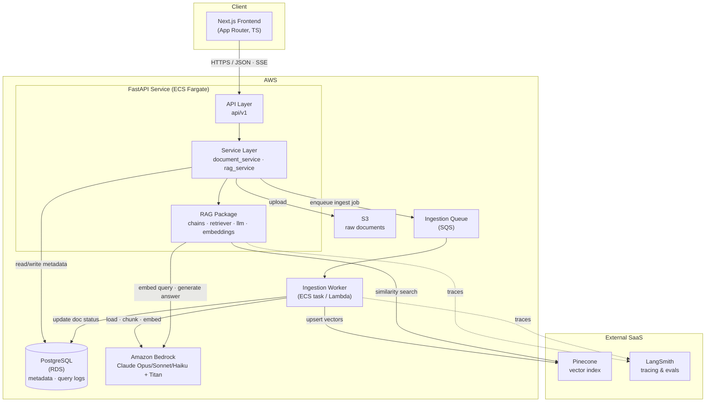
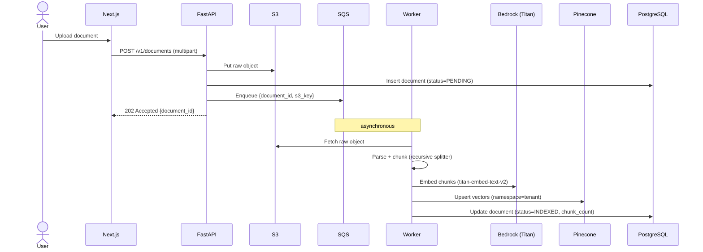
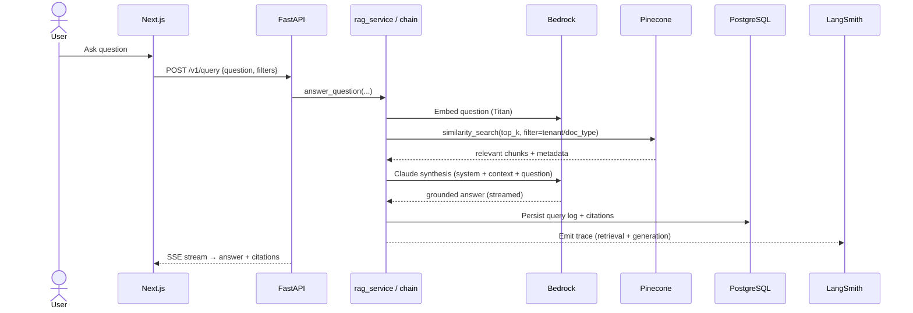
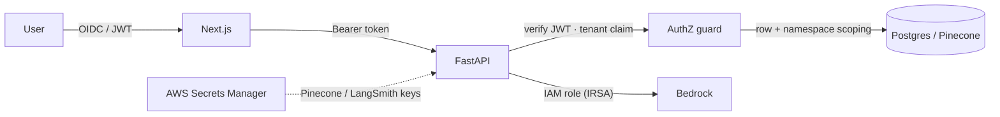

# Architecture — LLM-Powered Document Intelligence

## 2.1 Chosen Architectural Pattern

**Layered, service-oriented backend with a serverless-leaning AWS deployment and an
event-friendly ingestion path.**

The system is best described as a **modular monolith** for the API surface (one deployable
FastAPI service with clean internal layers) combined with an **asynchronous ingestion
pipeline** for the heavy, bursty document-processing work.

### Why this pattern fits

| Requirement | How the pattern serves it |
| --- | --- |
| Small-to-mid team, fast iteration | A modular monolith avoids premature microservice overhead while keeping seams (`api` → `services` → `rag`) that can later be split out. |
| Bursty, slow ingestion vs. latency-sensitive queries | Ingestion is decoupled and async (queue/worker), so a 200-page contract upload never blocks interactive Q&A. |
| Cost control on LLM inference | Bedrock is consumption-priced; serverless compute (ECS Fargate / Lambda) scales to demand. Pinecone serverless scales the index independently. |
| Enterprise trust boundaries (legal/medical) | A single well-audited service is easier to secure, log, and certify than a sprawl of services; multi-tenant isolation is enforced in one place. |
| Observability of multi-step LLM chains | LangChain + LangSmith give per-step traces; a layered design keeps each step inspectable. |

> When retrieval, ingestion, and synthesis develop independent scaling/ownership needs, the
> `rag/` package and the ingestion worker are the natural first extractions into separate
> services — the interfaces already exist.

### Pluggable backends (implementation note)

The `rag/` package is written against three protocols — `Embedder`, `VectorStore`,
`ChatModel` (`app/rag/types.py`) — with two interchangeable implementations selected by
`RAG_BACKEND`:

| Concern | `local` (dev / CI / docker) | `bedrock` (production) |
| --- | --- | --- |
| Embeddings | deterministic hashing vectorizer | Titan Text Embeddings v2 |
| Vector store | in-process cosine index (namespaced) | Pinecone (namespaced) |
| Synthesis | extractive grounded QA | Claude on Amazon Bedrock |
| Storage (`STORAGE_BACKEND`) | local filesystem | Amazon S3 |
| Ingestion (`INGEST_MODE`) | inline (synchronous) | SQS queue + worker |

The diagrams below depict the **production (`bedrock`/`queue`) topology**. The `local`
backend collapses the same data flow in-process (no SQS/S3/Pinecone/Bedrock) so the app runs
end-to-end offline; the API/service/pipeline layers and contracts are identical either way.

---

## 2.2 Key Component Interactions

**Communication mechanisms**

- **Synchronous HTTPS/JSON** — Frontend ↔ API for queries, document CRUD, and status polls.
- **Server-Sent Events (SSE)** — Streaming token-by-token answers from API → Frontend.
- **Message queue (SQS)** — API enqueues ingestion jobs; workers consume asynchronously. Decouples slow parsing/embedding from the request path.
- **Direct DB access** — Only the service layer touches PostgreSQL (via the async session); endpoints never query directly.
- **Outbound API calls** — RAG package → Bedrock (inference/embeddings) and → Pinecone (vector ops); both wrapped behind thin adapters in `rag/`.

---

## 2.3 Data Flow

### Ingestion (write path)

### Query (read path)

---

## 2.4 Scalability & Performance Strategy

| Dimension | Strategy |
| --- | --- |
| **Query throughput** | Stateless FastAPI behind an ALB; ECS Fargate autoscales on CPU + request count. No session affinity needed. |
| **Ingestion spikes** | SQS absorbs bursts; worker pool scales on queue depth. Backpressure is natural — the queue, not the API, holds the load. |
| **Vector search** | Pinecone serverless scales reads/writes independently of compute; per-tenant **namespaces** keep search sets small and isolated. |
| **LLM cost/latency** | Model tiering — Haiku 4.5 for routing/classification, Sonnet 4.6 for default QA, Opus 4.8 for hardest synthesis. **Prompt caching** on the stable system prompt + retrieved context (see TECH-NOTES). |
| **DB** | Read replicas for query-log analytics; connection pooling (async engine). Metadata only — no large blobs in Postgres. |
| **Caching** | (a) Prompt cache at the model; (b) optional embedding cache for repeated queries; (c) CDN for the static Next.js shell. |
| **Right-sizing context** | Top-k retrieval + reranking keeps prompts lean; map-reduce summarization bounds token growth on huge documents. |

**Performance targets (illustrative SLOs)**

- p95 interactive answer latency (first token): < 2.5 s
- Ingestion: < 60 s for a 50-page document (async, non-blocking)
- Retrieval recall@10: > 0.9 on the eval set

---

## 2.5 Security Considerations

- **Authentication & authorization**
  - End users authenticate via OIDC (e.g., Cognito/Auth0); the API verifies signed JWTs.
  - Every request carries a **tenant claim**; authorization is enforced at the service layer — Postgres rows and Pinecone namespaces are scoped per tenant. No cross-tenant retrieval is possible by construction.
  - Service-to-service AWS access uses **IAM roles** (IRSA / task roles), never static keys.

- **Data protection**
  - Encryption in transit (TLS everywhere) and at rest (S3 SSE-KMS, RDS encryption, Pinecone managed encryption).
  - Medical documents: PII/PHI redaction guardrail at ingestion; restricted KMS keys; audit logging for access (HIPAA-aligned posture).
  - Least-privilege IAM for Bedrock (only required `InvokeModel*` actions on allowed model ARNs).

- **API security**
  - Input validation via Pydantic; strict request size limits on upload.
  - Per-tenant rate limiting; output filtering to avoid prompt-injection-driven data exfiltration.
  - Retrieved context is treated as **untrusted** — the system prompt instructs the model to answer only from provided context and never to follow instructions embedded in documents.

- **Secret management**
  - All secrets (Pinecone API key, LangSmith key, DB credentials) in **AWS Secrets Manager**, injected at runtime. Nothing in source or images. `.env` is local-dev only.

---

## 2.6 Error Handling & Logging Philosophy

**Principle: fail loud at boundaries, degrade gracefully in the middle, never silently truncate or fabricate.**

- **Structured logging** — JSON logs with a correlation/request ID propagated from the edge through services, RAG steps, and the worker. Every log line carries `tenant_id`, `request_id`, and (where relevant) `document_id`.
- **Layered exception handling**
  - `rag/` adapters raise typed errors (`RetrievalError`, `LLMError`, `EmbeddingError`).
  - Services translate them into domain results; transient errors (429/5xx from Bedrock, Pinecone timeouts) are retried with exponential backoff + jitter.
  - The API layer maps domain/typed errors to clean HTTP responses via FastAPI exception handlers — clients get stable error shapes, never stack traces.
- **LLM-specific handling** — Always branch on `stop_reason` (handle `max_tokens`, `refusal`); parse tool/JSON outputs with a real parser, never string-matching; if context exceeds the window, surface it and chunk rather than truncate.
- **Observability** — LangSmith captures full chain traces (retrieval results, prompts, token usage, latency) for debugging and evals. CloudWatch holds infra metrics/alarms; SLO breaches page on-call.
- **Idempotency & recovery** — Ingestion jobs are idempotent on `document_id`; failed jobs land on a dead-letter queue for inspection and replay. Document status (`PENDING → INDEXED / FAILED`) is the source of truth surfaced to users.
