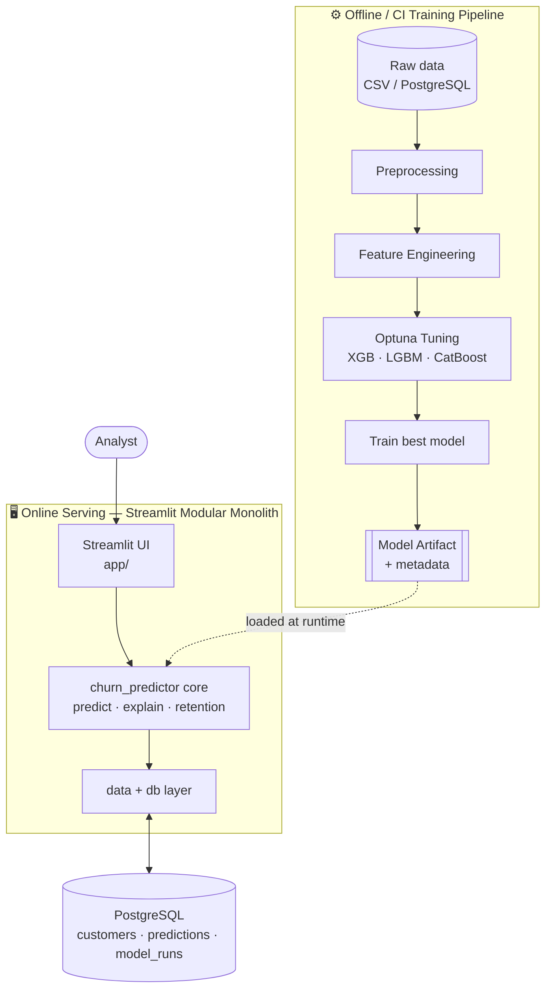
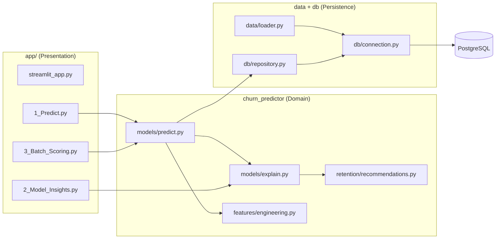
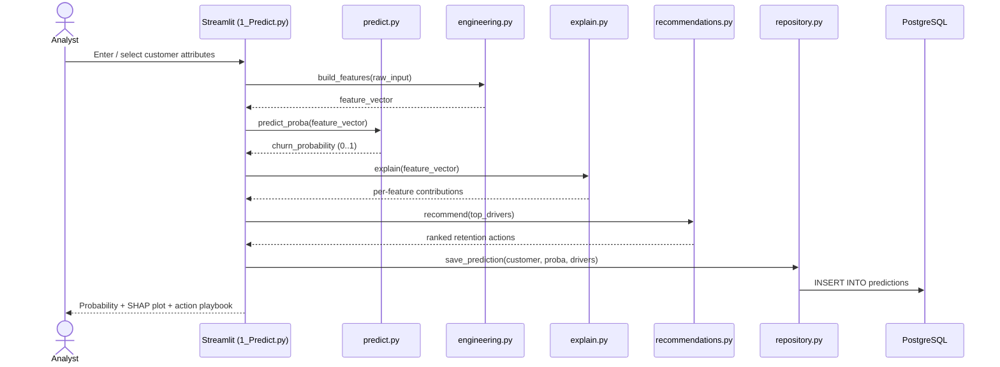
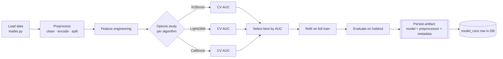
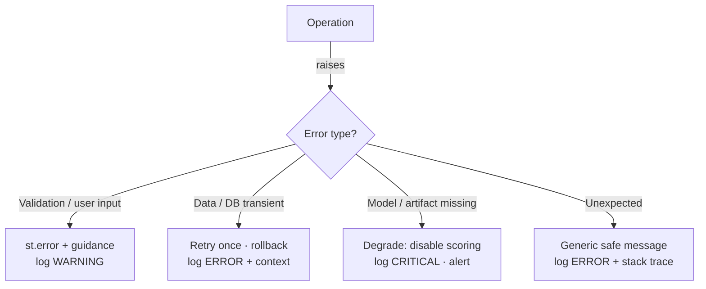

# Customer Churn Predictor — Architecture

## 2.1 Chosen Architectural Pattern

**Pattern: Layered Modular Monolith** (single deployable, strict internal layering),
with an **offline batch training pipeline** decoupled from the **online serving app**.

### Why this fits

| Requirement | How the pattern serves it |
|-------------|---------------------------|
| Small team, **self-service** tool | One deployable (Streamlit Cloud) — minimal ops overhead |
| Modest, bursty traffic (internal analysts) | No need for microservices or autoscaling fleets |
| ML lifecycle (train rarely, serve often) | **Training is offline/CI-driven**; serving just loads a frozen artifact |
| Maintainability | Clear layers (UI → domain → data) keep the core testable & reusable |
| Future REST/API or scheduler reuse | Core logic lives in an installable package, UI is a thin client |

Microservices would add network, deployment, and observability cost with no
payoff at this scale. Serverless functions struggle with large model artifacts
(cold starts loading XGBoost/SHAP). A layered modular monolith is the pragmatic
sweet spot: **simple to deploy, easy to evolve, hard to tangle.**



---

## 2.2 Key Component Interactions

| Interaction | Mechanism | Notes |
|-------------|-----------|-------|
| Analyst ↔ App | HTTPS (Streamlit server) | Session-based, websocket for reactivity |
| App → Core package | **In-process function calls** | No network hop; thin UI over domain API |
| Core → PostgreSQL | **SQLAlchemy** (pooled connections) | Parameterized queries only |
| Core → Model artifact | **Direct file load**, cached via `st.cache_resource` | Loaded once per process |
| Training → Artifact | File write (`joblib`) + metadata row in `model_runs` | Produced offline / in CI |
| CI → Streamlit Cloud | Git push to `main` triggers redeploy | Migrations gated before deploy |

The system is intentionally **call-based, not message-based**. There is no message
queue or event bus — traffic volume and latency tolerance do not justify the
complexity. Batch scoring runs synchronously within a Streamlit session (chunked
for large files); if volumes grow, the same core functions can be lifted into an
async worker without touching the UI.



---

## 2.3 Data Flow

### Single-customer prediction (online)



### Offline training (CI / manual)



> **Artifact contents.** The persisted bundle is a single `joblib` file containing
> `{model, preprocessor, metadata}`. The fitted `Preprocessor` (numeric medians +
> one-hot schema, fit on the **training split only**) travels with the model so the
> serving path reproduces transforms exactly — eliminating train/serve skew.
> In Docker, a one-shot **`trainer`** service runs `python -m churn_predictor.bootstrap`
> (migrate → seed → train) before the `app` service starts.

---

## 2.4 Scalability & Performance Strategy

**Current scale:** internal team, tens of concurrent users, batch files up to ~100k rows.

| Concern | Strategy |
|---------|----------|
| Model load cost | Load artifact **once** per process via `st.cache_resource`; never per request |
| Repeated reads | Cache reference/lookup data with `st.cache_data(ttl=...)` |
| Batch scoring | **Vectorized** scoring; chunked DB writes (`executemany`); SHAP sampled for large N |
| DB connections | SQLAlchemy **connection pool** (`pool_pre_ping=True`), short-lived sessions |
| Training cost | Offline only; Optuna **pruning** (median/Hyperband) cuts wasted trials |
| Read scaling | PostgreSQL **read replica** if reporting load grows (no app change) |
| Horizontal scale | Stateless app → run N replicas behind a load balancer if self-hosting |
| Future high-throughput | Lift `predict.py` into a queue-backed worker; UI contract unchanged |

**Performance budget (serving):** single prediction incl. SHAP < 1s; batch of
10k rows < 30s. Achieved by keeping the model in memory and vectorizing.

---

## 2.5 Security Considerations

| Area | Approach |
|------|----------|
| **Authentication** | Streamlit Cloud SSO/email allowlist for internal users; optional shared app password (`st.secrets`) or reverse-proxy SSO (OAuth2) when self-hosted |
| **Authorization** | Role-light: viewer vs. operator (batch write) flag in session; enforce write-back permissions in `repository.py` |
| **Data protection** | TLS in transit (managed PG + HTTPS); PII minimization — store customer **IDs**, not raw PII, where possible; encryption at rest via managed DB |
| **SQL safety** | **Parameterized queries only** via SQLAlchemy; no string-formatted SQL |
| **Input validation** | Pydantic / explicit schema checks on uploaded CSVs and manual inputs; reject unexpected columns/types |
| **Secret management** | **No secrets in git.** `st.secrets` on Streamlit Cloud, `.env` locally, GitHub **Actions Secrets** in CI. `.env.example` documents required keys only |
| **API/Transport** | HTTPS enforced; CSRF mitigated by Streamlit session model; rate-limit at proxy if exposed |
| **Dependency hygiene** | `pip-audit` / Dependabot in CI; pinned versions in `requirements.txt` |
| **Auditability** | Every prediction + model run written to DB with timestamp, model version, and actor |

---

## 2.6 Error Handling & Logging Philosophy

**Principles**
1. **Fail loud in code, fail gracefully in UI.** The core package raises typed
   exceptions; the Streamlit layer catches them and shows actionable messages.
2. **Structured logging** via the stdlib `logging` module configured centrally in
   `config.py` (JSON-ish key=value lines, level via `LOG_LEVEL` env var).
3. **No silent excepts.** Catch narrow exceptions; re-raise or log with context.
4. **Idempotent, transactional writes.** DB writes wrapped in transactions; rollback on error.



**Custom exception hierarchy** (defined in the core package):

```text
ChurnError (base)
├── ConfigError          # missing/invalid settings
├── DataLoadError        # source unreachable / schema mismatch
├── PreprocessingError   # bad/unexpected input data
├── ModelArtifactError   # artifact missing / incompatible version
└── PredictionError      # scoring failure
```

**Logging targets:** stdout (captured by Streamlit Cloud / container runtime).
Each log line carries: timestamp, level, module, `run_id`/`request_id` where
applicable, and a short message. Sensitive values are never logged.
