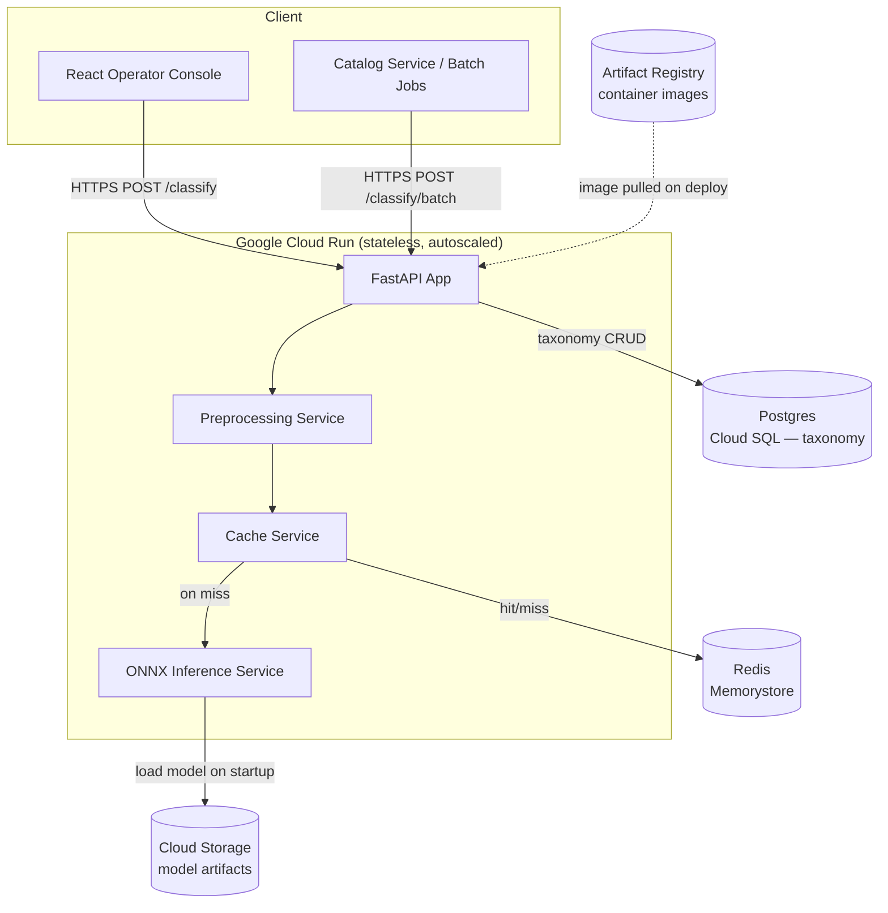
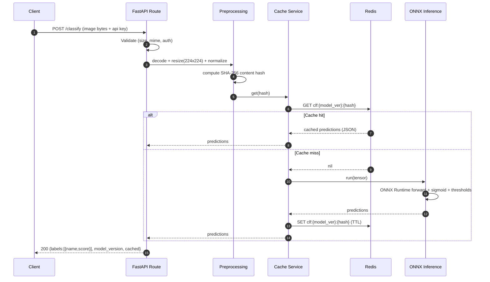
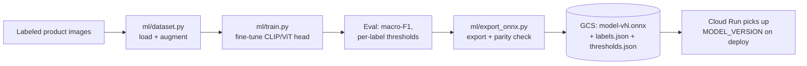
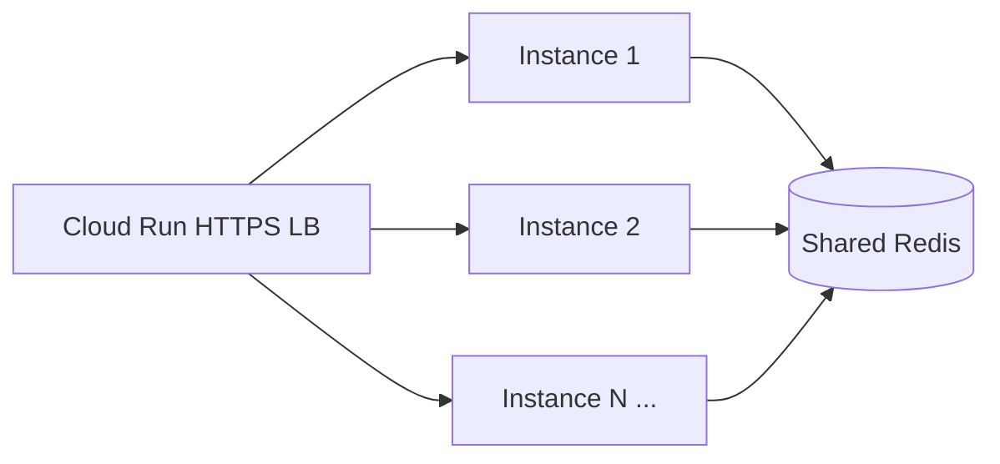
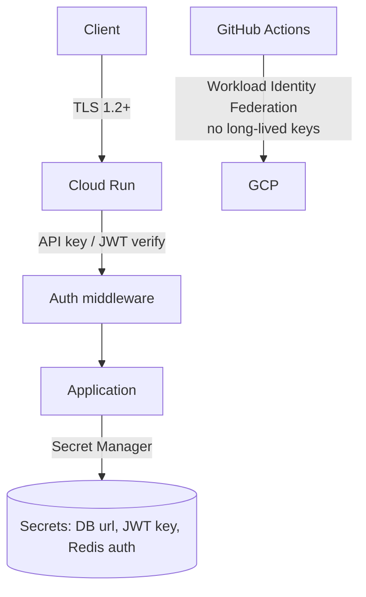
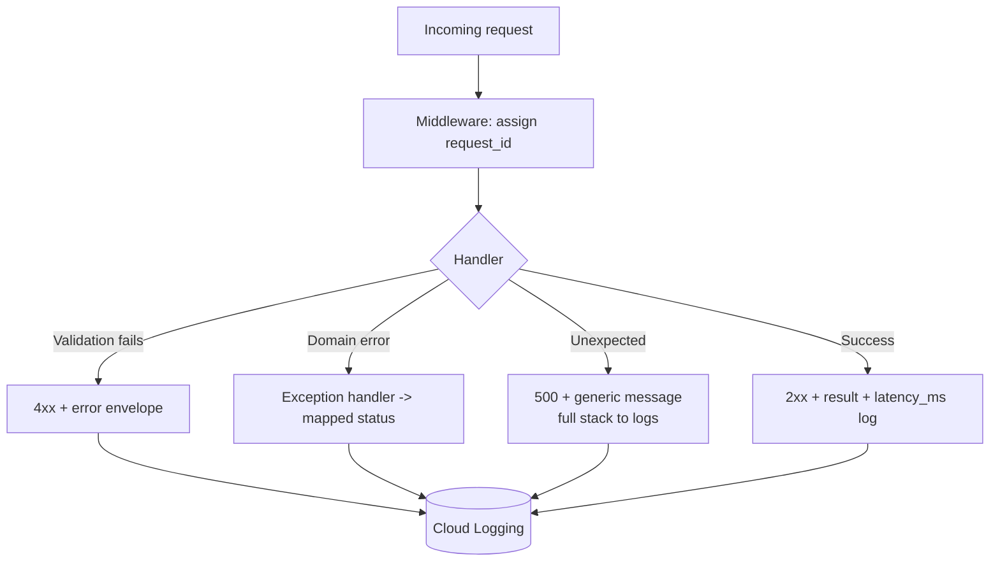

# Architecture — Image Classification Service

This document describes the architecture of the Image Classification Service: a
multi-label product-image classifier (ViT fine-tuned from CLIP), served via ONNX
Runtime behind FastAPI, cached in Redis, and deployed to Google Cloud Run.

---

## 2.1 Chosen Architectural Pattern

### Pattern: **Serverless, service-oriented inference API with a separate offline ML pipeline**

The system is split into two loosely-coupled planes:

1. **Serving plane (online):** a stateless FastAPI container running on Cloud Run.
   It performs preprocessing → cache lookup → ONNX inference → response. It is
   horizontally autoscaled and holds no session state.
2. **Training plane (offline):** a batch pipeline (`backend/app/ml`) that fine-tunes
   the model, exports to ONNX, validates parity, and publishes a versioned artifact.
   This runs on demand (locally, on a CI runner, or a GPU job) — **never** in the
   request path.

Internally the serving container follows a **layered (clean) architecture**:

```
Transport layer  (api/routes)      → HTTP, validation, status codes
Service layer    (services/*)      → inference, caching, preprocessing logic
Domain/models    (models/*)        → Pydantic DTOs, ORM entities
Infrastructure   (db, redis, onnx) → external systems behind interfaces
```

### Why this pattern fits

| Requirement | How the pattern satisfies it |
| --- | --- |
| **Spiky, bursty catalog ingestion** | Cloud Run scales to zero and bursts on demand — pay per request, no idle GPU cost. |
| **Stateless inference** | A pure function `image → labels` maps naturally to a scale-out serverless service. |
| **Expensive cold model load** | `min-instances ≥ 1` + lazy/once model load keeps a warm pool; Redis absorbs repeats. |
| **Independent ML iteration** | Decoupling training from serving lets data scientists ship new model versions without redeploying request-path code logic. |
| **Small-to-medium team** | A modular service (not full microservices) avoids distributed-systems overhead while keeping clear seams. |

> We deliberately **avoid full microservices**: the cache, classifier, and taxonomy
> CRUD are cohesive enough to live in one deployable. The only hard split is
> training-vs-serving, which is a *lifecycle* boundary, not a network boundary.

---

## 2.2 Key Component Interactions



**Communication styles**

- **Client ↔ API:** synchronous HTTPS/JSON (REST). Images sent as multipart/base64.
- **API ↔ Redis:** synchronous read-through cache (key = image content hash).
- **API ↔ Postgres:** direct DB access via SQLAlchemy for the category taxonomy
  (a small, slowly-changing dataset — no message queue needed).
- **API ↔ Cloud Storage:** model artifact pulled **once at startup**, cached on the
  instance's local disk/memory.
- **Batch ingestion (Phase 2+):** large catalog re-classification is the natural fit
  for an async queue (Pub/Sub) feeding a worker — see Scalability below.

---

## 2.3 Data Flow

### Single-image classification (request path)



### Offline training & promotion flow



**Key data-flow notes**

- The **content hash** is computed on the *normalized* image, so visually identical
  re-uploads (different filenames, same pixels post-resize) share a cache entry.
- Cache keys are namespaced by `model_version` so a new model deploy transparently
  invalidates stale predictions without a flush.
- Predictions are **idempotent** for a given (model, image) pair — safe to cache and retry.

---

## 2.4 Scalability & Performance Strategy



| Layer | Strategy |
| --- | --- |
| **Compute** | Cloud Run autoscaling on concurrency. `min-instances=1` avoids cold starts; `max-instances` caps cost. |
| **Concurrency** | ONNX Runtime is thread-safe for inference; tune `container concurrency` + intra-op threads to CPU count. |
| **Caching** | Read-through Redis on image hash collapses duplicate work — dominant win for catalog re-runs. |
| **Model size** | ONNX graph optimization + INT8 dynamic quantization shrink the model and cut CPU latency ~2–4×. |
| **Batching** | `POST /classify/batch` amortizes per-call overhead; ONNX dynamic batch axis enables true batched forward passes. |
| **Async ingestion** | For full-catalog reclassification, enqueue to Pub/Sub and process with worker revisions — decouples bursty backfills from interactive traffic. |
| **DB** | Taxonomy is small + read-heavy; Cloud SQL with a connection pool (and optional read replica) is sufficient. |
| **Statelessness** | No instance-local state (besides the read-only model) → linear horizontal scale. |

**Performance practices**

- Load the ONNX session **once** at process start (FastAPI lifespan), not per request.
- Reuse a single `InferenceSession`; allocate input tensors with `numpy` to avoid copies.
- Keep payloads small: downscale on the client where possible; enforce max upload size.

---

## 2.5 Security Considerations



| Area | Approach |
| --- | --- |
| **Authentication** | Service-to-service clients use API keys (hashed at rest, compared in constant time). The React console uses short-lived JWTs. |
| **Authorization** | Role scopes: `classify`, `taxonomy:read`, `taxonomy:write`, `admin`. Enforced in `core/security.py` as FastAPI dependencies. |
| **Transport** | HTTPS only (Cloud Run terminates TLS). HSTS on the frontend. |
| **Input validation** | Strict MIME sniffing, max file size, max dimensions, decode in a sandbox with Pillow limits to prevent decompression bombs. |
| **Data protection** | Images are processed in-memory and **not** persisted by default; only hashes + predictions are cached. PII is not expected in product images, but uploads are scoped per-tenant API key. |
| **Secret management** | All secrets in **Google Secret Manager**, injected as env vars at deploy. Nothing committed; `.env` is gitignored. |
| **CI/CD identity** | GitHub Actions authenticates to GCP via **Workload Identity Federation** — no downloaded service-account JSON keys. |
| **Dependency hygiene** | `pip-audit` / Dependabot, pinned versions, minimal base image (distroless/slim). |
| **Rate limiting** | Per-key rate limits (Phase 3) to mitigate abuse and protect the model from scraping. |

---

## 2.6 Error Handling & Logging Philosophy

**Principles**

1. **Fail fast at the edge, degrade gracefully in the core.** Reject malformed input
   with `4xx` immediately. If Redis is down, log a warning and fall through to
   inference (cache is an optimization, not a dependency).
2. **Typed, centralized exceptions.** Domain errors (`ModelNotLoadedError`,
   `UnsupportedImageError`, `InferenceError`) are mapped to HTTP responses by a single
   FastAPI exception handler — routes never build error bodies by hand.
3. **Consistent error envelope.** Every error returns:
   ```json
   { "error": { "code": "UNSUPPORTED_IMAGE", "message": "…", "request_id": "…" } }
   ```
4. **Structured JSON logging.** Every log line carries `request_id`, `model_version`,
   `cache` (hit/miss), and `latency_ms`. This makes Cloud Logging queryable and
   correlatable across a request.
5. **No secrets or raw image bytes in logs.** Log the image hash, never the payload.



| Failure | Behavior |
| --- | --- |
| Redis unavailable | Log `WARN cache_unavailable`, skip cache, serve from model |
| Model not loaded | `/ready` returns 503 so Cloud Run/LB stops routing traffic |
| Bad image | `415 UNSUPPORTED_IMAGE` with actionable message |
| Inference exception | `500 INFERENCE_ERROR`, full trace logged, generic client message |
| Downstream DB error (taxonomy) | `503`, request-id logged, retried by client |

**Observability stack:** structured logs → Cloud Logging; metrics (latency, cache-hit
ratio, error rate, model version) → Prometheus/Cloud Monitoring; traces →
OpenTelemetry → Cloud Trace (Phase 3).
