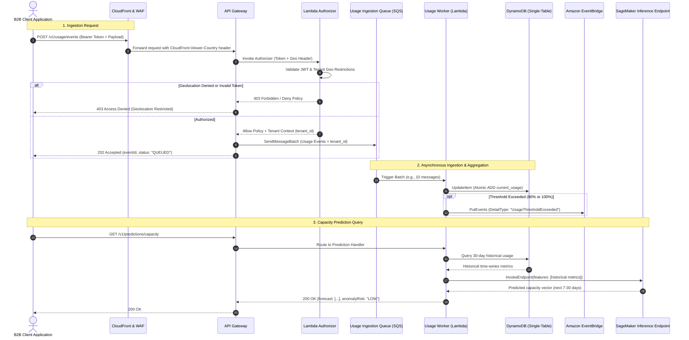
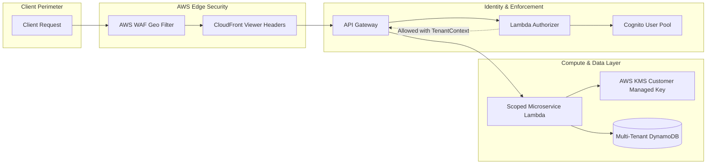

# Serverless SaaS Platform — System Architecture

## 1. Architectural Overview & Pattern Justification

The **Serverless SaaS Platform** leverages a **Serverless Event-Driven Architecture (EDA)** combined with a **Single-Table DynamoDB multi-tenant pattern**. This architecture is engineered to provide zero-idle-cost operation, near-instantaneous horizontal elasticity, strict multi-tenant data isolation, and decoupled real-time data processing.

```
                  +-------------------------------------------------------------+
                  |                      Client Requests                        |
                  +-------------------------------------------------------------+
                                                 |
                                                 v
                  +-------------------------------------------------------------+
                  |              Amazon CloudFront & AWS WAF                    |
                  |     (Edge Caching, Geo-Blocking, Rate-Limiting)             |
                  +-------------------------------------------------------------+
                                                 |
                                                 v
                  +-------------------------------------------------------------+
                  |                 Amazon API Gateway (REST/HTTP)              |
                  +-------------------------------------------------------------+
                                   |                           |
                   [Auth & Geo Verification]                   | [Direct / Buffering]
                                   v                           v
                  +-------------------------+     +-----------------------------+
                  | Lambda Custom Authorizer|     |      Amazon SQS (Buffer)    |
                  | (Cognito + Geo Enforcer)|     +-----------------------------+
                  +-------------------------+                    |
                               |                                 v
                               v                  +-----------------------------+
                  +-------------------------+     |   Usage Ingestion Worker    |
                  | Microservice Lambdas    |     |          (Lambda)           |
                  | (Tenant, Billing, API)  |     +-----------------------------+
                  +-------------------------+                    |
                               |                                 |
                               +---------------+-----------------+
                                               |
                                               v
                        +-----------------------------------------------+
                        |        Amazon DynamoDB (Single-Table)         |
                        |      (Multi-Tenant Data, PK: TENANT#id)       |
                        +-----------------------------------------------+
                                               |
                                               v
                        +-----------------------------------------------+
                        |        Amazon EventBridge (Custom Bus)        |
                        +-----------------------------------------------+
                             |                         |
                             v                         v
              +----------------------------+   +-------------------------------+
              | Billing Alert & Step Funcs |   |  SageMaker Serverless Infer   |
              | (Usage Threshold Exceeded) |   | (Capacity & Trend Prediction) |
              +----------------------------+   +-------------------------------+
```

### 1.1 Why Serverless & Event-Driven?
1. **Multi-Tenant SaaS Cost Efficiency**: B2B SaaS workloads have bursty and heterogeneous usage profiles. Serverless eliminates idle compute costs by scaling to zero when tenants are inactive, and automatically scaling compute units during business-hour peaks.
2. **High-Throughput Metering**: Usage-based billing demands high-volume event ingestion without database throttling. Decoupling ingestion using Amazon SQS buffers burst writes and feeds Lambda workers that perform atomic aggregations.
3. **Decoupled Asynchronous Processing**: Critical operational triggers (threshold warnings, quota enforcement, ML training triggers) execute via Amazon EventBridge, ensuring that the primary request-response path remains sub-50ms.
4. **Resilience & Fault Isolation**: Failures in third-party integrations (e.g., Stripe, SageMaker model inference) do not cascade to tenant write operations thanks to SQS Dead Letter Queues (DLQ) and EventBridge retries.

---

## 2. Key Component Interactions

### 2.1 Edge & Ingress Layer
- **Amazon CloudFront**: Terminates TLS 1.3, caches static frontend assets, and injects geolocation headers (`CloudFront-Viewer-Country`, `CloudFront-Viewer-Country-Region`).
- **AWS WAF**: Evaluates IP rate-limiting, SQLi/XSS prevention rules, and blocks unauthorized geographic regions at the AWS edge before hitting compute resources.
- **Amazon API Gateway**: Serves as the central API entry point, validating request parameters, enforcing throttling quotas per API key/plan, and routing to Lambda handlers.

### 2.2 Identity & Geolocation Authorizer
- **Amazon Cognito User Pool**: Issues JSON Web Tokens (JWT) containing tenant metadata (`custom:tenant_id`, `custom:allowed_countries`, `custom:role`).
- **Lambda Custom Authorizer**:
  - Validates the Cognito JWT signature against JWKS.
  - Extracts the tenant’s geolocation rules from the JWT claims or cached DynamoDB configuration.
  - Compares the client's detected country from `CloudFront-Viewer-Country` against the tenant’s allowed regions.
  - Returns an IAM policy allowing or denying access, enriching request context with `tenant_id`, `user_id`, and `role`.

### 2.3 Compute & Application Services
- **Tenant Management Lambda**: Handles tenant registration, provisioning, configuration changes, and user management.
- **Usage Ingestion Service**:
  - Exposes `POST /v1/usage/events`.
  - Sends high-volume events directly to an Amazon SQS FIFO queue with deduplication IDs.
- **Usage Ingestion Worker**:
  - Consumes batches from SQS (up to 10 records per invocation).
  - Uses DynamoDB atomic `ADD` operations to increment tenant consumption metrics for the active billing cycle.
  - When usage crosses 80% or 100% of the tier limit, emits `UsageThresholdExceeded` to EventBridge.
- **Billing Service**:
  - Reads aggregated usage records from DynamoDB and applies tiered pricing calculations.
  - Generates invoice previews and manages plan upgrade/downgrade state transitions.

### 2.4 ML-Powered Capacity Prediction (Amazon SageMaker)
- **SageMaker Serverless Inference**:
  - Hosts a trained time-series forecasting model (e.g., DeepAR or Gradient Boosting).
  - Provides cold-start-optimized on-demand inference endpoints for tenant usage predictions.
- **Prediction Lambda Service**:
  - Queries historical daily aggregated usage from DynamoDB.
  - Prepares the feature vector (last 30 days of metrics, seasonality flags, growth rate).
  - Invokes `SageMakerRuntime.invoke_endpoint()`.
  - Returns expected 7-day and 30-day capacity trends to the frontend dashboard.

---

## 3. End-to-End Data Flow

### 3.1 Metered Usage Ingestion & Prediction Flow



---

## 4. Single-Table Database Design (DynamoDB)

To achieve predictable single-digit millisecond latency regardless of scale, we employ **DynamoDB Single-Table Design**. All application entities (Tenants, Users, UsageCounters, Invoices, and Predictions) reside in a single table: `saas_platform_core`.

### 4.1 Primary Keys & Global Secondary Indexes (GSIs)
- **Primary Partition Key (`PK`)**: String (e.g., `TENANT#<tenant_id>`)
- **Primary Sort Key (`SK`)**: String (e.g., `METADATA#<tenant_id>`, `USER#<user_id>`, `USAGE#<metric>#<period>`)
- **GSI1-PK**: `GSI1PK` (e.g., `ENTITY#USER`, `STATUS#ACTIVE`)
- **GSI1-SK**: `GSI1SK` (e.g., `EMAIL#<user_email>`, `CREATED#<timestamp>`)
- **GSI2-PK**: `GSI2PK` (e.g., `TENANT#<tenant_id>#USAGE`)
- **GSI2-SK**: `GSI2SK` (e.g., `DATE#<YYYY-MM-DD>`)

### 4.2 Entity Mapping Matrix

| Entity | PK | SK | GSI1PK | GSI1SK | Description & Attributes |
| :--- | :--- | :--- | :--- | :--- | :--- |
| **Tenant** | `TENANT#<tid>` | `METADATA` | `STATUS#<status>` | `PLAN#<tier>` | Name, Tier, AllowedCountries (`["US", "DE"]`), Quotas, Status |
| **User** | `TENANT#<tid>` | `USER#<uid>` | `USER#EMAIL` | `<email>` | FullName, Email, Role (`ADMIN`, `OPERATOR`), Status |
| **UsageCounter** | `TENANT#<tid>` | `USAGE#<metric>#<YYYY-MM>` | `METRIC#<metric>` | `VAL#<count>` | TotalCount, TierLimit, WarningSent (Boolean), LastUpdated |
| **UsageRecord** | `TENANT#<tid>` | `EVENT#<timestamp>#<uuid>` | `TENANT#<tid>` | `<timestamp>` | Raw ingested event record, unit count, source IP, region |
| **Invoice** | `TENANT#<tid>` | `INVOICE#<YYYY-MM>` | `INVOICE#STATUS` | `<status>` | BaseFee, OverageCharge, TotalDue, PaidAt |
| **Prediction** | `TENANT#<tid>` | `PREDICTION#<metric>` | `PREDICTION` | `<timestamp>` | Forecast7Day, Forecast30Day, ModelVersion, GeneratedAt |

---

## 5. Scalability & Performance Strategy

1. **Write-Sharding for Hot Partition Avoidance**:
   - For ultra-high volume tenants exceeding 1,000 writes/sec to a single usage counter, the system distributes writes across shards: `PK: TENANT#<tid>`, `SK: USAGE#<metric>#<period>#SHARD#<0-9>`.
   - Read queries aggregate across all 10 shards using parallel query execution.
2. **Concurrency & Throttling Limits**:
   - Lambda functions have reserved concurrency to prevent noisy-neighbor starvation.
   - API Gateway throttles requests using tenant tier usage plans (e.g., Standard: 500 RPS; Enterprise: 5,000 RPS).
3. **Caching Layer**:
   - Tenant metadata and geolocation whitelists are cached in-memory inside Lambda execution contexts with a 5-minute TTL to reduce DynamoDB read consumption.
4. **Asynchronous Decoupling**:
   - The usage ingestion endpoint responds immediately (`202 Accepted`) after writing to SQS, decoupling client latency from database write latency.
5. **SageMaker Serverless Inference**:
   - Automatically provisions inference compute on demand and scales to zero, eliminating continuous EC2 endpoint hosting expenses.

---

## 6. Security & Multi-Tenancy Governance



1. **Strict Multi-Tenant Isolation**:
   - Logical isolation is guaranteed by mandatory `PK = TENANT#<tenant_id>` filtering in all database access layers.
   - Microservices strictly derive the `tenant_id` from the verified authorizer claims (`event.requestContext.authorizer.tenant_id`), never allowing clients to supply arbitrary tenant identifiers in request payloads.
2. **Geolocation Restriction Enforcement**:
   - **Layer 1 (Edge)**: AWS WAF Geo-Match blocks requests from embargoed/non-serviced countries before reaching backend infrastructure.
   - **Layer 2 (Application/Tenant)**: The Lambda Authorizer checks the tenant's individual `allowed_countries` array against `CloudFront-Viewer-Country`. If the user is traveling or accessing from an unauthorized location, the request is denied with a customized audit event.
3. **Data Protection & Encryption**:
   - **At Rest**: DynamoDB, S3, and SQS are encrypted using AWS KMS Customer Managed Keys (CMKs) with automatic key rotation.
   - **In Transit**: Enforced TLS 1.3 across CloudFront, API Gateway, and inter-service communications.
4. **Secret Management**:
   - Third-party credentials (Stripe API keys, webhook signing secrets) are stored in AWS Secrets Manager and retrieved dynamically at cold start.

---

## 7. Error Handling, Resilience & Observability

1. **Structured Logging with AWS Lambda Powertools**:
   - All logs are formatted as JSON, embedding standard metadata: `correlation_id`, `tenant_id`, `user_id`, `cold_start`, `function_name`, and `memory_limit`.
2. **Distributed Tracing**:
   - AWS X-Ray is active on API Gateway, Lambda, and DynamoDB. Downstream HTTP calls propagate the `X-Amzn-Trace-Id` header.
3. **Dead Letter Queues (DLQ)**:
   - SQS queues and EventBridge rules have attached DLQs with CloudWatch alarms configured to trigger on message arrival.
4. **Idempotent Ingestion**:
   - Every usage event includes a client-generated UUID (`idempotency_key`). The ingestion worker deduplicates events using DynamoDB conditional expressions (`attribute_not_exists(PK)`).
5. **Circuit Breakers**:
   - SageMaker inference calls are wrapped in a fallback circuit breaker. If the ML endpoint suffers a timeout or transient error, the system returns fallback statistical trend averages without degrading the primary dashboard.
