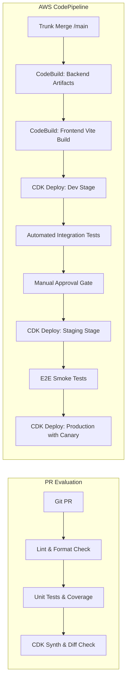

# Serverless SaaS Platform — Technical Notes & Guidelines

## 1. CI/CD Pipeline Design

The platform uses an automated deployment pipeline built natively with **AWS CodePipeline**, **AWS CodeBuild**, and **AWS CDK Pipelines**, supplemented by GitHub Actions for fast pull-request feedback loops.



### 1.1 Pipeline Stages
1. **Source Stage**: Listens to AWS CodeCommit or GitHub App webhooks on the `main` branch.
2. **Lint & Test Stage**:
   - **Backend**: Executes `ruff check`, `black --check`, `mypy`, and `pytest --cov=src --cov-fail-under=85`.
   - **Frontend**: Executes `eslint`, `tsc --noEmit`, and `vitest run`.
3. **Build & Package Stage**:
   - Synthesizes CDK CloudFormation templates (`cdk synth`).
   - Packages Python dependencies into Lambda Layers.
   - Compiles React frontend into production-ready static assets (`dist/`).
4. **Dev Deployment**: Deploys the full serverless stack to the `dev` AWS environment.
5. **Integration & Smoke Testing**: Runs synthetic API integration suites against live dev endpoints.
6. **Approval Gate & Production Promotion**:
   - Automated deployment to `staging`.
   - Manual approval gate with Slack notification before promoting to `prod`.
   - Production Lambda functions employ **AWS CodeDeploy canary traffic shifting** (`Canary10Percent5Minutes`) to detect errors before 100% rollout.

---

## 2. Testing Strategy

| Level | Scope | Frameworks / Tools | Coverage Target | Key Verification Areas |
| :--- | :--- | :--- | :--- | :--- |
| **Unit Tests** | Backend logic, pure functions, models | `pytest`, `pytest-mock`, `moto` | ≥ 85% line coverage | Pydantic validation, tiered billing calculations, geo-policy evaluator |
| **Unit / Component** | Frontend components & hooks | `vitest`, `React Testing Library` | ≥ 80% line coverage | UI state transitions, loading/error states, tenant context rendering |
| **Integration** | Service to AWS interactions | `pytest`, `LocalStack` / `moto` | Critical paths | DynamoDB single-table CRUD, EventBridge publishing, SQS batch consumer |
| **Contract / API** | HTTP endpoints & Auth | `pytest-requests`, `schemathesis` | 100% public endpoints | Cognito token validation, Geo-blocking headers, 403 vs 200 responses |
| **End-to-End (E2E)** | Full customer journeys | `Playwright` | Core tenant workflows | Tenant onboarding, usage meter ingestion, prediction chart rendering |

### 2.1 Backend Unit & Mocking Rules
- Use `moto` for mocking AWS services (`dynamodb`, `sqs`, `events`, `sagemaker-runtime`).
- Never make live network calls during unit test execution.
- Maintain mock fixtures in `backend/tests/conftest.py`.

### 2.2 Frontend Testing Pattern
- Test behavior, not implementation details (use `@testing-library/react`).
- Mock API responses with Mock Service Worker (`msw`) to simulate network latencies, HTTP 429 throttling, and HTTP 403 geolocation rejection.

---

## 3. Deployment Strategy & Traffic Management

### 3.1 Multi-Account AWS Architecture
To maintain absolute blast-radius isolation, the platform uses dedicated AWS accounts:
- **Core / Tooling Account**: Hosts CodePipeline, container registries, and shared artifacts.
- **Development Account (`dev`)**: Dedicated to developer experimentation and automated pipeline tests.
- **Staging Account (`staging`)**: Mirrors production configurations, quotas, and WAF rules.
- **Production Account (`prod`)**: Locked down with SCPs (Service Control Policies), strict least-privilege IAM, and audit logging.

### 3.2 Safe Lambda Rollouts with AWS CodeDeploy
Production Lambda deployments avoid abrupt 100% traffic replacement:
```typescript
// infrastructure/lib/compute-stack.ts snippet
const alias = new lambda.Alias(this, 'LiveAlias', {
  aliasName: 'live',
  version: lambdaFunction.currentVersion,
});

new codedeploy.LambdaDeploymentGroup(this, 'DeploymentGroup', {
  alias,
  deploymentConfig: codedeploy.LambdaDeploymentConfig.CANARY_10PERCENT_5MINUTES,
  alarms: [api5xxAlarm, lambdaErrorAlarm],
});
```

### 3.3 Frontend Deployment & CloudFront Invalidation
1. Build outputs (`dist/`) are uploaded to an Amazon S3 bucket configured with Server-Side Encryption (KMS).
2. CodeBuild triggers an AWS CloudFront cache invalidation (`/*`) to purge stale HTML and JS bundles.
3. Assets use content hashing in filenames (`assets/index.[hash].js`) to permit long-lived browser caching (`Cache-Control: max-age=31536000, immutable`).

---

## 4. Environment Management

### 4.1 Configuration Hierarchy
Configuration is resolved using a layered approach:
1. **SSM Parameter Store**: Hierarchical non-sensitive values (`/saas/{env}/api/base_url`, `/saas/{env}/billing/default_tier`).
2. **AWS Secrets Manager**: Sensitive secrets (`/saas/{env}/stripe/secret_key`, `/saas/{env}/webhook/signing_secret`).
3. **Environment Variables**: Injected by CDK during synthesis for static values (`STAGE`, `POWERTOOLS_SERVICE_NAME`, `LOG_LEVEL`).

### 4.2 `.env.example` Template

```env
# ------------------------------------------------------------------------------
# ENVIRONMENT & GENERAL SETTINGS
# ------------------------------------------------------------------------------
ENVIRONMENT=dev
AWS_REGION=us-east-1
POWERTOOLS_SERVICE_NAME=saas-platform-service
LOG_LEVEL=INFO

# ------------------------------------------------------------------------------
# COGNITO & AUTHENTICATION
# ------------------------------------------------------------------------------
COGNITO_USER_POOL_ID=us-east-1_exampleId
COGNITO_APP_CLIENT_ID=exampleAppClientId123456
COGNITO_ISSUER_URL=https://cognito-idp.us-east-1.amazonaws.com/us-east-1_exampleId

# ------------------------------------------------------------------------------
# DYNAMODB SINGLE-TABLE
# ------------------------------------------------------------------------------
DYNAMODB_TABLE_NAME=saas_platform_core_dev

# ------------------------------------------------------------------------------
# EVENT MESH & QUEUES
# ------------------------------------------------------------------------------
EVENT_BUS_NAME=saas-platform-eventbus-dev
USAGE_INGESTION_QUEUE_URL=https://sqs.us-east-1.amazonaws.com/123456789012/saas-usage-ingestion-dev
USAGE_INGESTION_DLQ_URL=https://sqs.us-east-1.amazonaws.com/123456789012/saas-usage-dlq-dev

# ------------------------------------------------------------------------------
# SAGEMAKER PREDICTION ENDPOINT
# ------------------------------------------------------------------------------
SAGEMAKER_ENDPOINT_NAME=saas-capacity-forecast-dev
SAGEMAKER_SERVERLESS_MAX_CONCURRENCY=20

# ------------------------------------------------------------------------------
# GEOLOCATION RESTRICTIONS (DEFAULT)
# ------------------------------------------------------------------------------
DEFAULT_BLOCKED_COUNTRIES=KP,IR,SY,CU
ENFORCE_GEOLOCATION=true

# ------------------------------------------------------------------------------
# FRONTEND VITE CLIENT ENVIRONMENT
# ------------------------------------------------------------------------------
VITE_API_BASE_URL=https://api-dev.saasplatform.example.com
VITE_COGNITO_REGION=us-east-1
VITE_COGNITO_USER_POOL_ID=us-east-1_exampleId
VITE_COGNITO_CLIENT_ID=exampleAppClientId123456
```

---

## 5. Version Control Workflow

The project follows a **Trunk-Based Development** workflow:
- The `main` branch is always deployable and protected against direct commits.
- Developers create short-lived feature branches named `feature/<ticket-id>-description` or `fix/<ticket-id>-description`.
- Branch lifetimes are restricted to 1–2 days max to minimize merge conflicts.

### 5.1 Pull Request Requirements
Every PR must satisfy:
1. **Automated Status Checks**: Passing linting, unit test coverage (≥ 85%), and CDK diff synthesis.
2. **Peer Review**: At least one senior peer review approval.
3. **Squash & Merge**: Enforces clean Git history following the [Conventional Commits](https://www.conventionalcommits.org/) format:
   - `feat(billing): add volume discount tiered rate calculation`
   - `fix(authorizer): correct country header extraction from cloudfront`
   - `infra(ddb): add GSI2 for date-range usage queries`

---

## 6. Common Pitfalls & How to Avoid Them

### 6.1 Lambda Cold Starts
- **Risk**: Python runtime initialization and heavy library imports (e.g., Pandas, Boto3 client instantiation) introduce p99 latency spikes (1.5s+).
- **Mitigation**:
  - Instantiate Boto3 clients and database connections *outside* the handler scope to reuse across warm executions.
  - Avoid importing large packages at module root if only needed conditionally.
  - Utilize **AWS Lambda Provisioned Concurrency** for the user-facing Custom Authorizer and synchronous ingestion API endpoints.

### 6.2 DynamoDB Hot Partitions & Write Throttling
- **Risk**: High-frequency usage ingestion for an enterprise tenant can exceed the 1,000 WCU partition limit on a single partition key (`TENANT#<tid>`).
- **Mitigation**:
  - Buffer high-frequency events in SQS and aggregate counts in memory before calling DynamoDB.
  - Implement **write-sharding** by appending a random suffix (0..N) to the partition/sort key during high-traffic events, then perform scatter-gather queries for reads.

### 6.3 Multi-Tenant Data Leakage
- **Risk**: A bug in an endpoint could accidentally allow Tenant A to view Tenant B's analytics or invoices.
- **Mitigation**:
  - **Zero Trust on Request Body**: Never trust a `tenant_id` provided in query parameters or POST bodies. Always overwrite `tenant_id` with the validated claim extracted from the Cognito token by the custom authorizer.
  - Encapsulate all DynamoDB data queries inside a strongly typed repository layer that explicitly injects `KeyConditionExpression("PK").eq(f"TENANT#{tenant_id}")`.

### 6.4 EventBridge Infinite Loops
- **Risk**: An event handler Lambda writes to DynamoDB or emits an event that accidentally retriggers the exact same EventBridge rule, causing exponential event loops and cloud bill spikes.
- **Mitigation**:
  - Separate raw usage event types from aggregated status change events (e.g., `UsageIngested` vs. `UsageThresholdExceeded`).
  - Add explicit detail-type filters on all EventBridge rules.
  - Set a max event retry count (e.g., 2) with immediate DLQ routing.

### 6.5 SageMaker Serverless Inference Latency
- **Risk**: SageMaker serverless endpoints take 3–8 seconds to cold start if uninvoked for a period of time.
- **Mitigation**:
  - Cache prediction results in DynamoDB (`PREDICTION#<metric>`) with a 6-hour TTL.
  - Serve cached forecasts to the dashboard immediately, and asynchronously trigger background refreshes if the cache is stale.
