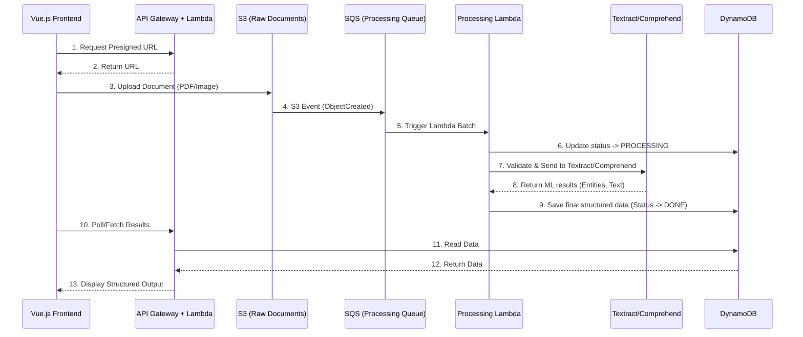

# Architecture Documentation

## 2.1 Chosen Architectural Pattern
**Event-Driven Serverless Architecture**

**Justification:** The project requires handling file uploads and heavy, asynchronous processing (OCR via Textract, ML via Comprehend/SageMaker). An event-driven serverless architecture (AWS Lambda, SQS, S3) is perfect because:
1. **Cost-Efficiency:** You only pay when documents are uploaded and processed.
2. **Scalability:** AWS automatically scales Lambdas and SQS to handle sudden spikes in document uploads without provisioning fixed server clusters.
3. **Decoupling:** Frontend uploads, basic API logic, and heavy ML processing are decoupled, increasing resilience.

## 2.2 Key Component Interactions
- **API Calls:** Frontend calls API Gateway -> Lambda for presigned S3 upload URLs and to retrieve processed document data from DynamoDB.
- **Direct Database Access:** Backend Lambdas interact directly with DynamoDB via `boto3` to store state and extracted metadata.
- **Event Buses / Triggers:** S3 upload triggers SQS. SQS triggers the main Processing Lambda.
- **Third-Party AWS Services:** Processing Lambda invokes AWS Textract (OCR) and Amazon Comprehend (Entity Extraction) synchronously or asynchronously depending on file size.

## 2.3 Data Flow

## 2.4 Scalability & Performance Strategy
- Building the system asynchronously via SQS prevents Lambda timeouts on large files.
- SQS acts as a buffer. Concurrency limits can be set on the Processing Lambda to prevent overwhelming downstream APIs or custom SageMaker endpoints.
- DynamoDB handles virtually unlimited read/write throughput (used with On-Demand capacity).
- Vue.js static assets can be offloaded to CloudFront + S3 for global edge caching.

## 2.5 Security Considerations
- **Authentication & Authorization:** Use Amazon Cognito (or equivalent Bearer tokens via API Gateway custom authorizer) to secure endpoints.
- **Data Protection:** All S3 buckets block public access. Encryption at rest enabled on S3 and DynamoDB (KMS). 
- **API Security:** API Gateway rate limiting (WAF) to prevent DDoS. Presigned URLs expire in 5-10 minutes.
- **Secret Management:** Sensitive API keys/Config stored in AWS Secrets Manager or Parameter Store, injected into Lambda at runtime.

## 2.6 Error Handling & Logging Philosophy
- **Logging:** Structured JSON logging in Python Lambdas pushed to CloudWatch. Include correlation IDs (like document UUID) to trace entire lifecycles across components.
- **Error Handling:** 
  - API endpoints return standardized JSON errors (e.g., `{"error": "Validation failed", "code": 400}`).
  - Processing Lambda handles internal faults by raising exceptions, sending messages causing failure to a Dead Letter Queue (DLQ) for manual inspection.
