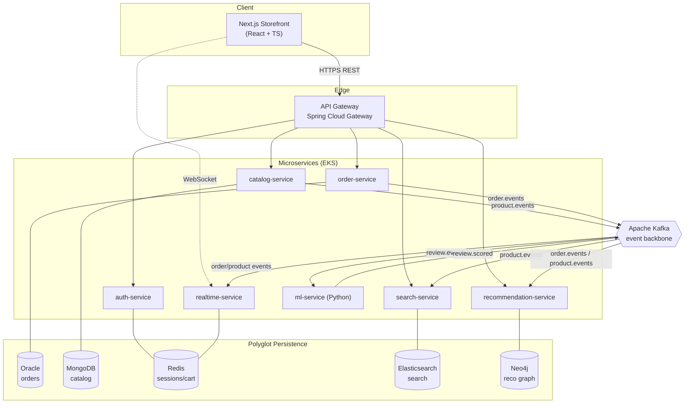
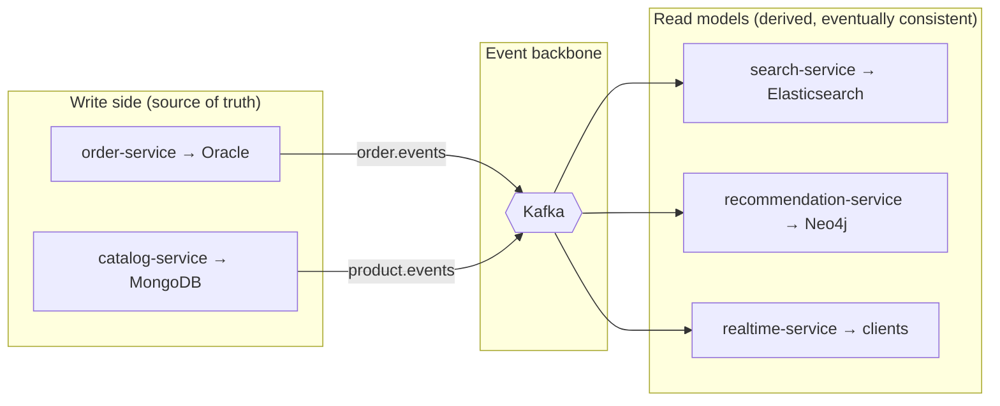
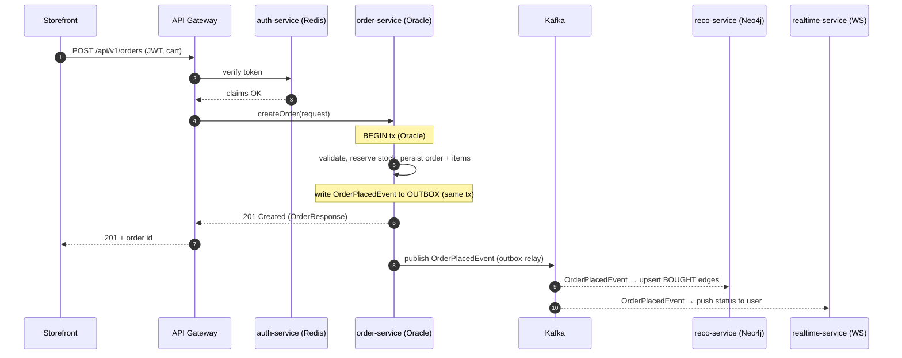
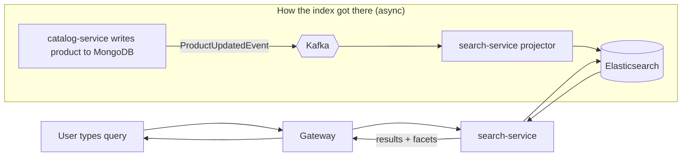
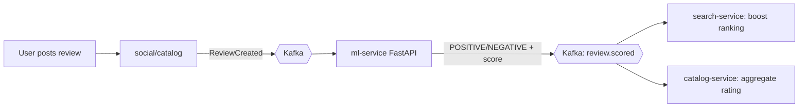
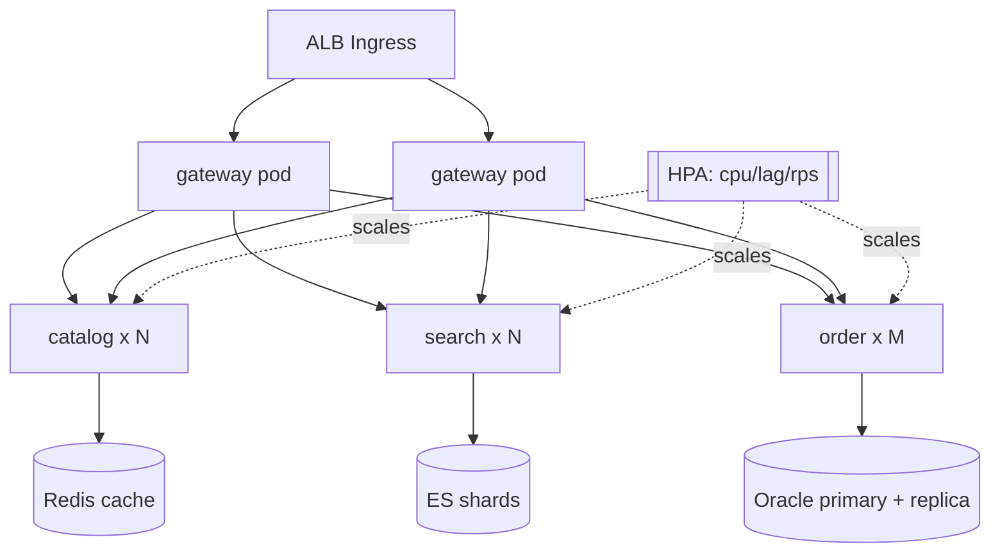
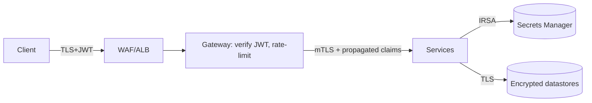
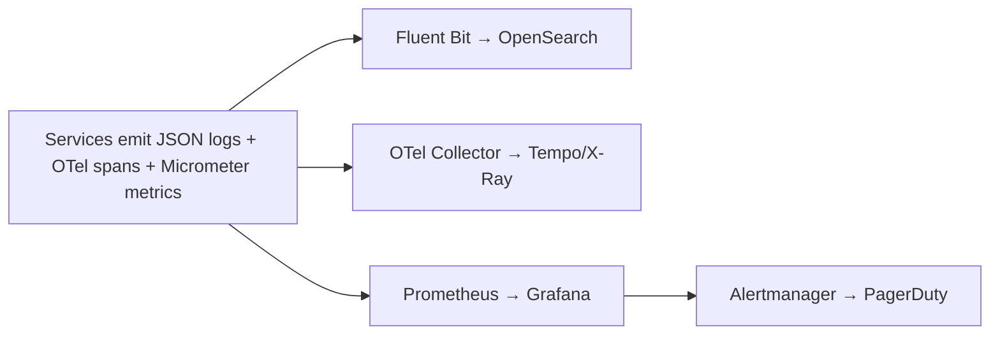

# ShopFlow — Architecture

> Polyglot-persistence, event-driven microservices for a complete e-commerce platform.

---

## 2.1 Chosen Architectural Pattern

**Event-Driven Microservices with Polyglot Persistence (CQRS-flavored).**

The platform is decomposed into independently deployable services aligned to
**bounded contexts** (orders, catalog, search, identity, recommendations,
real-time, ML). Services integrate **asynchronously through Kafka** and expose
**synchronous REST** only at their edges. Each service owns a private datastore
chosen for its workload — this is the defining requirement of the brief.

**Why this pattern fits:**

- **Heterogeneous workloads.** Transactional orders (Oracle/ACID), document
  catalog (MongoDB), search (Elasticsearch), and graph recommendations (Neo4j)
  have fundamentally different consistency, query, and scaling profiles. A
  single store would be a poor compromise for all four. Microservices let each
  own the *right* engine.
- **Independent scaling.** Catalog reads and search dwarf order writes by orders
  of magnitude. Separate services scale (and fail) independently.
- **Loose coupling via events.** Search index, recommendation graph, and the
  real-time feed are **read-models projected from events**. The write side never
  blocks on them, and new consumers (e.g., analytics) attach without touching
  producers — classic CQRS read-model derivation.
- **Team & deploy autonomy.** Each context ships on its own cadence behind the
  gateway, matching an org that grows past a single team.

**Why not the alternatives:** a *layered monolith* couldn't host five database
engines cleanly and would couple deploys; *pure serverless* fits spiky glue work
but not always-on stateful services with long-lived DB pools and Kafka consumer
groups (though ML inference and image processing are reasonable Lambda/Fargate
candidates later). We therefore choose microservices on EKS, keeping each
service a **modular, layered application internally** (api → service → repository).

---

## 2.2 Key Component Interactions

| Mechanism            | Where used | Example |
|----------------------|-----------|---------|
| **Synchronous REST** | Client → Gateway → service | Browse catalog, place order, query search |
| **API Gateway**      | Single edge | AuthN (JWT verify), routing, CORS, rate-limit, request-id |
| **Async events (Kafka)** | Service ↔ service | `OrderPlacedEvent` fans out to reco + realtime |
| **WebSocket push**   | realtime-service → client | Order status, price drop, low-stock alerts |
| **Direct DB access** | Service → *its own* DB only | order-service → Oracle; never cross-service |
| **HTTP to ML**       | ingestion → ml-service | Batch/stream review scoring |

**Rules of engagement**
1. A service may write **only** to its own database.
2. Services never call each other **synchronously** for write paths — they emit
   events. (Read-time enrichment may use a cached, gateway-aggregated call.)
3. Every event carries `eventId`, `aggregateId`, `occurredAt`, `version`,
   `correlationId` for idempotency and tracing.
4. Topics are **versioned & schema-governed** (Avro/JSON Schema in registry).

---

## 2.3 Data Flow

### A. Place-an-order (write path, ACID + async fan-out)

The HTTP response returns as soon as Oracle commits; recommendation and
real-time updates happen **after** commit via the **transactional outbox**, so
the user is never blocked on downstream systems and events are never lost.

### B. Search a product (read path, derived index)

### C. Review sentiment (ML loop)

---

## 2.4 Scalability & Performance Strategy

- **Horizontal, per-service scaling on EKS** via HPA on CPU/RPS/lag. Stateless
  services scale freely; Kafka consumer groups scale to the partition count.
- **Read/write separation (CQRS).** Heavy read traffic (catalog/search) hits
  derived stores and caches, never the transactional Oracle core.
- **Caching tiers.** Redis cache-aside for catalog/detail & session/cart; CDN
  for static + cacheable catalog responses; HTTP `ETag`/`Cache-Control`.
- **Right datastore = right scaling knob.** ES sharding for search; MongoDB
  sharded by category/tenant; Neo4j read replicas for reco queries; Oracle
  partitioning + read replicas for reporting.
- **Async by default.** Spikes (flash sales) are absorbed by Kafka buffering;
  consumers drain at their own pace; backpressure isolates slow consumers.
- **Connection hygiene.** HikariCP pools sized per service; reactive gateway
  (Netty) for high-concurrency edge fan-in.
- **Partitioning for ordering.** Events keyed by `aggregateId` (e.g., orderId)
  guarantee per-aggregate ordering while allowing parallelism across keys.

---

## 2.5 Security Considerations

**Authentication & authorization**
- OAuth2/OIDC password & refresh flows in **auth-service**; short-lived JWT
  access tokens (15 min) + Redis-backed rotating refresh tokens.
- **Gateway verifies JWT** once at the edge; signed claims (roles/scopes)
  propagate downstream; services enforce method-level authorization
  (`@PreAuthorize`).
- Service-to-service: mTLS via a mesh (Istio/Linkerd) + SPIFFE identities.

**Data protection**
- TLS 1.2+ everywhere (ingress, intra-mesh, DB connections).
- Encryption at rest: Oracle TDE, EBS/RDS KMS, MongoDB & ES encrypted volumes.
- PII minimization & tokenization; **payment data never stored** (PSP token only).
- Field-level encryption for sensitive attributes; GDPR delete via event-driven erasure.

**API security**
- Input validation (Bean Validation / Zod) at every boundary; output encoding.
- Rate limiting & quotas at gateway (Redis token bucket); WAF on ALB.
- CORS allow-list; security headers (CSP, HSTS, X-Content-Type-Options).
- Idempotency keys on POST `/orders` to prevent double-charge on retry.

**Secret management**
- **No secrets in images or git.** AWS Secrets Manager / SSM Parameter Store,
  surfaced via External Secrets Operator into K8s Secrets; IRSA for AWS access.
- Rotation policies; sealed-secrets/SOPS for any in-repo encrypted config.

---

## 2.6 Error Handling & Logging Philosophy

**Errors**
- **Uniform contract.** Every service returns the shared `ApiResponse` envelope;
  a `@RestControllerAdvice` `GlobalExceptionHandler` maps exceptions to RFC-7807
  problem details with a stable `code`, `message`, `traceId`, and field errors.
- **Fail fast at boundaries, degrade gracefully downstream.** Validation errors →
  `400`; auth → `401/403`; not found → `404`; conflict/idempotency → `409`;
  upstream/circuit-open → `503`.
- **Resilience.** Resilience4j circuit breakers, timeouts, bounded retries with
  jitter on outbound calls; **never** retry non-idempotent writes blindly.
- **Async failures** route to **dead-letter topics** with replay tooling;
  consumers are **idempotent** (dedupe by `eventId`).

**Logging & observability**
- **Structured JSON logs** (one event per line) to stdout → Fluent Bit →
  OpenSearch/CloudWatch. No secrets/PII in logs.
- **Correlation:** `correlationId`/`traceId` generated at gateway, propagated via
  headers and event metadata; W3C Trace Context + OpenTelemetry spans.
- **Metrics:** Micrometer → Prometheus; RED (rate/errors/duration) per service +
  Kafka consumer lag + DB pool saturation. Grafana dashboards & SLO alerts.
- **Levels:** ERROR = actionable/paging; WARN = degraded/retried; INFO =
  lifecycle & business events; DEBUG = local/troubleshooting only.

