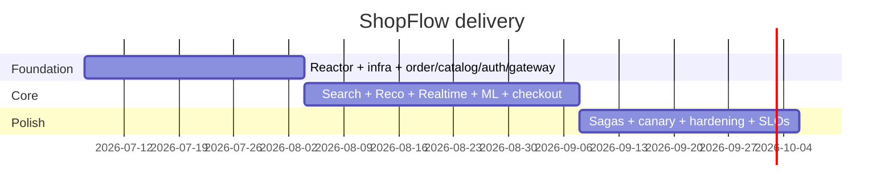

# ShopFlow — Project Plan

> **Multi-Database E-Commerce Platform** · polyglot persistence · event-driven microservices
> Stack: Java 21 · Spring Boot 3 · Oracle · MongoDB · Redis · Elasticsearch · Neo4j · Kafka ·
> Python ML · Next.js / React / TypeScript · AWS EKS · Jenkins · Terraform

---

## 1. Overview

ShopFlow is a complete e-commerce platform that deliberately uses **the right
database for each job** rather than forcing one store to do everything:

- **Oracle** owns money and inventory truth (orders, payments, stock ledger).
- **MongoDB** owns the product catalog (flexible, deeply-nested documents).
- **Redis** owns ephemeral state (sessions, carts, rate limits, hot caches).
- **Elasticsearch** owns search and faceted browse.
- **Neo4j** powers graph-based "customers who bought X" recommendations.
- **Kafka** is the integration backbone; it decouples services and feeds
  real-time projections (search index, recommendation graph, WebSocket push).
- **Python ML** scores review sentiment and feeds it back into ranking.

Each service owns its schema; no service reaches into another's database.
Cross-service consistency is achieved through **events**, not shared tables.

---

## 1.1 Project File Structure

```text
1Multi-Database-E-Commerce/
├── README.md
├── Opus-4.8.txt                      # model marker (per brief)
├── .env.example                      # environment template
├── .editorconfig
├── .gitignore
├── docker-compose.yml                # local polyglot stack
├── Jenkinsfile                       # CI/CD entrypoint
│
├── docs/
│   ├── PROJECT-PLAN.md               # ← this file
│   ├── ARCHITECTURE.md
│   └── TECH-NOTES.md
│
├── backend/                          # Maven multi-module reactor
│   ├── pom.xml                       # parent POM (dependency mgmt, plugins)
│   ├── checkstyle.xml                # shared lint rules
│   │
│   ├── common/                       # shared library (no web layer)
│   │   ├── pom.xml
│   │   └── src/main/java/com/shopflow/common/
│   │       ├── dto/ApiResponse.java          # envelope + error model
│   │       ├── error/GlobalExceptionHandler.java
│   │       ├── error/ApiException.java
│   │       └── event/OrderPlacedEvent.java   # cross-service event schema
│   │
│   ├── api-gateway/                  # Spring Cloud Gateway (edge)
│   │   ├── pom.xml
│   │   ├── Dockerfile
│   │   └── src/main/
│   │       ├── java/com/shopflow/gateway/ApiGatewayApplication.java
│   │       └── resources/application.yml      # routes, CORS, rate limit
│   │
│   ├── order-service/                # ✅ FULLY IMPLEMENTED reference service
│   │   ├── pom.xml
│   │   ├── Dockerfile
│   │   └── src/
│   │       ├── main/java/com/shopflow/order/
│   │       │   ├── OrderServiceApplication.java
│   │       │   ├── api/OrderController.java
│   │       │   ├── api/dto/CreateOrderRequest.java
│   │       │   ├── api/dto/OrderResponse.java
│   │       │   ├── service/OrderService.java
│   │       │   ├── domain/Order.java          # JPA entity (Oracle)
│   │       │   ├── domain/OrderItem.java
│   │       │   ├── domain/OrderStatus.java
│   │       │   ├── repository/OrderRepository.java
│   │       │   └── messaging/OrderEventPublisher.java
│   │       ├── main/resources/
│   │       │   ├── application.yml
│   │       │   └── db/migration/              # Flyway (Oracle DDL)
│   │       │       ├── V1__create_orders.sql
│   │       │       └── V2__seed_reference.sql
│   │       └── test/java/com/shopflow/order/
│   │           └── service/OrderServiceTest.java
│   │
│   ├── catalog-service/              # MongoDB — product catalog
│   │   ├── pom.xml · Dockerfile
│   │   └── src/main/java/com/shopflow/catalog/
│   │       ├── CatalogServiceApplication.java
│   │       ├── api/CatalogController.java
│   │       ├── domain/Product.java            # @Document
│   │       └── repository/ProductRepository.java
│   │
│   ├── search-service/              # Elasticsearch — search & facets
│   │   └── src/main/java/com/shopflow/search/ …
│   ├── auth-service/                # Redis — sessions / JWT
│   │   └── src/main/java/com/shopflow/auth/ …
│   ├── recommendation-service/      # Neo4j — collaborative filtering
│   │   └── src/main/java/com/shopflow/reco/ …
│   └── realtime-service/            # Kafka consumer + WebSocket push
│       └── src/main/java/com/shopflow/realtime/ …
│
├── ml-service/                      # Python FastAPI — sentiment analysis
│   ├── app/main.py
│   ├── app/sentiment.py
│   ├── requirements.txt
│   └── Dockerfile
│
├── frontend/                        # Next.js 14 (App Router) storefront
│   ├── package.json · tsconfig.json · next.config.js
│   ├── .eslintrc.json · .prettierrc · Dockerfile
│   └── src/
│       ├── app/products/page.tsx
│       ├── components/ProductList.tsx         # data-fetch + loading/error
│       ├── lib/api.ts                         # typed API client
│       └── types/catalog.ts
│
└── infrastructure/
    ├── terraform/                   # AWS: VPC, EKS, ECR, RDS-Oracle, MSK …
    │   ├── main.tf · variables.tf · outputs.tf
    └── k8s/                         # rendered manifests / Helm values
        ├── namespace.yaml
        ├── order-service.yaml
        └── ingress.yaml
```

**Module boundaries (one-paragraph rationale).** The backend is a Maven reactor
with a single parent POM centralizing dependency versions and the Spring Boot
BOM, so every service upgrades in lockstep. `common` is a thin library — DTO
envelope, error contract, and **event schemas** — and explicitly contains *no*
web/persistence beans so it never drags transitive infra onto a consumer.
Frontend, ML, and infra are siblings, each with its own toolchain, so they can
be built and deployed independently.

---

## 1.2 Implementation TODO List

### Phase 1 — Foundation (HIGH priority) — ✅ complete
- [x] Initialize Maven reactor: parent POM, `common`, Checkstyle wiring, `mvnw` wrapper.
- [x] Stand up `docker-compose.yml` (Oracle, Mongo, Redis, ES, Neo4j, Kafka) — all healthy.
- [x] **order-service**: JPA entities, Flyway Oracle migrations, full CRUD + lifecycle + idempotency, bean-validation, service, repository.
- [x] **catalog-service**: `Product` document, repository, list/detail/search/categories, seed catalog.
- [x] **api-gateway**: route table, CORS, Redis rate limit, HS256 JWT verification.
- [x] **auth-service**: register/login/refresh/me/logout, BCrypt, Redis-backed users & refresh tokens.
- [x] Event contracts in `common` (`OrderPlaced`, `ProductUpdated`, `ReviewCreated`, `ReviewScored`).
- [x] `ApiResponse` envelope + `GlobalExceptionHandler` (`@RestControllerAdvice`) wired across services.
- [x] Frontend: Next.js App Router, typed API client, product list + detail.
- [x] CI: Jenkins pipeline lint→test→build for backend + frontend; per-service Docker images to ECR.

### Phase 2 — Core features (MEDIUM priority) — ✅ core done
- [x] **search-service**: consume `ProductUpdatedEvent`, project into Elasticsearch; query API with category + price facets + pagination.
- [x] **recommendation-service**: consume `OrderPlacedEvent`, build `(:Customer)-[:BOUGHT]->(:Product)` graph; also-bought / personalised / trending queries in Neo4j.
- [x] **realtime-service**: Kafka→WebSocket (STOMP) bridge for order + product updates.
- [x] **ml-service**: FastAPI sentiment endpoint + Kafka pipeline (`ReviewCreated` → score → `ReviewScored`).
- [x] Cart & checkout flow end-to-end (client cart → order-service → payment → events).
- [x] Social feature: reviews + ratings + async sentiment (wishlists/follow are future).
- [x] Transactional-outbox table + idempotent consumers (MERGE / dedup by id); idempotency key on `POST /orders`.
- [x] Structured logs + correlation-id (traceId/spanId) log pattern across services. *(Full OpenTelemetry export: future.)*
- [x] Terraform skeleton: VPC, EKS, ECR per service (MSK/ElastiCache/OpenSearch modules stubbed).
- [x] Kubernetes manifests: Deployment + Service + HPA + PDB + Ingress (Helm values: future).

### Phase 3 — Polish & optimization (LOWER priority)
- [ ] Saga/compensation for checkout (reserve stock → charge → confirm; compensate on failure).
- [ ] Read-model caching + cache-aside invalidation via events; Redis cluster mode.
- [ ] Search relevance tuning: synonyms, boosting by sentiment & popularity, A/B framework.
- [ ] Recommendation quality: time-decay, ALS/GraphSDS, cold-start fallback to catalog popularity.
- [ ] Blue/green or canary rollout (Argo Rollouts); progressive delivery + automated rollback.
- [ ] Cost/perf: Oracle partitioning & index review, ES ILM, Kafka tiered storage, right-sizing.
- [ ] Security hardening: mTLS service mesh, OPA policies, image signing (cosign), SBOM.
- [ ] Load & chaos testing (k6 + Litmus); SLO dashboards & error-budget alerting.
- [ ] DR runbooks: cross-region backups, RPO/RTO targets, restore drills.

---

## 1.3 Service / Datastore / Port matrix

| Service                  | Datastore      | Sync API | Consumes (Kafka)            | Produces (Kafka)        | Port |
|--------------------------|----------------|----------|-----------------------------|-------------------------|------|
| api-gateway              | —              | REST     | —                           | —                       | 8080 |
| auth-service             | Redis          | REST     | —                           | `user.events`           | 8081 |
| catalog-service          | MongoDB        | REST     | —                           | `product.events`        | 8082 |
| order-service            | Oracle         | REST     | `payment.events`            | `order.events`          | 8083 |
| search-service           | Elasticsearch  | REST     | `product.events`            | —                       | 8084 |
| recommendation-service   | Neo4j          | REST     | `order.events`,`product.events` | —                   | 8085 |
| realtime-service         | Redis (pub/sub)| WS       | `order.events`,`product.events` | —                   | 8086 |
| ml-service               | — (model)      | REST     | `review.events`             | `review.scored`         | 8000 |

---

## 1.4 Milestones (indicative)



See [`ARCHITECTURE.md`](ARCHITECTURE.md) for component interaction & data flow,
and [`TECH-NOTES.md`](TECH-NOTES.md) for CI/CD, testing, and deployment detail.
