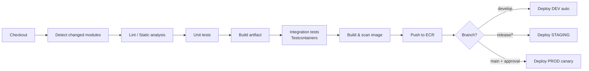
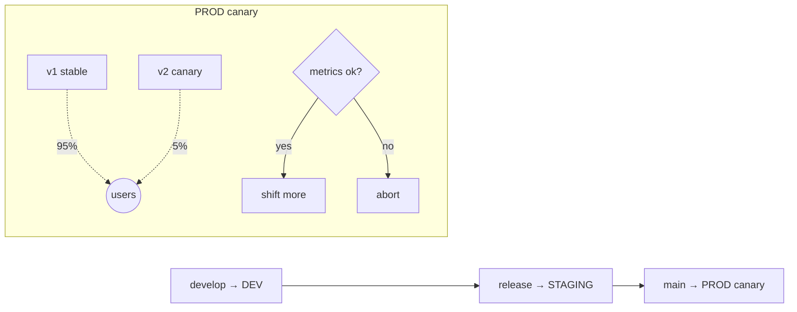
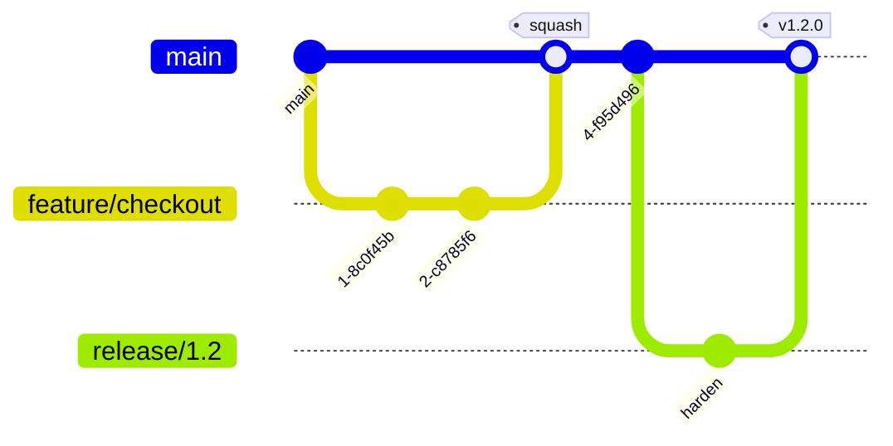

# ShopFlow — Technical Notes

Actionable engineering guidance for building, testing, shipping, and operating
the platform.

---

## 3.1 CI/CD Pipeline Design

**Tooling:** Jenkins (declarative pipeline, see [`/Jenkinsfile`](../Jenkinsfile)) →
ECR → EKS. Terraform runs in a separate infra pipeline (plan on PR, apply on
merge with manual approval for prod).

**Stages (per service, monorepo with change detection):**

1. **Lint / static analysis** — Checkstyle + Spotless (Java), ESLint + Prettier
   + `tsc --noEmit` (frontend), `ruff`/`black` (Python). Fail fast, cheap.
2. **Unit tests** — JUnit 5, Vitest/Jest, pytest. Quality gate on coverage.
3. **Build** — `mvn -pl <changed> -am package`; `npm run build`; Python wheel.
4. **Integration tests** — **Testcontainers** spin real Oracle/Mongo/Redis/ES/
   Kafka/Neo4j; verify repository + event round-trips. This is the highest-value
   gate for a polyglot system.
5. **Containerize & scan** — multi-stage Docker; Trivy/Grype image scan; **fail
   on HIGH/CRITICAL**; generate SBOM (Syft); sign with cosign.
6. **Publish** — tag `:<git-sha>` + `:<semver>` to ECR.
7. **Deploy** — Helm/Kustomize to EKS. `develop`→dev (auto), `release/*`→staging,
   `main`→prod via **canary** (Argo Rollouts) with automated metric analysis &
   rollback. Quality gates (SonarQube, coverage, security) block promotion.

**Only build/test what changed** (monorepo path filters) to keep PR feedback fast.

---

## 3.2 Testing Strategy

| Layer | Tooling | Target | What it proves |
|-------|---------|--------|----------------|
| **Unit** | JUnit 5 + Mockito · Vitest/RTL · pytest | **80%** line / **70%** branch on domain & services | Business logic in isolation |
| **Slice** | `@DataJpaTest`, `@WebMvcTest`, `@DataMongoTest` | key slices | Persistence mappings, controller contracts |
| **Integration** | **Testcontainers** (Oracle, Mongo, Redis, ES, Kafka, Neo4j) | critical paths | Real DB queries, migrations, event publish/consume |
| **Contract** | Spring Cloud Contract / Pact | every producer↔consumer | Event & REST compatibility across services |
| **E2E** | Playwright (UI) + REST flows | top user journeys | Browse → cart → checkout → order status |
| **Non-functional** | k6 (load), Litmus (chaos), OWASP ZAP (security) | pre-release | SLOs, resilience, vuln baseline |

**Principles**
- **Test pyramid**, not ice-cream cone: many fast unit tests, fewer integration,
  a handful of E2E.
- **Testcontainers over mocks** for anything that touches a datastore — polyglot
  persistence bugs (migrations, mappings, query semantics) hide in the real engine.
- **Deterministic events:** assert on consumer side using `Awaitility` with
  bounded timeouts; key by `eventId` to test idempotency (publish twice → one effect).
- **Coverage is a floor, not a goal**; gate on it but review for meaningful asserts.
- Seed data via Flyway/`init` scripts shared between local compose and tests.

---

## 3.3 Deployment Strategy

**Containerization.** Every service ships as a minimal multi-stage image:
- Java: build on `maven:3.9-eclipse-temurin-21`, run on
  `eclipse-temurin:21-jre-jammy` (or distroless) — **non-root**, read-only FS,
  layered jars for cache reuse.
- Frontend: build then serve via Next.js standalone output on a slim Node image.
- Python: `python:3.12-slim`, `pip install --no-cache-dir`, non-root.

**Orchestration — AWS EKS.**
- One **Deployment per service**, `replicas`≥2, **HPA** on CPU + custom metrics
  (RPS, Kafka lag), **PodDisruptionBudget**, anti-affinity across AZs.
- **readiness/liveness/startup probes**; graceful shutdown honoring Kafka
  rebalance & in-flight HTTP.
- **Resource requests/limits** per service; cluster-autoscaler/Karpenter for nodes.
- **Ingress:** AWS Load Balancer Controller (ALB) → gateway only; internal
  services are `ClusterIP` behind the mesh.
- **Config & secrets:** ConfigMaps for non-secret config; External Secrets
  Operator pulls from Secrets Manager; **IRSA** for pod-level AWS perms.

**Managed data services (recommended for prod):** RDS/Oracle (or self-managed on
EC2 with proper licensing), **MSK** for Kafka, **ElastiCache** for Redis,
**OpenSearch Service** for search, MongoDB Atlas or DocumentDB, Neo4j Aura/EC2.
Keep stateful systems **off** the EKS data plane where a managed option exists.

**Rollout:** canary via **Argo Rollouts** — shift 5%→25%→50%→100% gated on error
rate & latency; auto-rollback on breach. DB migrations run as **pre-deploy Jobs**,
**backward-compatible** (expand/contract) so canary old+new coexist.

---

## 3.4 Environment Management

- **Profiles:** Spring `local|docker|dev|staging|prod`; Next.js `NEXT_PUBLIC_*`;
  per-env Helm `values-<env>.yaml`; per-env Terraform workspaces/dirs.
- **Config hierarchy:** sane defaults in code → overridden by ConfigMap → secrets
  from Secrets Manager. **Twelve-factor:** all environment-specific values come
  from the environment, never hard-coded.
- **Parity:** local `docker-compose` mirrors prod topology (same engines/versions)
  so "works on my machine" ≈ "works in prod".
- **Promotion:** the **same image** flows dev→staging→prod; only config differs.
- See [`.env.example`](../.env.example) for the full variable catalog. Local dev
  copies it to `.env`; CI/CD injects via Secrets Manager + ConfigMaps.

---

## 3.5 Version Control Workflow

**Recommended: trunk-based with short-lived feature branches + release branches.**

- `main` is always releasable; protected (PR + green CI + ≥1 review + signed commits).
- `feature/*` branch from `main`, **short-lived (<2 days)**, squash-merge via PR.
- `release/x.y` cut for staging hardening; hotfixes branch from it and cherry-pick to `main`.
- **Conventional Commits** (`feat:`, `fix:`, `chore:` …) drive automated semver &
  changelog. Tags `vX.Y.Z` trigger prod pipeline.
- **Why not full Gitflow?** Long-lived `develop` + numerous branches add merge
  overhead that fights continuous delivery; trunk-based keeps integration
  continuous and batch sizes small — ideal for many independently-deployed
  services. Feature flags decouple deploy from release for incomplete work.

---

## 3.6 Common Pitfalls (this stack)

**Polyglot persistence / distributed data**
- **Dual-write trap.** Writing to a DB *and* publishing to Kafka in two steps
  loses events on crash. → **Transactional outbox** (write event in the same DB
  tx; relay to Kafka). order-service ships this pattern.
- **Expecting cross-store consistency.** Search/reco are **eventually
  consistent**; design UI for it (optimistic updates, "indexing…" states). Never
  read your own write from a derived store immediately.
- **Distributed transactions.** No 2PC across Oracle+Mongo+Kafka. Use **sagas**
  with compensation for checkout (reserve→charge→confirm / compensate).

**Oracle specifics**
- Driver/licensing: use the official `ojdbc11`; mind container licensing — prefer
  managed/RDS. Sequences vs identity, `NUMBER` precision, and **CLOB/BLOB**
  mapping bite JPA users. Test migrations against **real Oracle** (Testcontainers),
  not H2 — dialect differences are silent and dangerous.

**Kafka**
- **Idempotent consumers** (dedupe by `eventId`) — at-least-once means duplicates.
- **Partition key = ordering boundary.** Key by `aggregateId` or lose per-entity
  ordering. Plan partition count up front (hard to shrink).
- **Schema evolution:** use a registry + backward-compatible changes; never
  repurpose a field. Add DLQ + replay from day one.

**Elasticsearch**
- Mapping explosions & dynamic fields; define explicit mappings. Reindex strategy
  (alias swap) for mapping changes. It's a **read model**, not a system of record.

**MongoDB**
- Schema-less ≠ schema-free: enforce a versioned schema in code + validators.
  Avoid unbounded array growth in documents; index for actual query shapes.

**Neo4j**
- Recommendation queries can fan out badly; bound traversal depth, use GDS
  projections, and cache hot "also-bought" results in Redis.

**Redis**
- It's a cache/session store — assume **data can vanish**; never the only home for
  anything you can't rebuild. Set TTLs; guard against stampede (locking/jitter).

**Operational / cross-cutting**
- **Local env weight.** Six engines + Kafka is heavy; provide compose profiles and
  document minimum RAM. Don't make every dev run everything.
- **Observability or bust.** With this many moving parts, **correlation IDs +
  distributed tracing + consumer-lag dashboards are not optional**.
- **Config sprawl.** Centralize the variable catalog (`.env.example`) and validate
  required vars at boot (fail fast on missing config).
