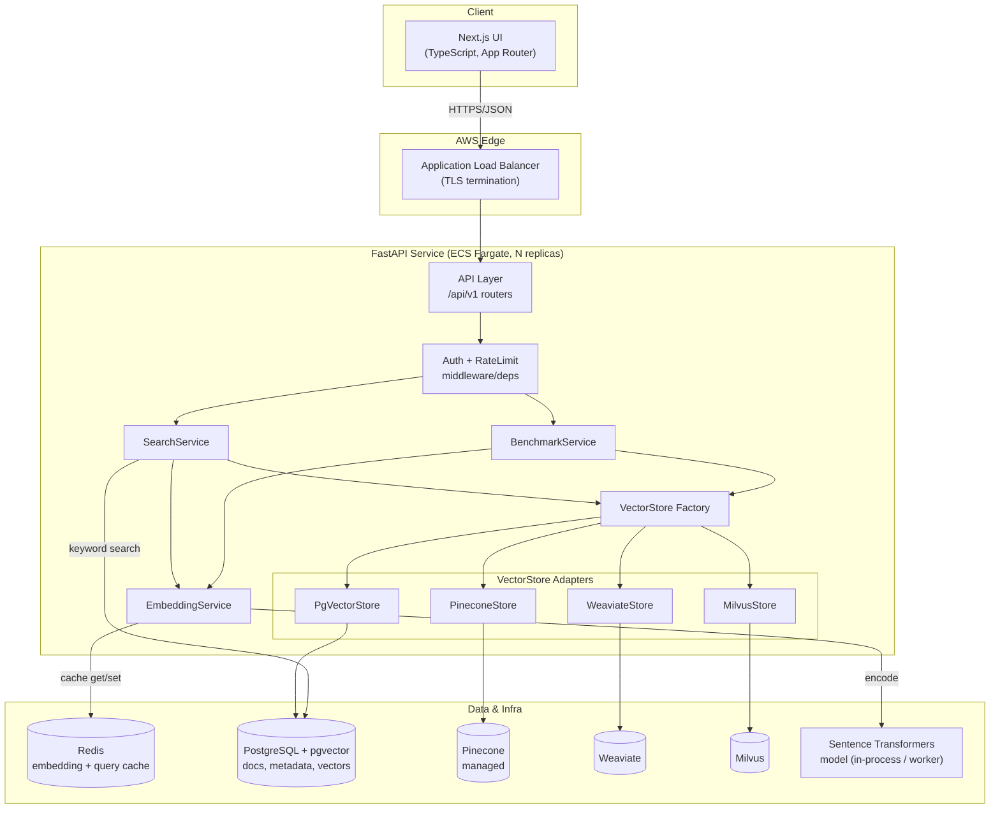
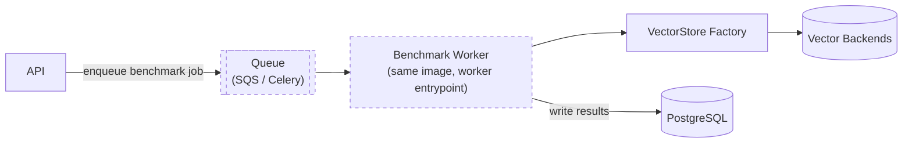
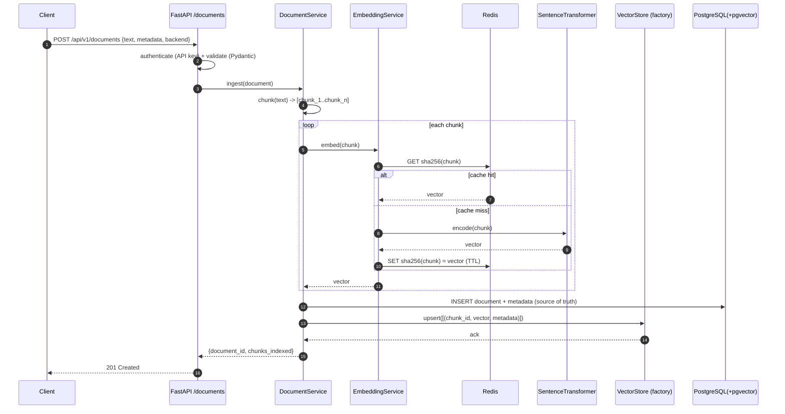
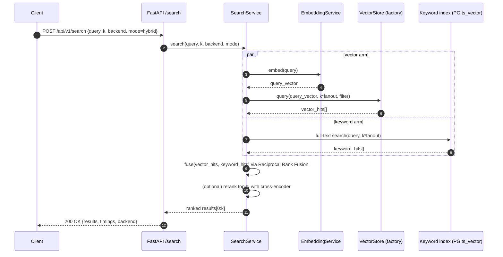
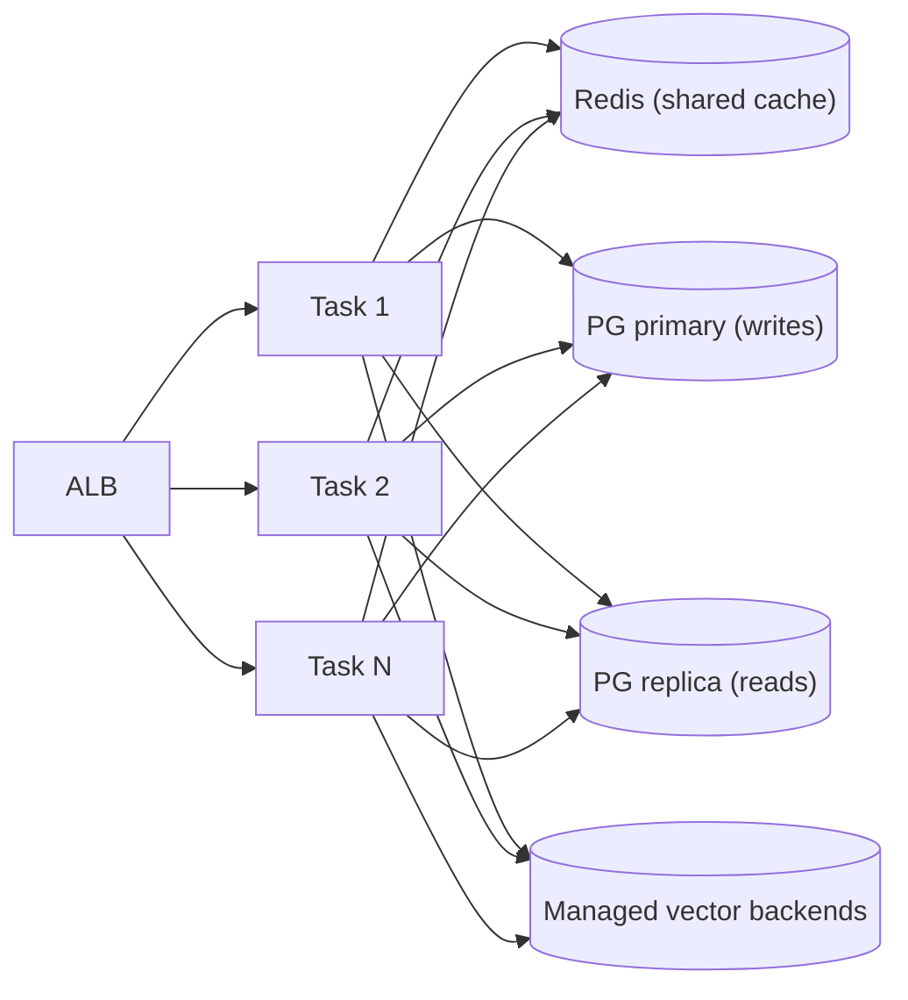
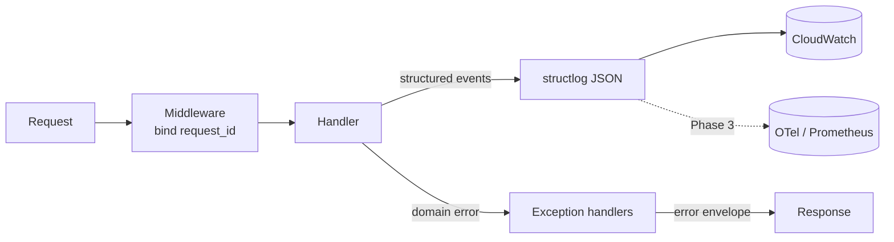

# Vector Search Platform — Architecture

> How the system is structured, how the pieces talk, how data flows, and how it stays fast,
> secure, and observable as it grows.

---

## 2.1 Chosen Architectural Pattern

**Pattern: Modular (layered) monolith with a pluggable-adapter core, deployed as stateless containers.**

The backend is a single FastAPI service organized into clear layers:

```
API layer (routers)  →  Service layer (orchestration)  →  Adapter layer (VectorStore backends)
                                     │
                                     └→ Infrastructure (Postgres, Redis, embedding model)
```

The defining design decision is the **`VectorStore` Strategy/Adapter boundary**: pgvector, Pinecone,
Weaviate, and Milvus all sit behind one abstract contract. Services never import a concrete backend.

### Why this pattern (and not microservices)?

- **The domain is naturally cohesive.** Ingest, embed, search, and benchmark share the same models,
  the same embedding pipeline, and the same backend abstraction. Splitting them into services would
  add network hops and serialization cost without a bounded-context reason to.
- **Comparability requires a single control plane.** Benchmarks must run identical queries through
  identical code paths; a monolith guarantees that by construction.
- **Statelessness gives us horizontal scale anyway.** The container holds no session state, so we get
  most of the scaling benefit of microservices (run N replicas behind an ALB on ECS) without the
  operational tax.
- **The adapter seam is where evolution happens.** New backends are new files, not new services. If a
  backend ever needs isolation (e.g., a GPU embedding worker), we can peel it off later — the seam is
  already there.

> Rule of thumb applied here: *start as a well-factored monolith; extract services only when a
> component has a genuinely independent scaling or deployment axis.* The one component with a distinct
> scaling axis — embedding generation — is isolated behind `EmbeddingService` and can become an async
> worker (SQS/Celery) in Phase 3 without touching callers.

> **Implementation note.** Alongside the four production backends there is a fifth, real
> `memory` backend (in-process exact-cosine search) — proof that "add a backend = one file + one
> factory line," and the zero-dependency default for local dev and the test suite. Likewise the
> `EmbeddingService` is provider-pluggable (Sentence Transformers *or* a deterministic hashing
> embedder), so the whole system runs fully offline. The diagrams below show the production path.

---

## 2.2 Key Component Interactions



**Communication styles used:**

| Interaction | Mechanism | Notes |
|-------------|-----------|-------|
| UI → API | HTTPS / JSON (REST) | Versioned under `/api/v1`, typed client in `lib/api.ts` |
| API → Services | In-process function calls | Async (`await`), no network hop |
| Services → Backends | In-process via `VectorStore` ABC | Concrete adapter chosen by factory at request time |
| Adapters → Vector DBs | Native SDK / SQL over TCP | pgvector via SQLAlchemy async; others via vendor SDKs |
| Services → Redis | Async Redis client | Embedding cache (content hash → vector), query cache |
| Embedding | In-process model (Phase 1) → async worker (Phase 3) | Seam preserved for future queue extraction |

There is **no message bus in Phase 1** — it would be premature. Phase 3 introduces an async job path
(SQS or Celery + Redis) for long-running benchmark runs and bulk ingestion, shown dashed below:



---

## 2.3 Data Flow

### Ingestion (write path)



PostgreSQL is always the **system of record** for document text + metadata, even when the vectors
live in an external backend (Pinecone/Weaviate/Milvus). This keeps the corpus reproducible and lets
us re-index any backend from source at any time.

### Query (read path — hybrid search)



---

## 2.4 Scalability & Performance Strategy

**Horizontal scale (compute).** The service is stateless → run N ECS Fargate tasks behind an ALB with
target-tracking autoscaling on CPU and ALB request count. No sticky sessions.

**Caching.** Two layers in Redis:
- *Embedding cache*: `sha256(text)` → vector. Ingestion and repeated queries skip the model entirely.
- *Query result cache*: `hash(query, k, backend, filters)` → results, short TTL, for hot queries.

**Backend-native indexing.** Each adapter uses the backend's ANN index:
- pgvector → **HNSW** (`vector_cosine_ops`), tuned `m` / `ef_construction` / `ef_search`.
- Pinecone/Weaviate/Milvus → their managed HNSW/IVF with per-backend params in config.

**Embedding throughput.** Batch encoding (`encode(list, batch_size=...)`) amortizes model overhead;
CPU by default, with a GPU-enabled ECS task variant for bulk ingest. The `EmbeddingService` seam lets
us move to a dedicated async worker pool without changing callers.

**Read/write separation.** Postgres read replicas serve keyword search + metadata reads; the primary
handles writes. External vector backends scale independently of Postgres.

**Connection management.** Async SQLAlchemy pool for Postgres; pooled clients for vendor SDKs; bounded
concurrency (semaphores) around backend calls to avoid overwhelming managed services.



---

## 2.5 Security Considerations

**Authentication & authorization.**
- Service-to-service and programmatic access via **API keys** (hashed at rest, passed as
  `Authorization: Bearer` / `X-API-Key`), enforced by a FastAPI dependency.
- Roadmap: JWT (OIDC) for human users, with scopes (`search:read`, `documents:write`, `benchmarks:run`).
- Per-key rate limiting at the edge (ALB/WAF) and in-app (Redis token bucket).

**Data protection.**
- TLS everywhere (ALB terminates TLS; internal traffic in private subnets).
- Encryption at rest: RDS + ElastiCache + external backends’ managed encryption.
- Tenant isolation via metadata namespaces / collection-per-tenant in the vector backends.
- PII-aware ingestion: optional redaction hook before embedding (Phase 3).

**API security.**
- Strict Pydantic validation on every request (types, bounds on `k`, payload size limits).
- CORS locked to known frontend origins.
- Security headers, request-size limits, and input sanitization on filter expressions passed to backends.

**Secret management.**
- No secrets in code or images. Config via env; secrets injected from **AWS Secrets Manager /
  SSM Parameter Store** into ECS task definitions.
- Pinecone/Weaviate/Milvus/DB credentials resolved at runtime; `.env` is for local dev only and is gitignored.

---

## 2.6 Error Handling & Logging Philosophy

**Errors.** A small domain-exception hierarchy (`app/core/exceptions.py`) maps cleanly to HTTP:

| Domain exception | HTTP | Meaning |
|------------------|------|---------|
| `NotFoundError` | 404 | Document / benchmark not found |
| `ValidationError` (Pydantic) | 422 | Bad request payload |
| `AuthError` | 401/403 | Missing/invalid key or scope |
| `BackendUnavailableError` | 503 | Vector backend down / timing out |
| `EmbeddingError` | 502 | Model / encode failure |
| `RateLimitError` | 429 | Too many requests |

Global exception handlers convert these into a **consistent JSON error envelope** so the frontend and
SDKs handle one shape:

```json
{ "error": { "code": "backend_unavailable", "message": "...", "request_id": "..." } }
```

Principles:
- **Fail fast at the edge** (validation) and **degrade gracefully at the backend** (timeouts, retries
  with jittered backoff, circuit breakers around external backends).
- Never leak stack traces or backend internals to clients; log them internally with the `request_id`.

**Logging.** Structured **JSON logs via structlog**, one event per line, with a `request_id` bound by
middleware and propagated through services. Every request logs method, path, status, latency, backend,
and (for search) `k` + result count. Logs ship to **CloudWatch**; Phase 3 adds OpenTelemetry traces and
Prometheus metrics (latency histograms per backend, cache hit ratio, embedding QPS).



See [`TECH-NOTES.md`](./TECH-NOTES.md) for CI/CD, testing, environment, and deployment specifics.
