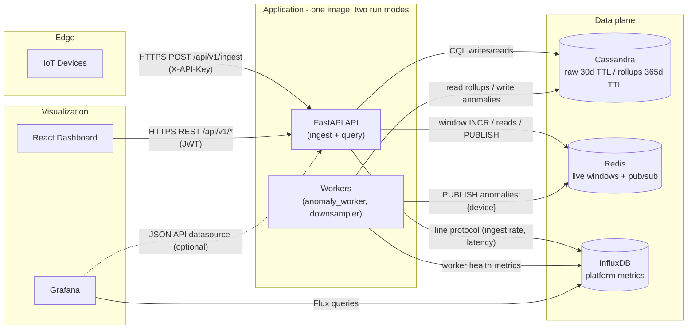
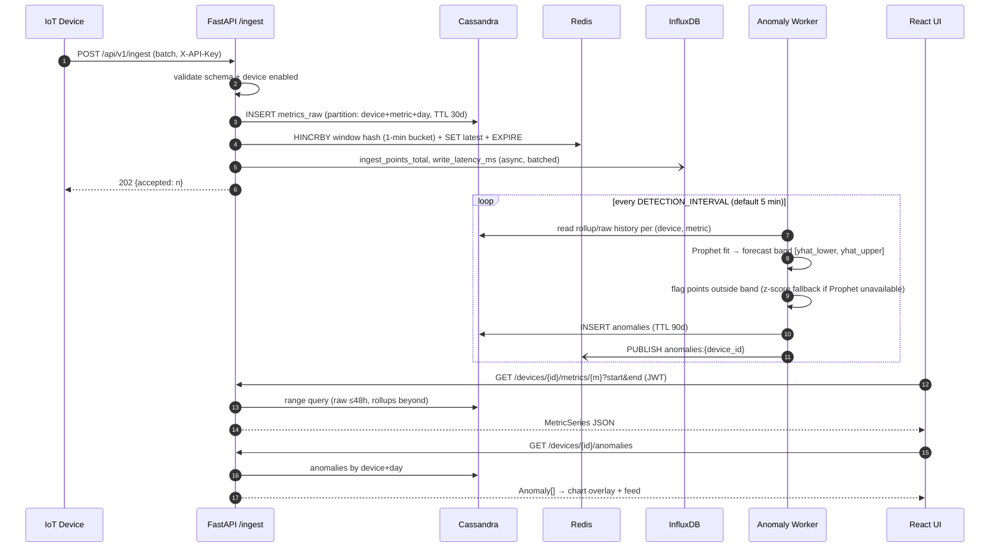

# Time-Series Analytics — Architecture

## 2.1 Chosen Architectural Pattern

**Modular monolith (FastAPI) + asynchronous background workers, over polyglot persistence,
with Redis pub/sub as a lightweight event channel.**

Why this fits:

- **Scale honesty.** The platform's hard problems are *data modeling* (Cassandra partitioning,
  TTL, rollups) and *ML cadence* (Prophet fits), not service orchestration. A single deployable
  API plus worker processes solves both with minimal operational surface — right-sized for a
  small team on DigitalOcean.
- **Clean seams anyway.** Internally the code is layered (`api → services → repositories → db`)
  and the workers already run as separate processes from the same image. The two components most
  likely to need independent scaling — **ingest** (write-heavy, spiky) and **anomaly detection**
  (CPU-heavy, batchy) — are behind service interfaces and can be extracted into standalone
  deployables without refactoring, only re-wiring.
- **Not microservices now.** Splitting ingest/query/ML into networked services would add
  serialization, partial-failure handling, and deploy complexity before any load justifies it.
- **Not serverless.** Prophet fits are long-running and memory-hungry; Cassandra wants persistent
  connections and steady compaction — both are a poor match for function runtimes.
- **Event-driven where it pays.** Anomaly notifications and live-tile updates flow through Redis
  pub/sub (fire-and-forget fan-out). Durable streaming (Kafka/Redpanda) is deliberately deferred
  until ingest volume or consumer count demands replay semantics.

## 2.2 Key Component Interactions

Communication styles, explicitly:

| Path | Mechanism | Notes |
|---|---|---|
| Devices → API | REST over HTTPS, batched JSON | API-key auth (gateway or per-device); MQTT bridge is a future ingest edge |
| React → API | REST over HTTPS, polling | JWT bearer; `GET /api/v1/events/anomalies` (SSE from Redis pub/sub) is live server-side — moving the UI off polling is a client-only change |
| API/Workers → Cassandra | Direct driver access via repository layer | Prepared statements, token-aware routing |
| API/Workers → Redis | Direct client + pub/sub events | Aggregates are disposable (cache semantics, TTL'd keys) |
| API/Workers → InfluxDB | Line-protocol writes, async batched | System telemetry only — not device data of record |
| Grafana → InfluxDB | Native datasource (Flux) | Provisioned from `infra/grafana/` |
| No service-to-service RPC | — | Monolith: in-process calls between layers |

**Ownership rule:** Cassandra is the *system of record* for device data. Redis is *disposable*
(rebuildable from Cassandra). InfluxDB holds *telemetry about the platform*, never the only copy
of device data. This keeps disaster recovery a one-database problem.

## 2.3 Data Flow

Ingest → storage → detection → visualization:

Read-path routing: queries over ranges longer than `ROLLUP_QUERY_THRESHOLD` (48h) are served
from `metrics_rollup_1h` instead of raw — bounded partitions, bounded response sizes.

## 2.4 Scalability & Performance Strategy

**Write path (the one that grows first)**
- Cassandra partition key `(device_id, metric, day_bucket)` caps partition size regardless of
  fleet age; at 1 sample/sec a partition stays ≈86K rows/day — comfortably inside best practice.
- `TimeWindowCompactionStrategy` with 1-day windows + table-level `default_time_to_live` means
  expiry is *SSTable drop*, not tombstone compaction — TTL'd time-series at near-zero cost.
- API is stateless: scale horizontally behind the DO load balancer; Cassandra scales by adding
  nodes (linear for this access pattern).
- Ingest accepts batches and answers 202 after the Cassandra write; Redis/Influx updates are
  best-effort. Next pressure-relief step: put a queue (Redis Streams → Kafka) between accept
  and persist, extract ingest as its own deployable.

**Read path**
- Live tiles hit Redis only (O(1) hash reads).
- Historical charts hit rollups beyond 48h; raw queries are range-limited and paginated.
- Grafana never touches Cassandra; it reads pre-aggregated telemetry from InfluxDB.

**Anomaly detection**
- Prophet fit is per (device, metric), embarrassingly parallel → worker scales by sharding the
  device list across N worker replicas (consistent hashing on `device_id`; TODO in worker).
- Fits run on rollups (≤ a few hundred points), not raw, keeping each fit < seconds.

**Capacity levers, in order:** raise rollup usage on the read path → add API replicas → shard
workers → add Cassandra nodes → introduce durable queue → extract ingest service → DOKS.

## 2.5 Security Considerations

- **Authentication**
  - *Devices:* API key sent as `X-API-Key`. Per-device keys have the form
    `<device_id>.<secret>`; only `sha256(secret)` is stored (`devices.api_key_hash`), the full
    key is revealed exactly once at registration. A shared gateway key (env) exists for site
    gateways and seeding. Keys are revoked by disabling the device (permission decisions are
    cached in Redis for `DEVICE_CACHE_TTL_SECONDS` and invalidated on mutation).
  - *Users (dashboard):* JWT bearer tokens issued by `POST /api/v1/auth/token` against the
    `users` table (PBKDF2-SHA256 password hashes, 120k iterations). A bootstrap admin is
    created at startup from `ADMIN_USERNAME`/`ADMIN_PASSWORD` via an LWT insert (never
    overwrites). Refresh tokens and OIDC remain future work behind the same decode interface.
- **Authorization:** role claims in JWT (`viewer`, `operator`, `admin`); write/manage endpoints
  require `operator+`. Device keys can only ingest — never query.
- **API security:** strict pydantic validation on every input; batch-size and payload-size caps
  on ingest; per-device rate limiting (Phase 3); CORS restricted to known origins; standard
  security headers at the nginx/load-balancer edge.
- **Data protection:** TLS termination at the DO load balancer, TLS to Cassandra/Redis/InfluxDB
  in production (private VPC network regardless); volumes on encrypted block storage; no PII in
  metric payloads by policy — device metadata only.
- **Secret management:** secrets exist only as environment variables. Local dev uses `.env`
  (gitignored, template in `.env.example`); CI/CD uses **masked, protected GitLab CI/CD
  variables**; droplets receive env files provisioned outside git. No secret is ever committed,
  logged, or baked into images.
- **Network posture:** only the load balancer (443) and SSH (key-only, allowlisted) are public.
  Cassandra/Redis/InfluxDB/Grafana listen on the VPC/private network only; Grafana is exposed
  via the LB behind its own auth.

## 2.6 Error Handling & Logging Philosophy

**Principles**
1. **Fail loud at the edge, degrade gracefully inside.** Invalid input → immediate 4xx with a
   structured body. A down dependency → 503 from the affected endpoint only; liveness stays
   green, readiness reports the failing dependency.
2. **Errors are structured data.** All error responses share one JSON shape
   (`{"error": {"code", "message", "detail?"}}`) emitted by central exception handlers in
   `app/main.py` — no ad-hoc `raise HTTPException` bodies scattered around.
3. **The system of record write is the transaction.** Ingest succeeds iff Cassandra accepts the
   batch. Redis/Influx side-effects are wrapped, logged on failure, never fail the request —
   they are rebuildable caches/telemetry.
4. **Retries are bounded and explicit.** Driver-level retry policies for transient Cassandra
   errors; workers use exponential backoff and skip-and-continue per device so one bad series
   can't stall the fleet scan.
5. **No silent excepts.** Every `except` either re-raises, converts to a typed error, or logs
   with context (`device_id`, `metric`, `request_id`) at WARNING+.

**Logging**
- Structured logs: human-readable in dev, JSON in production (`LOG_FORMAT=json`), always with
  `request_id` (middleware-injected, echoed in error responses for support correlation).
- Levels: DEBUG (dev only) / INFO (state changes: startup, deploys, worker runs) /
  WARNING (degraded mode, fallbacks used) / ERROR (request failed, needs attention).
- **Metrics over logs for trends:** counters/latencies go to InfluxDB and are alerted on in
  Grafana (ingest stall, error-rate spike, worker lag). Logs are for forensics, not dashboards.
- Error tracking (Sentry) and OpenTelemetry tracing are Phase 3; the middleware seams for both
  already exist in `app/main.py`.
