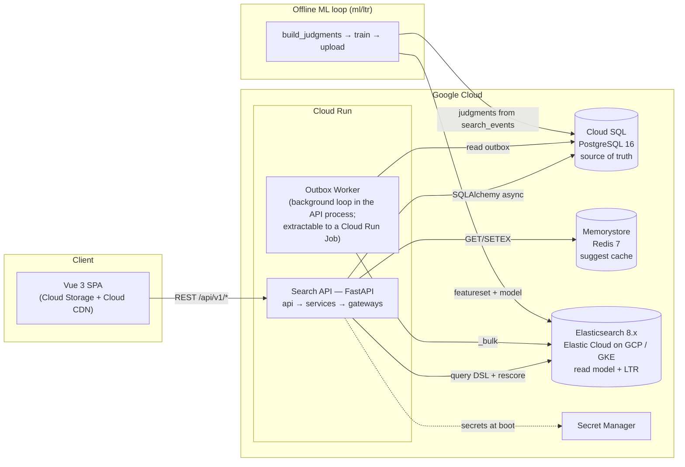
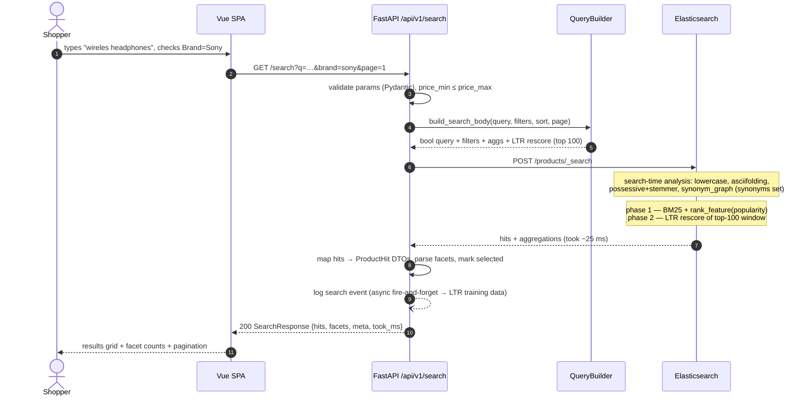
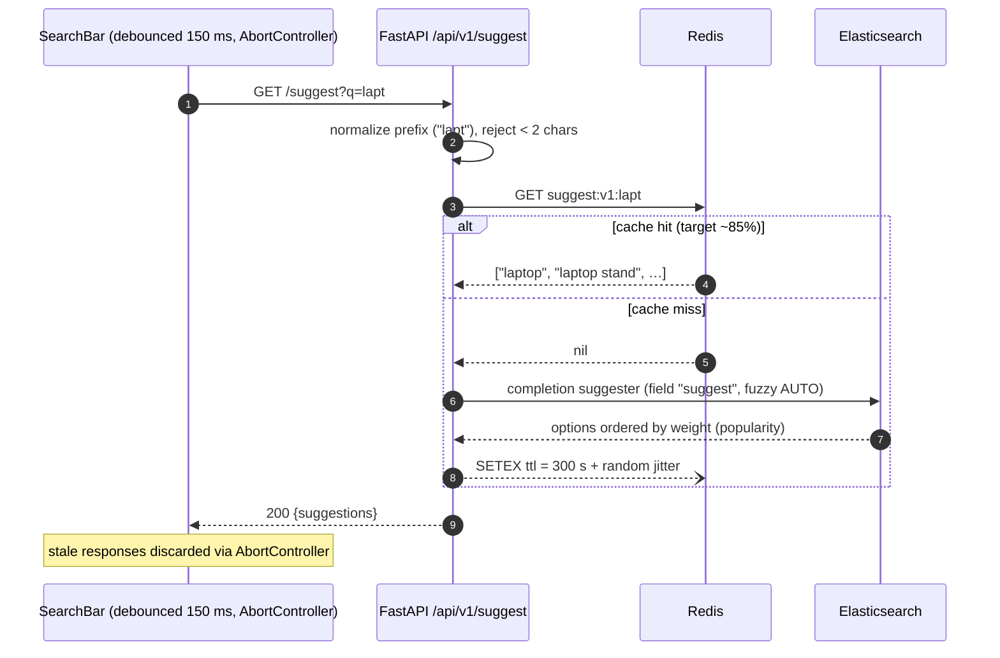
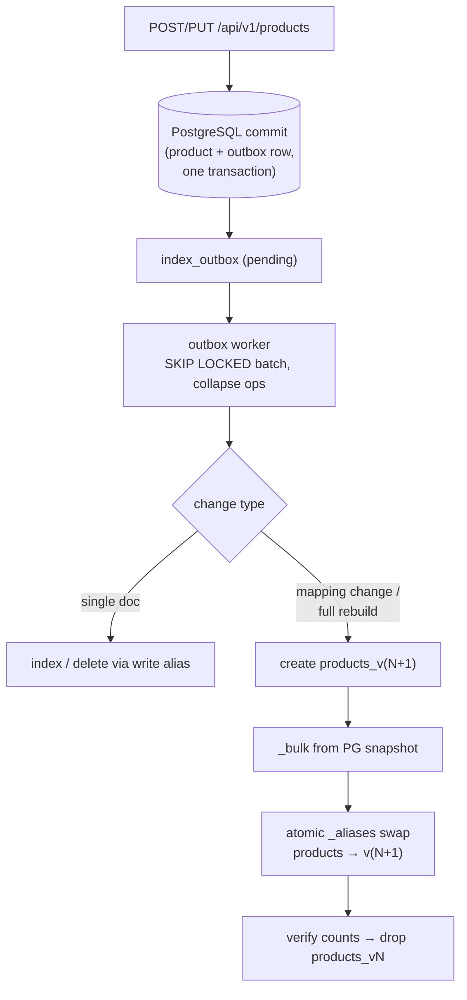
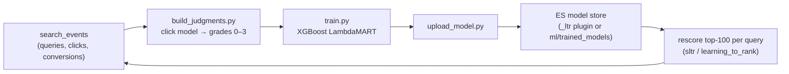

# Search Engine Backend — Architecture

This document describes the system architecture. See [PROJECT-PLAN.md](./PROJECT-PLAN.md)
for structure/roadmap and [TECH-NOTES.md](./TECH-NOTES.md) for operational details.

---

## 2.1 Chosen Architectural Pattern

**Layered modular monolith with a CQRS-flavored read model and an asynchronous indexing
pipeline.**

- One deployable FastAPI service (Cloud Run) contains all HTTP concerns, organized into
  strict layers: `api` (transport) → `services` (use-cases) → `repositories`/`search`/`cache`
  (gateways). Dependencies point inward only; the ES gateway never imports services.
- **CQRS-lite:** PostgreSQL is the *write model* and the single source of truth for the
  catalog. Elasticsearch is a disposable, rebuildable *read model* optimized for querying
  (analyzers, facets, LTR). Redis is a look-aside cache in front of the hottest read path
  (autocomplete).
- **Async indexing pipeline:** catalog writes insert an `index_outbox` row in the same
  PG transaction as the product change (transactional outbox); a background worker
  (`services/outbox_worker.py`, started in the app lifespan) drains pending rows into ES
  with `FOR UPDATE SKIP LOCKED` claiming, per-product op collapsing, retries, and
  dead-lettering — the index stays crash-consistent with PostgreSQL.
- The offline **ML loop** (judgment building, LTR training, model upload) runs outside the
  serving path entirely (`ml/ltr/`).

**Why this fits.** A search backend of this scale has one team, one bounded context, and
latency-critical read paths. A monolith keeps search, suggest, and catalog code in one
process — no network hops inside the request, one deploy, trivial local dev — while the
layer boundaries keep extraction cheap later (the indexing worker and the suggest service
are the natural first spin-offs). Microservices here would add serialization, versioned
internal contracts, and distributed failure modes with zero scaling benefit: Cloud Run
already scales the stateless monolith horizontally, and the real scaling constraints live
in Elasticsearch, not in application code. Serverless functions were rejected because the
API needs warm connection pools (ES/PG/Redis) and consistent p95 latency.

---

## 2.2 Key Component Interactions

| Path | Style | Protocol / mechanism | Notes |
|---|---|---|---|
| SPA → API | Sync request/response | REST + JSON over HTTPS | Versioned under `/api/v1`; RFC-7807 errors |
| API → Elasticsearch | Sync query | ES HTTP API (async client) | 5 s timeout, retries on connection errors; API key auth |
| API → PostgreSQL | Sync SQL | SQLAlchemy 2 async + asyncpg pool | Catalog CRUD, search-event writes |
| API → Redis | Sync cache ops | redis.asyncio | Cache-aside; Redis failure degrades, never breaks requests |
| API/Worker → ES (indexing) | Async propagation | Transactional outbox (`index_outbox`) → in-process worker loop (SKIP LOCKED) → index/`_bulk` | Catalog writes never block on ES; failed rows retry, then dead-letter |
| ML loop → PG/ES | Batch | SQL export; `_ltr` / eland upload | Scheduled (nightly), never in serving path |
| CI/CD → GCP | Push-based | GitHub Actions + Workload Identity Federation | No long-lived keys |

Design rules:

1. **Only gateways talk to infrastructure.** Endpoints never build query DSL; services never
   parse ES responses — `app/search/query_builder.py` and `facets.py` own that translation.
2. **No message broker yet.** The single async need (PG→ES sync) is served by an outbox +
   scheduled worker; Pub/Sub is the drop-in upgrade when event volume justifies it.
3. **Everything user-supplied enters the query DSL through typed builders** — never string
   interpolation — which structurally prevents query-DSL injection.

---

## 2.3 Data Flow

### Search request (facets + LTR re-ranking)

### Autocomplete (Redis cache-aside)

### Catalog write → index sync (zero-downtime reindex)

### LTR training loop (offline)

---

## 2.4 Scalability & Performance Strategy

**Latency budgets (p95):** search ≤ 300 ms end-to-end (ES ≤ 150 ms), suggest ≤ 80 ms
(Redis hit ≤ 10 ms), catalog writes ≤ 500 ms.

| Layer | Strategy |
|---|---|
| API | Stateless; Cloud Run autoscales on concurrency. Fully async I/O (asyncpg, AsyncElasticsearch, redis.asyncio) so one instance multiplexes many in-flight ES calls. `min-instances ≥ 1` in prod to avoid cold starts. |
| Elasticsearch | Catalog fits few shards (1 primary + replicas to scale *reads*). Aliases decouple naming from physical indexes → resize/reindex without downtime. LTR cost is bounded: model scores only the top-`window` (100) BM25 hits, never the full result set. |
| Redis | Cache-aside for suggest with TTL + jitter (prevents synchronized expiry stampedes). Keyed by normalized prefix; `allkeys-lru` eviction. |
| PostgreSQL | Only on write paths and event logging — search reads never touch PG. Vertical headroom + read replica later if analytics grows. |
| Pagination | `from/size` capped at 10 000 (enforced in `query_builder`); `search_after` planned for deep crawls (Phase 3). |
| Frontend | Debounced suggest (150 ms) + request cancellation; static assets on CDN. |

**Graceful degradation ladder:** LTR fails → serve BM25 order (rescore dropped). Redis
down → suggest goes straight to ES (slower, correct). ES down → search returns 503
problem-details; catalog CRUD (PG) keeps working and the outbox replays indexing later.

---

## 2.5 Security Considerations

- **Authentication & authorization.** Public read endpoints (`/search`, `/suggest`,
  `/events/click`) are anonymous and rate-limited (in-process sliding window per client
  IP, 429 problem-details; Cloud Armor is the authoritative edge limiter). Catalog writes
  and `/admin/*` require `X-API-Key` (constant-time compare); operator access moves
  behind Google IAM/IAP on Cloud Run, and JWT arrives only if user-scoped features do.
  Service-to-service auth uses Cloud Run service identities — no shared passwords.
- **Secret management.** Local dev reads `.env` (gitignored; `.env.example` is the
  contract). Cloud environments mount secrets from **GCP Secret Manager** into Cloud Run;
  CI authenticates via **Workload Identity Federation** — no JSON keys in GitHub. ES
  access uses scoped API keys (search-only key for the API; write key only for the worker).
- **Network.** Cloud SQL via private IP + connector; Memorystore in-VPC; ES reachable only
  through VPC/private endpoint with TLS. Only the API and CDN are public.
- **API security.** Strict Pydantic validation (lengths, ranges, enums); typed query
  builders prevent ES query-DSL injection; CORS restricted to known origins; security
  headers at the edge; request size limits. `dynamic: strict` mappings stop accidental
  field pollution.
- **Data protection.** TLS in transit everywhere; CMEK-encrypted disks at rest (GCP
  default). Search-event logs store a session pseudonym, never user PII — they become ML
  training data, so minimization is enforced at write time. Backups: automated Cloud SQL
  PITR; ES snapshots to GCS.

---

## 2.6 Error Handling & Logging Philosophy

**Errors are part of the API contract.** All failures surface as RFC-7807
`application/problem+json` with a stable `code`, and never leak stack traces or ES
internals. The mapping lives in one place (`app/core/exceptions.py`):

| Condition | Exception | HTTP |
|---|---|---|
| Bad input (invalid range, deep paging) | `InvalidSearchQueryError` | 422 |
| Missing resource | `NotFoundError` | 404 |
| Bad/absent credentials | `UnauthorizedError` | 401 |
| ES unreachable/timeout | `SearchBackendUnavailableError` | 503 (+ `Retry-After`) |
| Anything unexpected | generic handler | 500 (logged with traceback, opaque to client) |

**Policy per dependency:** timeouts everywhere (ES 5 s, Redis 200 ms, PG statement
timeout); retries only for idempotent connection-level failures; cache failures are
*logged and swallowed* (Redis is an optimization, not a dependency); LTR rescore failures
fall back to BM25 rather than failing the search.

**Logging:** `structlog` emits one JSON object per event to stdout — Cloud Run ships it to
Cloud Logging. Every request gets a `request_id` (accepted from `X-Request-ID` or
generated) bound via contextvars, so one grep reconstructs a request across layers; the
id is echoed in the response header and in problem-details for support tickets. Canonical
log line per request: route, status, duration, ES took, cache hit/miss. Levels: `INFO`
state changes, `WARNING` degraded-but-served (cache down, LTR fallback), `ERROR`
user-visible failure — alerts page on `ERROR` rate and on `WARNING` floods. Phase 3 adds
OpenTelemetry traces (API ↔ ES ↔ PG spans) and Sentry for exception grouping.
