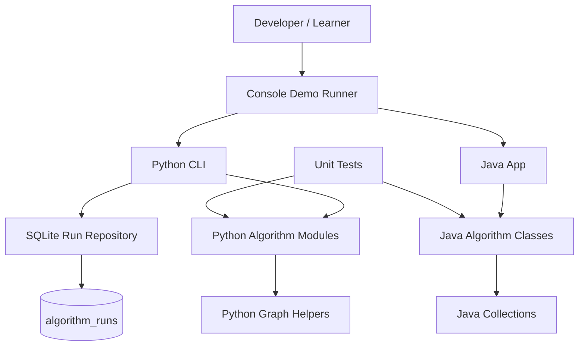
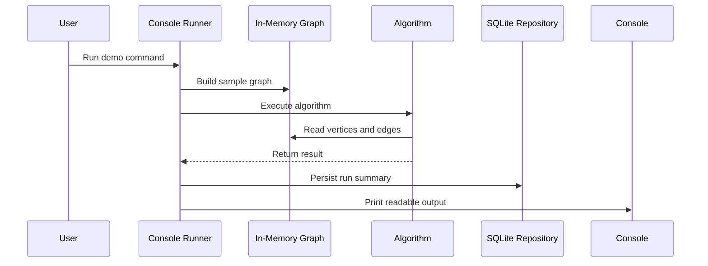

# Architecture

## 2.1 Chosen Architectural Pattern

The project uses a **modular console monolith**. Each graph algorithm is implemented in its own Java and Python file, with console entry points for local execution. The Python CLI includes SQLite run-history persistence.

This pattern fits the project because the goal is learning and demonstration, not serving network traffic or managing persistent state. It keeps the code easy to inspect, run, and test without introducing unnecessary services.

## 2.2 Key Component Interactions

- API calls: none in the current local version.
- Message queues: none.
- Direct database access: the Python CLI writes algorithm run summaries to SQLite through `AlgorithmRunRepository`.
- Event buses: none.
- Console runners directly call algorithm modules/classes and print readable output.

## 2.3 Data Flow

Typical flow:

1. A learner runs the Python or Java demo command.
2. The demo creates a small in-memory graph.
3. The selected algorithm processes the graph.
4. Results are printed to the console.
5. Python CLI runs are persisted to SQLite.
6. Unit tests call the same algorithm methods with deterministic fixtures.

## 2.4 Scalability & Performance Strategy

The first version optimizes for clarity. Future growth can be handled by:

- Keeping each algorithm isolated in one file to avoid accidental coupling.
- Benchmark fixtures measure representative graph runs before optimizing implementation details.
- Using adjacency lists for sparse graphs and matrices only where the algorithm naturally requires them, such as Floyd-Warshall.
- Avoiding global mutable state so algorithms can be tested and reused independently.
- Adding input parsers later without changing algorithm APIs.

## 2.5 Security Considerations

This is a local console app, so security scope is limited.

- Authentication and authorization: not applicable.
- Data protection: validate JSON input and avoid storing secrets in run summaries.
- API security: not applicable until a server is added.
- Secret management: `.env.example` documents local variable names only; no secrets should be committed.
- Dependency security: keep dependencies minimal and update them deliberately.

## 2.6 Error Handling & Logging Philosophy

- Prefer deterministic exceptions for invalid input rather than silent incorrect results.
- Keep console demos friendly and readable.
- Keep algorithm methods pure where possible: accept graph input, return result, avoid printing internally unless running as a standalone demo.
- Use standard test assertions for correctness.
- Repository operations raise clear validation and not-found errors.
