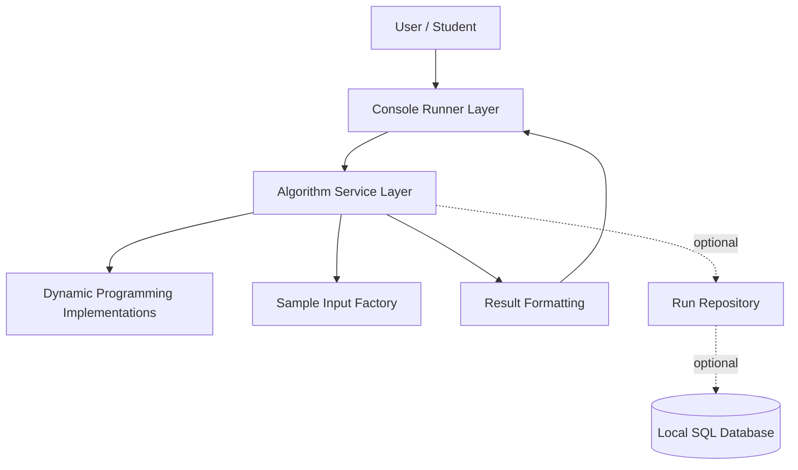
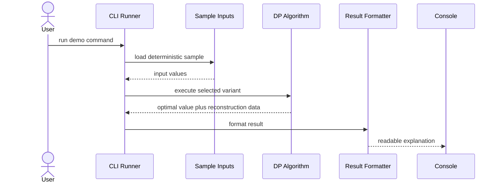
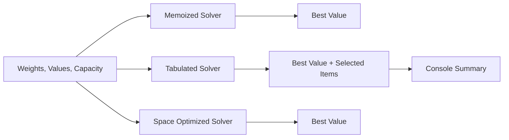

# Architecture

## 2.1 Chosen Architectural Pattern

The project uses a layered monolith architecture for local console execution.

This is suitable because the system is a learning project, not a distributed application. The core value is clear algorithm implementations in two languages, predictable execution from the terminal, and simple tests. Splitting the project into services would add operational noise without improving learning outcomes.

## 2.2 Key Component Interactions

- API calls: none. The default interface is command-line execution.
- Message queues: none. Algorithms are synchronous and deterministic.
- Direct database access: optional future extension only. The migration file defines a simple table for storing algorithm run metadata.
- Event buses: none. Console output and test assertions are sufficient for this scale.

The practical component boundaries are:

- CLI/demo layer: parses command-line choices and prints formatted examples.
- Algorithm layer: contains pure functions/classes for each DP problem.
- Result layer: standardizes value, selected items, sequence, edit operations, or path output.
- Test layer: verifies correctness independently of console formatting.

## 2.3 Data Flow

For example, a knapsack run follows this path:

## 2.4 Scalability & Performance Strategy

- Keep algorithm implementations pure and stateless so they are easy to test and benchmark.
- Use memoization for recursive clarity and tabulation for predictable iteration.
- Use rolling arrays or one-dimensional arrays where this preserves correctness.
- Keep exponential-state algorithms such as TSP and Egg Drop bounded in demos.
- Add benchmark tooling later without changing the algorithm API.
- Keep Java and Python implementations structurally similar so learners can compare language differences rather than different designs.

## 2.5 Security Considerations

Authentication and authorization are not required for the local console scope.

If the project later grows into a web or API application:

- Authentication: use a standard identity provider and keep algorithm execution behind authenticated routes.
- Authorization: restrict saved runs by owner and role.
- Data protection: avoid storing sensitive input data; encrypt any persisted private data at rest.
- API security: validate input sizes to prevent memory exhaustion and denial-of-service style workloads.
- Secret management: keep secrets outside source control and load them from environment variables or a managed secret store.

## 2.6 Error Handling & Logging Philosophy

- Validate public inputs at the CLI boundary and in algorithm functions/classes.
- Raise clear exceptions for impossible inputs, for example negative capacities or mismatched array lengths.
- Keep algorithm code deterministic and side-effect free where possible.
- Log demo startup, selected algorithm names, and unexpected failures.
- Do not hide errors in the learning layer; fail loudly with a message that helps the student fix the input.
