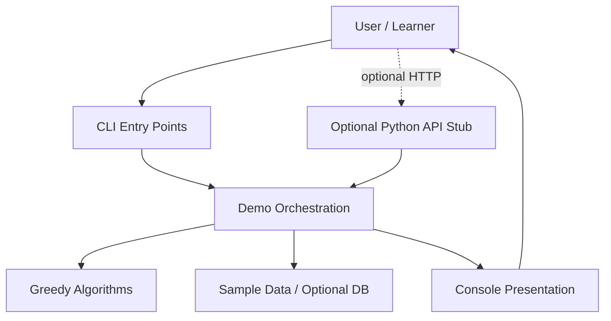
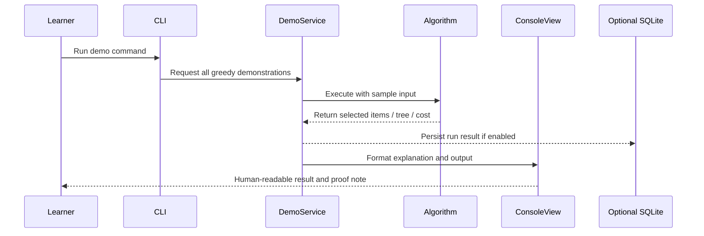

# Architecture

## 2.1 Chosen Architectural Pattern

The project uses a **Layered Educational Monolith**.

This is suitable because the product is a local learning tool, not a distributed production service. A monolith keeps the algorithms, examples, tests, and console output close together while still separating responsibilities cleanly:

- Presentation layer: CLI and console view formatting.
- Application layer: demo orchestration and optional API routes.
- Domain layer: greedy algorithm implementations.
- Data layer: sample input files and optional SQL schema.

## 2.2 Key Component Interactions

- API calls: Optional only. `python/greedy_algorithms/api.py` demonstrates how an HTTP layer could expose saved scenarios.
- Message queues: Not required. Algorithm execution is synchronous and CPU-local.
- Direct database access: Optional. The migration schema can store scenario metadata and run results later.
- Event buses: Not required. If reporting or analytics grows, a simple in-process event dispatcher is enough before introducing infrastructure.

The Java and Python tracks intentionally do not call each other. They are parallel reference implementations so learners can compare language style and algorithm behavior.

## 2.3 Data Flow

Typical path:

1. The user runs a Java or Python command.
2. The CLI chooses predefined sample data from code or `data/examples.json`.
3. The algorithm module executes deterministic greedy logic.
4. The presentation layer prints inputs, choices, results, complexity, and proof intuition.
5. Optional future storage records a scenario and result for comparison.

## 2.4 Scalability & Performance Strategy

The current workload is small and local, so clarity beats infrastructure. Still, the structure supports growth:

- Algorithms are pure functions or stateless services, making them easy to test and benchmark.
- CLI and API layers are thin and replaceable.
- Sample data is externalized so larger scenarios can be added without changing algorithm code.
- MST uses a disjoint-set data structure for near-linear performance after sorting edges.
- Huffman coding uses priority queues for efficient tree construction.
- Future benchmark mode can isolate input generation, execution time, and memory measurements.

## 2.5 Security Considerations

Authentication and authorization:

- Not needed for local CLI usage.
- If the optional API becomes active, add token-based auth before exposing it outside localhost.

Data protection:

- Avoid storing personal data in sample files.
- Treat uploaded or user-provided scenario files as untrusted input.

API security:

- Validate all request models.
- Put hard limits on graph size, string size, and item counts to prevent accidental resource exhaustion.
- Return structured errors instead of tracebacks.

Secret management:

- Keep secrets out of source control.
- Document required environment variables in `.env.example`.
- Use platform secret stores or CI secrets for any future deployment.

## 2.6 Error Handling & Logging Philosophy

- Algorithm functions should validate input and fail with clear domain errors.
- CLI commands should catch expected errors and print concise guidance.
- Optional API routes should return typed HTTP errors.
- Logs should be useful for debugging without overwhelming learners.
- Console output should separate teaching content from diagnostic output.

Recommended levels:

- `INFO`: algorithm selected, scenario name, execution summary.
- `WARNING`: skipped optional dependency, missing sample file, unsupported demo option.
- `ERROR`: invalid input, failed persistence, unexpected runtime failure.
