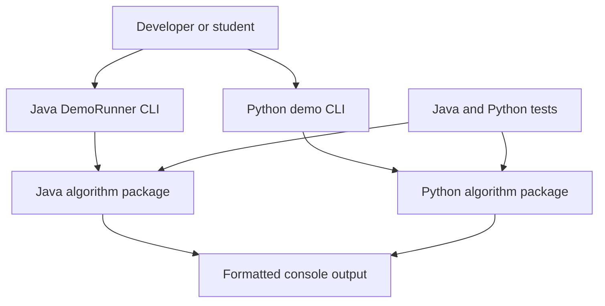
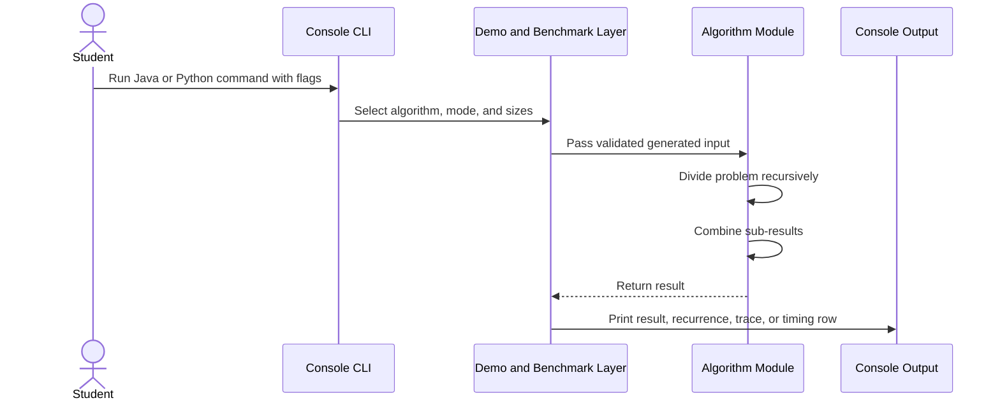

# Architecture

## 1. Chosen Architectural Pattern

The project uses a layered educational monolith with two parallel implementations:

- Java algorithm library plus Java console demo.
- Python algorithm library plus Python console demo.

This pattern fits the project because the goal is learning, comparison, and local execution.

## 2. Key Component Interactions

Runtime interaction is direct function invocation:

- Console CLI parses flags such as `--algorithm`, `--benchmark`, `--sizes`, and `--trace`.
- Demo code prepares deterministic sample input or benchmark input.
- Demo calls the selected algorithm implementation.
- Algorithm returns plain values such as arrays, points, matrices, numbers, or complex values.
- Demo formats the result, recurrence, trace, or benchmark row.
- Tests call algorithms directly and compare them with simple baselines.

## 3. Data Flow

Typical data flow is local and synchronous:

## 4. Scalability & Performance Strategy

Scalability in this project means algorithmic scalability rather than service scalability.

- Inputs are immutable or copied before mutation-sensitive algorithms such as selection.
- Algorithm APIs are stateless and suitable for repeated runs.
- Benchmark mode uses deterministic generated inputs.
- Strassen benchmarks are capped to practical educational sizes because the implementation favors clarity over memory reuse.
- Divide-and-conquer implementations expose the key performance idea directly:
  - Strassen: `T(n) = 7T(n/2) + O(n^2) = O(n^log2 7)`
  - Closest pair: `T(n) = 2T(n/2) + O(n) = O(n log n)`
  - FFT: `T(n) = 2T(n/2) + O(n) = O(n log n)`
  - Karatsuba: `T(n) = 3T(n/2) + O(n) = O(n^log2 3)`
  - Quickselect: average `T(n) = T(n/2) + O(n) = O(n)`
  - Median of Medians: deterministic worst-case `O(n)`
  - Binary search and exponentiation by squaring: `T(n) = T(n/2) + O(1) = O(log n)`
  - Merge sort, counting inversions, and maximum subarray: `T(n) = 2T(n/2) + O(n) = O(n log n)`
  - Skyline and polynomial multiplication use recursive split/merge strategies.
  - Toom-Cook reduces large integer multiplication by evaluation and interpolation.
  - Rotated search, peak finding, and two-array selection discard large search regions recursively.
  - Segment tree construction recursively combines child intervals.
  - Divide-and-conquer DP optimization computes DP rows by recursively narrowing optimal split ranges.

## 5. Security Considerations

Because this is a local educational CLI project, the security surface is intentionally small.

- Authentication and authorization: not applicable because there is no server or multi-user access.
- Data protection: no personal data is stored or transmitted.
- API security: not applicable because no network API is exposed.
- Secret management: no secrets are required. `.env.example` contains only harmless local knobs.
- Dependency hygiene: keep Java and Python dependencies minimal and update test tooling periodically.

## 6. Error Handling & Logging Philosophy

The project uses explicit validation and readable failures:

- Reject invalid matrix shapes, empty selections, invalid order statistics, and non-power-of-two FFT inputs.
- Keep algorithm methods deterministic.
- Throw `IllegalArgumentException` in Java for invalid input.
- Raise `ValueError` in Python for invalid input.
- CLI flags are validated before execution.

Logging is intentionally plain console output. Benchmark rows include algorithm name, input size, elapsed time, and result summary.
