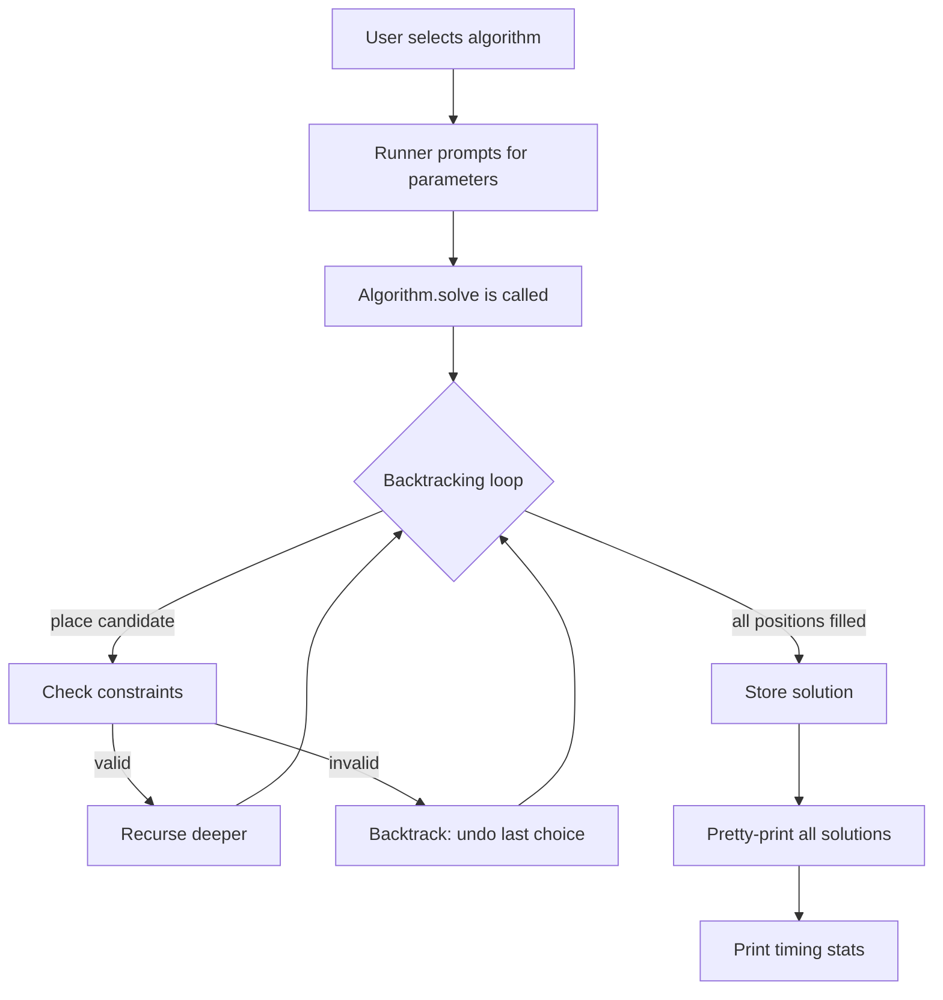
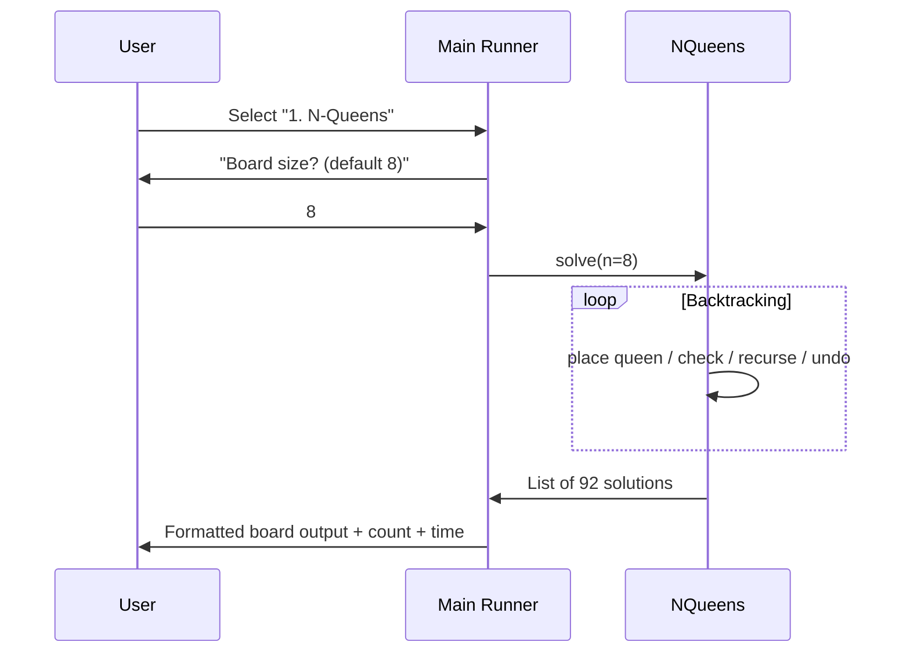

# Backtracking Algorithms — Architecture

## 2.1 Chosen Architectural Pattern

**Modular Console Application (Layered)**

Each algorithm is an independent, self-contained module behind a shared runner.
This is the natural fit because:
- Zero network / database / state concerns — pure computation.
- Each algorithm has its own isolated state (board, path, visited set).
- Easy to add new algorithms without touching existing code.
- Both Java and Python share the same conceptual interface: `solve() → pretty-print()`.

```
┌─────────────────────────────────────────────┐
│                  Main Runner                 │
│         (menu, arg parsing, banner)          │
├────────┬────────┬────────┬──────────────────┤
│N-Queens│Sudoku  │Knight's│  ... 5 more      │
│ .solve │ .solve │ .solve │  modules         │
│ .print │ .print │ .print │                  │
└────────┴────────┴────────┴──────────────────┘
```

## 2.2 Key Component Interactions

There are **no inter-component communications** at runtime.
Each module:
1. Receives configuration (board size, graph, target sum) from the runner.
2. Runs its `solve()` method independently.
3. Prints results directly to `stdout`.

```
Runner ──config──▶ Algorithm.solve()
                       │
                       ▼
                  stdout (formatted result)
```

## 2.3 Data Flow



### Typical sequence (N-Queens example)



## 2.4 Scalability & Performance Strategy

| Concern              | Approach                                                         |
|----------------------|------------------------------------------------------------------|
| Large inputs         | Optional `--max-solutions N` flag to stop early                  |
| Timeout              | Runner enforces wall-clock timeout per algorithm (configurable)  |
| Memory               | Each algorithm reuses a single board/path array (O(n) space)     |
| Parallelism          | Solutions for independent starting positions can run in parallel  |

Backtracking is inherently exponential; these algorithms are educational, not
designed for production-scale inputs.  The architecture focuses on clarity
and pedagogical value over raw throughput.

## 2.5 Security Considerations

Not applicable — this is a local-only, offline console application with:
- No network exposure
- No user authentication
- No persistent storage
- No secrets or API keys

## 2.6 Error Handling & Logging Philosophy

| Layer        | Strategy                                                          |
|--------------|-------------------------------------------------------------------|
| Input        | Validate parameters early (e.g., board size > 0, graph is valid) |
| Algorithm    | Throw/raise descriptive exceptions on invalid state               |
| Output       | Never crash mid-print; catch all errors in runner's main loop     |
| Timing       | Wrap each `solve()` call in try/finally to always report time     |

Logging uses plain `System.out.println` / `print()` — no framework needed at
this scale.  A `--verbose` flag can enable step-by-step tracing for learning.
