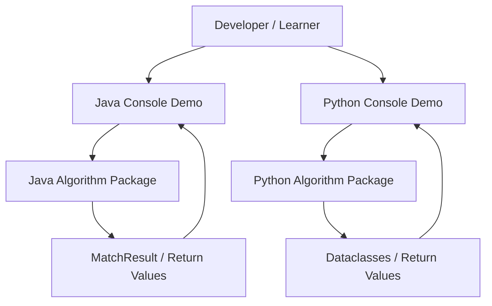
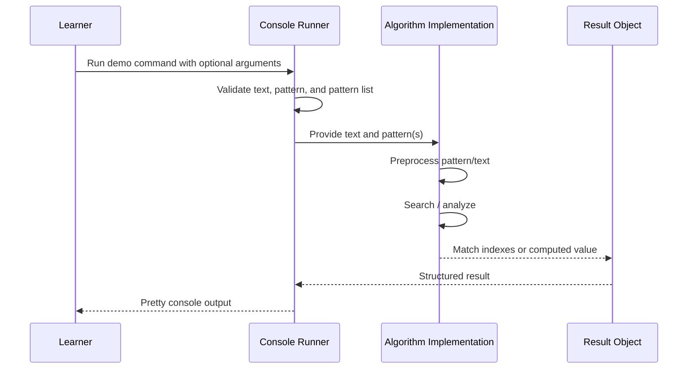

# Architecture

## 2.1 Chosen Architectural Pattern

The project uses a **layered console monolith** with two parallel language implementations.

This is suitable because the project is educational, local-first, and does not need network services, persistence, background workers, or distributed deployment. A small monolith keeps the algorithm implementations easy to inspect while still separating concerns:

- Console/demo layer: validates input, prepares examples, and prints readable output.
- Algorithm layer: pure functions/classes for string processing.
- Model layer: small result objects used by demos and tests.
- Test layer: language-specific unit and console integration checks.

## 2.2 Key Component Interactions

There are no API calls, message queues, direct database access, or event buses in the solution.

- User interaction happens through local console commands.
- Demo runners call algorithm classes/functions directly in memory.
- Tests call the same algorithm APIs used by the demos.
- Output is printed to stdout.

This direct-call model is intentionally simple and fits the learning goal.

## 2.3 Data Flow

Typical flow:

1. The learner starts the Java or Python console demo.
2. The demo reads defaults, environment variables, or CLI arguments.
3. The selected algorithm preprocesses the pattern or text.
4. The algorithm searches or analyzes in-memory strings.
5. Match positions or derived values are returned.
6. The console formatter prints human-readable output.

## 2.4 Scalability & Performance Strategy

The project does not need horizontal scalability, but the algorithm design supports growth in learning scope:

- Keep algorithm implementations stateless where practical.
- Keep preprocessing data structures private and reusable inside classes.
- Make return values deterministic and easy to test.
- Add benchmark inputs before optimizing.
- Prefer clear asymptotic behavior over clever micro-optimizations.

Algorithm-level performance:

- KMP: `O(n + m)` matching after prefix-table preprocessing.
- Rabin-Karp: average `O(n + m)` with rolling hash; collision verification included.
- Aho-Corasick: `O(text length + matches)` after trie/failure-link construction.
- Suffix Array: educational `O(n log n)` construction; demo search scans suffixes for clarity.
- Suffix Tree: compact edge-labeled suffix insertion build with `O(m)` contains traversal.
- Manacher: `O(n)` longest palindromic substring.
- Trie: `O(k)` insert/search/prefix for key length `k`.
- Longest Common Subsequence: `O(n * m)` dynamic programming sequence comparison.
- Longest Common Substring: `O(n * m)` dynamic programming contiguous comparison.

## 2.5 Security Considerations

Security requirements are minimal because the project is local-only and does not process secrets or network traffic.

- Authentication and authorization: not applicable.
- Data protection: avoid logging sensitive user-provided text if this becomes a real CLI tool.
- API security: not applicable because there is no API.
- Secret management: `.env.example` documents local settings only; real secrets should never be committed.
- Dependency security: keep build dependencies minimal and review CI warnings.

## 2.6 Error Handling & Logging Philosophy

The project favors explicit validation and readable console failures:

- Validate null values in Java public methods.
- Validate empty patterns where algorithm behavior would be ambiguous.
- Raise `ValueError` in Python for invalid inputs.
- Keep algorithm code free of console printing.
- Put human-readable formatting in demo runners.
- Validate CLI arguments and environment variables before algorithm execution.

Logging is not required. If the project grows, use Java `System.Logger` or SLF4J and Python `logging`, keeping algorithm implementations pure and testable.
