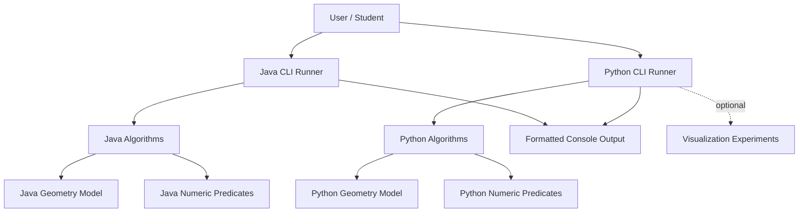
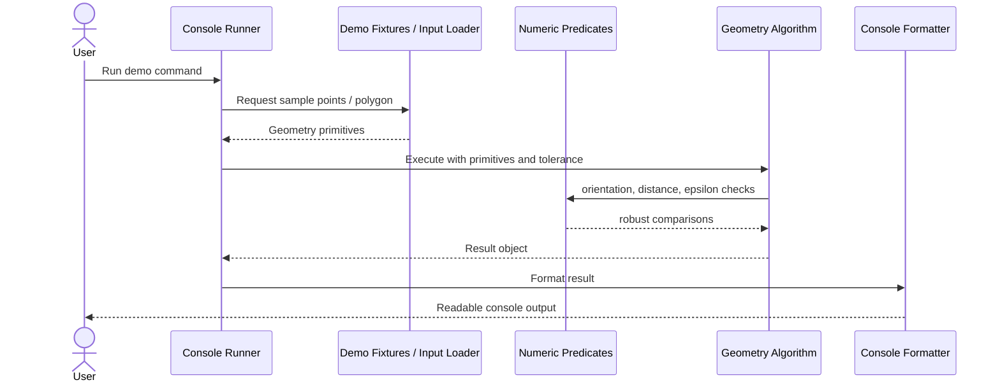
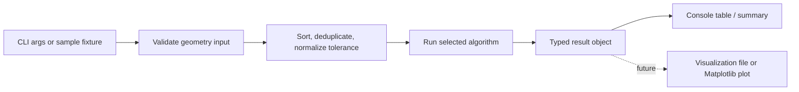

# Architecture

## 2.1 Chosen Architectural Pattern

The project uses a **layered console monolith** with mirrored Java and Python implementations.

This pattern fits the project because the system is a learning-oriented local executable, not a distributed service. Keeping the architecture simple makes algorithms easy to compare across languages while preserving enough structure for tests, demos, future visualizations, and reusable library code.

### Architectural Layers

- **CLI layer:** Parses simple command options, selects demos, and prints readable results.
- **Algorithm layer:** Contains the computational geometry implementations.
- **Model layer:** Defines points, segments, polygons, edges, and result records.
- **Utility layer:** Centralizes numeric tolerance, orientation predicates, formatting, and fixture loading.
- **Experiment layer:** Contains optional visualization scripts that consume algorithm output or sample data.

## 2.2 Key Component Interactions

The project has no network API calls, message queues, databases, or event buses. Communication is direct function/method invocation inside the process.

| Concern | Decision | Rationale |
|---|---|---|
| API calls | None | Local console execution only. |
| Message queues | None | Algorithms are synchronous and deterministic. |
| Direct database access | None | No persistence requirement. |
| Event buses | None | No asynchronous workflow requirement. |
| File input | CSV/JSON fixtures | Useful for repeatable algorithm demos. |
| Console output | Primary output channel | Matches the learning requirement. |

## 2.3 Data Flow

Typical execution starts with a CLI command, builds or loads 2D geometry input, runs one algorithm, and prints both summary and detailed results.

## 2.4 Scalability & Performance Strategy

Scalability here means handling larger geometry inputs locally and keeping the codebase easy to extend.

- **Algorithmic scalability:** Prefer asymptotically appropriate algorithms where practical:
  - Graham Scan: `O(n log n)`.
  - Closest Pair: target `O(n log n)`.
  - Sweep Line intersections: target `O((n + k) log n)`.
  - Delaunay/Voronoi: start with learning-friendly implementations, then optimize.
- **Memory discipline:** Use immutable geometry primitives and return compact result records.
- **Deterministic sorting:** Stable comparison rules reduce flaky behavior in tests and console output.
- **Numerical strategy:** Centralized epsilon comparisons avoid inconsistent tolerance handling.
- **Language parity:** Keep public examples equivalent between Java and Python so users can compare implementation choices.
- **Future acceleration:** Heavy workloads can later add spatial indexing, streaming input, or native numeric libraries without changing the CLI contract.

## 2.5 Security Considerations

The current project has a small attack surface because it is local and console-only.

- **Authentication and authorization:** Not applicable; there are no users, sessions, or remote endpoints.
- **Data protection:** Do not commit private datasets. Treat any future input files as local user-provided data.
- **API security:** Not applicable; no HTTP API exists.
- **Secret management:** No secrets are required. `.env.example` documents non-sensitive runtime settings only.
- **Input safety:** Validate future file paths, reject unsupported file formats, cap very large demo inputs by default, and avoid executing input content.
- **Dependency hygiene:** Pin major tool versions where useful and let CI run tests on every change.

## 2.6 Error Handling & Logging Philosophy

Errors should be clear for learners and precise enough for developers.

- **Invalid input:** Raise or return explicit validation errors such as "at least three distinct points required".
- **Degenerate geometry:** Represent known edge cases intentionally rather than letting them fail accidentally.
- **Numeric ambiguity:** Prefer documented tolerance behavior over hidden magic constants.
- **Console diagnostics:** Print concise messages with algorithm name, input size, tolerance, and outcome.
- **Logging:** Use standard language facilities only when needed:
  - Java: `java.util.logging` for future verbose modes.
  - Python: standard `logging` module for future verbose modes.
- **Testing:** Every fixed bug should gain a small regression test with the smallest geometry fixture that reproduces it.
