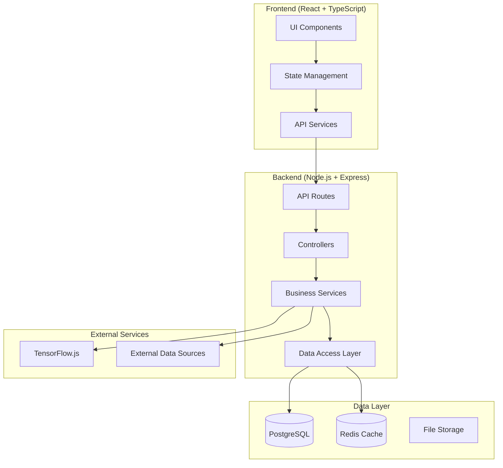
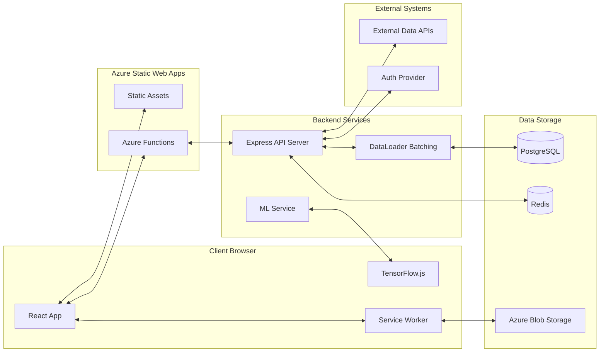
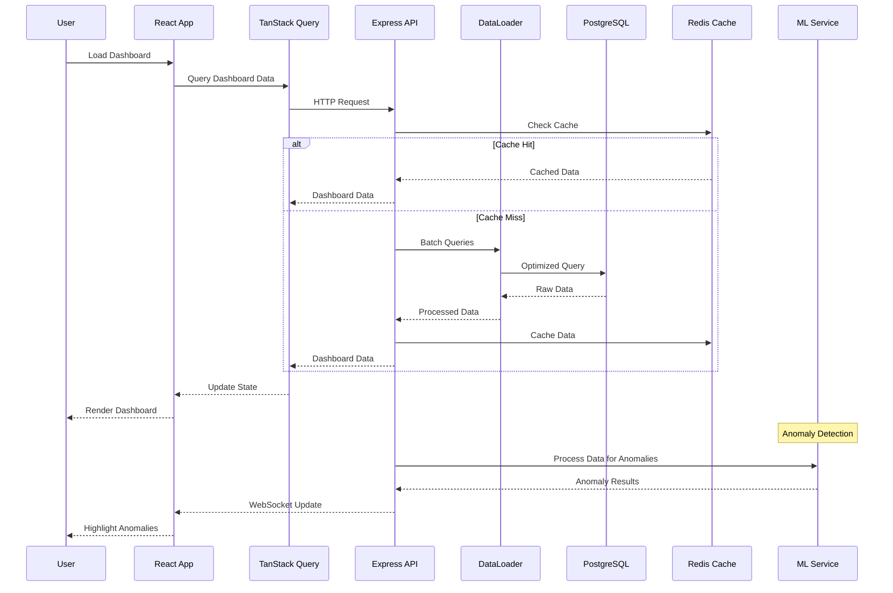
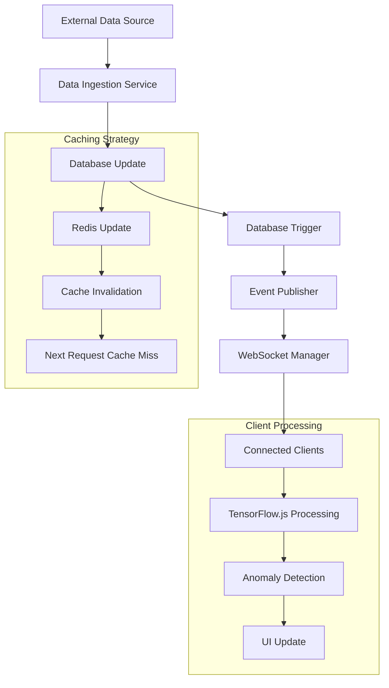
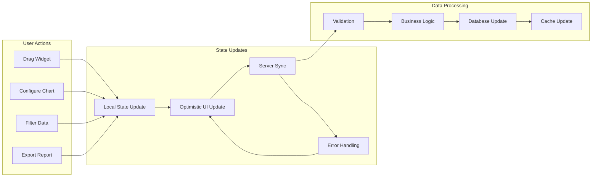
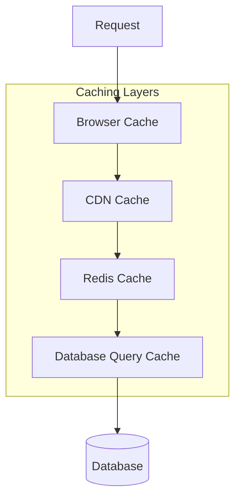
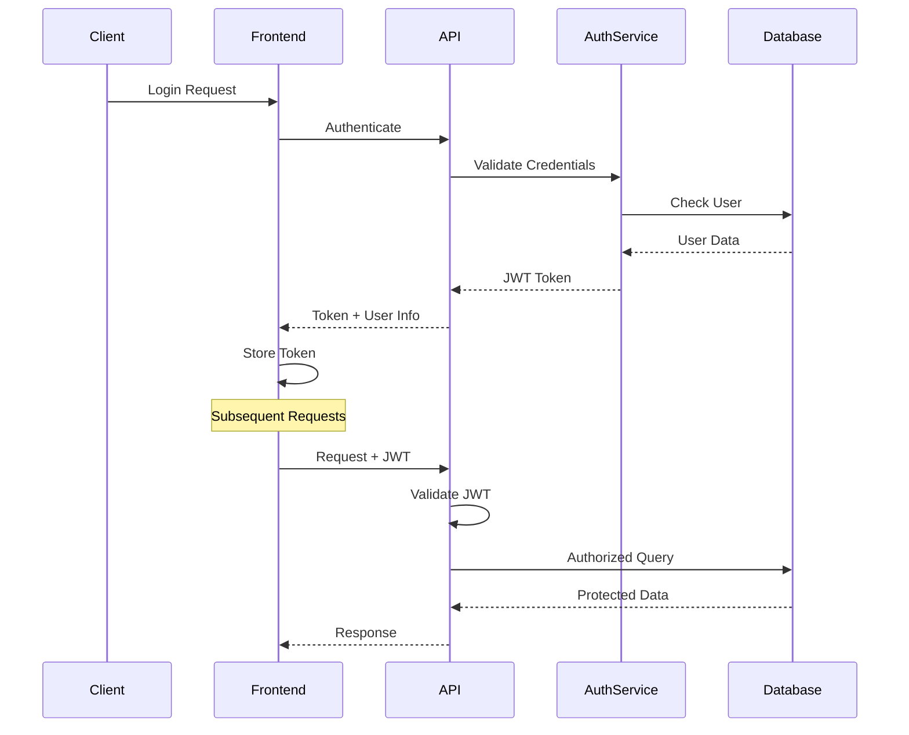
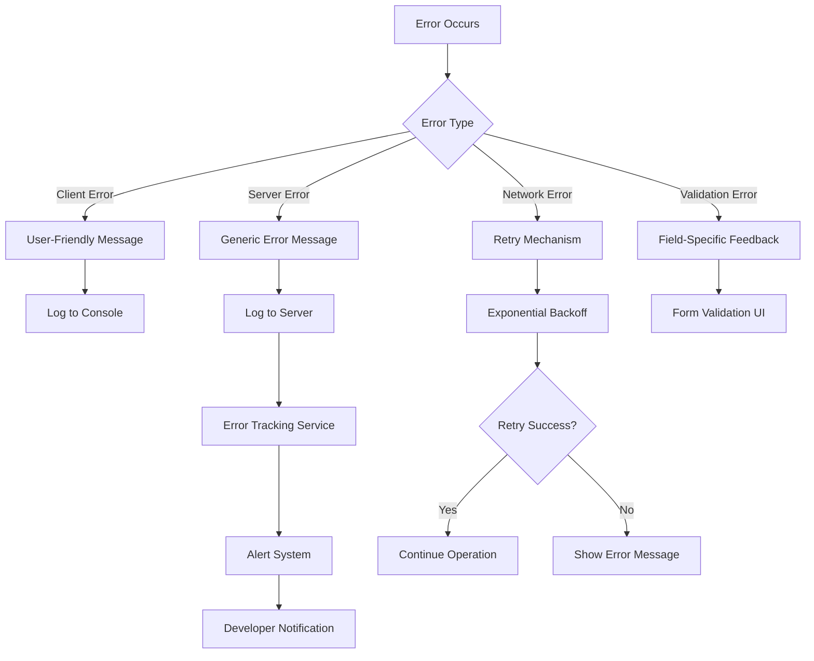
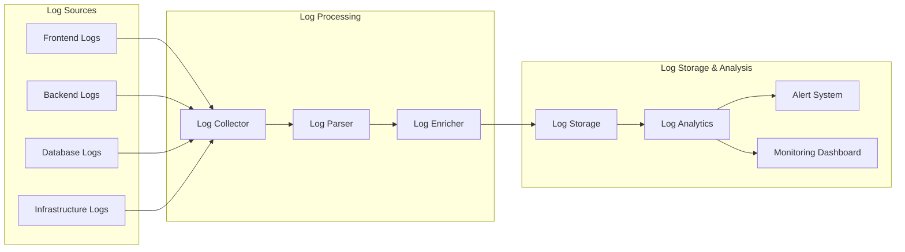

# Enterprise Dashboard Platform - Architecture Documentation

## 1. Chosen Architectural Pattern

### 1.1 Pattern: **Layered Monolith with Microservices-Ready Design**

We've chosen a **Layered Monolith** architecture with clear separation of concerns and microservices-ready modular design. This approach provides:

**Benefits:**
- **Simplicity**: Single deployable unit reduces operational complexity
- **Development Speed**: Faster development and debugging in early stages
- **Cost Effective**: Lower infrastructure costs compared to distributed systems
- **ACID Transactions**: Full database consistency across operations
- **Microservices Evolution**: Clean module boundaries allow future service extraction

**Justification for Enterprise Dashboard:**
- **Data Consistency**: Dashboard analytics require consistent data views across multiple widgets
- **Complex Queries**: Cross-entity analytics queries benefit from single database access
- **Real-time Updates**: Centralized event handling for live dashboard updates
- **Team Size**: Medium-sized team can effectively manage a well-structured monolith
- **Performance**: Reduced network latency compared to distributed microservices

### 1.2 Architectural Layers

## 2. Key Component Interactions

### 2.1 System Overview

### 2.2 Component Communication Patterns

#### 2.2.1 API Communication
- **RESTful APIs** for CRUD operations
- **GraphQL** for complex data fetching (optional future enhancement)
- **WebSocket/Server-Sent Events** for real-time updates
- **DataLoader** for efficient database query batching

#### 2.2.2 State Management
- **TanStack Query** for server state management and caching
- **Zustand** for client-side state management
- **Local Storage** for user preferences and offline data

#### 2.2.3 Event-Driven Updates
- **WebSocket connections** for real-time dashboard updates
- **Event emitters** for cross-component communication
- **Database triggers** for automated notifications

## 3. Data Flow

### 3.1 Dashboard Data Flow

### 3.2 Real-time Data Updates

### 3.3 User Interaction Flow

## 4. Scalability & Performance Strategy

### 4.1 Frontend Performance

#### 4.1.1 Bundle Optimization
- **Code Splitting**: Route-based and component-based lazy loading
- **Tree Shaking**: Remove unused code from bundles
- **Dynamic Imports**: Load chart libraries on-demand
- **Service Worker**: Cache static assets and API responses

#### 4.1.2 Rendering Optimization
- **Virtual Scrolling**: Handle large datasets in tables/lists
- **Progressive Hydration**: Incrementally hydrate components
- **Memoization**: React.memo and useMemo for expensive calculations
- **Web Workers**: Offload data processing from main thread

### 4.2 Backend Scalability

#### 4.2.1 Database Optimization
- **Connection Pooling**: Efficient database connection management
- **Query Optimization**: Proper indexing and query analysis
- **Read Replicas**: Separate read/write database instances
- **Partitioning**: Table partitioning for large datasets

#### 4.2.2 Caching Strategy

#### 4.2.3 Horizontal Scaling Preparation
- **Stateless Services**: Design for horizontal scaling
- **Load Balancer Ready**: Structure for multiple instance deployment
- **Database Sharding**: Prepare for data partitioning strategies
- **Message Queues**: Async processing with Redis/RabbitMQ

### 4.3 Performance Metrics & Monitoring

- **Core Web Vitals**: LCP < 2.5s, FID < 100ms, CLS < 0.1
- **API Response Time**: 95th percentile < 500ms
- **Database Query Performance**: Slow query monitoring
- **Memory Usage**: Heap monitoring and garbage collection
- **Error Rates**: < 0.1% error rate across all endpoints

## 5. Security Considerations

### 5.1 Authentication & Authorization

#### 5.1.1 Authentication Strategy
- **JWT Tokens**: Stateless authentication with refresh token rotation
- **Role-Based Access Control (RBAC)**: Granular permission system
- **Multi-Factor Authentication (MFA)**: Optional 2FA for enhanced security
- **Session Management**: Secure token storage and automatic logout

#### 5.1.2 Authorization Layers
- **Route Level**: Protect API endpoints by user role
- **Component Level**: Hide UI elements based on permissions
- **Data Level**: Filter data based on user access rights
- **Feature Level**: Enable/disable features by subscription tier

### 5.2 Data Protection

#### 5.2.1 Data Security Measures
- **Encryption at Rest**: PostgreSQL transparent data encryption
- **Encryption in Transit**: HTTPS/TLS for all communications
- **Data Sanitization**: Input validation and output encoding
- **PII Protection**: Anonymization of sensitive user data

#### 5.2.2 API Security
- **Rate Limiting**: Prevent API abuse and DDoS attacks
- **CORS Configuration**: Restrict cross-origin requests
- **Input Validation**: Comprehensive request validation
- **SQL Injection Prevention**: Parameterized queries with Prisma

### 5.3 Secret Management
- **Environment Variables**: Secure configuration management
- **Azure Key Vault**: Production secret storage
- **Rotation Policy**: Regular credential rotation
- **Least Privilege**: Minimal required permissions

## 6. Error Handling & Logging Philosophy

### 6.1 Error Handling Strategy

### 6.2 Logging Strategy

#### 6.2.1 Frontend Logging
- **Error Boundaries**: Catch and log React component errors
- **Console Logging**: Development debugging with log levels
- **User Activity**: Track user interactions for analytics
- **Performance Monitoring**: Log performance metrics

#### 6.2.2 Backend Logging
- **Structured Logging**: JSON format with consistent fields
- **Log Levels**: ERROR, WARN, INFO, DEBUG with appropriate filtering
- **Request Logging**: HTTP request/response logging with correlation IDs
- **Database Query Logging**: Monitor slow queries and errors

#### 6.2.3 Log Management

### 6.3 Monitoring & Alerting

#### 6.3.1 Health Checks
- **API Health Endpoints**: Monitor service availability
- **Database Connectivity**: Regular connection health checks
- **Cache Performance**: Redis connection and performance monitoring
- **External Dependencies**: Monitor third-party service status

#### 6.3.2 Alert Configuration
- **Error Rate Thresholds**: Alert on error rate spikes
- **Performance Degradation**: Monitor response time increases
- **Resource Utilization**: CPU, memory, and disk usage alerts
- **Security Events**: Failed login attempts and suspicious activity

## 7. Technology Integration Details

### 7.1 React 18 + TypeScript Setup
- **Concurrent Features**: Automatic batching and Suspense
- **Strict Mode**: Development error detection
- **TypeScript**: Strict type checking with comprehensive coverage
- **Hot Module Replacement**: Fast development experience

### 7.2 Vite Configuration
- **Build Optimization**: Fast builds with esbuild
- **Development Server**: HMR and hot reload
- **Plugin Architecture**: Extensible build pipeline
- **Environment-based Configs**: Development, staging, production

### 7.3 D3.js Integration
- **Custom Hooks**: React hooks for D3 lifecycle management
- **SVG Rendering**: Efficient vector graphics for charts
- **Animation**: Smooth transitions and interactions
- **Responsive Design**: Charts that adapt to container size

### 7.4 TanStack Query Integration
- **Server State Management**: Automatic caching and synchronization
- **Optimistic Updates**: Immediate UI updates with rollback
- **Background Refetching**: Keep data fresh automatically
- **Error Recovery**: Automatic retry with exponential backoff

This architecture provides a solid foundation for the Enterprise Dashboard Platform while maintaining flexibility for future enhancements and scaling requirements.