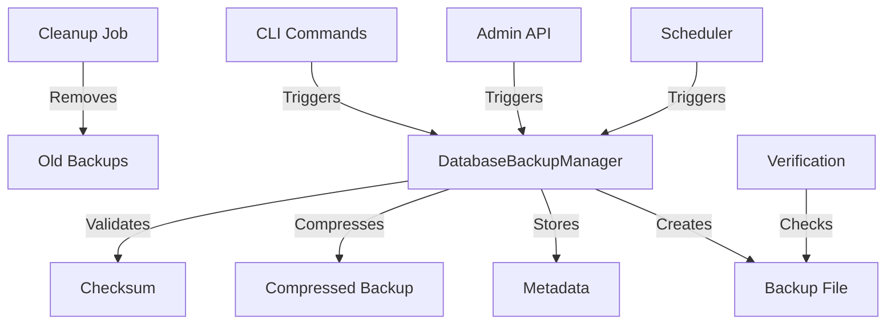

# Database Backup System

This document describes the comprehensive database backup system implemented in the Enterprise Dashboard Platform.

## Overview

The database backup system provides automated, secure, and reliable backup and restore capabilities for PostgreSQL databases. It includes scheduled backups, integrity verification, retention management, and comprehensive monitoring.

## Features

### Core Capabilities
- ✅ **Automated Scheduled Backups**: Daily, weekly, and monthly schedules
- ✅ **Manual On-Demand Backups**: API and CLI triggered backups
- ✅ **Backup Compression**: Configurable gzip compression
- ✅ **Integrity Verification**: Checksum validation and content testing
- ✅ **Retention Management**: Automated cleanup based on retention policies
- ✅ **Restore Functionality**: Full database restoration with validation
- ✅ **Monitoring & Notifications**: Slack notifications and comprehensive logging
- ✅ **Admin API**: Complete REST API for backup management

### Advanced Features
- ✅ **Backup Metadata**: Comprehensive backup information tracking
- ✅ **Selective Backups**: Schema-only, data-only, or table-specific backups
- ✅ **Dry Run Validation**: Test restore operations without affecting database
- ✅ **Health Monitoring**: Backup system health checks
- ✅ **Statistics & Analytics**: Backup metrics and performance tracking

## Architecture

### Components

1. **DatabaseBackupManager** (`scripts/backup/database-backup.ts`)
   - Core backup and restore functionality
   - Backup validation and integrity checking
   - Metadata management and file operations

2. **BackupScheduler** (`services/backup/backupScheduler.ts`)
   - Automated backup scheduling using cron
   - Cleanup management and retention policies
   - Bulk operations and statistics

3. **Backup API** (`routes/backup.ts`)
   - RESTful endpoints for backup management
   - Admin authentication and authorization
   - CSRF protection for state-changing operations

### Data Flow



## Configuration

### Environment Variables

```bash
# Core backup settings
BACKUP_ENABLED=true
BACKUP_DIR=./backups
BACKUP_RETENTION_DAYS=30
BACKUP_COMPRESSION=true

# Backup schedules (cron format)
BACKUP_DAILY_SCHEDULE="0 2 * * *"      # 2 AM daily
BACKUP_WEEKLY_SCHEDULE="0 3 * * 0"     # 3 AM Sunday
BACKUP_MONTHLY_SCHEDULE="0 4 1 * *"    # 4 AM 1st of month
BACKUP_CLEANUP_SCHEDULE="0 5 * * 0"    # 5 AM Sunday

# Backup limits
BACKUP_MAX_SIZE_MB=1000                 # Maximum backup size
BACKUP_TIMEOUT_SECONDS=3600             # Backup timeout (1 hour)

# Optional features
BACKUP_ENCRYPTION_KEY=""                # Future: backup encryption
BACKUP_REMOTE_BUCKET=""                 # Future: cloud storage
BACKUP_SLACK_WEBHOOK=""                 # Slack notifications
```

### Schedule Configuration

The system supports flexible cron-based scheduling:

| Schedule Type | Default | Description |
|---------------|---------|-------------|
| **Daily** | `0 2 * * *` | Every day at 2 AM |
| **Weekly** | `0 3 * * 0` | Every Sunday at 3 AM |
| **Monthly** | `0 4 1 * *` | 1st of every month at 4 AM |
| **Cleanup** | `0 5 * * 0` | Every Sunday at 5 AM |

## Usage

### CLI Commands

```bash
# Create a backup
npm run backup

# List all backups
npm run backup:list

# Clean up old backups
npm run backup:cleanup

# Verify backup integrity
npm run backup:verify backup-2024-01-01T02-00-00-000Z.sql.gz
```

### API Endpoints

#### List Backups
```http
GET /api/backup/list
Authorization: Bearer <admin-token>
```

Response:
```json
{
  "success": true,
  "data": {
    "backups": [
      {
        "filename": "backup-2024-01-15T02-00-00-000Z-daily.sql.gz",
        "timestamp": "2024-01-15T02:00:00.000Z",
        "size": 52428800,
        "compressed": true,
        "checksum": "sha256:abc123...",
        "databaseSize": 104857600,
        "tables": ["users", "dashboards", "widgets"],
        "version": "PostgreSQL 15.5",
        "duration": 45000
      }
    ],
    "total": 1,
    "totalSize": 52428800
  }
}
```

#### Create Manual Backup
```http
POST /api/backup/create
Authorization: Bearer <admin-token>
X-CSRF-Token: <csrf-token>
Content-Type: application/json

{
  "includeSchema": true,
  "includeData": true,
  "specificTables": ["users", "dashboards"],
  "customSuffix": "manual"
}
```

#### Restore Database
```http
POST /api/backup/restore
Authorization: Bearer <super-admin-token>
X-CSRF-Token: <csrf-token>
Content-Type: application/json

{
  "backupFilename": "backup-2024-01-15T02-00-00-000Z-daily.sql.gz",
  "dropExisting": false,
  "dryRun": true
}
```

#### Verify Backup
```http
POST /api/backup/backup-2024-01-15T02-00-00-000Z-daily.sql.gz/verify
Authorization: Bearer <admin-token>
```

#### Get Backup Statistics
```http
GET /api/backup/stats
Authorization: Bearer <admin-token>
```

Response:
```json
{
  "success": true,
  "data": {
    "totalBackups": 15,
    "totalSize": 734003200,
    "oldestBackup": "2024-01-01T02:00:00.000Z",
    "newestBackup": "2024-01-15T02:00:00.000Z",
    "averageSize": 48933546,
    "backupsLast24Hours": 1,
    "backupsLast7Days": 7,
    "compressionUsage": 100,
    "averageDuration": 42
  }
}
```

#### Schedule Status
```http
GET /api/backup/schedule/status
Authorization: Bearer <admin-token>
```

Response:
```json
{
  "success": true,
  "data": {
    "enabled": true,
    "schedules": [
      {
        "id": "backup-daily",
        "type": "daily",
        "schedule": "0 2 * * *",
        "lastRun": "2024-01-15T02:00:00.000Z",
        "nextRun": "2024-01-16T02:00:00.000Z",
        "status": "completed"
      }
    ],
    "runningBackups": [],
    "stats": {
      "totalBackups": 15,
      "successfulBackups": 14,
      "failedBackups": 1
    }
  }
}
```

### React Component Integration

```tsx
import React, { useEffect, useState } from 'react';
import { apiClient } from '@/services/api/apiClient';

interface BackupStats {
  totalBackups: number;
  totalSize: number;
  backupsLast24Hours: number;
  averageDuration: number;
}

const BackupDashboard: React.FC = () => {
  const [stats, setStats] = useState<BackupStats | null>(null);
  const [backups, setBackups] = useState([]);
  const [loading, setLoading] = useState(true);

  useEffect(() => {
    const fetchData = async () => {
      try {
        const [statsRes, backupsRes] = await Promise.all([
          apiClient.get('/api/backup/stats'),
          apiClient.get('/api/backup/list')
        ]);

        setStats(statsRes.data.data);
        setBackups(backupsRes.data.data.backups);
      } catch (error) {
        console.error('Failed to fetch backup data:', error);
      } finally {
        setLoading(false);
      }
    };

    fetchData();
  }, []);

  const triggerManualBackup = async () => {
    try {
      setLoading(true);
      await apiClient.post('/api/backup/create', {
        customSuffix: 'manual'
      });

      // Refresh data
      window.location.reload();
    } catch (error) {
      console.error('Failed to create backup:', error);
    } finally {
      setLoading(false);
    }
  };

  if (loading) return <div>Loading backup data...</div>;

  return (
    <div className="backup-dashboard">
      <h2>Database Backups</h2>

      {stats && (
        <div className="stats-grid">
          <div className="stat-card">
            <h3>Total Backups</h3>
            <p>{stats.totalBackups}</p>
          </div>
          <div className="stat-card">
            <h3>Total Size</h3>
            <p>{Math.round(stats.totalSize / 1024 / 1024)}MB</p>
          </div>
          <div className="stat-card">
            <h3>Last 24 Hours</h3>
            <p>{stats.backupsLast24Hours}</p>
          </div>
          <div className="stat-card">
            <h3>Avg Duration</h3>
            <p>{stats.averageDuration}s</p>
          </div>
        </div>
      )}

      <div className="actions">
        <button onClick={triggerManualBackup} disabled={loading}>
          Create Manual Backup
        </button>
      </div>

      <div className="backup-list">
        <h3>Recent Backups</h3>
        {backups.slice(0, 10).map(backup => (
          <div key={backup.filename} className="backup-item">
            <span>{backup.filename}</span>
            <span>{new Date(backup.timestamp).toLocaleString()}</span>
            <span>{Math.round(backup.size / 1024 / 1024)}MB</span>
          </div>
        ))}
      </div>
    </div>
  );
};
```

## Backup Process

### Backup Creation Flow

1. **Pre-backup Validation**
   - Database connection check
   - Disk space verification
   - Permission validation

2. **Backup Execution**
   - Generate timestamped filename
   - Execute pg_dump with optimized settings
   - Monitor progress and timeout
   - Validate backup file creation

3. **Post-backup Processing**
   - Compress backup (if enabled)
   - Calculate SHA256 checksum
   - Create metadata file
   - Upload to remote storage (if configured)

4. **Notification & Logging**
   - Send success/failure notifications
   - Log comprehensive backup metrics
   - Update backup statistics

### Backup Metadata

Each backup includes comprehensive metadata:

```json
{
  "filename": "backup-2024-01-15T02-00-00-000Z-daily.sql.gz",
  "timestamp": "2024-01-15T02:00:00.000Z",
  "size": 52428800,
  "compressed": true,
  "encrypted": false,
  "checksum": "sha256:abc123...",
  "databaseSize": 104857600,
  "tables": ["users", "dashboards", "widgets", "analytics"],
  "version": "PostgreSQL 15.5",
  "duration": 45000
}
```

## Restore Process

### Restore Options

- **Full Restore**: Complete database restoration
- **Dry Run**: Validate restore without applying changes
- **Target Database**: Restore to different database
- **Drop Existing**: Replace existing database

### Restore Flow

1. **Pre-restore Validation**
   - Backup file existence check
   - Integrity verification (checksum)
   - Metadata validation
   - Decompression test

2. **Restore Preparation**
   - Decompress backup file (if needed)
   - Prepare restore command
   - Validate target database

3. **Restore Execution**
   - Execute psql restore command
   - Monitor progress and timeout
   - Handle errors and rollback

4. **Post-restore Verification**
   - Verify database connectivity
   - Run basic sanity checks
   - Clean up temporary files
   - Log restore completion

## Monitoring & Alerting

### Health Checks

The backup system provides health check endpoints:

```http
GET /api/backup/health
```

Response:
```json
{
  "success": true,
  "data": {
    "status": "healthy",
    "totalBackups": 15,
    "hasRecentBackup": true,
    "lastBackup": "2024-01-15T02:00:00.000Z",
    "timestamp": "2024-01-15T10:30:00.000Z"
  }
}
```

### Notifications

Slack notifications are sent for:
- ✅ Successful backups
- ❌ Failed backups
- 🔄 Restore operations
- 🧹 Cleanup operations

### Metrics & Statistics

Key metrics tracked:
- Backup success/failure rates
- Backup duration trends
- Storage usage over time
- Compression effectiveness
- System performance impact

## Security Considerations

### Access Control
- **Admin Only**: All backup operations require admin privileges
- **Super Admin**: Database restore requires super admin access
- **CSRF Protection**: State-changing operations protected
- **Audit Logging**: All operations logged with user attribution

### Data Protection
- **Checksum Validation**: SHA256 integrity verification
- **Secure Storage**: Backups stored with restricted permissions
- **Encryption Ready**: Infrastructure for backup encryption
- **Network Security**: API endpoints behind authentication

### Operational Security
- **Timeout Protection**: Commands timeout to prevent hanging
- **Resource Limits**: Maximum backup size enforcement
- **Error Handling**: Secure error messages without information leakage
- **Cleanup Automation**: Automatic cleanup prevents disk exhaustion

## Performance Optimization

### Backup Performance
- **Efficient pg_dump Options**: Optimized dump parameters
- **Compression**: Reduces storage space by ~70%
- **Concurrent Limits**: Prevents resource exhaustion
- **Progress Monitoring**: Timeout protection and monitoring

### Storage Optimization
- **Retention Policies**: Automatic cleanup of old backups
- **Compression Ratios**: Typically 60-80% size reduction
- **Metadata Storage**: Efficient JSON metadata files
- **Remote Storage**: Optional cloud storage integration

## Troubleshooting

### Common Issues

1. **Backup Failures**
   ```bash
   # Check database connectivity
   pg_isready -h hostname -p 5432 -d dbname

   # Check disk space
   df -h /backup/directory

   # Check permissions
   ls -la /backup/directory
   ```

2. **Restore Failures**
   ```bash
   # Verify backup integrity
   npm run backup:verify backup-file.sql.gz

   # Test decompression
   gunzip -t backup-file.sql.gz

   # Check target database
   psql -h hostname -p 5432 -d target_db -c "SELECT version();"
   ```

3. **Schedule Issues**
   ```bash
   # Check cron syntax
   crontab -l

   # Verify backup scheduler status
   curl -H "Authorization: Bearer $TOKEN" http://localhost:3001/api/backup/schedule/status
   ```

### Debugging Commands

```bash
# Manual backup with verbose logging
NODE_ENV=development npm run backup

# Test backup verification
npm run backup:verify backup-filename.sql.gz

# List all backups with details
npm run backup:list

# Check backup system health
curl http://localhost:3001/api/backup/health
```

### Log Analysis

Backup operations are comprehensively logged:

```javascript
// Successful backup
logger.info('Database backup completed successfully', {
  filename: 'backup-2024-01-15T02-00-00-000Z.sql.gz',
  size: 52428800,
  duration: 45000,
  tables: 4
});

// Failed backup
logger.error('Database backup failed', {
  error: 'Connection timeout',
  duration: 60000
});

// Cleanup operation
logger.info('Backup cleanup completed', {
  deleted: 3,
  errors: 0
});
```

## Best Practices

### Backup Strategy
1. **Multiple Schedules**: Daily operational, weekly archival, monthly long-term
2. **Verification**: Regular integrity checks of backup files
3. **Testing**: Periodic restore testing in non-production environments
4. **Monitoring**: Automated alerts for backup failures
5. **Documentation**: Maintain restore procedures documentation

### Operational Practices
1. **Resource Management**: Monitor disk space and backup sizes
2. **Retention Policies**: Balance storage costs with recovery needs
3. **Security**: Protect backup files with appropriate permissions
4. **Redundancy**: Consider multiple backup locations
5. **Recovery Planning**: Document and test disaster recovery procedures

### Development Practices
1. **Testing**: Include backup/restore in CI/CD testing
2. **Configuration**: Environment-specific backup settings
3. **Monitoring**: Integration with application monitoring systems
4. **Documentation**: Keep backup procedures up to date
5. **Training**: Ensure team members understand backup operations

## Future Enhancements

### Planned Features
- [ ] **Encryption**: Backup file encryption at rest
- [ ] **Cloud Storage**: AWS S3, Azure Blob, Google Cloud integration
- [ ] **Incremental Backups**: Delta backups for large databases
- [ ] **Multi-Database**: Support for multiple database backup
- [ ] **Backup Streaming**: Direct streaming to cloud storage
- [ ] **Advanced Scheduling**: More flexible scheduling options

### Integration Possibilities
- [ ] **Kubernetes**: Helm charts for K8s deployment
- [ ] **Docker**: Multi-stage backup container
- [ ] **Monitoring**: Prometheus metrics integration
- [ ] **GitOps**: Infrastructure as code management
- [ ] **Disaster Recovery**: Cross-region backup replication

This backup system provides enterprise-grade data protection with comprehensive monitoring, flexible scheduling, and robust security features. It's designed to scale with your application while maintaining reliable data safety and quick recovery capabilities.