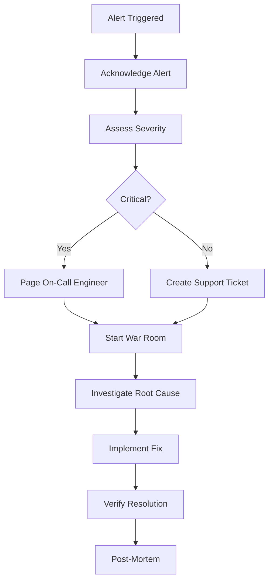

# Enterprise Dashboard Platform - Operations Manual

## 📋 Table of Contents

1. [Overview](#overview)
2. [Daily Operations](#daily-operations)
3. [Monitoring and Alerting](#monitoring-and-alerting)
4. [Incident Response](#incident-response)
5. [Maintenance Procedures](#maintenance-procedures)
6. [Backup and Recovery](#backup-and-recovery)
7. [Security Operations](#security-operations)
8. [Performance Management](#performance-management)
9. [User Management](#user-management)
10. [Troubleshooting Guide](#troubleshooting-guide)
11. [Emergency Procedures](#emergency-procedures)

## 🎯 Overview

This operations manual provides comprehensive guidance for the day-to-day operation, maintenance, and troubleshooting of the Enterprise Dashboard Platform in production environments.

### Operational Responsibilities

| Team | Primary Responsibilities | Contact |
|------|-------------------------|---------|
| **Platform Team** | Infrastructure, deployments, scaling | platform@company.com |
| **DevOps Team** | CI/CD, monitoring, automation | devops@company.com |
| **Security Team** | Security monitoring, compliance | security@company.com |
| **Database Team** | Database optimization, backups | dba@company.com |
| **Support Team** | User issues, application support | support@company.com |

### Service Level Objectives (SLOs)

| Metric | Target | Measurement Period |
|--------|--------|--------------------|
| **Availability** | 99.9% | Monthly |
| **API Response Time** | < 200ms (95th percentile) | Daily |
| **Database Query Time** | < 100ms (average) | Daily |
| **Error Rate** | < 0.1% | Daily |
| **Recovery Time** | < 15 minutes | Per incident |

## 📅 Daily Operations

### Daily Health Check Checklist

Execute this checklist every morning at 9:00 AM:

#### System Health Verification

```bash
# 1. Check cluster health
kubectl get nodes
kubectl get pods --all-namespaces | grep -v Running

# 2. Verify application health
curl -f https://api.yourcompany.com/health
curl -f https://dashboard.yourcompany.com/

# 3. Check resource usage
kubectl top nodes
kubectl top pods -n production --sort-by=memory

# 4. Database health
kubectl exec -it postgresql-0 -n production -- psql -U postgres -c "SELECT version();"
```

#### Monitoring Dashboard Review

1. **Open Grafana Dashboard**: https://monitoring.yourcompany.com/grafana
2. **Review Key Metrics**:
   - API response times (last 24 hours)
   - Database performance metrics
   - Error rates and logs
   - Resource utilization

3. **Check Alerts**: Review any active alerts in AlertManager

#### Log Review

```bash
# Check for errors in the last 24 hours
kubectl logs -n production -l app=enterprise-dashboard --since=24h | grep ERROR

# Review authentication failures
kubectl logs -n production -l app=enterprise-dashboard --since=24h | grep "authentication failed"

# Check rate limiting
kubectl logs -n production -l app=enterprise-dashboard --since=24h | grep "rate limit"
```

### Weekly Operations

#### Every Monday

1. **Security Scan Review**
   ```bash
   # Check for security vulnerabilities
   kubectl get vulnerabilityreports -A

   # Review security audit logs
   kubectl logs -n production -l app=enterprise-dashboard --since=7d | grep SECURITY
   ```

2. **Performance Analysis**
   ```bash
   # Generate performance report
   ./scripts/performance-report.sh production --weekly

   # Review slow query logs
   kubectl exec -it postgresql-0 -n production -- psql -U postgres -c "
   SELECT query, calls, total_time, mean_time
   FROM pg_stat_statements
   ORDER BY total_time DESC LIMIT 10;"
   ```

3. **Capacity Planning Review**
   - Check resource usage trends
   - Review auto-scaling metrics
   - Plan for upcoming capacity needs

#### Every Wednesday

1. **Backup Verification**
   ```bash
   # Verify latest backups exist
   kubectl get cronjobs -n production
   kubectl describe cronjob database-backup -n production

   # Test backup restoration (on staging)
   ./scripts/test-backup-restore.sh staging
   ```

2. **Security Updates**
   ```bash
   # Check for image updates
   kubectl get pods -n production -o jsonpath='{.items[*].spec.containers[*].image}' | tr ' ' '\n' | sort -u

   # Review CVE reports for used images
   ```

#### Every Friday

1. **Weekly Report Generation**
   ```bash
   # Generate operational metrics report
   ./scripts/generate-weekly-report.sh
   ```

2. **Certificate Expiry Check**
   ```bash
   # Check SSL certificate expiration
   kubectl get certificates -n production
   kubectl describe certificate dashboard-tls-auto -n production
   ```

## 📊 Monitoring and Alerting

### Key Metrics to Monitor

#### Application Metrics

| Metric | Alert Threshold | Action |
|--------|----------------|---------|
| API Response Time | > 500ms (95th percentile) | Investigate performance |
| Error Rate | > 0.5% | Check logs, investigate |
| Memory Usage | > 80% | Scale up or investigate leaks |
| CPU Usage | > 75% | Scale up |
| Database Connections | > 80% of pool | Check connection leaks |

#### Infrastructure Metrics

| Metric | Alert Threshold | Action |
|--------|----------------|---------|
| Node CPU | > 80% | Scale cluster |
| Node Memory | > 85% | Scale cluster |
| Disk Usage | > 80% | Clean up or expand storage |
| Network I/O | > 80% of capacity | Investigate traffic |

### Grafana Dashboard URLs

- **Main Dashboard**: https://monitoring.yourcompany.com/d/dashboard-main
- **Infrastructure**: https://monitoring.yourcompany.com/d/dashboard-infra
- **Database**: https://monitoring.yourcompany.com/d/dashboard-db
- **Security**: https://monitoring.yourcompany.com/d/dashboard-security

### Alert Configuration

#### Critical Alerts (PagerDuty)

```yaml
# prometheus-alerts.yaml
groups:
- name: critical.rules
  rules:
  - alert: ServiceDown
    expr: up{job="enterprise-dashboard"} == 0
    for: 1m
    labels:
      severity: critical
    annotations:
      summary: "Service {{ $labels.instance }} is down"

  - alert: HighErrorRate
    expr: rate(http_requests_total{status=~"5.."}[5m]) > 0.05
    for: 5m
    labels:
      severity: critical
    annotations:
      summary: "High error rate detected"

  - alert: DatabaseDown
    expr: pg_up == 0
    for: 1m
    labels:
      severity: critical
    annotations:
      summary: "Database is unreachable"
```

#### Warning Alerts (Slack)

```yaml
- alert: HighLatency
  expr: http_request_duration_seconds{quantile="0.95"} > 0.5
  for: 10m
  labels:
    severity: warning
  annotations:
    summary: "High latency detected"

- alert: HighMemoryUsage
  expr: container_memory_usage_bytes / container_spec_memory_limit_bytes > 0.8
  for: 15m
  labels:
    severity: warning
  annotations:
    summary: "High memory usage on {{ $labels.pod_name }}"
```

## 🚨 Incident Response

### Incident Response Process



### Severity Levels

| Severity | Definition | Response Time | Escalation |
|----------|------------|---------------|------------|
| **P0 - Critical** | Complete service outage | 15 minutes | Immediate page |
| **P1 - High** | Major functionality impaired | 1 hour | Page during business hours |
| **P2 - Medium** | Minor functionality affected | 4 hours | Standard support ticket |
| **P3 - Low** | Cosmetic issues, feature requests | 24 hours | Standard queue |

### Incident Communication

#### Internal Communication

1. **Create Incident Channel**: `#incident-YYYY-MM-DD-HHMM`
2. **Status Page Updates**: https://status.yourcompany.com
3. **Stakeholder Notifications**: Email updates every 30 minutes for P0/P1

#### External Communication

- **Customer Notifications**: Via status page and email
- **Status Updates**: Every hour during active incidents
- **Resolution Notice**: Within 15 minutes of resolution

### Common Incident Scenarios

#### Database Connection Exhaustion

```bash
# Immediate actions
kubectl scale deployment dashboard-backend -n production --replicas=0
kubectl scale deployment dashboard-backend -n production --replicas=3

# Investigation
kubectl exec -it postgresql-0 -n production -- psql -U postgres -c "
SELECT pid, state, query_start, query
FROM pg_stat_activity
WHERE state != 'idle'
ORDER BY query_start;"

# Resolution
# - Increase connection pool size
# - Identify and kill long-running queries
# - Scale application pods
```

#### High Memory Usage / Memory Leaks

```bash
# Immediate actions
kubectl get pods -n production --sort-by=.status.containerStatuses[0].restartCount

# Investigation
kubectl exec -it <pod-name> -n production -- ps aux --sort=-rss
kubectl exec -it <pod-name> -n production -- node -e "console.log(process.memoryUsage())"

# Resolution
# - Restart affected pods
# - Investigate memory leak in application code
# - Scale up resources temporarily
```

#### SSL Certificate Expiry

```bash
# Check certificate status
kubectl describe certificate dashboard-tls-auto -n production

# Force renewal
kubectl delete certificate dashboard-tls-auto -n production
kubectl apply -f k8s/ingress.yaml

# Verify renewal
kubectl get certificate dashboard-tls-auto -n production
```

## 🔧 Maintenance Procedures

### Scheduled Maintenance Windows

| Frequency | Day/Time | Duration | Purpose |
|-----------|----------|----------|---------|
| **Weekly** | Sunday 02:00-04:00 UTC | 2 hours | Security updates, minor patches |
| **Monthly** | First Sunday 01:00-05:00 UTC | 4 hours | Major updates, database maintenance |
| **Quarterly** | Saturday 22:00-06:00 UTC | 8 hours | Infrastructure upgrades |

### Pre-Maintenance Checklist

```bash
# 1. Notify stakeholders
# Send notification 48 hours in advance

# 2. Create backup
kubectl create job backup-pre-maintenance --from=cronjob/database-backup -n production

# 3. Verify rollback plan
./scripts/deploy.sh production --rollback --version=$(get_current_version) --dry-run

# 4. Prepare monitoring
# Set up enhanced monitoring during maintenance window

# 5. Update status page
curl -X POST "https://api.statuspage.io/v1/pages/PAGE_ID/incidents" \
  -H "Authorization: OAuth API_KEY" \
  -d "incident[name]=Scheduled Maintenance" \
  -d "incident[status]=scheduled"
```

### Application Updates

#### Rolling Update Process

```bash
# 1. Pre-deployment verification
./scripts/build-verification.sh --production

# 2. Deploy to staging
./scripts/deploy.sh staging --version=$NEW_VERSION

# 3. Run verification tests
./scripts/deployment-verification.sh staging --full-suite

# 4. Deploy to production
./scripts/deploy.sh production --version=$NEW_VERSION --strategy=rolling

# 5. Post-deployment verification
./scripts/deployment-verification.sh production
```

#### Database Migrations

```bash
# 1. Backup database
kubectl create job backup-pre-migration --from=cronjob/database-backup -n production

# 2. Run migration in maintenance mode
kubectl scale deployment dashboard-backend -n production --replicas=0

kubectl run migration-job \
  --namespace production \
  --image=ghcr.io/your-org/enterprise-dashboard:$NEW_VERSION \
  --rm -it --restart=Never \
  --env="DATABASE_URL=$DATABASE_URL" \
  -- npx prisma migrate deploy

# 3. Start application
kubectl scale deployment dashboard-backend -n production --replicas=3

# 4. Verify migration
kubectl exec -it postgresql-0 -n production -- psql -U postgres -c "\dt"
```

### Infrastructure Updates

#### Kubernetes Cluster Updates

```bash
# 1. Update worker nodes (rolling)
eksctl upgrade nodegroup --cluster=enterprise-dashboard --name=main-nodes

# 2. Update control plane
eksctl upgrade cluster --name=enterprise-dashboard

# 3. Update addons
kubectl apply -f https://raw.githubusercontent.com/kubernetes/ingress-nginx/main/deploy/static/provider/aws/deploy.yaml
```

#### Operating System Updates

```bash
# For each node:
# 1. Drain node
kubectl drain <node-name> --ignore-daemonsets --delete-emptydir-data

# 2. Apply OS updates (on the node)
sudo apt update && sudo apt upgrade -y

# 3. Reboot node
sudo reboot

# 4. Uncordon node
kubectl uncordon <node-name>
```

## 💾 Backup and Recovery

### Backup Strategy

#### Database Backups

```bash
# Daily full backup (automated via CronJob)
# Location: S3 bucket with 30-day retention
# Schedule: 02:00 UTC daily

# Verify backup integrity
kubectl logs -l job-name=database-backup -n production --tail=50

# Manual backup
kubectl create job manual-backup-$(date +%Y%m%d) --from=cronjob/database-backup -n production
```

#### Application Data Backups

```bash
# Persistent volume backups
kubectl get pvc -n production
kubectl create job backup-volumes-$(date +%Y%m%d) --from=cronjob/volume-backup -n production

# Configuration backups
kubectl get configmaps,secrets -n production -o yaml > backup-config-$(date +%Y%m%d).yaml
```

### Recovery Procedures

#### Database Recovery

```bash
# 1. Identify backup to restore
aws s3 ls s3://your-backup-bucket/database/

# 2. Scale down application
kubectl scale deployment dashboard-backend -n production --replicas=0

# 3. Restore database
kubectl run restore-job \
  --namespace production \
  --image=postgres:16-alpine \
  --rm -it --restart=Never \
  --env="PGPASSWORD=$DB_PASSWORD" \
  -- sh -c "
    aws s3 cp s3://your-backup-bucket/database/backup-YYYYMMDD-HHMMSS.sql /tmp/
    psql -h $DB_HOST -U $DB_USER -d $DB_NAME -f /tmp/backup-YYYYMMDD-HHMMSS.sql
  "

# 4. Restart application
kubectl scale deployment dashboard-backend -n production --replicas=3
```

#### Complete Disaster Recovery

```bash
# 1. Provision new infrastructure
./scripts/provision-infrastructure.sh production

# 2. Restore database
./scripts/restore-database.sh --backup-date=YYYY-MM-DD

# 3. Deploy application
./scripts/deploy.sh production --version=$LAST_KNOWN_GOOD_VERSION

# 4. Restore application data
./scripts/restore-volumes.sh --backup-date=YYYY-MM-DD

# 5. Update DNS records
./scripts/update-dns.sh production
```

### Recovery Time Objectives (RTO) / Recovery Point Objectives (RPO)

| Scenario | RTO | RPO | Process |
|----------|-----|-----|---------|
| **Application Failure** | 5 minutes | 0 | Pod restart/rollback |
| **Database Failure** | 15 minutes | 15 minutes | Restore from backup |
| **Zone Failure** | 30 minutes | 15 minutes | Multi-AZ failover |
| **Region Failure** | 4 hours | 1 hour | Cross-region restore |
| **Complete Disaster** | 8 hours | 24 hours | Full infrastructure rebuild |

## 🔐 Security Operations

### Security Monitoring

#### Daily Security Checks

```bash
# 1. Review security alerts
kubectl get events -n production | grep -i security

# 2. Check failed authentication attempts
kubectl logs -n production -l app=enterprise-dashboard --since=24h | grep "authentication failed" | wc -l

# 3. Monitor rate limiting
kubectl logs -n production -l app=enterprise-dashboard --since=24h | grep "rate limit exceeded"

# 4. Review access logs
kubectl logs -n production -l app=enterprise-dashboard --since=24h | grep "suspicious"
```

#### Weekly Security Tasks

```bash
# 1. Vulnerability scanning
kubectl get vulnerabilityreports -A -o custom-columns=NAME:.metadata.name,CRITICAL:.report.summary.criticalCount,HIGH:.report.summary.highCount

# 2. Certificate expiry check
kubectl get certificates -A -o custom-columns=NAME:.metadata.name,READY:.status.conditions[0].status,SECRET:.spec.secretName

# 3. Access review
kubectl get rolebindings,clusterrolebindings -A | grep dashboard

# 4. Update security policies
kubectl apply -f k8s/network-policies.yaml
```

### Security Incident Response

#### Suspected Security Breach

```bash
# 1. Immediate isolation
kubectl patch networkpolicy dashboard-backend-network-policy -n production \
  -p '{"spec":{"ingress":[]}}'

# 2. Capture evidence
kubectl logs -n production -l app=enterprise-dashboard --since=24h > security-incident-logs.txt
kubectl get events -n production > security-incident-events.txt

# 3. Rotate secrets
kubectl delete secret dashboard-secrets -n production
kubectl create secret generic dashboard-secrets --from-env-file=.env.production.new

# 4. Force user re-authentication
kubectl exec -it redis-master-0 -n production -- redis-cli FLUSHDB
```

#### DDoS Attack Response

```bash
# 1. Enable rate limiting
kubectl patch ingress dashboard-ingress -n production \
  -p '{"metadata":{"annotations":{"nginx.ingress.kubernetes.io/rate-limit":"100"}}}'

# 2. Scale up resources
kubectl scale deployment dashboard-backend -n production --replicas=10

# 3. Enable CloudFlare DDoS protection
# (Configure via CloudFlare dashboard)

# 4. Monitor attack patterns
kubectl logs -f -l app=ingress-nginx -n ingress-nginx | grep "rate limit"
```

## ⚡ Performance Management

### Performance Monitoring

#### Key Performance Indicators

```bash
# API Response Time
kubectl exec -it prometheus-server-0 -n monitoring -- promtool query instant \
  'histogram_quantile(0.95, rate(http_request_duration_seconds_bucket{job="enterprise-dashboard"}[5m]))'

# Database Query Performance
kubectl exec -it postgresql-0 -n production -- psql -U postgres -c "
SELECT query, calls, total_time/calls as avg_time
FROM pg_stat_statements
WHERE calls > 100
ORDER BY total_time DESC LIMIT 10;"

# Memory Usage
kubectl top pods -n production --sort-by=memory

# Cache Hit Ratio
kubectl exec -it redis-master-0 -n production -- redis-cli info stats | grep keyspace_hits
```

#### Performance Optimization

```bash
# Database optimization
kubectl exec -it postgresql-0 -n production -- psql -U postgres -c "
ANALYZE;
REINDEX DATABASE enterprise_dashboard;
VACUUM ANALYZE;"

# Clear Redis cache if needed
kubectl exec -it redis-master-0 -n production -- redis-cli FLUSHDB

# Restart pods to clear memory leaks
kubectl rollout restart deployment/dashboard-backend -n production
```

### Capacity Planning

#### Resource Usage Analysis

```bash
# Generate capacity report
./scripts/capacity-report.sh production

# Check resource requests vs limits
kubectl describe nodes | grep -A 5 "Allocated resources"

# Review auto-scaling metrics
kubectl get hpa -n production
kubectl describe hpa dashboard-backend-hpa -n production
```

#### Scaling Decisions

| Trigger | Action | Commands |
|---------|---------|----------|
| CPU > 75% for 10 minutes | Scale up pods | `kubectl scale deployment dashboard-backend -n production --replicas=5` |
| Memory > 80% | Scale up pods or nodes | `kubectl scale deployment dashboard-backend -n production --replicas=5` |
| Database connections > 80% | Increase connection pool | Update DATABASE_POOL_SIZE environment variable |
| Storage > 80% | Expand volumes | `kubectl patch pvc <pvc-name> -n production -p '{"spec":{"resources":{"requests":{"storage":"200Gi"}}}}'` |

## 👥 User Management

### User Lifecycle Management

#### New User Onboarding

```bash
# Create user account (via API or admin interface)
curl -X POST https://api.yourcompany.com/api/users \
  -H "Authorization: Bearer $ADMIN_TOKEN" \
  -H "Content-Type: application/json" \
  -d '{
    "email": "newuser@company.com",
    "firstName": "John",
    "lastName": "Doe",
    "role": "USER"
  }'
```

#### User Account Management

```bash
# List active users
kubectl exec -it postgresql-0 -n production -- psql -U postgres -d enterprise_dashboard -c \
  "SELECT id, email, role, is_active, last_login_at FROM users ORDER BY created_at DESC LIMIT 20;"

# Deactivate user account
kubectl exec -it postgresql-0 -n production -- psql -U postgres -d enterprise_dashboard -c \
  "UPDATE users SET is_active = false WHERE email = 'user@company.com';"

# Reset user password (force password reset on next login)
kubectl exec -it postgresql-0 -n production -- psql -U postgres -d enterprise_dashboard -c \
  "UPDATE users SET password_reset_required = true WHERE email = 'user@company.com';"
```

### Access Control

#### Role-Based Access Control (RBAC)

```sql
-- Available roles in the system
SELECT DISTINCT role FROM users;

-- Users by role
SELECT role, COUNT(*) as user_count FROM users WHERE is_active = true GROUP BY role;

-- Dashboard sharing permissions
SELECT d.title, u.email, ds.permission
FROM dashboard_shares ds
JOIN dashboards d ON ds.dashboard_id = d.id
JOIN users u ON ds.user_id = u.id;
```

#### Audit Log Review

```bash
# Review user authentication events
kubectl logs -n production -l app=enterprise-dashboard --since=7d | grep "USER_LOGIN"

# Review permission changes
kubectl logs -n production -l app=enterprise-dashboard --since=7d | grep "PERMISSION_CHANGED"

# Export audit log for compliance
kubectl logs -n production -l app=enterprise-dashboard --since=30d > audit-log-$(date +%Y%m).txt
```

## 🔍 Troubleshooting Guide

### Common Issues and Solutions

#### Application Won't Start

**Symptoms**: Pods in CrashLoopBackOff state

**Investigation**:
```bash
kubectl describe pod <pod-name> -n production
kubectl logs <pod-name> -n production --previous
```

**Common Causes & Solutions**:

1. **Database Connection Failed**
   ```bash
   # Check database credentials
   kubectl get secret dashboard-secrets -n production -o yaml

   # Test database connection
   kubectl run db-test --image=postgres:16-alpine --rm -it --restart=Never \
     --env="PGPASSWORD=$DB_PASSWORD" \
     -- psql -h $DB_HOST -U $DB_USER -c "SELECT version();"
   ```

2. **Missing Environment Variables**
   ```bash
   # Check configmap and secrets
   kubectl describe configmap dashboard-config -n production
   kubectl describe secret dashboard-secrets -n production
   ```

3. **Resource Limits**
   ```bash
   # Check resource constraints
   kubectl describe pod <pod-name> -n production | grep -A 10 "Limits:"

   # Temporary fix: increase limits
   kubectl patch deployment dashboard-backend -n production \
     -p '{"spec":{"template":{"spec":{"containers":[{"name":"backend","resources":{"limits":{"memory":"4Gi"}}}]}}}}'
   ```

#### High Response Times

**Investigation**:
```bash
# Check API response times
curl -w "%{time_total}" -s -o /dev/null https://api.yourcompany.com/health

# Check database query performance
kubectl exec -it postgresql-0 -n production -- psql -U postgres -c "
SELECT query, calls, mean_time, total_time
FROM pg_stat_statements
ORDER BY mean_time DESC LIMIT 10;"

# Check memory usage
kubectl top pods -n production --sort-by=memory
```

**Solutions**:

1. **Database Performance**
   ```sql
   -- Analyze slow queries
   SELECT query, calls, mean_time, total_time
   FROM pg_stat_statements
   WHERE mean_time > 100
   ORDER BY total_time DESC;

   -- Check for missing indexes
   SELECT schemaname, tablename, attname, n_distinct, correlation
   FROM pg_stats
   WHERE n_distinct > 100 AND correlation < 0.1;
   ```

2. **Memory Issues**
   ```bash
   # Scale up pods
   kubectl scale deployment dashboard-backend -n production --replicas=5

   # Increase memory limits
   kubectl patch deployment dashboard-backend -n production \
     -p '{"spec":{"template":{"spec":{"containers":[{"name":"backend","resources":{"limits":{"memory":"4Gi"}}}]}}}}'
   ```

#### Certificate Issues

**Symptoms**: SSL certificate warnings or errors

**Investigation**:
```bash
kubectl describe certificate dashboard-tls-auto -n production
kubectl get certificaterequests -n production
kubectl logs -l app=cert-manager -n cert-manager --tail=50
```

**Solutions**:
```bash
# Force certificate renewal
kubectl delete certificate dashboard-tls-auto -n production
kubectl apply -f k8s/ingress.yaml

# Check ACME challenge
kubectl describe challenge -n production

# Manual certificate verification
openssl s_client -servername dashboard.yourcompany.com -connect dashboard.yourcompany.com:443 -showcerts
```

### Diagnostic Commands Reference

#### Pod Diagnostics

```bash
# Pod status and events
kubectl get pods -n production -o wide
kubectl describe pod <pod-name> -n production

# Resource usage
kubectl top pod <pod-name> -n production --containers

# Execute commands in pod
kubectl exec -it <pod-name> -n production -- /bin/bash
kubectl exec -it <pod-name> -n production -- ps aux
kubectl exec -it <pod-name> -n production -- netstat -tlnp
```

#### Network Diagnostics

```bash
# Service endpoints
kubectl get endpoints -n production
kubectl describe service dashboard-service -n production

# Network connectivity test
kubectl run netshoot --image=nicolaka/netshoot --rm -it --restart=Never -- nslookup dashboard-service.production.svc.cluster.local

# Ingress diagnostics
kubectl describe ingress dashboard-ingress -n production
kubectl get ingress -n production -o yaml
```

#### Storage Diagnostics

```bash
# Persistent volumes
kubectl get pv,pvc -n production
kubectl describe pvc dashboard-uploads-pvc -n production

# Storage usage
kubectl exec -it <pod-name> -n production -- df -h
kubectl exec -it <pod-name> -n production -- du -sh /app/*
```

## 🚨 Emergency Procedures

### Service Outage Response

#### Immediate Actions (First 5 minutes)

1. **Acknowledge the incident**
   ```bash
   # Check overall service status
   curl -f https://api.yourcompany.com/health || echo "SERVICE DOWN"

   # Check pod status
   kubectl get pods -n production | grep -v Running
   ```

2. **Scale up immediately if pods are down**
   ```bash
   kubectl scale deployment dashboard-backend -n production --replicas=5
   ```

3. **Check for obvious issues**
   ```bash
   kubectl get events -n production --sort-by='.firstTimestamp' | tail -20
   kubectl logs -n production -l app=enterprise-dashboard --tail=100 | grep ERROR
   ```

#### Recovery Actions (5-15 minutes)

1. **Database connectivity**
   ```bash
   kubectl exec -it postgresql-0 -n production -- psql -U postgres -c "SELECT 1;"
   ```

2. **Rollback if recent deployment**
   ```bash
   kubectl rollout history deployment/dashboard-backend -n production
   kubectl rollout undo deployment/dashboard-backend -n production
   ```

3. **Resource exhaustion check**
   ```bash
   kubectl top nodes
   kubectl describe nodes | grep -A 5 "Allocated resources"
   ```

### Data Loss Response

#### Immediate Actions

1. **Stop all writes**
   ```bash
   kubectl scale deployment dashboard-backend -n production --replicas=0
   ```

2. **Assess data loss extent**
   ```bash
   kubectl exec -it postgresql-0 -n production -- psql -U postgres -c "\dt+"
   ```

3. **Initiate recovery from backup**
   ```bash
   ./scripts/restore-database.sh --backup-date=$(date -d "yesterday" +%Y-%m-%d)
   ```

### Security Incident Response

#### Immediate Containment

1. **Isolate affected systems**
   ```bash
   kubectl patch networkpolicy dashboard-backend-network-policy -n production \
     -p '{"spec":{"ingress":[]}}'
   ```

2. **Capture forensic evidence**
   ```bash
   kubectl logs -n production -l app=enterprise-dashboard > security-incident-logs-$(date +%Y%m%d-%H%M%S).txt
   ```

3. **Rotate all secrets**
   ```bash
   ./scripts/rotate-secrets.sh production --emergency
   ```

4. **Force user re-authentication**
   ```bash
   kubectl exec -it redis-master-0 -n production -- redis-cli FLUSHALL
   ```

### Communication Templates

#### Status Page Update Template

```
🔴 INVESTIGATING: We are currently investigating reports of [service impact].
We are working to resolve this as quickly as possible and will provide updates as we learn more.

Last updated: [timestamp] UTC
Next update: [estimated time] UTC
```

#### Resolution Template

```
✅ RESOLVED: The issue affecting [service component] has been resolved.
All systems are now operational.

Root cause: [brief explanation]
Resolution: [action taken]
Prevention: [measures to prevent recurrence]

Resolved at: [timestamp] UTC
```

---

**Last Updated**: December 2024
**Version**: 1.0.0
**Next Review**: March 2025
**Document Owner**: Platform Engineering Team