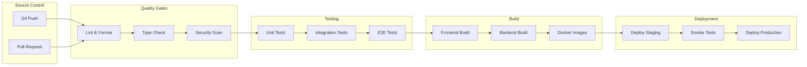
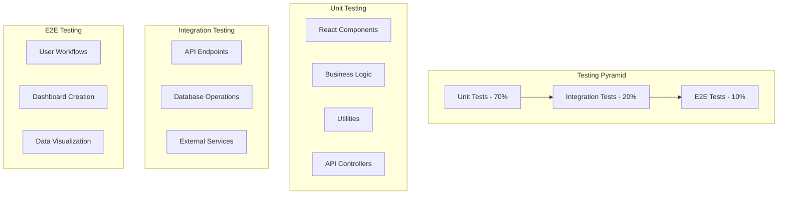
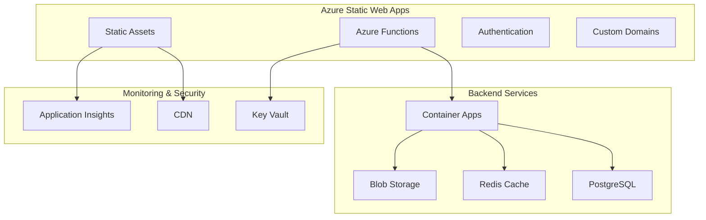
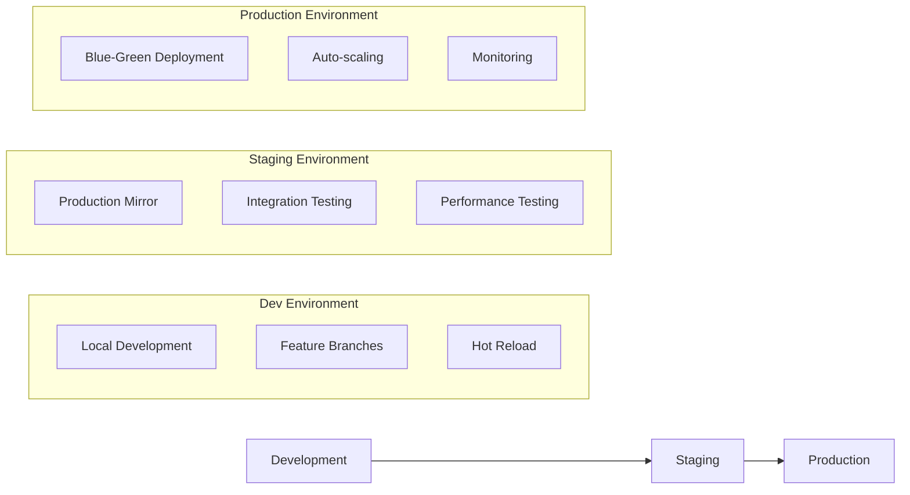
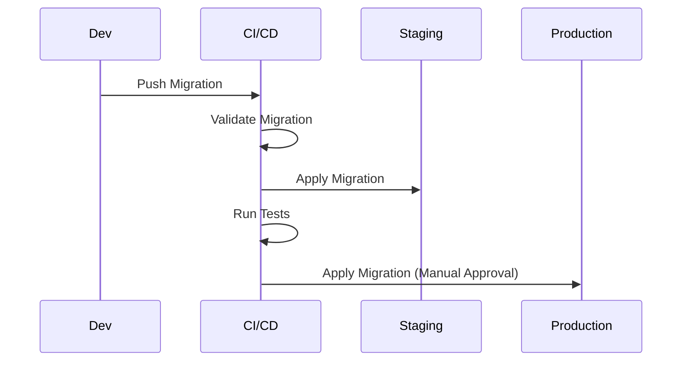
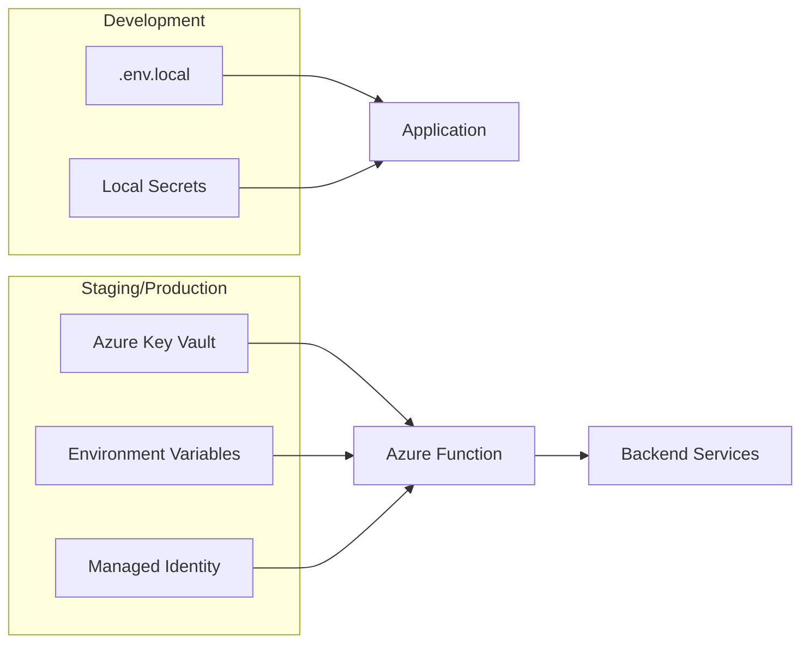

# Enterprise Dashboard Platform - Technical Notes

## 1. CI/CD Pipeline Design

### 1.1 Pipeline Stages Overview



### 1.2 Detailed Pipeline Configuration

#### 1.2.1 Pre-commit Hooks (Husky)
```bash
# .husky/pre-commit
#!/bin/sh
npm run lint
npm run type-check
npm run test:unit
```

#### 1.2.2 GitHub Actions Workflow Stages

**Stage 1: Code Quality (2-3 minutes)**
- ESLint with TypeScript rules
- Prettier code formatting
- TypeScript compilation check
- Dependency vulnerability scan
- License compliance check

**Stage 2: Testing (5-8 minutes)**
- Unit tests with Jest (frontend & backend)
- Integration tests with Supertest
- Code coverage reporting (minimum 80%)
- Test result aggregation

**Stage 3: Build & Package (3-5 minutes)**
- Frontend build with Vite
- Backend compilation with TypeScript
- Docker image creation
- Asset optimization and compression

**Stage 4: Security & Quality (2-3 minutes)**
- SAST security scanning
- Docker image vulnerability scan
- Bundle size analysis
- Performance budget checks

**Stage 5: Deployment (5-10 minutes)**
- Deploy to staging environment
- Database migrations (if needed)
- Smoke tests execution
- Production deployment approval gate

### 1.3 Branch-specific Pipeline Behavior

```mermaid
graph TD
    subgraph "Feature Branch"
        A[Push] --> B[Quality Gates]
        B --> C[Unit Tests]
        C --> D[Build Check]
    end

    subgraph "Pull Request"
        E[PR Created] --> F[Full Test Suite]
        F --> G[E2E Tests]
        G --> H[Security Scan]
        H --> I[Deploy Preview]
    end

    subgraph "Main Branch"
        J[Merge] --> K[Full Pipeline]
        K --> L[Deploy Staging]
        L --> M[Manual Approval]
        M --> N[Deploy Production]
    end
```



## 2. Testing Strategy

### 2.1 Testing Pyramid



### 2.2 Frontend Testing Strategy

#### 2.2.1 Unit Testing (Jest + React Testing Library)
```typescript
// Example test structure
describe('DashboardWidget', () => {
  it('should render with proper data', () => {
    // Arrange, Act, Assert pattern
  });

  it('should handle loading states', () => {
    // Test loading indicators
  });

  it('should handle error states', () => {
    // Test error boundaries
  });

  it('should call API on user interaction', () => {
    // Test user interactions
  });
});
```

**Coverage Targets:**
- **Components**: 90% statement coverage
- **Hooks**: 95% statement coverage
- **Utils**: 100% statement coverage
- **Services**: 85% statement coverage

#### 2.2.2 Component Testing Best Practices
- **Test user behavior**, not implementation details
- **Mock external dependencies** (APIs, third-party libraries)
- **Use MSW** (Mock Service Worker) for API mocking
- **Test accessibility** with jest-axe
- **Snapshot testing** for stable component output

### 2.3 Backend Testing Strategy

#### 2.3.1 Unit Testing (Jest + Supertest)
```typescript
// Example API test structure
describe('Dashboard API', () => {
  beforeEach(async () => {
    // Setup test database
    await setupTestDB();
  });

  it('GET /api/dashboard should return user dashboards', async () => {
    const response = await request(app)
      .get('/api/dashboard')
      .set('Authorization', `Bearer ${token}`)
      .expect(200);

    expect(response.body).toHaveProperty('dashboards');
  });
});
```

#### 2.3.2 Database Testing
- **In-memory database** for unit tests (SQLite)
- **Test containers** for integration tests (PostgreSQL)
- **Transaction rollback** for test isolation
- **Seed data** for consistent test scenarios

### 2.4 E2E Testing with Playwright

#### 2.4.1 Test Scenarios
```typescript
// Example E2E test
test.describe('Dashboard Management', () => {
  test('should create and configure dashboard', async ({ page }) => {
    await page.goto('/dashboard');
    await page.click('[data-testid="create-dashboard"]');
    await page.fill('[data-testid="dashboard-name"]', 'Test Dashboard');
    await page.click('[data-testid="save-dashboard"]');

    await expect(page.locator('[data-testid="dashboard-title"]'))
      .toHaveText('Test Dashboard');
  });
});
```

#### 2.4.2 E2E Best Practices
- **Page Object Model** for maintainable tests
- **Data attributes** for reliable element selection
- **Visual regression testing** for UI consistency
- **Cross-browser testing** (Chrome, Firefox, Safari)
- **Mobile responsive testing**

### 2.5 Performance Testing
- **Lighthouse CI** for performance budgets
- **Bundle analyzer** for code splitting optimization
- **Memory leak detection** in long-running tests
- **API load testing** with Artillery or k6

### 2.6 Testing Tools Configuration

| Tool | Purpose | Configuration |
|------|---------|---------------|
| Jest | Unit testing | 80% coverage threshold |
| React Testing Library | Component testing | DOM testing utilities |
| Supertest | API testing | HTTP assertions |
| MSW | API mocking | Service worker mocking |
| Playwright | E2E testing | Cross-browser automation |
| Jest-axe | Accessibility | a11y rule validation |

## 3. Deployment Strategy

### 3.1 Azure Static Web Apps Architecture



### 3.2 Deployment Environments

#### 3.2.1 Environment Strategy


#### 3.2.2 Environment Configuration
| Environment | Database | Cache | CDN | SSL | Monitoring |
|-------------|----------|-------|-----|-----|------------|
| Development | SQLite | Memory | None | Self-signed | Console |
| Staging | PostgreSQL | Redis | Azure CDN | Let's Encrypt | Basic |
| Production | PostgreSQL (HA) | Redis (Cluster) | Azure CDN | Custom SSL | Full |

### 3.3 Containerization Strategy

#### 3.3.1 Multi-stage Docker Build
```dockerfile
# Multi-stage build for optimization
FROM node:18-alpine AS builder
WORKDIR /app
COPY package*.json ./
RUN npm ci --only=production

FROM node:18-alpine AS runtime
WORKDIR /app
COPY --from=builder /app/node_modules ./node_modules
COPY . .
EXPOSE 3000
CMD ["npm", "start"]
```

#### 3.3.2 Container Optimization
- **Multi-stage builds** to reduce image size
- **Alpine Linux** base images for security
- **Non-root user** execution
- **Health checks** for container orchestration
- **Resource limits** for predictable performance

### 3.4 Database Migration Strategy

#### 3.4.1 Migration Workflow


#### 3.4.2 Migration Best Practices
- **Backward compatible** changes when possible
- **Rollback strategies** for breaking changes
- **Data backup** before major migrations
- **Incremental migrations** for large datasets
- **Testing migrations** on production-like data

## 4. Environment Management

### 4.1 Configuration Strategy

#### 4.1.1 Environment Variable Structure
```typescript
// Environment configuration types
interface EnvironmentConfig {
  // Application
  NODE_ENV: 'development' | 'staging' | 'production';
  PORT: number;

  // Database
  DATABASE_URL: string;
  DATABASE_POOL_SIZE: number;

  // Cache
  REDIS_URL: string;
  REDIS_TTL: number;

  // Authentication
  JWT_SECRET: string;
  JWT_EXPIRY: string;

  // External APIs
  ML_SERVICE_URL: string;
  DATA_API_KEY: string;

  // Monitoring
  LOG_LEVEL: 'error' | 'warn' | 'info' | 'debug';
  ANALYTICS_KEY: string;
}
```

#### 4.1.2 Secret Management


### 4.2 Configuration Validation

#### 4.2.1 Environment Validation Schema
```typescript
import { z } from 'zod';

const configSchema = z.object({
  NODE_ENV: z.enum(['development', 'staging', 'production']),
  DATABASE_URL: z.string().url(),
  REDIS_URL: z.string().url(),
  JWT_SECRET: z.string().min(32),
  // ... other validations
});

export const config = configSchema.parse(process.env);
```

### 4.3 Feature Flags

#### 4.3.1 Feature Flag Implementation
```typescript
// Feature flag configuration
export const featureFlags = {
  ADVANCED_ANALYTICS: process.env.NODE_ENV === 'production',
  DRAG_DROP_BUILDER: true,
  REAL_TIME_UPDATES: process.env.ENABLE_REAL_TIME === 'true',
  ML_ANOMALY_DETECTION: process.env.NODE_ENV !== 'development',
} as const;
```

## 5. Version Control Workflow

### 5.1 Git Flow Strategy

We'll use **GitHub Flow** (simplified Git Flow) for its simplicity and CI/CD friendliness:

```mermaid
gitgraph
    commit id: "Initial"
    branch feature/dashboard-builder
    commit id: "Add drag drop"
    commit id: "Add widget system"
    checkout main
    merge feature/dashboard-builder
    commit id: "Deploy v1.1"

    branch hotfix/security-fix
    commit id: "Fix auth bug"
    checkout main
    merge hotfix/security-fix
    commit id: "Deploy v1.1.1"
```

### 5.2 Branch Naming Conventions

| Branch Type | Pattern | Example |
|-------------|---------|---------|
| Feature | `feature/description` | `feature/dashboard-builder` |
| Bug Fix | `bugfix/description` | `bugfix/chart-rendering-error` |
| Hotfix | `hotfix/description` | `hotfix/security-vulnerability` |
| Release | `release/version` | `release/v1.2.0` |
| Chore | `chore/description` | `chore/update-dependencies` |

### 5.3 Commit Message Convention

#### 5.3.1 Conventional Commits Format
```
<type>[optional scope]: <description>

[optional body]

[optional footer(s)]
```

#### 5.3.2 Commit Types
- **feat**: New feature
- **fix**: Bug fix
- **docs**: Documentation changes
- **style**: Code style changes
- **refactor**: Code refactoring
- **perf**: Performance improvements
- **test**: Adding or updating tests
- **chore**: Maintenance tasks

#### 5.3.3 Examples
```
feat(dashboard): add drag-and-drop widget builder

Implemented a comprehensive widget builder that allows users to:
- Drag widgets from palette to canvas
- Resize widgets dynamically
- Configure widget properties
- Save dashboard layouts

Closes #123
```

### 5.4 Pull Request Guidelines

#### 5.4.1 PR Template
```markdown
## Description
Brief description of changes

## Type of Change
- [ ] Bug fix
- [ ] New feature
- [ ] Breaking change
- [ ] Documentation update

## Testing
- [ ] Unit tests pass
- [ ] Integration tests pass
- [ ] E2E tests pass
- [ ] Manual testing completed

## Checklist
- [ ] Code follows style guidelines
- [ ] Self-review completed
- [ ] Code is properly commented
- [ ] Documentation updated
```

#### 5.4.2 Review Process
1. **Author self-review** before requesting review
2. **Automated checks** must pass
3. **Two approvals** required for main branch
4. **Linear history** with squash and merge
5. **Branch deletion** after merge

## 6. Common Pitfalls

### 6.1 React + TypeScript Pitfalls

#### 6.1.1 Performance Issues
```typescript
// ❌ Bad: Creates new object on every render
const Dashboard = () => {
  return <ChartComponent config={{width: 400, height: 300}} />;
};

// ✅ Good: Memoized configuration
const Dashboard = () => {
  const chartConfig = useMemo(() => ({
    width: 400,
    height: 300
  }), []);

  return <ChartComponent config={chartConfig} />;
};
```

#### 6.1.2 State Management Issues
```typescript
// ❌ Bad: Direct state mutation
const updateDashboard = (dashboard: Dashboard) => {
  dashboard.widgets.push(newWidget); // Mutates original
  setDashboard(dashboard);
};

// ✅ Good: Immutable update
const updateDashboard = (dashboard: Dashboard) => {
  setDashboard({
    ...dashboard,
    widgets: [...dashboard.widgets, newWidget]
  });
};
```

### 6.2 D3.js Integration Pitfalls

#### 6.2.1 React + D3 Lifecycle Issues
```typescript
// ❌ Bad: D3 fighting with React
useEffect(() => {
  d3.select(ref.current).selectAll('*').remove(); // Removes React children
}, [data]);

// ✅ Good: Let React handle DOM
useEffect(() => {
  const svg = d3.select(ref.current);
  const dataBinding = svg.selectAll('.data-point').data(data);

  dataBinding.enter().append('circle').attr('class', 'data-point');
  dataBinding.exit().remove();
}, [data]);
```

### 6.3 Database & Performance Pitfalls

#### 6.3.1 N+1 Query Problem
```typescript
// ❌ Bad: N+1 queries
const dashboards = await prisma.dashboard.findMany();
for (const dashboard of dashboards) {
  dashboard.widgets = await prisma.widget.findMany({
    where: { dashboardId: dashboard.id }
  });
}

// ✅ Good: Single query with includes
const dashboards = await prisma.dashboard.findMany({
  include: {
    widgets: true
  }
});
```

#### 6.3.2 Memory Leaks in Real-time Updates
```typescript
// ❌ Bad: WebSocket not cleaned up
useEffect(() => {
  const ws = new WebSocket(url);
  ws.onmessage = handleMessage;
}, []);

// ✅ Good: Proper cleanup
useEffect(() => {
  const ws = new WebSocket(url);
  ws.onmessage = handleMessage;

  return () => {
    ws.close();
  };
}, []);
```

### 6.4 Security Pitfalls

#### 6.4.1 XSS Vulnerabilities
```typescript
// ❌ Bad: Dangerous HTML injection
const UserContent = ({ content }: { content: string }) => {
  return <div dangerouslySetInnerHTML={{ __html: content }} />;
};

// ✅ Good: Sanitized content
import DOMPurify from 'dompurify';

const UserContent = ({ content }: { content: string }) => {
  const sanitized = DOMPurify.sanitize(content);
  return <div dangerouslySetInnerHTML={{ __html: sanitized }} />;
};
```

#### 6.4.2 Authorization Bypass
```typescript
// ❌ Bad: Client-side only authorization
const AdminPanel = () => {
  if (user.role !== 'admin') return null;
  return <AdminComponents />;
};

// ✅ Good: Server-side authorization
const AdminPanel = () => {
  const { data: adminData, error } = useQuery('/api/admin', {
    enabled: user.role === 'admin'
  });

  if (error?.status === 403) return <NotAuthorized />;
  return adminData ? <AdminComponents data={adminData} /> : null;
};
```

### 6.5 Deployment & DevOps Pitfalls

#### 6.5.1 Environment Configuration Issues
```typescript
// ❌ Bad: Hardcoded values
const API_URL = 'http://localhost:3001/api';

// ✅ Good: Environment-based configuration
const API_URL = process.env.REACT_APP_API_URL || 'http://localhost:3001/api';
```

#### 6.5.2 Database Migration Issues
```sql
-- ❌ Bad: Breaking change without rollback strategy
ALTER TABLE users DROP COLUMN old_field;

-- ✅ Good: Gradual migration
-- Step 1: Add new column
ALTER TABLE users ADD COLUMN new_field VARCHAR(255);

-- Step 2: Migrate data
UPDATE users SET new_field = old_field WHERE new_field IS NULL;

-- Step 3: (Later deployment) Drop old column
-- ALTER TABLE users DROP COLUMN old_field;
```

### 6.6 Monitoring & Debugging Pitfalls

#### 6.6.1 Insufficient Error Context
```typescript
// ❌ Bad: Generic error handling
try {
  await processData(data);
} catch (error) {
  console.error('Error occurred');
}

// ✅ Good: Contextual error handling
try {
  await processData(data);
} catch (error) {
  logger.error('Data processing failed', {
    userId: user.id,
    dataSize: data.length,
    timestamp: new Date().toISOString(),
    error: error.message,
    stack: error.stack
  });
}
```

These technical notes provide a comprehensive guide for successfully implementing and maintaining the Enterprise Dashboard Platform while avoiding common pitfalls.