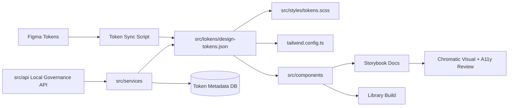
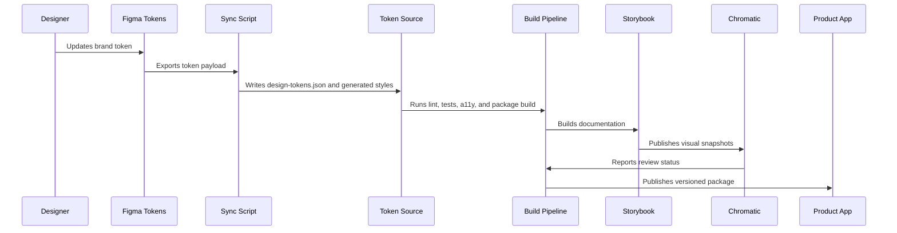
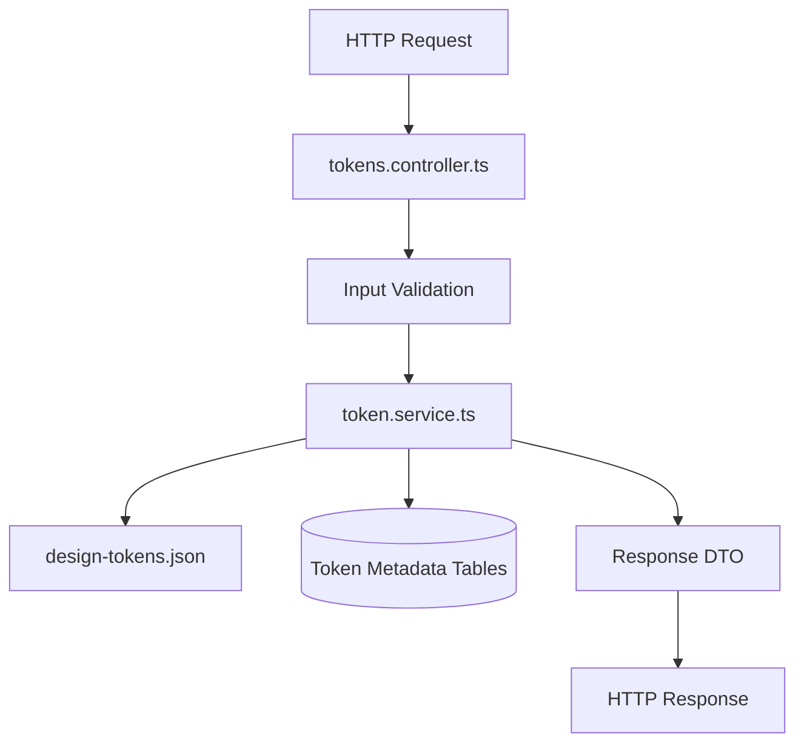

# Architecture

## 2.1 Chosen Architectural Pattern

The recommended pattern is a **modular package architecture with a local governance API**.

The primary product is a TypeScript component library distributed as a package and documented through Storybook. The local API is intentionally small and supports token CRUD, validation, and workflow demonstrations without turning the design system into a distributed application too early.

This pattern is suitable because the project needs strong boundaries, repeatable builds, and testable outputs, but does not require independently deployed microservices. Components, styles, tokens, tests, and documentation can evolve together while still being separated by module responsibility.

## 2.2 Key Component Interactions

### API calls

- Storybook and local tooling may call `src/api/server.ts` during development to preview token metadata and governance workflows.
- Consumers normally import compiled components and CSS from the package instead of calling an API.

### Message queues

- No message queue is required for the initial local-first design system.
- If token sync becomes asynchronous at scale, a queue can be introduced for Figma sync jobs, visual review jobs, and downstream product notification events.

### Direct database access

- Only the service layer should access token metadata storage.
- Component code must not access storage directly.
- The database is optional for early local development; the source of truth remains versioned token files until governance features mature.

### Event buses

- Internal events can be represented as typed function calls at first.
- Future events may include `token.synced`, `token.approved`, `component.released`, and `a11y.regression.detected`.

## 2.3 Data Flow

Typical flow for a token update:

Data flow for local token CRUD API:

## 2.4 Scalability & Performance Strategy

- Keep the package modular so products can import only required components and styles.
- Generate token artifacts from a single source to avoid duplicate hand-maintained theme files.
- Use CSS custom properties for runtime theming while keeping Sass and Tailwind outputs available for build-time ergonomics.
- Keep Storybook as documentation and review infrastructure, not as a runtime dependency.
- Add bundle-size checks before publishing.
- Use Chromatic baselines to prevent accidental visual drift across products.
- Prefer semantic HTML and native browser behavior to reduce JavaScript payload and accessibility risk.

## 2.5 Security Considerations

### Authentication & authorization

- Local development API can run without auth by default.
- Any shared governance API must require SSO-backed authentication and role-based authorization for token approval, release, and rollback operations.

### Data protection

- Do not store Figma personal access tokens in source control.
- Keep generated token files free of secrets and customer data.
- Store audit events for token changes if governance features are enabled.

### API security

- Validate all request bodies at controller boundaries.
- Use explicit DTOs and reject unknown fields for mutation endpoints.
- Apply rate limits if the API becomes shared beyond local development.
- Return stable error shapes without leaking stack traces.

### Secret management

- Use `.env` for local development only.
- Use CI secret storage for Figma tokens, Chromatic project tokens, registry credentials, and signing keys.
- Rotate tokens used by automated sync jobs.

## 2.6 Error Handling & Logging Philosophy

- Components should render accessible loading, empty, and error states without throwing raw errors into the UI.
- Shared utilities should normalize network and validation errors.
- API controllers should return consistent `error.code`, `error.message`, and optional `error.details` fields.
- Service layer logs should include operation name, token name, version, and correlation ID when available.
- CI logs should be verbose enough to diagnose failed builds but must not print secret values.
- Accessibility failures are treated as product defects, not cosmetic warnings.
