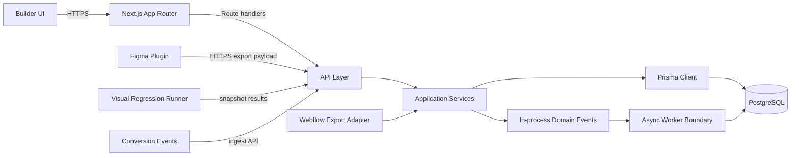
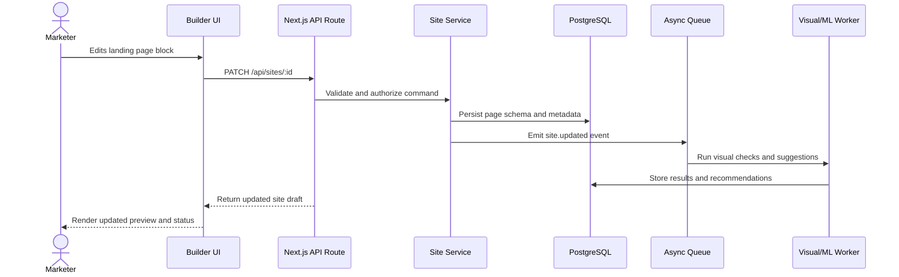

# Architecture

## 2.1 Chosen Architectural Pattern

The recommended architecture is a **modular serverless monolith** built on Next.js App Router, deployed to Vercel, with PostgreSQL as the primary database and Prisma as the persistence layer.

This pattern is suitable because the product needs fast iteration across tightly related domains: page editing, template management, design export, analytics, and recommendations. A modular monolith keeps deployment simple while preserving clean internal boundaries. Serverless route handlers and Vercel preview environments fit the marketing-site workflow, where every branch or pull request can produce a reviewable preview.

The architecture can later extract high-load workloads into separate services, especially visual regression workers, ML recommendation jobs, and event ingestion.

## 2.2 Key Component Interactions

### Communication Patterns

- **API calls:** Browser, Figma plugin, generated landing pages, and visual regression jobs communicate with the application through typed HTTP APIs.
- **Direct database access:** Only server-side services access PostgreSQL through Prisma. Client-side code never talks directly to the database.
- **Message queues:** Layout suggestion generation, visual regression jobs, export packaging, and analytics rollups have a service boundary that can move to a queue once volume increases.
- **Event bus:** Domain events such as `site.published`, `figma.imported`, `conversion.recorded`, and `regression.failed` provide extension points without coupling UI flows to long-running work.

## 2.3 Data Flow

Figma export uses the same service boundary. The plugin sends selected design nodes as normalized JSON, the API validates the payload, the service maps it to builder blocks, and the persisted draft can then be edited in the builder.

## 2.4 Scalability & Performance Strategy

- Keep interactive editing reads and writes lightweight by storing builder documents as structured JSON with separately indexed metadata.
- Cache public published pages at the edge through Vercel and invalidate on publish.
- Move expensive work into asynchronous jobs: visual snapshots, Figma imports, ML suggestions, image optimization, and analytics rollups.
- Use database indexes for organization, site, slug, status, and event timestamp lookups.
- Split analytics event ingestion from builder APIs once traffic volume justifies it.
- Store large assets in object storage and keep only metadata and references in PostgreSQL.
- Use feature flags to roll out editor, export, and recommendation changes gradually.

## 2.5 Security Considerations

### Authentication & Authorization

Use a hosted identity provider or NextAuth-compatible provider. Model permissions around organizations, projects, and roles such as owner, developer, marketer, reviewer, and viewer. Every API command should authorize both the actor and the target resource.

### Data Protection

Encrypt data in transit with TLS. Rely on managed PostgreSQL encryption at rest. Keep sensitive analytics data scoped by organization and avoid storing unnecessary PII in conversion events.

### API Security

Validate all request bodies at the route boundary. Apply rate limits to public ingestion endpoints, Figma import endpoints, and authentication-sensitive flows. Use idempotency keys for publish, import, export, and billing-related actions.

### Secret Management

Secrets belong in Vercel environment variables or a managed secret store. Local development uses `.env.local`, derived from `.env.example`. Secrets must never be committed.

## 2.6 Error Handling & Logging Philosophy

- Use typed domain errors for validation, authorization, not found, and conflict cases.
- Return stable API error shapes with `code`, `message`, and optional field-level details.
- Log structured events with request IDs, organization IDs, actor IDs, and resource IDs where safe.
- Avoid logging tokens, raw form submissions, private customer data, or full analytics payloads.
- Report unexpected server errors to an observability provider and surface user-friendly failure states in the builder UI.
- Track background job failures separately from interactive request failures so retries and alerts can be tuned independently.
