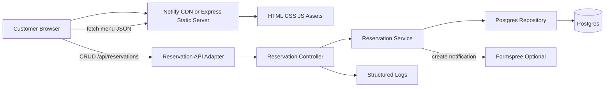
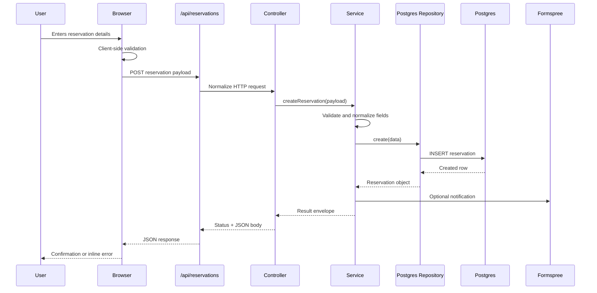

# Restaurant Website Architecture

## 2.1 Chosen Architectural Pattern

The application uses a **static frontend with serverless/API adapters and a layered reservation backend**.

The public experience remains CDN-friendly and static-first. Dynamic reservation behavior is isolated behind a controller/service/repository stack. Netlify uses the serverless adapter, while Docker/local production uses the Express adapter. Both paths share the same service and Postgres repository.

## 2.2 Key Component Interactions

- **Static asset delivery:** Vite builds the site into `dist`; Netlify or Express serves it, including the local animated restaurant hero artwork.
- **Frontend components:** vanilla JS initializes navigation, menu filtering, featured carousel, gallery lightbox, GSAP reveals, and reservation form submission.
- **Reservation API:** `/api/reservations` supports list and create; `/api/reservations/:id` supports read, update, and delete.
- **Controller layer:** converts HTTP requests into service calls and returns consistent JSON envelopes.
- **Service layer:** validates input, applies business rules, invokes notification forwarding, and handles not-found/validation errors.
- **Repository layer:** performs all reservation database operations through parameterized Postgres queries.
- **Database:** Postgres stores reservation requests with status lifecycle values: `requested`, `confirmed`, `declined`, `cancelled`.

There is no message queue or event bus in this version. Reservation volume and integration complexity do not justify asynchronous infrastructure yet.

## 2.3 Data Flow

## 2.4 Scalability & Performance Strategy

- Static files are CDN-cacheable and built by Vite.
- The reservation API is stateless, allowing horizontal scaling in Netlify Functions or container platforms.
- Postgres is the only mutable state and is accessed through pooled connections.
- Parameterized SQL prevents injection and keeps query planning predictable.
- Static assets use long-lived cache headers under `/assets/*`.
- Animations respect `prefers-reduced-motion`.

## 2.5 Security Considerations

### Authentication & Authorization

The customer-facing site is public. Reservation CRUD is implemented for operational completeness; an admin UI should place update/delete/list access behind authentication before exposing it to nontrusted users.

### Data Protection

- The app stores only booking contact and reservation details.
- Client and server validation both run for reservation input.
- Secrets live in environment variables and are not committed.
- HTTPS is expected on Netlify and any production reverse proxy.

### API Security

- JSON request bodies are size-limited.
- Inputs are normalized and validated before database writes.
- SQL uses parameterized queries.
- Public errors are consistent and sanitized.
- Netlify security headers deny framing and reduce browser capability exposure.

### Secret Management

- `DATABASE_URL`, `FORM_ENDPOINT`, `NETLIFY_AUTH_TOKEN`, and `NETLIFY_SITE_ID` are environment-managed.
- `.env.example` documents required keys without real secrets.

## 2.6 Error Handling & Logging Philosophy

- Frontend validation errors are rendered inline and announced through a status region.
- API errors use `{ ok: false, error, code, details }`.
- Expected 4xx errors avoid noisy server logs.
- Unexpected errors are logged with method, message, and error code.
- Tests cover validation, CRUD behavior, and frontend smoke flows.
