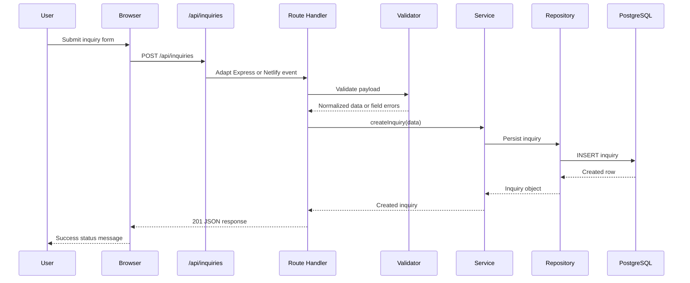

# Travel Agency Website Architecture

## 2.1 Chosen Architectural Pattern

The implemented pattern is a static frontend with serverless API functions and a shared local Express host. Netlify serves static assets and functions in production; Docker runs the same API route modules through Express with PostgreSQL for local development and smoke testing.

This fits the project because the public experience remains CDN-friendly, while lead capture and catalog data use a real persistence layer with clear validation, service, and repository boundaries.

```mermaid
flowchart LR
  Visitor[Website Visitor] --> CDN[Netlify CDN or Express Static Host]
  CDN --> StaticPages[HTML, CSS, JS, Images]
  StaticPages --> BrowserModules[Vanilla JS Modules]
  BrowserModules --> Leaflet[Leaflet Map]
  BrowserModules --> Swiper[Swiper Carousels]
  BrowserModules --> API[/api routes]
  API --> Functions[Netlify Functions or Express Adapter]
  Functions --> Validators[Validators]
  Validators --> Services[Services]
  Services --> Repositories[Repositories]
  Repositories --> Postgres[(PostgreSQL)]
```

## 2.2 Key Component Interactions

- Browser modules fetch `/api/tours`, `/api/destinations`, and `/api/inquiries`.
- Netlify redirects `/api/*` to function files under `netlify/functions`.
- Local Docker and Playwright use `src/app.js`, which adapts Express requests to the same route handlers used by Netlify.
- Services enforce business rules such as unique tour slugs, valid inquiry statuses, valid tour references, and missing-record handling.
- Repositories perform parameterized PostgreSQL queries and map database rows to API response objects.

## 2.3 Data Flow



## 2.4 Scalability and Performance Strategy

- Static pages, CSS, JavaScript, and images are served through Netlify CDN or an Express static host.
- Tour and destination reads are simple indexed PostgreSQL queries.
- List endpoints expose bounded `limit` and `offset` pagination.
- API modules are stateless and safe to run in horizontally scaled serverless functions.
- Express responses are compressed for local/container deployments.
- Browser code initializes page-specific widgets only when their DOM nodes exist.
- Images use lazy loading in tour cards and carousel slides.
- Docker provides a production-like PostgreSQL-backed runtime for local validation.

## 2.5 Security Considerations

- Public browsing is anonymous; no admin UI is exposed.
- API input is validated before service or repository calls.
- SQL access uses parameterized queries.
- The inquiry payload stores only fields needed for follow-up.
- CORS is configurable through `CORS_ORIGIN`.
- HTTPS redirects can be enforced behind a proxy with `ENFORCE_HTTPS=true`.
- Secrets live in `.env`, Docker environment variables, Netlify environment variables, or GitHub Actions secrets.
- Netlify headers set `X-Content-Type-Options`, `X-Frame-Options`, and `Referrer-Policy`.

## 2.6 Error Handling and Logging Philosophy

The API returns a consistent JSON error envelope:

```json
{
  "error": {
    "code": "VALIDATION_ERROR",
    "message": "Please check the highlighted fields.",
    "details": []
  }
}
```

Validation and missing-resource errors return 4xx responses. Unexpected failures return a generic 500 response while logging safe diagnostic details on the server.
