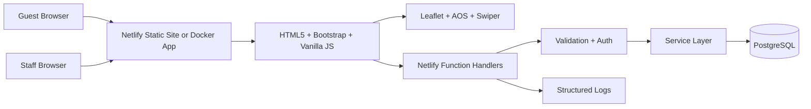
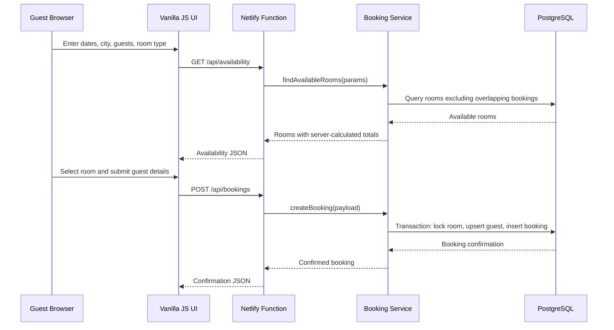
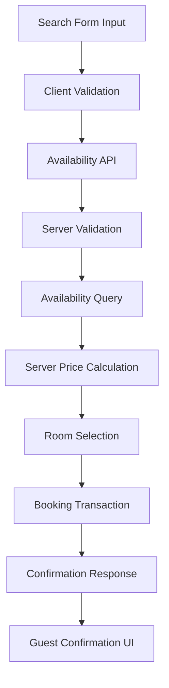

# Hotel Booking Website - Architecture

## 2.1 Chosen Architectural Pattern

The application uses a static frontend with a serverless backend. Netlify serves the HTML/CSS/JavaScript and Netlify Functions own all sensitive operations: availability checks, pricing, guest persistence, booking creation, and staff administration. For Docker/local development, `server.js` is a thin Express adapter that invokes the same function handlers and serves the same static frontend.

## 2.2 Key Component Interactions

- Browser modules call `/api/*`, redirected to `/.netlify/functions/*` on Netlify and handled by `server.js` locally.
- Function handlers parse JSON/query input, enforce staff token authorization where needed, validate payloads, and call service modules.
- Service modules perform business logic and PostgreSQL operations through the shared database adapter.
- PostgreSQL stores hotels, rooms, guests, bookings, and staff users.
- Staff-only CRUD operations require `x-staff-token`; manager-only operations also require a manager role.
- List endpoints use bounded `limit`/`offset` pagination.
- The local Express adapter applies response compression and security headers; Netlify applies equivalent headers through `netlify.toml`.

## 2.3 Data Flow

## 2.4 Scalability & Performance Strategy

- Static assets are served from Netlify CDN or the Docker app with cache headers.
- Functions are stateless; horizontal scale depends on platform capacity and database limits.
- PostgreSQL indexes support city searches, room filters, booking date overlap checks, and status filtering.
- Price calculation is server-side and deterministic.
- Public listing APIs avoid exposing staff-only fields.
- Frontend assets use lazy images and page-level modules to keep the first screen light.

## 2.5 Security Considerations

- Public endpoints: hotel listing, room listing, availability search, booking creation, and confirmation lookup by code.
- Staff endpoints: guest lists, booking lists/status changes, room writes, hotel writes, and staff user management.
- Staff authorization uses `STAFF_API_TOKEN` plus role headers for local/demo operation; production can swap this helper for a real identity provider without changing services.
- Secrets live in `.env`, Docker environment variables, GitHub Actions secrets, or Netlify environment variables.
- API handlers validate methods, JSON bodies, dates, capacity, prices, statuses, and staff roles.
- Prices are always recalculated by the backend from room records.
- Dynamic browser rendering escapes API-provided text before assigning HTML.
- Docker credentials are supplied through `.env`, not committed Compose literals.

## 2.6 Error Handling & Logging Philosophy

- `AppError` represents expected validation, authorization, not-found, and conflict failures.
- All endpoints return stable JSON envelopes: `{ "data": ... }` or `{ "error": { "code": "...", "message": "..." } }`.
- Unexpected server failures are logged with safe metadata and returned as generic 500 responses.
- Booking creation uses a transaction and row lock to prevent overlapping active reservations for the same room.
